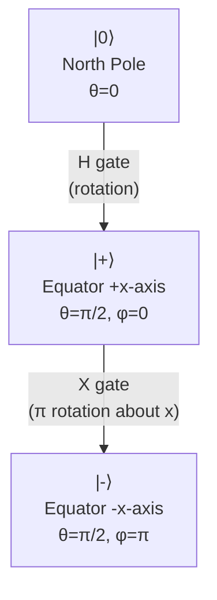

# **Chapter 1: Introduction**

---

The goal of this chapter is to establish the essential mathematical and physical principles—linear algebra, superposition, entanglement, and the postulates of quantum mechanics—that form the basis of quantum computation.

---

## **1.1 Introduction to Quantum Information** {.heading-with-pill}

> **Difficulty:** ★★☆☆☆
> 
> **Concept:** Quantum Superposition and Qubit Fundamentals 
> 
> **Summary:** Quantum computing leverages phenomena like superposition, entanglement, and interference to solve classically intractable problems. The qubit is the fundamental unit, capable of existing in a linear combination of the $|0\rangle$ and $|1\rangle$ basis states.

---

### **Theoretical Background**

Classical computation operates on **bits**, deterministic binary units that exist in one of two definite states: 0 or 1. The state space of a classical system with $N$ bits is exponential—$2^N$ possible configurations exist—but the system can only occupy **one** configuration at any given time. This fundamental limitation constrains classical computers to exploring the solution space sequentially.

Quantum computation, by contrast, operates on **qubits** (quantum bits), which exploit the principle of **superposition** to exist in linear combinations of basis states. A single qubit is described by the state vector:

$$
|\psi\rangle = \alpha|0\rangle + \beta|1\rangle
$$

where $\alpha, \beta \in \mathbb{C}$ are complex **probability amplitudes** satisfying the normalization constraint:

$$
|\alpha|^2 + |\beta|^2 = 1
$$

The computational basis states $|0\rangle$ and $|1\rangle$ correspond to the classical bit values 0 and 1, but the superposition state $|\psi\rangle$ contains information about **both** simultaneously until measured.

**Quantum Parallelism:**

For a system of $N$ qubits, the state space is the tensor product of individual qubit spaces, yielding a $2^N$-dimensional Hilbert space. Crucially, a quantum system can exist in a **superposition of all $2^N$ basis states simultaneously**:

$$
|\Psi\rangle = \sum_{x=0}^{2^N - 1} \alpha_x |x\rangle
$$

where $\sum_x |\alpha_x|^2 = 1$. This exponential scaling of the **active** state space—where the system simultaneously explores all configurations—is the foundation of quantum parallelism and the source of quantum computational advantage.

**Measurement and Collapse:**

The act of **measurement** extracts classical information from a quantum system but fundamentally disturbs it. When a qubit in state $|\psi\rangle = \alpha|0\rangle + \beta|1\rangle$ is measured in the computational basis, the quantum state **collapses** probabilistically to one of the eigenstates:

* Outcome $|0\rangle$ with probability $|\alpha|^2$
* Outcome $|1\rangle$ with probability $|\beta|^2$

After measurement, the superposition is destroyed, and the qubit occupies a definite classical state. This irreversible process is governed by the **Born rule** and distinguishes quantum information processing from classical determinism.

**Quantum Interference:**

Quantum algorithms exploit **interference**—the constructive and destructive combination of probability amplitudes—to amplify correct answers and suppress incorrect ones. By carefully designing unitary operations (quantum gates), algorithms like Grover's search algorithm achieve quadratic speedup by ensuring that the amplitude of the desired solution state grows while others cancel.

-----

### </i> **Comprehension Check**

!!! note "Quiz"
    **1. Which of the following is a fundamental principle that gives quantum computers their parallel processing capability?**

    - A. Deterministic memory  
    - B. Superposition  
    - C. Boolean logic gates  
    - D. The No-cloning theorem

    ??? info "See Answer"
        **Correct: B**

        Superposition allows a quantum system with $N$ qubits to exist in a linear combination of all $2^N$ basis states simultaneously, enabling exponential parallelism in the state space.

---

!!! note "Quiz"
    **2. A classical computer relies on a bit, which is deterministic (0 or 1). A quantum computer relies on a qubit, which is based on:**

    - A. The asset's historical return  
    - B. Probabilistic and amplitude-based information  
    - C. Classical logic gates  
    - D. A finite, two-state physical system

    ??? info "See Answer"
        **Correct: B**

        Qubits encode information in complex probability amplitudes $\alpha$ and $\beta$, with measurement outcomes determined probabilistically by $|\alpha|^2$ and $|\beta|^2$ according to the Born rule.

---

!!! note "Quiz"
    **3. In a quantum system with 10 qubits, how many computational basis states can exist in superposition simultaneously before measurement?**

    - A. 10  
    - B. 20  
    - C. 100  
    - D. 1024

    ??? info "See Answer"
        **Correct: D**

        The state space dimension is $2^N = 2^{10} = 1024$. A general 10-qubit state is a superposition of all 1024 computational basis states $|x\rangle$ where $x \in \{0, 1, \ldots, 1023\}$.

---

!!! abstract "Interview-Style Question"

    **Q:** Explain the difference in **state space** growth between a classical computer and a quantum computer, and how this relates to the idea of **superposition**.

    ???+ info "Answer Strategy"
        **Classical State Space:**  
        A classical system with $N$ bits has an exponentially large configuration space of $2^N$ possible states, but can only occupy **one** state at any moment. Information processing occurs by transitioning sequentially through this space, exploring one configuration at a time.

        **Quantum State Space (Superposition):**  
        A quantum system with $N$ qubits inhabits a $2^N$-dimensional Hilbert space and can exist in a **superposition** of all $2^N$ basis states simultaneously. For example, 10 qubits can represent a coherent linear combination of 1024 states at once:
        
        $$
        |\Psi\rangle = \sum_{x=0}^{1023} \alpha_x |x\rangle
        $$

        **Connection to Quantum Advantage:**  
        This exponential growth in the **actively occupied** state space (not merely the potential space) is the foundation of quantum parallelism. Quantum algorithms exploit this by performing computations on all $2^N$ amplitudes in parallel through unitary evolution, then using interference to concentrate probability into the desired solution state upon measurement.

---

## **1.2 The Qubit and the Bloch Sphere** {.heading-with-pill}

> **Difficulty:** ★★☆☆☆
> 
> **Concept:** Geometric Representation of Qubit States
> 
> **Summary:** The state of a qubit $|\psi\rangle = \alpha|0\rangle + \beta|1\rangle$ is a unit vector in a complex Hilbert space. The Bloch Sphere provides a geometric visualization where any pure single-qubit state corresponds to a point on the surface of a unit sphere.

---

### **Theoretical Background**

The general state of a qubit can be parameterized using spherical coordinates on the **Bloch Sphere**, providing an intuitive geometric representation of quantum states and operations.

**Parameterization:**

Any pure single-qubit state can be written in the form:

$$
|\psi\rangle = \cos\left(\frac{\theta}{2}\right)|0\rangle + e^{i\phi}\sin\left(\frac{\theta}{2}\right)|1\rangle
$$

where $\theta \in [0, \pi]$ is the **polar angle** (measured from the positive $z$-axis) and $\phi \in [0, 2\pi)$ is the **azimuthal angle** (measured in the $x$-$y$ plane from the positive $x$-axis). The global phase factor has been absorbed into the parameterization, as it has no physical significance.

**Geometric Interpretation:**

* **North Pole** ($\theta = 0$): The state $|0\rangle$
* **South Pole** ($\theta = \pi$): The state $|1\rangle$
* **Equator** ($\theta = \pi/2$): Equal superposition states like $|+\rangle = \frac{1}{\sqrt{2}}(|0\rangle + |1\rangle)$ and $|-\rangle = \frac{1}{\sqrt{2}}(|0\rangle - |1\rangle)$
* **Interior Points:** Do not correspond to pure states; mixed states (density matrices) reside inside the sphere

**Quantum Gates as Rotations:**

Single-qubit quantum gates correspond to rotations on the Bloch Sphere:

* **Pauli-X gate** ($X$): $\pi$-rotation about the $x$-axis, maps $|0\rangle \leftrightarrow |1\rangle$
* **Pauli-Y gate** ($Y$): $\pi$-rotation about the $y$-axis
* **Pauli-Z gate** ($Z$): $\pi$-rotation about the $z$-axis, maps $|+\rangle \leftrightarrow |-\rangle$
* **Hadamard gate** ($H$): Transforms computational basis to superposition basis, maps $|0\rangle \to |+\rangle$ and $|1\rangle \to |-\rangle$

General rotation operators $R_{\hat{n}}(\theta)$ rotate the Bloch vector by angle $\theta$ about the axis defined by unit vector $\hat{n}$.

**Measurement on the Bloch Sphere:**

Measurement projects the Bloch vector onto one of the measurement basis states. For computational basis measurement:

* Probability of outcome $|0\rangle$: 
$$
P(0) = \cos^2(\theta/2)
$$

* Probability of outcome $|1\rangle$: 
$$
P(1) = \sin^2(\theta/2)
$$

States closer to the North Pole have higher probability of measuring $|0\rangle$; states closer to the South Pole favor $|1\rangle$.

-----

### **Comprehension Check**

!!! note "Quiz"
    **1. According to the postulates of quantum mechanics, a closed quantum system must evolve via which type of mathematical operation?**

    - A. A complex number multiplication  
    - B. A unitary transformation  
    - C. A Hermitian operation  
    - D. A measurement and collapse

    ??? info "See Answer"
        **Correct: B**

        The evolution of a closed quantum system is governed by the Schrödinger equation, which requires **unitary operators** $U$ satisfying $U^\dagger U = I$. Unitarity preserves the normalization of quantum states and ensures reversibility of quantum operations.

---

!!! note "Quiz"
    **2. On the Bloch Sphere, where is the state $|1\rangle$ located?**

    - A. At the North Pole  
    - B. At the Equator  
    - C. At the South Pole  
    - D. At the center of the sphere

    ??? info "See Answer"
        **Correct: C**

        The computational basis state $|1\rangle$ corresponds to $\theta = \pi$ in the Bloch sphere parameterization, placing it at the South Pole. The state $|0\rangle$ occupies the North Pole ($\theta = 0$).

---

!!! note "Quiz"
    **3. Which quantum gate performs a rotation that transforms $|0\rangle$ into the equal superposition state $|+\rangle = \frac{1}{\sqrt{2}}(|0\rangle + |1\rangle)$?**

    - A. Pauli-X gate  
    - B. Pauli-Z gate  
    - C. Hadamard gate  
    - D. Phase gate

    ??? info "See Answer"
        **Correct: C**

        The Hadamard gate $H$ creates equal superpositions by mapping computational basis states to the $X$-basis: $H|0\rangle = |+\rangle$ and $H|1\rangle = |-\rangle$. Geometrically, this corresponds to a $\pi$ rotation about the axis $(\hat{x} + \hat{z})/\sqrt{2}$.

---

!!! abstract "Interview-Style Question"

    **Q:** Briefly define the concept of **Superposition** and the role of **Measurement** in a quantum system.

    ???+ info "Answer Strategy"
        **Superposition:**  
        Superposition is the fundamental principle that a quantum system can exist in a **linear combination** of all theoretically possible basis states simultaneously until measured. Mathematically, a qubit in superposition is:
        
        $$
        |\psi\rangle = \alpha|0\rangle + \beta|1\rangle
        $$
        
        where the complex amplitudes $\alpha$ and $\beta$ encode the relative phase and magnitude of each component, satisfying $|\alpha|^2 + |\beta|^2 = 1$.

        **Measurement:**  
        Measurement is the process that **extracts classical information** from a quantum system. When a qubit is measured in the computational basis:
        
        1. The superposition **collapses** irreversibly to one of the eigenstates ($|0\rangle$ or $|1\rangle$)
        2. The outcome is **probabilistic**, occurring with probability $|\alpha|^2$ for $|0\rangle$ and $|\beta|^2$ for $|1\rangle$ (Born rule)
        3. Post-measurement, the qubit occupies the measured eigenstate, and the original superposition is destroyed

        **Physical Significance:**  
        This measurement-induced collapse is what distinguishes quantum information from classical information and necessitates careful algorithm design to preserve quantum coherence until the final measurement extracts the desired result.

---

## **1.3 Linear Algebra and Tensor Products** {.heading-with-pill}

> **Difficulty:** ★★★☆☆
> 
> **Concept:** Mathematical Framework for Multi-Qubit Systems
> 
> **Summary:** Quantum computation is linear algebra over a complex vector space. Quantum gates are unitary matrices, and the state space of a composite system is described by the tensor product of individual state spaces. This mathematical structure enables the construction and analysis of quantum circuits.

---

### **Theoretical Background**

The mathematical foundation of quantum computing rests on **linear algebra over complex vector spaces**. Quantum states are vectors, quantum gates are linear operators (matrices), and quantum measurements are described by Hermitian operators.

**State Vectors:**

A single qubit state lives in a 2-dimensional complex Hilbert space $\mathbb{C}^2$, with computational basis vectors:

$$
|0\rangle = \begin{pmatrix} 1 \\ 0 \end{pmatrix}, \quad |1\rangle = \begin{pmatrix} 0 \\ 1 \end{pmatrix}
$$

An arbitrary state is a linear combination:

$$
|\psi\rangle = \alpha|0\rangle + \beta|1\rangle = \begin{pmatrix} \alpha \\ \beta \end{pmatrix}
$$

**Quantum Gates (Unitary Operators):**

Quantum gates are represented by **unitary matrices** $U$ satisfying $U^\dagger U = UU^\dagger = I$, where $U^\dagger$ is the conjugate transpose. Common single-qubit gates include:

* **Pauli-X (NOT) gate:**

$$
X = \begin{pmatrix} 0 & 1 \\ 1 & 0 \end{pmatrix}
$$

* **Hadamard gate:**

$$
H = \frac{1}{\sqrt{2}}\begin{pmatrix} 1 & 1 \\ 1 & -1 \end{pmatrix}
$$

* **Phase gate:**

$$
S = \begin{pmatrix} 1 & 0 \\ 0 & i \end{pmatrix}
$$

**Tensor Product for Composite Systems:**

The state space of a multi-qubit system is the **tensor product** of individual qubit spaces. For two qubits with states $|\psi_A\rangle \in \mathbb{C}^2$ and $|\psi_B\rangle \in \mathbb{C}^2$, the composite state is:

$$
|\psi_{AB}\rangle = |\psi_A\rangle \otimes |\psi_B\rangle \in \mathbb{C}^2 \otimes \mathbb{C}^2 = \mathbb{C}^4
$$

For example, if $|\psi_A\rangle = \alpha_0|0\rangle + \alpha_1|1\rangle$ and $|\psi_B\rangle = \beta_0|0\rangle + \beta_1|1\rangle$, then:

$$
|\psi_{AB}\rangle = \alpha_0\beta_0|00\rangle + \alpha_0\beta_1|01\rangle + \alpha_1\beta_0|10\rangle + \alpha_1\beta_1|11\rangle
$$

The computational basis for two qubits is $\{|00\rangle, |01\rangle, |10\rangle, |11\rangle\}$, with dimension $2^2 = 4$. For $N$ qubits, the state space has dimension $2^N$.

**Tensor Product Notation:**

The tensor product can be written in multiple equivalent notations:

$$
|\psi_A\rangle \otimes |\psi_B\rangle = |\psi_A\rangle|\psi_B\rangle = |\psi_A, \psi_B\rangle
$$

For basis states: $|0\rangle \otimes |1\rangle = |01\rangle$.

**Matrix Representation of Tensor Products:**

The tensor product of matrices $A$ and $B$ is:

$$
A \otimes B = \begin{pmatrix} a_{11}B & a_{12}B \\ a_{21}B & a_{22}B \end{pmatrix}
$$

For example, applying $X$ to the first qubit and $I$ (identity) to the second:

$$
X \otimes I = \begin{pmatrix} 0 & 1 \\ 1 & 0 \end{pmatrix} \otimes \begin{pmatrix} 1 & 0 \\ 0 & 1 \end{pmatrix} = \begin{pmatrix} 0 & 0 & 1 & 0 \\ 0 & 0 & 0 & 1 \\ 1 & 0 & 0 & 0 \\ 0 & 1 & 0 & 0 \end{pmatrix}
$$

**The No-Cloning Theorem:**

A fundamental result of quantum mechanics is the **no-cloning theorem**: it is impossible to create an exact copy of an arbitrary unknown quantum state. This arises directly from the **linearity** and **unitarity** of quantum operations.

Proof sketch: Suppose a unitary operator $U$ could clone states, meaning $U(|\psi\rangle|0\rangle) = |\psi\rangle|\psi\rangle$ for all $|\psi\rangle$. For two different states $|\psi\rangle$ and $|\phi\rangle$:

$$
U(|\psi\rangle|0\rangle) = |\psi\rangle|\psi\rangle, \quad U(|\phi\rangle|0\rangle) = |\phi\rangle|\phi\rangle
$$

Taking the inner product and using unitarity:

$$
\langle\psi|\phi\rangle = \langle\psi|\phi\rangle^2
$$

This equation is only satisfied if $\langle\psi|\phi\rangle \in \{0, 1\}$, meaning $|\psi\rangle$ and $|\phi\rangle$ must be orthogonal or identical. Thus, universal cloning is impossible for non-orthogonal states.

-----

### **Comprehension Check**

!!! note "Quiz"
    **1. Which mathematical operation is used to combine the state vectors of two separate qubits into a single composite state vector?**

    - A. Outer product  
    - B. Matrix multiplication  
    - C. Tensor product  
    - D. Hadamard transformation

    ??? info "See Answer"
        **Correct: C**

        The **tensor product** $\otimes$ combines individual qubit state spaces into a composite multi-qubit state space. For states $|\psi_A\rangle$ and $|\psi_B\rangle$, the combined state is $|\psi_{AB}\rangle = |\psi_A\rangle \otimes |\psi_B\rangle$.

---

!!! note "Quiz"
    **2. The no-cloning theorem states that it is impossible to create an exact copy of an arbitrary unknown quantum state. This theorem arises fundamentally from the property that quantum operations are:**

    - A. Probabilistic  
    - B. Unitary (and therefore linear) transformations  
    - C. Always Hermitian  
    - D. Entangled

    ??? info "See Answer"
        **Correct: B**

        The no-cloning theorem is a direct consequence of the **linearity** and **unitarity** of quantum operations. A hypothetical cloning operation would violate the preservation of inner products required by unitary transformations, except for orthogonal states.

---

!!! note "Quiz"
    **3. What is the dimension of the Hilbert space for a system of 3 qubits?**

    - A. 3  
    - B. 6  
    - C. 8  
    - D. 9

    ??? info "See Answer"
        **Correct: C**

        The Hilbert space dimension for $N$ qubits is $2^N$. For 3 qubits: $2^3 = 8$. The computational basis consists of 8 states: $\{|000\rangle, |001\rangle, |010\rangle, |011\rangle, |100\rangle, |101\rangle, |110\rangle, |111\rangle\}$.

---

!!! abstract "Interview-Style Question"

    **Q:** Explain how the tensor product operation scales the computational resources required for quantum simulation on classical computers.

    ???+ info "Answer Strategy"
        **Exponential Scaling:**  
        The tensor product structure of multi-qubit systems causes the Hilbert space dimension to grow **exponentially** with the number of qubits:
        
        $$
        \dim(\mathcal{H}_N) = 2^N
        $$

        **Classical Simulation Cost:**  
        To classically simulate an $N$-qubit quantum state requires storing $2^N$ complex amplitudes. For example:
        
        - 10 qubits: $2^{10} = 1024$ complex numbers (~16 KB memory)
        - 30 qubits: $2^{30} \approx 10^9$ complex numbers (~17 GB memory)
        - 50 qubits: $2^{50} \approx 10^{15}$ complex numbers (~18 PB memory)

        **Gate Operation Complexity:**  
        Each quantum gate application on an $N$-qubit system requires updating up to $2^N$ amplitudes. For a quantum circuit with $G$ gates, classical simulation requires $\mathcal{O}(G \cdot 2^N)$ operations.

        **Quantum Advantage Threshold:**  
        This exponential memory and computational scaling is why classical simulation becomes intractable beyond approximately 50 qubits, establishing the regime where quantum computers can demonstrate computational advantage over classical supercomputers.

---

## **1.4 Quantum Entanglement** {.heading-with-pill}

> **Difficulty:** ★★★☆☆
> 
> **Concept:** Non-Separable Multi-Qubit Correlations
> 
> **Summary:** Entanglement describes multi-qubit states that cannot be factored into tensor products of individual qubit states. This uniquely quantum correlation is the critical resource enabling quantum algorithms to achieve exponential speedups over classical approaches.

---

### **Theoretical Background**

**Entanglement** is the phenomenon where the quantum state of a composite system cannot be expressed as a tensor product of the states of its constituent subsystems. This non-separability creates correlations stronger than any achievable through classical means.

**Separable vs. Entangled States:**

A two-qubit state $|\psi_{AB}\rangle$ is **separable** (not entangled) if it can be written as:

$$
|\psi_{AB}\rangle = |\psi_A\rangle \otimes |\psi_B\rangle
$$

for some single-qubit states $|\psi_A\rangle$ and $|\psi_B\rangle$. If no such factorization exists, the state is **entangled**.

Example of a separable state:

$$
|\psi\rangle = \left(\frac{1}{\sqrt{2}}|0\rangle + \frac{1}{\sqrt{2}}|1\rangle\right) \otimes |0\rangle = \frac{1}{\sqrt{2}}|00\rangle + \frac{1}{\sqrt{2}}|10\rangle
$$

Example of an entangled state (Bell state):

$$
|\Phi^+\rangle = \frac{1}{\sqrt{2}}(|00\rangle + |11\rangle)
$$

This state **cannot** be factored into $|\psi_A\rangle \otimes |\psi_B\rangle$ for any choice of single-qubit states.

**Bell States:**

The four maximally entangled two-qubit states are the **Bell states** (EPR pairs):

$$
\begin{align}
|\Phi^+\rangle &= \frac{1}{\sqrt{2}}(|00\rangle + |11\rangle) \\
|\Phi^-\rangle &= \frac{1}{\sqrt{2}}(|00\rangle - |11\rangle) \\
|\Psi^+\rangle &= \frac{1}{\sqrt{2}}(|01\rangle + |10\rangle) \\
|\Psi^-\rangle &= \frac{1}{\sqrt{2}}(|01\rangle - |10\rangle)
\end{align}
$$

These states form a complete orthonormal basis for the two-qubit Hilbert space, known as the **Bell basis**.

**Measurement Correlations:**

Entangled states exhibit **perfect correlations** that persist regardless of spatial separation. For the Bell state $|\Phi^+\rangle = \frac{1}{\sqrt{2}}(|00\rangle + |11\rangle)$:

* Measuring the first qubit yields $|0\rangle$ or $|1\rangle$ with equal probability (50% each)
* **Instantly**, the second qubit's measurement outcome is **determined**: if the first qubit measured $|0\rangle$, the second **must** measure $|0\rangle$; if the first measured $|1\rangle$, the second **must** measure $|1\rangle$
* These correlations are **stronger than classical**: no local hidden variable theory can reproduce quantum entanglement statistics (Bell's theorem)

**Entanglement as a Resource:**

Entanglement is not merely a curiosity—it is the **computational resource** that powers quantum algorithms:

* **Quantum Teleportation:** Transfers quantum states using entanglement and classical communication
* **Superdense Coding:** Transmits two classical bits using one entangled qubit
* **Shor's Algorithm:** Uses entanglement to achieve exponential speedup for integer factorization
* **Grover's Search:** Exploits entanglement to achieve quadratic speedup for unstructured search

Without entanglement, quantum computers would offer no advantage over classical probabilistic computers.

**Creating Entanglement:**

Entanglement is generated by applying multi-qubit gates. The canonical example uses the **CNOT (Controlled-NOT)** gate:

$$
\text{CNOT} = \begin{pmatrix} 1 & 0 & 0 & 0 \\ 0 & 1 & 0 & 0 \\ 0 & 0 & 0 & 1 \\ 0 & 0 & 1 & 0 \end{pmatrix}
$$

Starting from $|00\rangle$ and applying $H \otimes I$ followed by $\text{CNOT}$:

$$
|00\rangle \xrightarrow{H \otimes I} \frac{1}{\sqrt{2}}(|00\rangle + |10\rangle) \xrightarrow{\text{CNOT}} \frac{1}{\sqrt{2}}(|00\rangle + |11\rangle) = |\Phi^+\rangle
$$

-----

### **Comprehension Check**

!!! note "Quiz"
    **1. Which of the following two-qubit states is entangled?**

    - A. $\frac{1}{2}|00\rangle + \frac{1}{2}|01\rangle + \frac{1}{2}|10\rangle + \frac{1}{2}|11\rangle$  
    - B. $\frac{1}{\sqrt{2}}(|00\rangle + |11\rangle)$  
    - C. $|0\rangle \otimes |+\rangle$  
    - D. $\frac{1}{\sqrt{2}}(|0\rangle + |1\rangle) \otimes |0\rangle$

    ??? info "See Answer"
        **Correct: B**

        The state $|\Phi^+\rangle = \frac{1}{\sqrt{2}}(|00\rangle + |11\rangle)$ is the Bell state, which cannot be factored into a tensor product of single-qubit states. Options A, C, and D are all separable.

---

!!! note "Quiz"
    **2. What property distinguishes entangled states from separable states?**

    - A. Entangled states have higher energy  
    - B. Entangled states cannot be written as tensor products of individual subsystem states  
    - C. Entangled states require more qubits  
    - D. Entangled states have complex amplitudes

    ??? info "See Answer"
        **Correct: B**

        Entanglement is defined by the **non-separability** of the composite state: an entangled state $|\psi_{AB}\rangle$ cannot be expressed as $|\psi_A\rangle \otimes |\psi_B\rangle$ for any choice of single-qubit states.

---

!!! note "Quiz"
    **3. For the Bell state $|\Phi^+\rangle = \frac{1}{\sqrt{2}}(|00\rangle + |11\rangle)$, if the first qubit is measured and found to be in state $|1\rangle$, what is the state of the second qubit?**

    - A. $|0\rangle$ with certainty  
    - B. $|1\rangle$ with certainty  
    - C. $|+\rangle$ with certainty  
    - D. $|0\rangle$ or $|1\rangle$ with equal probability

    ??? info "See Answer"
        **Correct: B**

        The Bell state exhibits perfect correlation: measuring the first qubit as $|1\rangle$ **instantaneously** collapses the two-qubit state to $|11\rangle$, guaranteeing the second qubit is also in state $|1\rangle$.

---

!!! abstract "Interview-Style Question"

    **Q:** Explain the concept of **entanglement** and its importance to quantum computing, using the Bell state $|\Phi^+\rangle$ as an example.

    ???+ info "Answer Strategy"
        **Definition:**  
        Entanglement occurs when the quantum state of two or more qubits **cannot be written as a tensor product** of the individual qubit states. The qubits are linked such that measuring the state of one **instantaneously determines** the state of the other, regardless of spatial separation.

        **Mathematical Example:**  
        The Bell state 
        
        $$
        |\Phi^+\rangle = \frac{1}{\sqrt{2}}(|00\rangle + |11\rangle)
        $$
        
        is maximally entangled. It cannot be factored as $|\psi_A\rangle \otimes |\psi_B\rangle$ for any single-qubit states $|\psi_A\rangle$ and $|\psi_B\rangle$.

        **Measurement Correlations:**  
        - Measuring the first qubit yields $|0\rangle$ or $|1\rangle$ with equal probability (50% each)
        - If the first qubit measures $|0\rangle$, the second **must** measure $|0\rangle$
        - If the first qubit measures $|1\rangle$, the second **must** measure $|1\rangle$
        - These correlations are **perfect** and **non-local**, persisting regardless of the distance between qubits

        **Importance to Quantum Computing:**  
        Entanglement is the **critical resource** that distinguishes quantum computation from classical probabilistic computation. It enables:
        
        1. **Quantum Algorithms:** Shor's factoring algorithm and Grover's search algorithm exploit entanglement to achieve exponential or quadratic speedups
        2. **Quantum Communication:** Quantum teleportation and superdense coding rely on shared entanglement
        3. **Quantum Error Correction:** Entanglement across multiple qubits enables fault-tolerant quantum computation

        Without entanglement, quantum computers would provide no computational advantage over classical computers. It is the "spooky action at a distance" that Einstein questioned, yet it is experimentally verified and forms the foundation of quantum information science.

---

## **1.5 <i class="fa-solid fa-flask"></i> Hands-On Projects**

These projects are designed to ensure comprehension of the core mathematical concepts introduced in Chapter 1 through direct calculation and visualization.

---

### **Project 1: Qubit State Normalization Check** {.heading-with-pill}

> **Difficulty:** ★★☆☆☆
> 
> **Concept:** Normalization Postulate Verification
> 
> **Summary:** Verify the normalization postulate ($|\alpha|^2 + |\beta|^2 = 1$) for various qubit states and demonstrate that measurement probabilities sum to unity.

---

#### **Project Blueprint**

| **Section**              | **Description**                                                                                                                                                                                                                                                      |
| ------------------------ | -------------------------------------------------------------------------------------------------------------------------------------------------------------------------------------------------------------------------------------------------------------------- |
| **Objective**            | Verify that arbitrary qubit states satisfy the normalization constraint and correctly predict measurement outcome probabilities.                                                                                                                                     |
| **Mathematical Concept** | The normalization postulate requires that for any valid qubit state $\|\psi\rangle = \alpha\|0\rangle + \beta\|1\rangle$, the sum of probabilities equals unity: $\\|\alpha\\|^2 + \\|\beta\\|^2 = 1$.                                                                   |
| **Experiment Setup**     | Consider two test states: <br>1. Real amplitudes: $\|\psi_1\rangle = \frac{1}{\sqrt{3}}\|0\rangle + \sqrt{\frac{2}{3}}\|1\rangle$ <br>2. Complex amplitudes: $\|\psi_2\rangle = \frac{1}{2}\|0\rangle + \frac{\sqrt{3}}{2}i\|1\rangle$                              |
| **Process Steps**        | For each state: <br>1. Extract coefficients $\alpha$ and $\beta$ <br>2. Compute measurement probabilities $P(0) = \\|\alpha\\|^2$ and $P(1) = \\|\beta\\|^2$ <br>3. Verify normalization: $P(0) + P(1) = 1$ <br>4. For complex amplitudes, show that $\\|i\beta\\|^2 = \\|\beta\\|^2$ |
| **Expected Behavior**    | Both states should satisfy the normalization constraint exactly (within numerical precision). The complex phase in $\|\psi_2\rangle$ does not affect probabilities.                                                                                                  |
| **Tracking Variables**   | - $\alpha$, $\beta$: state amplitudes <br> - $P(0)$, $P(1)$: measurement probabilities <br> - $\text{sum}$: $P(0) + P(1)$ (should equal 1)                                                                                                                          |
| **Verification Goal**    | Confirm that normalization holds for both real and complex amplitude cases, demonstrating that global phases do not affect measurement statistics.                                                                                                                   |
| **Output**               | For each state: display $\alpha$, $\beta$, $P(0)$, $P(1)$, and the normalization sum.                                                                                                                                                                               |

---

#### **Pseudocode Implementation**

```pseudo-code
BEGIN

  // State 1: Real amplitudes
  SET alpha_1 = 1 / SQRT(3)
  SET beta_1 = SQRT(2 / 3)
  
  SET P0_state1 = |alpha_1|^2
  SET P1_state1 = |beta_1|^2
  SET norm_sum_1 = P0_state1 + P1_state1
  
  PRINT "State 1: Real Amplitudes"
  PRINT "alpha =", alpha_1, "beta =", beta_1
  PRINT "P(|0⟩) =", P0_state1, "P(|1⟩) =", P1_state1
  PRINT "Normalization sum:", norm_sum_1
  PRINT "------------------------------"
  
  // State 2: Complex amplitudes
  SET alpha_2 = 1 / 2
  SET beta_2 = (SQRT(3) / 2) * i  // imaginary unit
  
  SET P0_state2 = |alpha_2|^2
  SET P1_state2 = |beta_2|^2  // Note: |i*beta|^2 = |beta|^2
  SET norm_sum_2 = P0_state2 + P1_state2
  
  PRINT "State 2: Complex Amplitudes"
  PRINT "alpha =", alpha_2, "beta =", beta_2
  PRINT "P(|0⟩) =", P0_state2, "P(|1⟩) =", P1_state2
  PRINT "Normalization sum:", norm_sum_2
  PRINT "------------------------------"
  
  // Verification
  IF |norm_sum_1 - 1.0| < 1e-10 AND |norm_sum_2 - 1.0| < 1e-10 THEN
      PRINT "VERIFIED: Both states satisfy normalization"
  ELSE
      PRINT "ERROR: Normalization constraint violated"
  END IF

END
```

---

#### **Outcome and Interpretation**

**Expected Results:**

For State 1 ($|\psi_1\rangle$):

* $P(0) = \left(\frac{1}{\sqrt{3}}\right)^2 = \frac{1}{3} \approx 0.3333$
* $P(1) = \left(\sqrt{\frac{2}{3}}\right)^2 = \frac{2}{3} \approx 0.6667$
* Sum: $\frac{1}{3} + \frac{2}{3} = 1.0$ ✓

For State 2 ($|\psi_2\rangle$):

* $P(0) = \left(\frac{1}{2}\right)^2 = \frac{1}{4} = 0.25$
* $P(1) = \left|\frac{\sqrt{3}}{2}i\right|^2 = \frac{3}{4} = 0.75$
* Sum: $\frac{1}{4} + \frac{3}{4} = 1.0$ ✓

**Physical Interpretation:**

1. **Normalization is Fundamental:** The constraint $|\alpha|^2 + |\beta|^2 = 1$ ensures that measurement probabilities form a valid probability distribution, with total probability conserved.

2. **Complex Phases Don't Affect Probabilities:** The imaginary unit $i$ in State 2 contributes to the **relative phase** between basis states but does not change measurement probabilities, since $|z|^2$ eliminates the phase information.

3. **Global Phase Irrelevance:** A state $|\psi\rangle$ and $e^{i\theta}|\psi\rangle$ (for any real $\theta$) are physically **indistinguishable**, as they yield identical measurement statistics. Only **relative phases** between different basis states have physical significance.

This project reinforces the Born rule and the critical distinction between quantum amplitudes (which carry phase information) and classical probabilities (which do not).

---

### **Project 2: Tensor Product for a 2-Qubit State** {.heading-with-pill}

> **Difficulty:** ★★★☆☆
> 
> **Concept:** Composite System State Construction
> 
> **Summary:** Calculate the full state vector for two non-entangled qubits using the tensor product operation and verify the dimensionality scaling from $2 \to 4$.

---

#### **Project Blueprint**

| **Section**              | **Description**                                                                                                                                                                                                                                                                          |
| ------------------------ | ---------------------------------------------------------------------------------------------------------------------------------------------------------------------------------------------------------------------------------------------------------------------------------------- |
| **Objective**            | Construct the composite two-qubit state $\|\psi_{AB}\rangle$ from individual single-qubit states using the tensor product, demonstrating how the Hilbert space dimension scales exponentially.                                                                                           |
| **Mathematical Concept** | The tensor product $\otimes$ combines independent quantum systems. For states $\|\psi_A\rangle = \alpha_0\|0\rangle + \alpha_1\|1\rangle$ and $\|\psi_B\rangle = \beta_0\|0\rangle + \beta_1\|1\rangle$, the composite state is $\|\psi_{AB}\rangle = \|\psi_A\rangle \otimes \|\psi_B\rangle$. |
| **Experiment Setup**     | Two single-qubit states: <br>- Qubit A: $\|\psi_A\rangle = \frac{1}{\sqrt{2}}(\|0\rangle + \|1\rangle)$ (Hadamard-transformed $\|0\rangle$) <br>- Qubit B: $\|\psi_B\rangle = \frac{1}{2}\|0\rangle - \frac{\sqrt{3}}{2}\|1\rangle$                                                       |
| **Process Steps**        | 1. Express each single-qubit state in column vector form <br>2. Compute tensor product: $\|\psi_{AB}\rangle = \|\psi_A\rangle \otimes \|\psi_B\rangle$ <br>3. Expand result in computational basis $\\{\|00\rangle, \|01\rangle, \|10\rangle, \|11\rangle\\}$ <br>4. Verify dimension is $2^2 = 4$ |
| **Expected Behavior**    | The resulting state will have 4 complex amplitude components, one for each basis state. The amplitudes satisfy $\sum_i \\|\alpha_i\\|^2 = 1$.                                                                                                                                              |
| **Tracking Variables**   | - $\|\psi_A\rangle$, $\|\psi_B\rangle$: input single-qubit states <br> - $\|\psi_{AB}\rangle$: composite state <br> - Coefficients: $c_{00}$, $c_{01}$, $c_{10}$, $c_{11}$ for each basis state                                                                                          |
| **Verification Goal**    | Confirm the tensor product yields a 4-dimensional state vector with proper normalization and verify that the state is separable (not entangled).                                                                                                                                         |
| **Output**               | Display the composite state $\|\psi_{AB}\rangle$ in both column vector form and computational basis expansion.                                                                                                                                                                           |

---

#### **Pseudocode Implementation**

```pseudo-code
BEGIN

  // Define single-qubit states
  SET psi_A = [1/SQRT(2), 1/SQRT(2)]  // Column vector for |ψ_A⟩
  SET psi_B = [1/2, -SQRT(3)/2]       // Column vector for |ψ_B⟩
  
  PRINT "Qubit A: |ψ_A⟩ = (1/√2)|0⟩ + (1/√2)|1⟩"
  PRINT "Qubit B: |ψ_B⟩ = (1/2)|0⟩ - (√3/2)|1⟩"
  PRINT "------------------------------"
  
  // Compute tensor product
  // |ψ_AB⟩ = |ψ_A⟩ ⊗ |ψ_B⟩
  SET c_00 = psi_A[0] * psi_B[0]  // Coefficient of |00⟩
  SET c_01 = psi_A[0] * psi_B[1]  // Coefficient of |01⟩
  SET c_10 = psi_A[1] * psi_B[0]  // Coefficient of |10⟩
  SET c_11 = psi_A[1] * psi_B[1]  // Coefficient of |11⟩
  
  SET psi_AB = [c_00, c_01, c_10, c_11]  // Composite state vector
  
  // Display result
  PRINT "Composite State |ψ_AB⟩:"
  PRINT "Column vector form:", psi_AB
  PRINT ""
  PRINT "Computational basis expansion:"
  PRINT "|ψ_AB⟩ = ", c_00, "|00⟩ + ", c_01, "|01⟩ + ", c_10, "|10⟩ + ", c_11, "|11⟩"
  PRINT "------------------------------"
  
  // Verify normalization
  SET norm_sum = |c_00|^2 + |c_01|^2 + |c_10|^2 + |c_11|^2
  PRINT "Normalization check: Σ|c_i|² =", norm_sum
  
  IF |norm_sum - 1.0| < 1e-10 THEN
      PRINT "VERIFIED: State is properly normalized"
  ELSE
      PRINT "ERROR: Normalization constraint violated"
  END IF
  
  PRINT "------------------------------"
  PRINT "State space dimension: 2² = 4 ✓"

END
```

---

#### **Outcome and Interpretation**

**Expected Results:**

Computing the tensor product coefficients:

$$
\begin{align}
c_{00} &= \frac{1}{\sqrt{2}} \cdot \frac{1}{2} = \frac{1}{2\sqrt{2}} \\
c_{01} &= \frac{1}{\sqrt{2}} \cdot \left(-\frac{\sqrt{3}}{2}\right) = -\frac{\sqrt{3}}{2\sqrt{2}} \\
c_{10} &= \frac{1}{\sqrt{2}} \cdot \frac{1}{2} = \frac{1}{2\sqrt{2}} \\
c_{11} &= \frac{1}{\sqrt{2}} \cdot \left(-\frac{\sqrt{3}}{2}\right) = -\frac{\sqrt{3}}{2\sqrt{2}}
\end{align}
$$

The composite state is:

$$
|\psi_{AB}\rangle = \frac{1}{2\sqrt{2}}|00\rangle - \frac{\sqrt{3}}{2\sqrt{2}}|01\rangle + \frac{1}{2\sqrt{2}}|10\rangle - \frac{\sqrt{3}}{2\sqrt{2}}|11\rangle
$$

**Normalization Verification:**

$$
\sum_i |c_i|^2 = \left(\frac{1}{2\sqrt{2}}\right)^2 + \left(\frac{\sqrt{3}}{2\sqrt{2}}\right)^2 + \left(\frac{1}{2\sqrt{2}}\right)^2 + \left(\frac{\sqrt{3}}{2\sqrt{2}}\right)^2 = \frac{1}{8} + \frac{3}{8} + \frac{1}{8} + \frac{3}{8} = 1
$$

**Separability Check:**

The state **is separable** because it was constructed as $|\psi_A\rangle \otimes |\psi_B\rangle$. Factoring the expression:

$$
|\psi_{AB}\rangle = \left[\frac{1}{\sqrt{2}}(|0\rangle + |1\rangle)\right] \otimes \left[\frac{1}{2}|0\rangle - \frac{\sqrt{3}}{2}|1\rangle\right]
$$

**Physical Interpretation:**

1. **Exponential Scaling:** Two single qubits (dimension 2 each) combine to form a 4-dimensional composite system ($2 \times 2 = 4$). For $N$ qubits, the dimension scales as $2^N$.

2. **Independence vs. Entanglement:** This state is **separable** because the qubits were prepared independently. If we applied a two-qubit gate like CNOT, the state could become **entangled** and no longer factorizable.

3. **Measurement Statistics:** The probability of measuring $|00\rangle$ is $|c_{00}|^2 = 1/8$, while the probability of measuring $|01\rangle$ or $|11\rangle$ is $|c_{01}|^2 = 3/8$ each. These probabilities reflect the product of individual qubit measurement probabilities due to separability.

This project demonstrates how the tensor product constructs multi-qubit state spaces and clarifies the distinction between separable and entangled states.

---

### **Project 3: Visualizing Quantum Gates as Rotations (Conceptual)** {.heading-with-pill}

> **Difficulty:** ★★☆☆☆
> 
> **Concept:** Bloch Sphere Geometric Interpretation
> 
> **Summary:** Understand how single-qubit gates relate to rotations on the Bloch Sphere by tracing the trajectory of quantum states through successive gate applications.

---

#### **Project Blueprint**

| **Section**              | **Description**                                                                                                                                                                                                                                        |
| ------------------------ | ------------------------------------------------------------------------------------------------------------------------------------------------------------------------------------------------------------------------------------------------------ |
| **Objective**            | Visualize the geometric action of Hadamard ($H$) and Pauli-$X$ gates on qubit states by tracking their movement on the Bloch Sphere.                                                                                                                  |
| **Mathematical Concept** | Single-qubit quantum gates correspond to rotations on the Bloch Sphere. The Hadamard gate transforms computational basis states to superposition basis states, while the Pauli-X gate performs a $\pi$ rotation about the $x$-axis, flipping $\|0\rangle \leftrightarrow \|1\rangle$. |
| **Experiment Setup**     | Start with the initial state $\|\psi_0\rangle = \|0\rangle$ (North Pole of Bloch Sphere, $\theta = 0$).                                                                                                                                               |
| **Process Steps**        | 1. Apply Hadamard gate: $\|\psi_1\rangle = H\|0\rangle$ <br>2. Determine the resulting state and its Bloch Sphere coordinates <br>3. Apply $X$ gate: $\|\psi_2\rangle = X\|\psi_1\rangle$ <br>4. Trace the complete trajectory: $\|0\rangle \to H\|0\rangle \to XH\|0\rangle$ |
| **Expected Behavior**    | $H\|0\rangle$ moves the state from the North Pole to a point on the equator (superposition state $\|+\rangle$). Applying $X$ then rotates about the $x$-axis to reach $\|-\rangle$.                                                                   |
| **Tracking Variables**   | - $\|\psi_0\rangle$: initial state (North Pole) <br> - $\|\psi_1\rangle$: after Hadamard (equator) <br> - $\|\psi_2\rangle$: after X gate <br> - Bloch coordinates $(\theta, \phi)$ for each state                                                   |
| **Verification Goal**    | Confirm that $H\|0\rangle = \frac{1}{\sqrt{2}}(\|0\rangle + \|1\rangle) = \|+\rangle$ and $XH\|0\rangle = \frac{1}{\sqrt{2}}(\|0\rangle - \|1\rangle) = \|-\rangle$.                                                                                  |
| **Output**               | For each gate application, display the resulting state vector and describe its location on the Bloch Sphere using geometric language (pole, equator, axis).                                                                                           |

---

#### **Pseudocode Implementation**

```pseudo-code
BEGIN

  // Initial state: |0⟩ at North Pole
  SET psi_0 = [1, 0]  // Column vector
  SET theta_0 = 0
  SET phi_0 = 0  // (arbitrary for poles)
  
  PRINT "Initial State: |ψ₀⟩ = |0⟩"
  PRINT "Bloch Sphere location: North Pole (θ = 0)"
  PRINT "------------------------------"
  
  // Define Hadamard gate matrix
  SET H = (1/SQRT(2)) * [[1, 1], [1, -1]]
  
  // Apply Hadamard gate
  SET psi_1 = H * psi_0  // Matrix-vector multiplication
  SET psi_1 = [1/SQRT(2), 1/SQRT(2)]
  
  PRINT "After Hadamard Gate: |ψ₁⟩ = H|0⟩"
  PRINT "State vector:", psi_1
  PRINT "Basis expansion: |ψ₁⟩ = (1/√2)|0⟩ + (1/√2)|1⟩ = |+⟩"
  PRINT "Bloch Sphere location: Equator on +x-axis (θ = π/2, φ = 0)"
  PRINT "------------------------------"
  
  // Define Pauli-X gate matrix
  SET X = [[0, 1], [1, 0]]
  
  // Apply X gate to |ψ₁⟩
  SET psi_2 = X * psi_1
  SET psi_2 = [1/SQRT(2), -1/SQRT(2)]
  
  PRINT "After X Gate: |ψ₂⟩ = X|ψ₁⟩ = XH|0⟩"
  PRINT "State vector:", psi_2
  PRINT "Basis expansion: |ψ₂⟩ = (1/√2)|0⟩ - (1/√2)|1⟩ = |-⟩"
  PRINT "Bloch Sphere location: Equator on -x-axis (θ = π/2, φ = π)"
  PRINT "------------------------------"
  
  // Geometric interpretation
  PRINT "Gate Operations as Rotations:"
  PRINT "1. Hadamard: Rotates |0⟩ from North Pole to equator (+x-axis)"
  PRINT "   - Creates equal superposition of |0⟩ and |1⟩"
  PRINT "2. Pauli-X: π-rotation about x-axis"
  PRINT "   - Flips the sign of the |1⟩ component"
  PRINT "   - Moves from |+⟩ to |-⟩ on the equator"
  PRINT ""
  PRINT "Complete trajectory: North Pole → Equator (+x) → Equator (-x)"

END
```

---

#### **Outcome and Interpretation**

**Expected State Transformations:**

1. **Initial State** $|\psi_0\rangle = |0\rangle$:
   - Bloch coordinates: North Pole, $\theta = 0$
   - Column vector: $(1, 0)^T$

2. **After Hadamard** $|\psi_1\rangle = H|0\rangle = |+\rangle$:
   
$$
H|0\rangle = \frac{1}{\sqrt{2}}\begin{pmatrix} 1 & 1 \\ 1 & -1 \end{pmatrix}\begin{pmatrix} 1 \\ 0 \end{pmatrix} = \frac{1}{\sqrt{2}}\begin{pmatrix} 1 \\ 1 \end{pmatrix}
$$
   
   - Bloch coordinates: Equator on $+x$-axis, $\theta = \pi/2$, $\phi = 0$
   - Creates **equal superposition** with **constructive interference** between $|0\rangle$ and $|1\rangle$

3. **After Pauli-X** $|\psi_2\rangle = XH|0\rangle = |-\rangle$:
   
$$
X|+\rangle = \begin{pmatrix} 0 & 1 \\ 1 & 0 \end{pmatrix}\frac{1}{\sqrt{2}}\begin{pmatrix} 1 \\ 1 \end{pmatrix} = \frac{1}{\sqrt{2}}\begin{pmatrix} 1 \\ -1 \end{pm
   - Bloch coordinates: Equator on $-x$-axis, $\theta = \pi/2$, $\phi = \pi$
   - The negative sign creates **destructive interference**, flipping the relative phase

**Geometric Interpretation:**



**Physical Insights:**

1. **Hadamard Creates Superposition:** The $H$ gate is the fundamental tool for creating quantum superposition from computational basis states. Geometrically, it moves states from the $z$-axis (computational basis) to the $x$-$y$ plane (superposition basis).

2. **Pauli-X as Bit Flip:** The $X$ gate performs a classical NOT operation in the computational basis ($|0\rangle \leftrightarrow |1\rangle$), corresponding to a $\pi$ rotation about the $x$-axis. When applied to superposition states, it flips the **relative phase**.

3. **Rotation Composition:** Sequential gate applications compose as rotations. The sequence $XH$ can be understood as a single rotation obtained by composing the individual rotations, demonstrating how quantum circuits build complex transformations from simple gates.

4. **Basis Independence:** The same quantum state can be described in different bases:
   - $|+\rangle$ is a superposition in the computational basis but an eigenstate in the $X$-basis
   - $|-\rangle$ is orthogonal to $|+\rangle$, forming the complete $X$-basis

This conceptual project reinforces the geometric picture of quantum gates and provides intuition for circuit design, where gates are strategically chosen to rotate the quantum state toward the desired final configuration before measurement.

---
