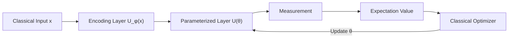
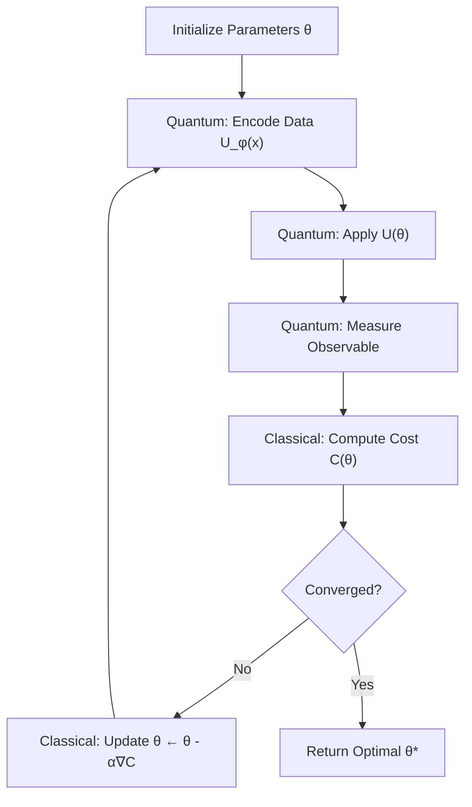
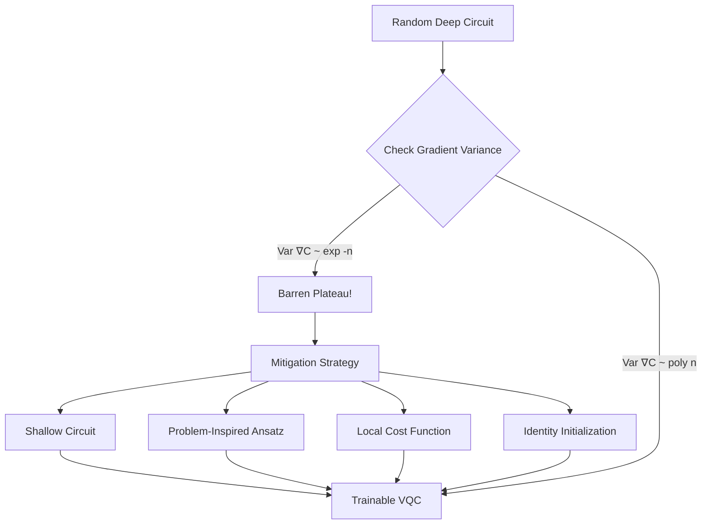

# **Chapter 10: Variational Quantum Circuits**


---


## **Introduction**

Variational Quantum Circuits (VQCs) represent the bridge between the promise of quantum computing and the pragmatic reality of Noisy Intermediate-Scale Quantum (NISQ) hardware. Unlike idealized fault-tolerant quantum algorithms that require millions of qubits and perfect error correction, VQCs are designed to extract value from today's imperfect quantum processors through a powerful hybrid quantum-classical paradigm.

At their core, VQCs are parameterized quantum circuits that learn optimal solutions by iteratively adjusting quantum gate parameters through classical optimization. This approach mirrors classical machine learning: just as neural networks adjust weights to minimize loss functions, VQCs tune rotation angles to minimize quantum cost functions. The key difference lies in the exponential expressivity of quantum Hilbert space, which enables VQCs to potentially capture patterns and correlations that are computationally intractable for classical models.

This chapter deconstructs the anatomy of VQCs, examining their three-stage architecture (encoding, parameterization, and measurement), exploring the design principles of circuit ansätze that balance expressibility with trainability, and confronting the fundamental challenges—particularly the devastating barren plateau problem—that constrain their practical deployment. Understanding VQCs is essential for navigating the landscape of near-term quantum machine learning and variational algorithms [1, 2].

---

## **Chapter Outline**

| **Sec.** | **Title** | **Core Ideas & Examples** |
|----------|-----------|---------------------------|
| **10.1** | **Parameterized Quantum Circuits** | Three-stage VQC architecture: data encoding $U_\phi(x)$, trainable unitary $U(\vec{\theta})$, measurement layer; quantum analogue of neural networks; expectation value computation. |
| **10.2** | **Circuit Ansätze for Learning** | Hardware-efficient (NISQ-compatible shallow circuits), problem-inspired (UCC, QAOA), layered ansätze; rotation + entanglement layer structure; expressibility vs. trainability trade-off. |
| **10.3** | **Hybrid Classical-Quantum Models** | NISQ-era paradigm: quantum processor for state evolution, classical optimizer for parameter updates; noise mitigation through shallow quantum circuits; Adam, COBYLA, SPSA optimizers. |
| **10.4** | **Training and Optimization** | Parameter shift rule for gradient computation; gradient-based (Adam, SGD) vs. gradient-free (COBYLA, Nelder-Mead) optimizers; SPSA for noisy environments; local minima challenges. |
| **10.5** | **Barren Plateaus and Mitigation** | Exponential gradient vanishing with circuit depth/width; causes (random initialization, excessive entanglement); mitigation (shallow circuits, structured ansätze, layer-wise training, identity initialization). |

---

## **10.1 Parameterized Quantum Circuits**

---

The foundation of quantum machine learning and variational algorithms is the **Parameterized Quantum Circuit (PQC)**, commonly referred to as a **Variational Quantum Circuit (VQC)**. A VQC is a **hybrid quantum-classical model** designed to be the trainable core of an algorithm, where the quantum hardware performs the complex state transformation and the classical hardware executes the optimization.

!!! tip "VQCs as Quantum Neural Networks"
    Think of a VQC as a quantum neural network: the encoding layer is the input, the parameterized gates are trainable weights, entangling gates are activation functions, and measurement extracts the output. The entire circuit learns by gradient descent [3].

### **Structural Stages of a VQC**

-----

A VQC operates in three sequential, interconnected layers, transforming classical input data $x$ into a classical output value (e.g., a cost or a classification probability):

**1. Data Encoding Layer ($U_\phi(x)$)**

This is the **input pipeline** of the VQC.

* **Purpose:** Acts as a **quantum feature map** that converts the classical input data $x$ into a quantum state, embedding the information into the high-dimensional Hilbert space.
* **Mechanism:** It is composed of fixed unitary gates whose parameters are functions of the input data $x$ (e.g., Angle Encoding, Hamiltonian Encoding). It is not optimized during training.

**2. Parameterized Unitary Layer ($U(\vec{\theta})$)**

This is the **trainable core** of the circuit.

* **Purpose:** To **learn patterns** and relationships inherent in the encoded data.
* **Mechanism:** Composed of rotation gates ($R_x, R_y, R_z$) and entanglement gates (CNOT) whose angles are set by the **trainable parameters** $\vec{\theta}$. These parameters are iteratively adjusted by the classical optimizer. This layer determines the VQC's expressibility (ability to reach a solution).

**3. Measurement Layer**

This final stage extracts the classical information necessary to calculate the cost.

* **Purpose:** To calculate the **expectation value** of a designated observable (e.g., the Hamiltonian $H$ for VQE, or Pauli $Z$ for classification).
* **Mechanism:** The quantum state collapses, and the resulting classical bit string statistics are used to compute the expected output, $C(x, \vec{\theta})$.



-----

### **Mathematical Formulation**

-----

The final quantum state of the VQC, $|\psi(x, \vec{\theta})\rangle$, is the sequential application of the two primary unitary layers to the initial state $|0\rangle^{\otimes n}$:

$$
|\psi(x, \vec{\theta})\rangle = U(\vec{\theta}) U_\phi(x) |0\rangle^{\otimes n}
$$

The final measured output $f(x, \vec{\theta})$ is the expectation value of an observable $H$:

$$
f(x, \vec{\theta}) = \langle \psi(x, \vec{\theta}) | H | \psi(x, \vec{\theta}) \rangle
$$

The classical optimization process minimizes a loss function:

$$
L(\vec{\theta}) = \sum_i (f(x_i, \vec{\theta}) - y_i)^2
$$

where $y_i$ is the target label.

!!! example "VQC for Binary Classification"
    For classifying data point $x$ into classes $\{-1, +1\}$:
    
    1. **Encode:** $U_\phi(x)|0\rangle^{\otimes n}$ maps $x$ to quantum state
    2. **Transform:** $U(\vec{\theta})$ applies trainable rotations and entanglement
    3. **Measure:** Compute $\langle Z_0 \rangle$ (expectation of Pauli-Z on qubit 0)
    4. **Classify:** Prediction = sign($\langle Z_0 \rangle$)
    5. **Train:** Minimize $L(\vec{\theta}) = \sum_i (\langle Z_0 \rangle_i - y_i)^2$ using classical optimizer

-----

### **Analogy to Classical Neural Networks**

-----

The VQC serves as the quantum analogue of a classical feedforward neural network:

* The **Data Encoding Layer ($U_\phi(x)$)** is analogous to the **input layer** and **fixed feature map**.
* The **Parameterized Unitary Layer ($U(\vec{\theta})$)** is analogous to the **hidden layers** with adjustable weights.
* The **Entangling Gates** (CNOTs) serve as the **non-linear activation functions**, generating the required complexity and expressivity.

```
VQC_Forward_Pass(x, theta, num_qubits):
    # Initialize quantum state
    state = Initialize_Register(num_qubits)
    
    # Stage 1: Data Encoding Layer (fixed, data-dependent)
    for i in range(num_qubits):
        Apply_R_y(state[i], x[i])  # Angle encoding
    
    # Stage 2: Parameterized Unitary Layer (trainable)
    param_idx = 0
    for layer in range(num_layers):
        # Rotation layer (trainable parameters)
        for i in range(num_qubits):
            Apply_R_y(state[i], theta[param_idx])
            param_idx += 1
        
        # Entangling layer (fixed structure)
        for i in range(num_qubits - 1):
            Apply_CNOT(state[i], state[i+1])
    
    # Stage 3: Measurement Layer
    observable = Pauli_Z(qubit=0)  # Measure Z on first qubit
    expectation = Measure_Expectation(state, observable)
    
    return expectation
```

---

## **10.2 Circuit Ansätze for Learning**

---

An **ansatz** is a pre-defined template for the **Parameterized Unitary Layer** $U(\vec{\theta})$ in a Variational Quantum Circuit (VQC). It is a structured sequence of fixed gates and trainable rotations that determines the **expressibility** (the ability to generate complex target states) and **trainability** (the ease of finding optimal parameters) of the model.

!!! tip "Ansatz Design is Everything"
    The choice of ansatz is not a mere implementation detail—it fundamentally determines whether your VQC will train successfully or get stuck in barren plateaus. Structured, problem-inspired ansätze often outperform deep random circuits [4].

### **Structure and Design Principles**

-----

Ansätze are constructed by alternating layers of two basic components to ensure both local transformation and global correlation:

**1. Rotation Layers (Parametric)**

These consist of single-qubit parameterized gates, such as $R_y(\theta)$, applied to every qubit. These layers provide the **tunable parameters** $\vec{\theta}$ that the classical optimizer adjusts during training.

**2. Entangling Layers (Fixed)**

These consist of non-parameterized multi-qubit gates, typically **CNOTs**, applied in chains or blocks. The purpose of these layers is to introduce the necessary **entanglement** and non-linearity that allows the circuit to capture correlations between qubits.

The overall structure involves repeating these layers $L$ times, where $L$ determines the circuit's depth.

-----

### **Types of Ansätze**

-----

Ansätze are generally categorized based on their design philosophy and applicability:

**Hardware-Efficient Ansatz**

This design is pragmatic, prioritizing performance on current hardware over theoretical rigor.

* **Structure:** It consists of alternating layers of single-qubit rotations and fixed entanglement layers (e.g., CNOTs) **tailored to the specific physical connectivity** of the quantum device (e.g., nearest-neighbor chains).
* **Advantage:** **Shallow depth** and high compatibility, making it feasible for noise-limited NISQ devices.
* **Disadvantage:** Requires many parameters ($\vec{\theta}$) to achieve high expressivity.

**Problem-Inspired Ansatz**

This type utilizes **domain knowledge** to guide its structure, often resulting in more efficient training.

* **Structure:** The circuit template is constructed to reflect known symmetries or physical constraints of the problem (e.g., the Unitary Coupled Cluster (UCC) ansatz for chemistry, or the alternating Cost/Mixer structure of QAOA).
* **Advantage:** Significantly **reduces the number of tunable parameters** $\vec{\theta}$ by encoding known information. This specialization often improves the likelihood of convergence and helps mitigate **Barren Plateaus**.

**Layered or Generic Ansatz**

This structure involves applying universal gates to every qubit in a simple repeating fashion, often used as a baseline for classification.

* **Structure:** Alternates layers of all-to-all entanglement (or fixed patterns) and rotation blocks. An example is alternating $R_y(\theta)$ on all qubits and CNOTs on adjacent pairs.

??? question "Why do entangling gates act like activation functions in neural networks?"
    Entangling gates create non-linear correlations between qubits by coupling their states, similar to how ReLU or sigmoid functions introduce non-linearity in neural networks. Without entanglement, the circuit would only produce separable (product) states, limiting expressivity to linear transformations.

-----

### **Importance for Trainability (Barren Plateaus)**

-----

The choice of ansatz is the primary tool for mitigating the **Barren Plateau** problem. Barren plateaus occur when the gradients vanish exponentially, stalling training.

**Mitigation**

Structured, local, and **shallow circuits** (like hardware-efficient ansätze) are preferred because they restrict the search space, maintaining higher gradients and ensuring the classical optimizer can still effectively update the parameters $\vec{\theta}$.

```
Hardware_Efficient_Ansatz(num_qubits, num_layers, theta):
    # theta is flattened parameter vector
    qubits = Initialize_Register(num_qubits)
    param_idx = 0
    
    for layer in range(num_layers):
        # Rotation layer: single-qubit gates
        for i in range(num_qubits):
            Apply_R_y(qubits[i], theta[param_idx])
            param_idx += 1
            Apply_R_z(qubits[i], theta[param_idx])
            param_idx += 1
        
        # Entangling layer: nearest-neighbor CNOTs
        for i in range(num_qubits - 1):
            Apply_CNOT(qubits[i], qubits[i+1])
    
    return qubits

Problem_Inspired_Ansatz_QAOA(num_qubits, beta, gamma):
    # QAOA ansatz with mixer (beta) and cost (gamma) parameters
    qubits = Initialize_Register(num_qubits)
    
    # Initialize in equal superposition
    for i in range(num_qubits):
        Apply_H(qubits[i])
    
    for layer in range(num_layers):
        # Cost Hamiltonian layer (problem-dependent)
        for i in range(num_qubits - 1):
            Apply_ZZ_Rotation(qubits[i], qubits[i+1], gamma[layer])
        
        # Mixer Hamiltonian layer (driver)
        for i in range(num_qubits):
            Apply_R_x(qubits[i], beta[layer])
    
    return qubits
```

---

## **10.3 Hybrid Classical-Quantum Models**

---

Variational Quantum Circuits (VQCs) are not standalone algorithms; they function as the quantum processor within **hybrid quantum-classical models**. This model is the dominant paradigm for current computation on **NISQ (Noisy Intermediate-Scale Quantum)** devices, pragmatically dividing the computational workload between the quantum processor and the conventional classical computer.

!!! tip "Why Hybrid Models Dominate NISQ"
    Quantum hardware excels at exploring exponential Hilbert spaces but is terrible at iterative optimization (noise, decoherence, limited coherence time). Classical computers excel at optimization but cannot efficiently simulate quantum states. Hybrid models exploit the best of both worlds [5].

### **The Hybrid Workflow**

-----

The hybrid model partitions tasks based on the resource required, allowing each processor to handle the computationally intensive part it excels at:

| Component | Function | Processor | Time Complexity |
| :--- | :--- | :--- | :--- |
| **Data Encoding Layer** ($U_\phi(x)$) | Converts classical input data $x$ into a quantum feature state. | Quantum (Fixed Unitary) | Depends on the encoding (e.g., poly($n$)) |
| **Parameterized Unitary Layer** ($U(\vec{\theta})$) | Applies trainable rotations and entanglement to learn data patterns. | Quantum (Trainable Unitary) | poly($n$) |
| **Measurement and Cost Computation** ($C(\vec{\theta})$) | Calculates the expectation value of the observable. | Quantum (Final Measurement) | Requires multiple shots |
| **Parameter Update and Optimization** | Determines the next, improved parameter vector $\vec{\theta}'$ using the calculated cost. | **Classical Computer** (CPU/GPU) | Varies (e.g., Adam, COBYLA) |

-----

### **The Training Loop and Role Division**

-----

The training of a VQC is an iterative process governed by a classical feedback loop:

**1. Initialization**

The classical computer initializes the parameter vector $\vec{\theta}$.

**2. Quantum Evaluation**

The quantum computer runs the VQC using the current $\vec{\theta}$ and measures the output statistics (e.g., number of times $|1\rangle$ is observed). This process yields the cost value $C(\vec{\theta})$.

**3. Classical Optimization**

The classical optimizer (e.g., Adam, COBYLA, or SPSA) takes the cost $C(\vec{\theta})$ and calculates the updated parameters $\vec{\theta}'$ that minimize the associated loss function. The parameter update is the **specific role** of the classical optimizer.

**4. Repetition**

The loop repeats steps 2 and 3 until the cost converges to a minimum or reaches a defined tolerance.



!!! example "VQC Training Loop Pseudo-code"
    ```
    VQC_Training_Loop(data, labels, initial_theta, max_iterations):
        theta = initial_theta
        
        for iteration in range(max_iterations):
            # Quantum execution: evaluate cost
            total_cost = 0
            for (x, y) in zip(data, labels):
                # Run VQC on quantum hardware
                prediction = VQC_Forward_Pass(x, theta)
                total_cost += (prediction - y)^2
            
            # Classical optimization: compute gradient and update
            if using_gradient_based_optimizer:
                gradient = Parameter_Shift_Rule(theta, data, labels)
                theta = theta - learning_rate * gradient
            else:
                # Gradient-free (e.g., COBYLA)
                theta = Optimizer_Step(theta, total_cost)
            
            # Check convergence
            if total_cost < tolerance:
                break
        
        return theta
    ```

-----

### **Advantages for NISQ**

-----

The hybrid model is dominant because it addresses the primary limitations of current quantum hardware:

**Noise Mitigation**

The quantum computer only performs the **shallow** part of the computation (feature extraction and unitary evolution, which scales polynomially). The deeper, iterative, high-precision task of optimization is handled classically, minimizing the exposure of the quantum state to noise and decoherence.

**Computational Efficiency**

The exponential number of repetitions inherent in optimization is handled by classical hardware, which is optimized for running iterative algorithms, while the quantum processor is reserved for the task of exploring the exponential Hilbert space.

---

## **10.4 Training and Optimization**

---

Training a Variational Quantum Circuit (VQC) involves the critical step of using a classical optimizer to find the parameter vector $\vec{\theta}$ that minimizes the measured cost function $C(\vec{\theta})$. This process relies on efficiently calculating or approximating the gradient of the cost function, often through quantum mechanical methods.

!!! tip "The Parameter Shift Rule: Quantum Backpropagation"
    Classical neural networks use backpropagation to compute gradients. Quantum circuits use the parameter shift rule—a quantum-native method that analytically computes gradients by running the circuit twice with shifted parameters [6].

### **Gradient-Based Optimization and the Parameter Shift Rule**

-----

Gradient-based optimizers (e.g., **Adam, SGD, RMSProp**) require the gradient ($\frac{\partial C}{\partial \theta_k}$) to determine the steepest descent direction in the parameter space. Since the VQC output is probabilistic and its parameters are angles, the gradient cannot be computed using standard classical backpropagation.

The primary method for calculating the analytic gradient on a quantum computer is the **Parameter Shift Rule**:

**Mechanism**

This rule allows the derivative of the expectation value $C(\theta_k)$ with respect to a gate parameter $\theta_k$ to be calculated using only two measurements of the quantum circuit, with the parameter shifted by a fixed value (often $\pm \pi/2$).

**Formula**

For a simple rotation gate, the gradient is given by:

$$
\frac{\partial C}{\partial \theta_k} = \frac{C(\theta_k + s) - C(\theta_k - s)}{2 \sin(s)}
$$

where $s$ is the shift angle (typically $s=\pi/2$). The gradient calculation thus involves **two evaluations of the quantum circuit** per parameter.

```
Parameter_Shift_Rule(theta, k, cost_function, shift=π/2):
    # Compute gradient of cost w.r.t. theta[k]
    theta_plus = theta.copy()
    theta_plus[k] += shift
    
    theta_minus = theta.copy()
    theta_minus[k] -= shift
    
    # Evaluate cost at shifted parameters
    cost_plus = cost_function(theta_plus)
    cost_minus = cost_function(theta_minus)
    
    # Compute gradient
    gradient = (cost_plus - cost_minus) / (2 * sin(shift))
    
    return gradient

Compute_Full_Gradient(theta, cost_function):
    # Compute gradient for all parameters
    num_params = len(theta)
    gradient = zeros(num_params)
    
    for k in range(num_params):
        gradient[k] = Parameter_Shift_Rule(theta, k, cost_function)
    
    return gradient
```

-----

### **Gradient-Free and Stochastic Optimizers**

-----

When the cost of calculating the full gradient via the Parameter Shift Rule is too high, or when the measurement noise is significant, alternatives are used:

**Gradient-Free Optimizers**

Methods like **COBYLA, Nelder-Mead, or Powell** do not calculate the gradient at all. They infer the best direction by sampling and comparing the cost function value at neighboring points. They are often more robust to **noise-induced fluctuations** but can converge slower than gradient-based methods in clean environments.

**Stochastic Optimizers**

Methods like **SPSA (Simultaneous Perturbation Stochastic Approximation)** estimate the gradient using only a small, fixed number of noisy measurements (usually two per iteration), regardless of the number of parameters. This makes SPSA highly efficient in terms of quantum circuit executions, particularly for circuits with a large number of parameters.

??? question "When should you use COBYLA instead of Adam for VQC training?"
    Use COBYLA when: (1) measurement noise is high and gradient estimates are unreliable, (2) the number of parameters is small (<50), or (3) the cost landscape is highly non-convex with many local minima. Adam is preferred when gradients are reliable and you need faster convergence with many parameters.

-----

### **Challenges to Optimization**

-----

VQC optimization is hampered by two primary challenges:

**1. Local Minima**

The highly complex, non-convex nature of the cost landscape means optimizers can become trapped in **local minima** rather than reaching the desired global minimum.

**2. Barren Plateaus**

This is a severe problem where the cost function gradients vanish exponentially as the circuit size or depth increases. When this occurs, parameter updates halt, making training impossible. Mitigations include using **shallow circuits** and **structured initialization**.

---

## **10.5 Barren Plateaus and Mitigation**

---

**Barren plateaus** are a critical, inherent issue in training large **Variational Quantum Circuits (VQCs)**, representing an exponential vanishing of gradients across the optimization landscape. This issue directly impacts the **trainability** of VQCs.

!!! tip "The Barren Plateau Crisis"
    Barren plateaus are the quantum equivalent of the vanishing gradient problem in deep classical neural networks, but exponentially worse. Random deep quantum circuits become exponentially flat—gradients vanish as $\exp(-n)$ where $n$ is the number of qubits [7].

### **The Phenomenon**

-----

A barren plateau occurs when the variance of the partial derivative ($\frac{\partial C}{\partial \theta_k}$) of the cost function $C(\vec{\theta})$ drops exponentially with the number of qubits ($n$) or the circuit depth.

**Consequence**

When the gradient approaches zero across the entire parameter space, the optimizer cannot determine which direction to move to minimize the cost, effectively stalling the training process.

**Cause**

Barren plateaus are caused by the **random initialization** of parameters in deep circuits and the resulting **excessive entanglement**, which spreads information thinly across the exponentially large Hilbert space, making local changes ($\partial \theta_k$) undetectable.

Mathematically, for randomly initialized circuits with global cost functions, the gradient variance scales as:

$$
\text{Var}\left[\frac{\partial C}{\partial \theta_k}\right] \in O(2^{-n})
$$

This exponential suppression makes gradient-based training infeasible for large systems.

-----

### **Mitigation Strategies**

-----

Mitigation strategies focus on controlling the structural design and initial conditions of the VQC to maintain sufficiently large, non-vanishing gradients:

**1. Structural Control**

* **Use Shallow Circuits:** Limiting the **circuit depth** prevents excessive entanglement and maintains larger gradients, which is essential for NISQ devices.
* **Structured Ansatz:** Employing **problem-inspired** or **structured ansätze** (Section 10.2), rather than randomly initialized deep circuits, helps restrict the search space to a local region that is more trainable.
* **Local Cost Functions:** Using cost functions that depend only on a few qubits (rather than global observables) can prevent barren plateaus by localizing the gradient information.

**2. Initialization Control**

* **Initialize Near Identity:** Starting the VQC with parameters close to the identity operation (e.g., $\vec{\theta} \approx \vec{0}$) ensures that the state does not become maximally entangled immediately.
* **Layer-wise Training:** Training the circuit layer by layer, rather than optimizing all parameters simultaneously, can help manage entanglement growth and maintain non-vanishing gradients.

**3. Advanced Techniques**

* **Parameter Correlation:** Correlating parameters across different layers can create structure that avoids barren plateaus.
* **Pre-training:** Using classical simulations or simplified quantum circuits to pre-train parameters before deploying on full quantum hardware.



!!! example "Barren Plateau Detection"
    To detect if your VQC suffers from barren plateaus:
    
    1. **Sample gradients:** Compute $\frac{\partial C}{\partial \theta_k}$ for multiple random $\vec{\theta}$
    2. **Calculate variance:** $\text{Var}[\nabla C] = \frac{1}{K}\sum_{k=1}^{K}(\nabla_k C)^2 - (\frac{1}{K}\sum_{k=1}^{K}\nabla_k C)^2$
    3. **Check scaling:** If $\text{Var}[\nabla C] \propto 2^{-n}$, you have a barren plateau
    4. **Mitigate:** Switch to shallow, structured ansatz or local cost function

The challenge of barren plateaus reinforces the current necessity of designing **shallow, localized VQCs** for quantum machine learning.

---

### **Summary: Comparison of VQC Components and Challenges**

-----

| Aspect | Component / Concept | Description | Critical Role & Constraints |
| :--- | :--- | :--- | :--- |
| **I. VQC Structure** | **Data Encoding Layer** ($U_\phi(x)$) | **Input pipeline**; a non-trainable quantum feature map that converts classical data $x$ into a high-dimensional quantum state. | Must efficiently **embed data** without exponential circuit depth (data loading bottleneck). |
| | **Parameterized Unitary Layer** ($U(\vec{\theta})$) | **Trainable core** composed of alternating layers of parameterized rotations (e.g., $R_y(\theta)$) and fixed entanglement (CNOTs). | Unitary nature ensures **probability conservation** during learning. The parameters $\vec{\theta}$ are adjusted classically. |
| | **Measurement Layer** | Extracts classical output ($f(x, \vec{\theta})$) by calculating the **expectation value** of a target observable (e.g., $H$ or $Z$). | Requires **shot-based estimation** (finite sampling), introducing statistical noise. |
| **II. The Ansatz ($U(\vec{\theta})$)** | **Hardware-Efficient Ansatz** | Shallow structure tailored to the physical **connectivity** of the NISQ device. | Practical solution for **NISQ devices** due to minimal depth, but may require many parameters. |
| | **Problem-Inspired Ansatz** | Structure guided by known symmetries or physical constraints (e.g., QAOA mixer/cost blocks). | **Reduces parameter count** and often improves **trainability** by restricting the search space. |
| **III. Training and Optimization**| **Hybrid Model** | Workflow that splits tasks: **Quantum** calculates expectation value; **Classical** updates parameters $\vec{\theta}$. | Dominant paradigm to minimize quantum exposure to **noise and decoherence**. |
| | **Parameter Shift Rule** | Quantum method to calculate the **analytic gradient** ($\frac{\partial C}{\partial \theta_k}$) by running the circuit twice with shifted parameter values (e.g., $\pm \pi/2$). | Necessary for **gradient-based optimizers** (e.g., Adam), avoiding classical backpropagation complexity. |
| | **SPSA/COBYLA** | **Stochastic** (SPSA) and **Gradient-Free** (COBYLA) classical optimizers. | Preferred in **noisy environments** as they are more robust to shot-noise fluctuations than traditional gradient methods. |
| **IV. Core Challenges** | **Barren Plateaus** | Phenomenon where the **gradient of the cost function vanishes exponentially** with circuit depth or width ($\text{Var}[\nabla C] \sim 2^{-n}$). | Occurs due to **random initialization** and excessive entanglement; halts training. Mitigation requires **shallow, structured circuits**. |
| | **Convergence** | Achieved when the cost $C(\vec{\theta})$ **plateaus** or the parameter updates stabilize. | Optimization seeks a minimum within the constraints of **statistical fluctuation** and **hardware noise**. |
| | **Measurement Optimization** | Technique of **grouping commuting Pauli strings** in the Hamiltonian for simultaneous measurement. | Essential to **reduce overhead** (total shot count) and accelerate the training loop. |

---

## **References**

---

[1] Cerezo, M., Arrasmith, A., Babbush, R., Benjamin, S. C., Endo, S., Fujii, K., ... & Coles, P. J. (2021). "Variational quantum algorithms." *Nature Reviews Physics*, 3(9), 625-644.

[2] Schuld, M., & Petruccione, F. (2018). *Supervised Learning with Quantum Computers*. Springer.

[3] Benedetti, M., Lloyd, E., Sack, S., & Fiorentini, M. (2019). "Parameterized quantum circuits as machine learning models." *Quantum Science and Technology*, 4(4), 043001.

[4] Sim, S., Johnson, P. D., & Aspuru-Guzik, A. (2019). "Expressibility and entangling capability of parameterized quantum circuits for hybrid quantum-classical algorithms." *Advanced Quantum Technologies*, 2(12), 1900070.

[5] Farhi, E., & Neven, H. (2018). "Classification with quantum neural networks on near term processors." *arXiv preprint arXiv:1802.06002*.

[6] Mitarai, K., Negoro, M., Kitagawa, M., & Fujii, K. (2018). "Quantum circuit learning." *Physical Review A*, 98(3), 032309.

[7] McClean, J. R., Boixo, S., Smelyanskiy, V. N., Babbush, R., & Neven, H. (2018). "Barren plateaus in quantum neural network training landscapes." *Nature Communications*, 9(1), 4812.

[8] Kandala, A., Mezzacapo, A., Temme, K., Takita, M., Brink, M., Chow, J. M., & Gambetta, J. M. (2017). "Hardware-efficient variational quantum eigensolver for small molecules and quantum magnets." *Nature*, 549(7671), 242-246.

[9] Grant, E., Wossnig, L., Ostaszewski, M., & Benedetti, M. (2019). "An initialization strategy for addressing barren plateaus in parametrized quantum circuits." *Quantum*, 3, 214.

[10] Biamonte, J., Wittek, P., Pancotti, N., Rebentrost, P., Wiebe, N., & Lloyd, S. (2017). "Quantum machine learning." *Nature*, 549(7671), 195-202.

