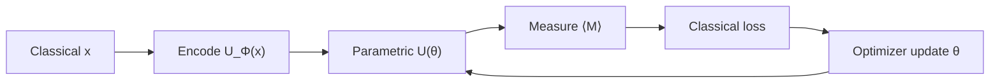

# **Chapter 10: Variational Quantum Circuits**

---

> **Summary:** This chapter deconstructs Variational Quantum Circuits (VQCs), the cornerstone of near-term quantum machine learning. We explore the hybrid quantum-classical paradigm where parameterized quantum circuits are iteratively trained via classical optimizers to solve complex problems. The chapter details the three-stage VQC architecture—encoding, parameterization, and measurement—and examines the critical design principles of circuit ansätze that balance expressibility with trainability. Finally, we confront the notorious barren plateau problem, a key obstacle in the practical deployment of VQCs on NISQ-era hardware.

---

The goal of this chapter is to establish the foundational concepts and techniques of Variational Quantum Classifiers (VQC), exploring how quantum computing can enhance traditional classification frameworks.

---


## **10.1 Parameterized Quantum Circuits (VQC)** {.heading-with-pill}
> **Difficulty:** ★★★☆☆
> 
> **Concept:** Trainable quantum models with data encoders and parameterized unitaries
> 
> **Summary:** A VQC prepares $\lvert\psi(x,\mathbf{\theta})\rangle = \mathbf{U}(\mathbf{\theta})\,\mathbf{U}_\phi(x)\,\lvert 0\rangle^{\otimes n}$ and predicts from expectation values of observables; training updates $\mathbf{\theta}$ to minimize a loss.

### **Theoretical Background**

Variational Quantum Circuits (VQCs) are hybrid quantum-classical models that parameterize quantum states and use classical optimization to minimize task-specific loss functions, enabling quantum machine learning on NISQ devices.

**Three-Stage VQC Architecture:**

A VQC consists of three sequential operations:

**1. Data Encoding ($\mathbf{U}_{\Phi}(x)$):**  
Map classical input $x \in \mathbb{R}^d$ to quantum state via feature map:

$$
\mathbf{U}_{\Phi}(x)|0\rangle^{\otimes n} = |\phi(x)\rangle
$$

Common encoding schemes:

**Angle Encoding:**
$$
\mathbf{U}_{\Phi}(x) = \bigotimes_{i=1}^{\min(d,n)} R_y(x_i) = \prod_{i=1}^{\min(d,n)} \begin{pmatrix} \cos(x_i/2) & -\sin(x_i/2) \\ \sin(x_i/2) & \cos(x_i/2) \end{pmatrix}_i
$$

**Amplitude Encoding:**  
For $d = 2^n$, encode normalized vector $\mathbf{x}/\|\mathbf{x}\|$ as amplitudes:

$$
|\phi(x)\rangle = \frac{1}{\|\mathbf{x}\|}\sum_{i=0}^{2^n-1} x_i |i\rangle
$$

Requires $\Theta(2^n)$ gates for arbitrary data.

**IQP-Inspired Encoding:**  
Apply Hadamards, then diagonal unitaries encoding feature products:

$$
\mathbf{U}_{\Phi}(x) = U_Z(x) \mathbf{H}^{\otimes n}, \quad U_Z(x) = \exp\left(-i\sum_{S \subseteq [n]} \phi_S(x) \prod_{j \in S} Z_j\right)
$$

where $\phi_S(x) = \sum_{k \in S} x_k$ or polynomial features.

**2. Variational Ansatz ($\mathbf{U}(\vec{\theta})$):**  
Parameterized unitary with trainable parameters $\vec{\theta} = (\theta_1, \ldots, \theta_m)$:

$$
\mathbf{U}(\vec{\theta}) = \prod_{\ell=1}^L \mathbf{W}_{\text{ent}}^{(\ell)} \cdot \mathbf{R}(\vec{\theta}_{\ell})
$$

where:
- $\mathbf{R}(\vec{\theta}_{\ell}) = \bigotimes_{i=1}^n R_y(\theta_{\ell,i})$ are single-qubit rotations  
- $\mathbf{W}_{\text{ent}}^{(\ell)}$ is entangling layer (e.g., CNOT ladder)

**Combined State:**
$$
|\psi(x;\vec{\theta})\rangle = \mathbf{U}(\vec{\theta}) \cdot \mathbf{U}_{\Phi}(x) \cdot |0\rangle^{\otimes n}
$$

**3. Measurement and Prediction:**  
Measure observable $\mathbf{M}$ (Hermitian operator) to extract prediction:

$$
\langle \mathbf{M} \rangle_{x,\vec{\theta}} = \langle\psi(x;\vec{\theta})|\mathbf{M}|\psi(x;\vec{\theta})\rangle
$$

**Binary Classification:**  
For labels $y \in \{-1, +1\}$, predict:

$$
\hat{y}(x;\vec{\theta}) = \text{sign}\left(\langle \mathbf{M} \rangle_{x,\vec{\theta}} - b\right)
$$

where $b \in \mathbb{R}$ is bias threshold (often $b=0$).

Typical observables:
- Single-qubit: $\mathbf{M} = \mathbf{Z}_0$ (measure first qubit)  
- Global: $\mathbf{M} = \sum_{i=0}^{n-1} \mathbf{Z}_i$ (parity)  
- Custom: $\mathbf{M} = \sum_j c_j \mathbf{P}_j$ where $\mathbf{P}_j$ are Pauli strings

**Loss Functions:**

**Mean Squared Error (Regression/Classification):**
$$
\mathcal{L}_{\text{MSE}}(\vec{\theta}) = \frac{1}{N}\sum_{i=1}^N \left(y_i - \langle\mathbf{M}\rangle_{x_i,\vec{\theta}}\right)^2
$$

**Hinge Loss (SVM-style):**
$$
\mathcal{L}_{\text{hinge}}(\vec{\theta}) = \frac{1}{N}\sum_{i=1}^N \max\left(0, 1 - y_i \langle\mathbf{M}\rangle_{x_i,\vec{\theta}}\right)
$$

**Cross-Entropy (Multi-class with softmax):**  
For $C$ classes, measure $C$ observables $\{\mathbf{M}_c\}$:

$$
p_c(x;\vec{\theta}) = \frac{e^{\langle\mathbf{M}_c\rangle_{x,\vec{\theta}}}}{\sum_{c'=1}^C e^{\langle\mathbf{M}_{c'}\rangle_{x,\vec{\theta}}}}
$$

$$
\mathcal{L}_{\text{CE}}(\vec{\theta}) = -\frac{1}{N}\sum_{i=1}^N \sum_{c=1}^C \mathbb{1}[y_i = c] \log p_c(x_i;\vec{\theta})
$$

**Training via Gradient Descent:**

Update rule:
$$
\vec{\theta}_{k+1} = \vec{\theta}_k - \eta \nabla_{\vec{\theta}} \mathcal{L}(\vec{\theta}_k)
$$

where $\eta > 0$ is learning rate.

**Parameter-Shift Rule for Gradients:**  
For gates $U(\theta_j) = e^{-i\theta_j G_j}$ with generator $G_j$ satisfying $G_j^2 = \mathbf{I}$ (eigenvalues $\pm 1$):

$$
\frac{\partial \langle\mathbf{M}\rangle}{\partial \theta_j} = \frac{1}{2}\left[\langle\mathbf{M}\rangle_{\vec{\theta}^+} - \langle\mathbf{M}\rangle_{\vec{\theta}^-}\right]
$$

where $\vec{\theta}^\pm = \vec{\theta} \pm \frac{\pi}{2}\hat{e}_j$.

**Proof Sketch:**  
Expand state in eigenbasis of $G_j$:

$$
U(\theta_j) = \cos(\theta_j/2)\mathbf{I} - i\sin(\theta_j/2)G_j
$$

Differentiating:

$$
\frac{\partial U}{\partial \theta_j} = -\frac{1}{2}\sin(\theta_j/2)\mathbf{I} - \frac{i}{2}\cos(\theta_j/2)G_j
$$

Applying product rule and using $U(\theta \pm \pi/2)$ evaluations yields the shift formula.

**Hybrid Training Loop:**

1. **Initialize:** Random $\vec{\theta}_0 \sim \mathcal{N}(0, \sigma^2)$ or small values  
2. **Forward Pass:** Prepare $|\psi(x_i;\vec{\theta}_k)\rangle$, measure $\langle\mathbf{M}\rangle$ for all training samples  
3. **Compute Loss:** Evaluate $\mathcal{L}(\vec{\theta}_k)$ from measurements  
4. **Gradient Estimation:** Use parameter-shift or SPSA to estimate $\nabla_{\vec{\theta}} \mathcal{L}$  
5. **Classical Update:** Apply optimizer (SGD, Adam, BFGS) to update $\vec{\theta}$  
6. **Iterate:** Repeat until convergence or budget exhaustion



### **Comprehension Check**

!!! note "Quiz"
    **1. Which layer embeds classical data into the quantum state?**

    - A. Measurement  
    - B. $\mathbf{U}_\phi(x)$  
    - C. $\mathbf{U}(\mathbf{\theta})$  
    - D. Identity  

    **2. A simple VQC prediction can be formed from which quantity?**

    - A. Circuit depth  
    - B. $\langle \mathbf{M} \rangle$ for some observable $\mathbf{M}$  
    - C. Number of qubits  
    - D. Number of CNOTs  

    ??? info "See Answer"
        **1: B** — The encoder $\mathbf{U}_\phi(x)$ maps $x$ into Hilbert space.  
        **2: B** — Expectation values provide scalar predictions.

-----

!!! abstract "Interview-Style Question"

    **Q:** Distinguish the roles of $\mathbf{U}_\phi(x)$ and $\mathbf{U}(\mathbf{\theta})$ in terms of feature mapping vs. learning capacity.

    ???+ info "Answer Strategy"
        In a Variational Quantum Classifier (VQC), the circuit is typically split into two distinct unitaries: the data encoder $U_\phi(x)$ and the variational ansatz $U(\theta)$.

        1.  **$U_\phi(x)$ (The Feature Map):**
            *   **Role:** To encode classical data $x$ into a quantum state. It acts as a **fixed, non-trainable feature map**.
            *   **Purpose:** To project the classical data into a high-dimensional Hilbert space where patterns may be more easily discernible. The structure of this encoder is chosen based on the problem domain (e.g., angle encoding for tabular data, ZZ feature maps for capturing correlations).
            *   **Analogy:** Similar to feature engineering or applying a kernel in classical machine learning.

        2.  **$U(\theta)$ (The Learning Circuit):**
            *   **Role:** A **trainable, parameterized quantum circuit** that processes the state prepared by the encoder.
            *   **Purpose:** To learn the classification task by finding the optimal parameters $\theta$ that map the encoded data to the correct labels. It adjusts the quantum state to align it with a measurement observable that separates the classes.
            *   **Analogy:** The hidden layers of a classical neural network, where the weights and biases are learned during training.

        **In short:** $U_\phi(x)$ is responsible for **data representation**, while $U(\theta)$ is responsible for **learning the model**. This separation allows for modular design and helps manage the complexity of the training process.

### **<i class="fa-solid fa-flask"></i> Hands-On Projects**

#### **Project Blueprint**

| **Section**              | **Description** |
| ------------------------ | --------------- |
| **Objective**            | Compute $C(\theta)=\langle \psi(\theta)\rvert\mathbf{Z}\lvert\psi(\theta)\rangle$ for $\lvert\psi(\theta)\rangle = \mathbf{R}_y(\theta)\,\mathbf{R}_x(\tfrac{\pi}{2})\lvert 0\rangle$. |
| **Mathematical Concept** | Expectation of Pauli $\mathbf{Z}$ after rotations; Bloch-sphere geometry. |
| **Experiment Setup**     | One qubit; apply $\mathbf{R}_x(\pi/2)$ then $\mathbf{R}_y(\theta)$; measure $\mathbf{Z}$. |
| **Process Steps**        | Derive $\lvert\psi(\theta)\rangle$; compute $\langle \mathbf{Z} \rangle$ analytically. |
| **Expected Behavior**    | $C(\theta)$ follows a cosine or sine law depending on ordering. |
| **Tracking Variables**   | Angle $\theta$, expectation $C(\theta)$. |
| **Verification Goal**    | Closed-form matches numeric evaluation. |
| **Output**               | Formula for $C(\theta)$ and brief interpretation. |

#### **Pseudocode Implementation**
```pseudo-code
FUNCTION Calculate_VQC_Expectation(theta):
    # theta: The angle for the Ry rotation gate.
    
    # Step 1: Prepare the initial state |0>.
    # State vector is [1, 0].
    initial_state = State_Vector([1, 0])
    LOG "Initial state: |0>"

    # Step 2: Apply the Rx(π/2) gate.
    # This creates a state on the equator of the Bloch sphere.
    # Rx(π/2)|0> = 1/sqrt(2) * (|0> - i|1>)
    Rx_gate = Rx_Matrix(PI / 2)
    state_after_Rx = Matrix_Vector_Multiply(Rx_gate, initial_state)
    LOG "State after Rx(π/2): ", state_after_Rx

    # Step 3: Apply the Ry(θ) gate.
    # This rotates the state around the Y-axis.
    Ry_gate = Ry_Matrix(theta)
    final_state = Matrix_Vector_Multiply(Ry_gate, state_after_Rx)
    LOG "Final state after Ry(θ): ", final_state

    # Step 4: Compute the expectation value of the Pauli Z observable.
    # <Z> = <ψ_final| Z |ψ_final>
    # The analytical result for this sequence is sin(theta).
    pauli_Z = Pauli_Z_Matrix()
    expectation_Z = Expectation_Value(final_state, pauli_Z)
    LOG "Expectation value <Z>: ", expectation_Z

    # Step 5: Verify against the known analytical result.
    analytical_result = sin(theta)
    ASSERT abs(expectation_Z - analytical_result) < 1e-9
    LOG "Result matches analytical formula sin(θ)."

    RETURN expectation_Z
END FUNCTION
```

#### **Outcome and Interpretation**

You relate rotation angles to measured expectations, grounding how VQCs generate outputs.

---

## **10.2 Circuit Ansätze for Learning** {.heading-with-pill}
> **Difficulty:** ★★★☆☆
> 
> **Concept:** Expressibility vs. trainability trade-offs in template design
> 
> **Summary:** Hardware-efficient ansätze align with device topology and are shallow; problem-inspired ansätze encode symmetries to focus search and mitigate barren plateaus.

### **Theoretical Background**

The choice of ansatz—the parameterized circuit architecture—determines the trade-off between expressibility (ability to represent target states) and trainability (ability to optimize parameters efficiently).

**Expressibility Framework:**

An ansatz $\mathbf{U}(\vec{\theta})$ with parameters $\vec{\theta} \in \Theta \subseteq \mathbb{R}^m$ generates a manifold $\mathcal{M} = \{|\psi(\vec{\theta})\rangle : \vec{\theta} \in \Theta\}$ within the Hilbert space $\mathcal{H} = \mathbb{C}^{2^n}$.

**Expressibility Measure:**  
Quantify how uniformly $\mathcal{M}$ covers $\mathcal{H}$ via Kullback-Leibler divergence from Haar measure:

$$
\text{Expr}(\mathbf{U}) = D_{KL}(P_{\mathcal{M}} \| P_{\text{Haar}})
$$

Lower values indicate higher expressibility. Random deep circuits approach Haar-random distributions (high expressibility) but suffer trainability issues.

**Hardware-Efficient Ansätze:**

Designed to match native gate sets and qubit connectivity of quantum processors:

$$
\mathbf{U}_{\text{HE}}(\vec{\theta}) = \prod_{\ell=1}^L \left[\mathbf{E}_{\mathcal{G}} \cdot \prod_{i=1}^n R_y(\theta_{\ell,i})\right]
$$

where:
- $\mathbf{E}_{\mathcal{G}} = \prod_{(i,j) \in \mathcal{G}} \text{CNOT}_{i,j}$ entangles along hardware graph $\mathcal{G}$  
- $L$ is circuit depth (number of layers)  
- Total parameters: $m = nL$

**Common Entangling Patterns:**

**Linear Chain:**
$$
\mathbf{E}_{\text{chain}} = \prod_{i=0}^{n-2} \text{CNOT}_{i,i+1}
$$
Depth: $\mathcal{O}(n)$ per layer. Nearest-neighbor only.

**Circular Ladder:**
$$
\mathbf{E}_{\text{circ}} = \prod_{i=0}^{n-1} \text{CNOT}_{i,(i+1)\bmod n}
$$
Adds periodic boundary.

**Brick-Layer (Alternating):**
$$
\mathbf{E}_{\text{brick}} = \left[\prod_{i \text{ even}} \text{CNOT}_{i,i+1}\right] \cdot \left[\prod_{i \text{ odd}} \text{CNOT}_{i,i+1}\right]
$$
Depth: $\mathcal{O}(1)$ with 2D qubit layout.

**All-to-All:**
$$
\mathbf{E}_{\text{all}} = \prod_{i<j} \text{CNOT}_{i,j}
$$
Maximal entanglement, depth $\mathcal{O}(n^2)$, prone to barren plateaus.

**Problem-Inspired Ansätze:**

Encode domain knowledge and symmetries to restrict search space.

**Unitary Coupled Cluster (UCC) for Chemistry:**
$$
\mathbf{U}_{\text{UCC}}(\vec{\theta}) = e^{\mathbf{T}(\vec{\theta}) - \mathbf{T}^\dagger(\vec{\theta})}
$$

where cluster operator includes excitations:

$$
\mathbf{T}(\vec{\theta}) = \sum_{a,i} \theta_a^i (a_a^\dagger a_i - a_i^\dagger a_a) + \sum_{a>b,i>j} \theta_{ab}^{ij} (a_a^\dagger a_b^\dagger a_j a_i - \text{h.c.})
$$

Preserves particle number and spin symmetries. After Jordan-Wigner transformation, each term becomes Pauli string product.

**QAOA-Inspired (Alternating Operators):**
$$
\mathbf{U}_{\text{QAOA}}(\vec{\gamma}, \vec{\beta}) = \prod_{k=1}^p e^{-i\beta_k \mathbf{B}} e^{-i\gamma_k \mathbf{C}}
$$

where $\mathbf{C}$ encodes problem Hamiltonian, $\mathbf{B}$ is mixer (typically $\sum_i \mathbf{X}_i$).

**Equivariant Ansätze:**  
Respect group symmetries $\mathcal{G}$ of the problem:

$$
g \cdot \mathbf{U}(\vec{\theta}) \cdot g^{-1} = \mathbf{U}(\vec{\theta}) \quad \forall g \in \mathcal{G}
$$

Reduces parameter space and prevents optimizer from exploring symmetry-equivalent redundant solutions.

**Depth-Expressibility Trade-off:**

For $n$-qubit system with Hilbert space dimension $D = 2^n$:

**Universal Approximation:**  
Solovay-Kitaev theorem: Any unitary can be approximated to precision $\epsilon$ using:

$$
L \sim \mathcal{O}\left(\log^c(D/\epsilon)\right) = \mathcal{O}\left(n^c \log^c(1/\epsilon)\right)
$$

gates from finite universal set (e.g., $\{H, T, \text{CNOT}\}$), where $c \approx 3.97$.

For hardware-efficient circuits with structure, empirical depth requirements:
- **Shallow regime** ($L \sim 1-3$): Low expressibility, limited to simple functions  
- **Moderate regime** ($L \sim \mathcal{O}(\log n)$): Sufficient for many practical tasks  
- **Deep regime** ($L \gg n$): Near-universal but trainability collapses

**Entanglement Scaling:**

Entanglement entropy of bipartition $A$ for state $|\psi(\vec{\theta})\rangle$:

$$
S_A = -\text{Tr}(\rho_A \log \rho_A), \quad \rho_A = \text{Tr}_{\bar{A}}|\psi\rangle\langle\psi|
$$

For random circuits:
- **Shallow:** $S_A \sim \mathcal{O}(L)$ (linear growth)  
- **Deep:** $S_A \to \min(|A|, |\bar{A}|) \log 2$ (volume-law, maximal)

Volume-law entanglement correlates with barren plateaus.

**Trainability vs. Expressibility:**

| Ansatz Type | Expressibility | Trainability | Use Case |
|-------------|----------------|--------------|----------|
| Shallow HE ($L=1-2$) | Low | High | Simple classification, initialization |
| Moderate HE ($L=3-5$) | Medium | Medium | General-purpose NISQ |
| Deep HE ($L>10$) | High | Low | Theoretical studies (barren plateaus) |
| UCC/QAOA | Problem-specific | High | Chemistry, optimization |
| Equivariant | Constrained | High | Symmetric problems |

### **Comprehension Check**

!!! note "Quiz"
    **1. A key benefit of hardware-efficient ansätze is:**

    - A. Guaranteed global minima  
    - B. Shallow depth and native-gate compatibility  
    - C. Exact simulation of any Hamiltonian  
    - D. Zero-shot variance  

    **2. Problem-inspired designs often aim to:**

    - A. Randomize parameters heavily  
    - B. Reduce parameter count and preserve symmetries  
    - C. Maximize depth regardless of noise  
    - D. Eliminate measurements  

    ??? info "See Answer"
        **1: B** — They map efficiently to available hardware.  
        **2: B** — Symmetry and sparsity improve trainability.

-----

!!! abstract "Interview-Style Question"

    **Q:** Explain how entanglement pattern and depth influence both expressibility and barren plateau risk.

    ???+ info "Answer Strategy"
        The design of a variational circuit's ansatz involves a critical trade-off between its **expressibility** (ability to represent complex functions) and its **trainability** (avoiding issues like barren plateaus).

        1.  **Expressibility:**
            *   **Influence of Entanglement:** More entanglement (e.g., all-to-all connections) allows the circuit to generate a wider variety of quantum states, increasing its representative power.
            *   **Influence of Depth:** Deeper circuits (more layers) can create more complex quantum states and approximate more complicated functions.

        2.  **Barren Plateaus (Trainability Issue):**
            *   **Definition:** A phenomenon where the gradients of the cost function vanish exponentially with the number of qubits, making optimization infeasible.
            *   **Influence of Entanglement and Depth:** Highly entangled and deep circuits are prone to becoming "too random." They start to approximate a mathematical structure known as a 2-design, which leads to the gradients flattening out across the parameter landscape.

        **The Trade-off:**
        *   **High Expressibility (Deep, Global Entanglement):** Leads to a high risk of barren plateaus, making the circuit untrainable.
        *   **High Trainability (Shallow, Local Entanglement):** Reduces the risk of barren plateaus but may result in a circuit that is too simple to capture the complexity of the problem (underfitting).

        The key to a good ansatz design is to find a "sweet spot" that is expressive enough for the task but structured and shallow enough to ensure that gradients remain trainable. This often involves using problem-specific knowledge or local entanglement patterns.

### **<i class="fa-solid fa-flask"></i> Hands-On Projects**

#### **Project Blueprint**

| **Section**              | **Description** |
| ------------------------ | --------------- |
| **Objective**            | Determine depth scaling for a hardware-efficient layer with parallel $\mathbf{R}_y$ and a serial nearest-neighbor CNOT chain. |
| **Mathematical Concept** | Depth per layer: $1$ (rotations in parallel) $+ (n-1)$ (serial CNOT chain). Total depth $\approx L\,(n-1+1)$. |
| **Experiment Setup**     | $n$ qubits in a line; $L$ layers; consider compilation constraints. |
| **Process Steps**        | Derive per-layer depth; extend to $L$ layers; discuss parallelization limits. |
| **Expected Behavior**    | Depth grows linearly in $n$ per layer and in $L$ overall. |
| **Tracking Variables**   | $n$, $L$, per-layer depth, total depth. |
| **Verification Goal**    | Consistency with gate scheduling assumptions. |
| **Output**               | Closed-form depth expressions and rationale. |

#### **Pseudocode Implementation**
```pseudo-code
FUNCTION Calculate_Ansatz_Depth(num_qubits_n, num_layers_L):
    # num_qubits_n: The number of qubits.
    # num_layers_L: The number of times the ansatz layer is repeated.
    ASSERT num_qubits_n > 1 AND num_layers_L > 0

    # --- Calculate Depth of a Single Layer ---
    # Step 1: Depth of the single-qubit rotation layer.
    # All Ry gates can be applied in parallel.
    depth_rotations = 1
    LOG "Depth of parallel rotation layer: ", depth_rotations

    # Step 2: Depth of the entangling layer.
    # A chain of CNOTs on a linear topology (q0-q1, q1-q2, ...)
    # must be applied sequentially.
    IF num_qubits_n > 1:
        depth_cnots = num_qubits_n - 1
    ELSE:
        depth_cnots = 0
    END IF
    LOG "Depth of serial CNOT chain: ", depth_cnots

    # Step 3: Total depth of one full layer.
    depth_per_layer = depth_rotations + depth_cnots
    LOG "Depth of a single full layer: ", depth_per_layer

    # --- Calculate Total Circuit Depth ---
    # Step 4: Total depth is the depth of one layer multiplied by L.
    total_depth = num_layers_L * depth_per_layer
    LOG "Total circuit depth for L=", num_layers_L, " layers: ", total_depth

    RETURN total_depth
END FUNCTION
```

#### **Outcome and Interpretation**

You quantify how template choices affect depth under simple scheduling assumptions, informing resource planning.

---

## **10.3 Gradient Estimation: Parameter-Shift** {.heading-with-pill}
> **Difficulty:** ★★★★☆
> 
> **Concept:** Exact derivatives from two evaluations for suitable generators
> 
> **Summary:** For $\mathbf{U}(\theta)=e^{-i\theta\mathbf{G}/2}$ with $\mathbf{G}^2=\mathbf{I}$, the parameter-shift rule yields $\partial_\theta E$ from two shifted objective values.

### **Theoretical Background**

The parameter-shift rule provides exact gradients of quantum expectation values for parameterized circuits, enabling gradient-based optimization without numerical differentiation.

**Problem Setup:**

Given expectation value:

$$
E(\vec{\theta}) = \langle\psi(\vec{\theta})|\mathbf{M}|\psi(\vec{\theta})\rangle
$$

where $|\psi(\vec{\theta})\rangle = \mathbf{U}(\vec{\theta})|0\rangle$ and $\mathbf{M}$ is observable, compute partial derivative:

$$
\frac{\partial E}{\partial \theta_j}
$$

**Single-Parameter Gate Structure:**

Consider gate generated by Hermitian operator $G$ with eigenvalues $\lambda_\pm$:

$$
U(\theta) = e^{-i\theta G}
$$

If $G$ has two distinct eigenvalues (two-point spectrum), normalize so $G^2 = \mathbf{I}$ with eigenvalues $\pm 1$.

**Eigendecomposition:**

Write $G = \sum_k \lambda_k |g_k\rangle\langle g_k|$ where $\lambda_k \in \{-1, +1\}$. Then:

$$
U(\theta) = \sum_k e^{-i\theta \lambda_k}|g_k\rangle\langle g_k|
$$

Expanding exponential via Euler formula:

$$
e^{-i\theta G} = \cos\theta \sum_k |g_k\rangle\langle g_k| - i\sin\theta \sum_k \lambda_k |g_k\rangle\langle g_k| = \cos\theta \cdot \mathbf{I} - i\sin\theta \cdot G
$$

**Derivative Calculation:**

Differentiate:

$$
\frac{\partial U(\theta)}{\partial \theta} = -\sin\theta \cdot \mathbf{I} - i\cos\theta \cdot G
$$

For expectation $E(\theta) = \langle\psi(\theta)|\mathbf{M}|\psi(\theta)\rangle$ where $|\psi(\theta)\rangle = U(\theta)|\psi_0\rangle$:

$$
\frac{\partial E}{\partial \theta} = \left\langle\frac{\partial\psi}{\partial\theta}\middle|\mathbf{M}\middle|\psi\right\rangle + \left\langle\psi\middle|\mathbf{M}\middle|\frac{\partial\psi}{\partial\theta}\right\rangle
$$

Since $\mathbf{M}$ is Hermitian, these are complex conjugates. Computing:

$$
\frac{\partial E}{\partial \theta} = 2\text{Re}\left\langle\frac{\partial U}{\partial\theta}\psi_0\middle|\mathbf{M}\middle|U(\theta)\psi_0\right\rangle
$$

**Shift Formula Derivation:**

Evaluate $U(\theta)$ at shifted points $\theta \pm s$:

$$
U(\theta + s) = \cos(\theta+s)\mathbf{I} - i\sin(\theta+s)G
$$

$$
U(\theta - s) = \cos(\theta-s)\mathbf{I} - i\sin(\theta-s)G
$$

Taking difference:

$$
U(\theta+s) - U(\theta-s) = [\cos(\theta+s)-\cos(\theta-s)]\mathbf{I} - i[\sin(\theta+s)-\sin(\theta-s)]G
$$

Using trigonometric identities:

$$
\cos(\theta+s) - \cos(\theta-s) = -2\sin\theta\sin s
$$
$$
\sin(\theta+s) - \sin(\theta-s) = 2\cos\theta\sin s
$$

Thus:

$$
U(\theta+s) - U(\theta-s) = -2\sin s(\sin\theta \cdot \mathbf{I} + i\cos\theta \cdot G)
$$

For $s = \pi/2$, $\sin s = 1$:

$$
U(\theta+\pi/2) - U(\theta-\pi/2) = -2(\sin\theta \cdot \mathbf{I} + i\cos\theta \cdot G) = 2i\frac{\partial U}{\partial\theta}
$$

Applying to expectation:

$$
E(\theta+\pi/2) - E(\theta-\pi/2) = 2\text{Im}\left\langle\psi_0\middle|U^\dagger(\theta)\frac{\partial U}{\partial\theta}\mathbf{M}\middle|\psi(\theta)\right\rangle
$$

After algebra involving the derivative structure:

$$
\frac{\partial E}{\partial\theta} = \frac{1}{2}\left[E(\theta+\pi/2) - E(\theta-\pi/2)\right]
$$

**Multi-Parameter Extension:**

For circuit $\mathbf{U}(\vec{\theta}) = \prod_{j=1}^m U_j(\theta_j)$, the gradient of expectation:

$$
\frac{\partial E}{\partial \theta_j} = \frac{1}{2}\left[E(\vec{\theta}^+_j) - E(\vec{\theta}^-_j)\right]
$$

where $\vec{\theta}^\pm_j = \vec{\theta} \pm \frac{\pi}{2}\hat{e}_j$.

**Computational Cost:**
- Per parameter: 2 circuit evaluations  
- For $m$ parameters: $2m$ total evaluations  
- Each evaluation requires $N_{\text{shots}}$ measurements

Total shots per gradient: $2m \times N_{\text{shots}}$

**General Shift Rules:**

For generators with eigenvalue spectrum $\{\lambda_1, \ldots, \lambda_r\}$:

$$
\frac{\partial E}{\partial\theta} = \sum_{k=1}^{r-1} c_k \left[E(\theta + s_k) - E(\theta - s_k)\right]
$$

where shifts $s_k$ and coefficients $c_k$ depend on eigenvalue gaps. For Pauli generators ($r=2$), recovers $\pi/2$ shift.

**Advantages:**
1. **Exactness:** No finite-difference approximation error  
2. **Hardware compatibility:** Uses actual circuit evaluations  
3. **Noise resilience:** Averages over shot noise with proper statistics  
4. **Barren plateau awareness:** Gradient magnitude directly measured

**Limitations:**
1. **Scalability:** $\mathcal{O}(m)$ cost prohibitive for $m > 100$  
2. **Noise accumulation:** Each evaluation subject to device errors  
3. **Barren plateaus:** Cannot overcome exponentially small gradients  
4. **Non-Pauli gates:** Require generalized shifts (e.g., controlled rotations need 4+ evaluations)

**Comparison with Finite Differences:**

Central difference approximation:

$$
\frac{\partial E}{\partial\theta} \approx \frac{E(\theta+h) - E(\theta-h)}{2h}
$$

Error: $\mathcal{O}(h^2)$ plus shot noise amplification $\mathcal{O}(1/h)$ for small $h$. Parameter-shift avoids this trade-off with exact formula.

### **Comprehension Check**

!!! note "Quiz"
    **1. Parameter-shift requires what property of the generator?**

    - A. Non-Hermitian  
    - B. Two-point spectrum (involutory up to scale)  
    - C. Nilpotent  
    - D. Non-unitary  

    **2. How many evaluations per parameter are needed?**

    - A. One  
    - B. Two  
    - C. $d$  
    - D. $2d$  

    ??? info "See Answer"
        **1: B** — Eigenvalues $\pm 1$ admit shifts by $\pm\pi/2$.  
        **2: B** — Two evaluations suffice per parameter.

-----

!!! abstract "Interview-Style Question"

    **Q:** Compare parameter-shift with SPSA in terms of query cost and noise tolerance.

    ???+ info "Answer Strategy"
        When training VQCs, the choice of gradient estimator involves a trade-off between cost and precision. The two most common methods are the Parameter-Shift Rule and Simultaneous Perturbation Stochastic Approximation (SPSA).

        | Metric                | Parameter-Shift Rule                               | SPSA (Simultaneous Perturbation Stochastic Approx.)        |
        | --------------------- | -------------------------------------------------- | ---------------------------------------------------------- |
        | **Query Cost**        | **High ($2m$ circuits per gradient)**, where $m$ is the number of parameters. | **Low (2 circuits per gradient)**, regardless of $m$.      |
        | **Gradient Quality**  | **Exact**. It provides the analytical gradient, limited only by shot noise. | **Stochastic**. It's an approximation, introducing its own noise. |
        | **Noise Tolerance**   | **Moderate**. It's robust to shot noise but can be sensitive to device control errors. | **High**. Its stochastic nature makes it inherently resilient to device noise. |
        | **Scalability**       | **Poor**. The cost becomes prohibitive for models with many parameters ($m > 100$). | **Excellent**. It is the preferred method for large-scale models. |
        | **Best For**          | Small models, high-precision optimization, or final fine-tuning. | Large models, noisy hardware, and initial, rapid exploration of the parameter space. |

        **Summary:**
        - Use **Parameter-Shift** for small, precise models where accuracy is paramount and the cost is manageable.
        - Use **SPSA** for large, complex models, especially on noisy hardware, where scalability and cost-efficiency are the primary concerns. A common strategy is to use SPSA for initial training and switch to parameter-shift for final convergence.

### **<i class="fa-solid fa-flask"></i> Hands-On Projects**

#### **Project Blueprint**

| **Section**              | **Description** |
| ------------------------ | --------------- |
| **Objective**            | Apply parameter-shift to $C(\theta)=-\cos\theta$ at $\theta=\pi/4$ and compare to analytic derivative. |
| **Mathematical Concept** | $\partial_\theta C(\theta)=\sin\theta$; shift estimator with $\pm\pi/2$. |
| **Experiment Setup**     | Use closed-form $C$; compute two shifted values and difference/2. |
| **Process Steps**        | Evaluate $C(\pi/4\pm\pi/2)$; form estimate; compare to $\sin(\pi/4)$. |
| **Expected Behavior**    | Exact agreement in noise-free algebra. |
| **Tracking Variables**   | $C_+$, $C_-$, estimate, analytic value. |
| **Verification Goal**    | Equality within arithmetic precision. |
| **Output**               | Numeric comparison table (conceptual). |

#### **Pseudocode Implementation**
```pseudo-code
FUNCTION Demonstrate_Parameter_Shift_Rule(CostFunction, theta):
    # CostFunction: A function C(θ) that returns a scalar value, e.g., -cos(θ).
    # theta: The parameter value at which to compute the gradient.
    
    # Step 1: Define the shift amount.
    # For Pauli-based gates, the shift is π/2.
    shift = PI / 2
    LOG "Using parameter shift amount: ", shift

    # Step 2: Evaluate the cost function at the shifted points.
    cost_plus = CostFunction(theta + shift)
    cost_minus = CostFunction(theta - shift)
    LOG "C(θ + π/2) = ", cost_plus
    LOG "C(θ - π/2) = ", cost_minus

    # Step 3: Apply the parameter-shift formula to estimate the gradient.
    # The formula for a single parameter is (C(θ+s) - C(θ-s)) / (2*sin(s))
    # For s=π/2, this simplifies to (C(θ+π/2) - C(θ-π/2)) / 2.
    gradient_estimate = (cost_plus - cost_minus) / 2.0
    LOG "Parameter-shift gradient estimate: ", gradient_estimate

    # Step 4: Compare with the analytical derivative for verification.
    # For C(θ) = -cos(θ), the derivative is dC/dθ = sin(θ).
    analytical_gradient = sin(theta)
    LOG "Analytical gradient: ", analytical_gradient

    # Step 5: Check if the estimate matches the true value.
    ASSERT abs(gradient_estimate - analytical_gradient) < 1e-9
    LOG "Verification successful: The estimate matches the analytical gradient."

    RETURN gradient_estimate
END FUNCTION

// Example usage:
// Demonstrate_Parameter_Shift_Rule(lambda t: -cos(t), PI / 4)
```

#### **Outcome and Interpretation**

You verify the parameter-shift estimator and its exactness for simple generators.

---

## **10.4 Noise and Shot Complexity** {.heading-with-pill}
> **Difficulty:** ★★★☆☆
> 
> **Concept:** Finite-sample variance and measurement budgeting
> 
> **Summary:** Expectation estimates have variance $\mathcal{O}(1/N_{\text{shots}})$; reducing error bars requires more shots or grouping strategies and dominates runtime in training loops.

### **Theoretical Background**

Finite-sample measurement introduces statistical noise that dominates computational cost in variational quantum algorithms, requiring careful shot budgeting and variance reduction strategies.

**Measurement Statistics:**

Measuring observable $\mathbf{M}$ with eigenvalues $\{m_k\}$ on state $\rho$ yields outcome $m_k$ with probability:

$$
p_k = \text{Tr}(\mathbf{M}_k \rho), \quad \mathbf{M}_k = |m_k\rangle\langle m_k|
$$

Expectation value:

$$
\langle\mathbf{M}\rangle = \text{Tr}(\mathbf{M}\rho) = \sum_k m_k p_k
$$

**Shot Noise Analysis:**

With $N$ independent measurements $\{m^{(i)}\}_{i=1}^N$, empirical estimator:

$$
\widehat{\langle\mathbf{M}\rangle}_N = \frac{1}{N}\sum_{i=1}^N m^{(i)}
$$

This is unbiased: $\mathbb{E}[\widehat{\langle\mathbf{M}\rangle}_N] = \langle\mathbf{M}\rangle$

**Variance:**

$$
\text{Var}[\widehat{\langle\mathbf{M}\rangle}_N] = \frac{1}{N}\text{Var}[m^{(1)}] = \frac{1}{N}\left(\langle\mathbf{M}^2\rangle - \langle\mathbf{M}\rangle^2\right)
$$

For Pauli operators with eigenvalues $\pm 1$:

$$
\mathbf{M}^2 = \mathbf{I} \implies \langle\mathbf{M}^2\rangle = 1
$$

Thus:

$$
\text{Var}[\widehat{\langle\mathbf{M}\rangle}_N] = \frac{1 - \langle\mathbf{M}\rangle^2}{N}
$$

Maximum variance (at $\langle\mathbf{M}\rangle = 0$): $\sigma^2 = 1/N$

**Standard Error:**

$$
\sigma[\widehat{\langle\mathbf{M}\rangle}_N] = \sqrt{\text{Var}} = \frac{\sqrt{1 - \langle\mathbf{M}\rangle^2}}{\sqrt{N}}
$$

Confidence interval (95%):

$$
\langle\mathbf{M}\rangle \in \left[\widehat{\langle\mathbf{M}\rangle}_N \pm 1.96\sigma\right]
$$

**Shot Requirement for Precision:**

To achieve standard error $\epsilon$:

$$
\frac{1}{\sqrt{N}} \leq \epsilon \implies N \geq \frac{1}{\epsilon^2}
$$

**Examples:**
- $\epsilon = 0.1$: $N \geq 100$ shots  
- $\epsilon = 0.01$: $N \geq 10,000$ shots  
- $\epsilon = 0.001$: $N \geq 1,000,000$ shots

Halving error requires **4× shots** (quadratic scaling).

**Multi-Observable Estimation:**

For Hamiltonian $\mathbf{H} = \sum_{j=1}^T c_j \mathbf{P}_j$ with Pauli terms:

**Naive Strategy:**  
Measure each term independently with $N_j$ shots:

$$
\widehat{\langle\mathbf{H}\rangle} = \sum_{j=1}^T c_j \widehat{\langle\mathbf{P}_j\rangle}_{N_j}
$$

Variance:

$$
\text{Var}[\widehat{\langle\mathbf{H}\rangle}] = \sum_{j=1}^T c_j^2 \cdot \frac{1 - \langle\mathbf{P}_j\rangle^2}{N_j}
$$

With uniform allocation $N_j = N/T$:

$$
\text{Var}[\widehat{\langle\mathbf{H}\rangle}] = \frac{T}{N}\sum_{j=1}^T c_j^2
$$

Total measurements: $N_{\text{total}} = T \times (N/T) = N$

**Commuting Group Optimization:**

Partition terms into $M$ commuting groups $\{\mathcal{G}_m\}$ where all $\mathbf{P}_i, \mathbf{P}_j \in \mathcal{G}_m$ satisfy $[\mathbf{P}_i, \mathbf{P}_j] = 0$.

Each group measured simultaneously in shared eigenbasis. Group variance:

$$
\sigma_m^2 = \text{Var}\left[\sum_{\mathbf{P}_j \in \mathcal{G}_m} c_j \mathbf{P}_j\right] = \left\langle\left(\sum_j c_j\mathbf{P}_j\right)^2\right\rangle - \left(\sum_j c_j\langle\mathbf{P}_j\rangle\right)^2
$$

With $N_m$ shots per group:

$$
\text{Var}[\widehat{\langle\mathbf{H}\rangle}] = \sum_{m=1}^M \frac{\sigma_m^2}{N_m}
$$

**Optimal Shot Allocation:**

Minimize variance subject to budget $\sum_m N_m = N$ using Lagrange multipliers:

$$
\mathcal{L} = \sum_{m=1}^M \frac{\sigma_m^2}{N_m} + \lambda\left(\sum_{m=1}^M N_m - N\right)
$$

Setting $\frac{\partial\mathcal{L}}{\partial N_m} = 0$:

$$
-\frac{\sigma_m^2}{N_m^2} + \lambda = 0 \implies N_m \propto \sigma_m
$$

Normalizing:

$$
N_m^* = N \cdot \frac{\sigma_m}{\sum_{k=1}^M \sigma_k}
$$

Minimum variance:

$$
\text{Var}_{\min} = \frac{1}{N}\left(\sum_{m=1}^M \sigma_m\right)^2
$$

**Training Loop Shot Budget:**

For optimization with $K$ iterations, $m$ parameters:

**Using Parameter-Shift:**
- Evaluations per gradient: $2m$  
- Shots per evaluation: $N_{\text{shots}}$  
- Total per iteration: $2m \times N_{\text{shots}}$  
- Total for training: $K \times 2m \times N_{\text{shots}}$

**Example:**  
$K=500$ iterations, $m=100$ parameters, $N_{\text{shots}}=10^4$:

$$
N_{\text{total}} = 500 \times 200 \times 10^4 = 10^9 \text{ measurements}
$$

**Adaptive Shot Strategies:**

1. **Increasing schedule:** $N_k = N_0 \cdot (1 + k/K)^\alpha$ with $\alpha \sim 1-2$  
2. **Gradient-dependent:** $N_k \propto 1/\|\nabla\mathcal{L}_k\|$ (more shots when gradients small)  
3. **Error-driven:** Increase shots when $|\mathcal{L}_k - \mathcal{L}_{k-1}| < \delta\sigma_k$

**Variance Reduction Techniques:**

1. **Observable grouping:** Reduces bases from $T$ to $M \ll T$  
2. **Control variates:** Use known expectations as baselines  
3. **Importance sampling:** Weight basis measurement frequencies  
4. **Classical shadows:** Estimate many observables from single measurement data

### **Comprehension Check**

!!! note "Quiz"
    **1. If you halve the standard error, how must shots change?**

    - A. Halve shots  
    - B. Keep shots constant  
    - C. Double shots  
    - D. Quadruple shots  

    **2. Which tactic reduces measurement overhead?**

    - A. Deeper circuits  
    - B. Grouping commuting terms  
    - C. Randomizing bases  
    - D. Fewer iterations regardless of loss  

    ??? info "See Answer"
        **1: D** — $\epsilon\propto 1/\sqrt{N}$ implies $N\mapsto 4N$.  
        **2: B** — Shared bases reduce distinct settings.

-----

!!! abstract "Interview-Style Question"

    **Q:** Why can measurement cost dominate end-to-end training time, and how would you budget shots across iterations?

    ???+ info "Answer Strategy"
        Measurement cost often dominates the total training time of a VQC for two primary reasons: the sheer volume of measurements required and the statistical nature of quantum mechanics.

        **Why Measurement is Expensive:**

        1.  **Shot Noise:** To get a reliable estimate of an expectation value, you must repeat the circuit execution and measurement many times (thousands or millions of "shots"). The statistical error in your estimate decreases only as $1/\sqrt{N}$, where $N$ is the number of shots. This means to halve your error, you must quadruple your shots.
        2.  **Iterative Optimization:** Training a VQC involves many optimization steps (iterations).
        3.  **Gradient Calculation:** At each step, calculating the gradient requires multiple circuit evaluations (e.g., $2m$ for the parameter-shift rule with $m$ parameters).

        The total number of shots is multiplicative: `(Number of Iterations) x (Circuits per Gradient) x (Shots per Circuit)`. This can quickly lead to billions or trillions of total shots, making measurement the main bottleneck.

        **How to Budget Shots:**

        A naive approach is to use a fixed, large number of shots for every step. A much more efficient strategy is to use an **adaptive shot budget**:

        1.  **Start Low:** In the early stages of training, when gradients are large and the optimizer is just exploring, precision is not critical. Use a low number of shots (e.g., 1,000) to get a rough estimate of the gradient direction quickly.
        2.  **Increase Gradually:** As the optimization proceeds and the parameters get closer to a minimum, the gradients become smaller. To resolve these smaller gradients from the shot noise, you need more precision. Therefore, you should gradually increase the number of shots with each iteration.

        This adaptive approach concentrates the measurement budget on the later stages of training where it is most needed, leading to significant savings in both time and cost without sacrificing the quality of the final result.

### **<i class="fa-solid fa-flask"></i> Hands-On Projects**

#### **Project Blueprint**

| **Section**              | **Description** |
| ------------------------ | --------------- |
| **Objective**            | Compute shot scaling to halve standard deviation and total shots for a run with many gradient calls. |
| **Mathematical Concept** | $\epsilon\propto 1/\sqrt{N}$; linear accumulation of shot cost. |
| **Experiment Setup**     | Given $S=1000$ shots baseline; 500 gradient evaluations; 8000 shots per evaluation. |
| **Process Steps**        | Find $S'$ with $\epsilon'/\epsilon=1/2$; compute total shots $=500\times 8000$. |
| **Expected Behavior**    | $S'=4S$; total shots $=4\times 10^6$. |
| **Tracking Variables**   | $S$, $S'$, evaluations, total shots. |
| **Verification Goal**    | Arithmetic matches definitions. |
| **Output**               | Shot budget numbers and interpretation. |

#### **Pseudocode Implementation**
```pseudo-code
FUNCTION Analyze_Shot_Budget(baseline_shots_S, error_reduction_factor, num_gradient_evals):
    # baseline_shots_S: The initial number of shots for a baseline error ε.
    # error_reduction_factor: The factor by which to reduce the error (e.g., 2 for halving).
    # num_gradient_evals: The total number of gradient evaluations in the run.
    ASSERT baseline_shots_S > 0 AND error_reduction_factor > 0

    # --- Shot Scaling for Precision ---
    # Step 1: Calculate the new shot count S' required for the desired error ε'.
    # Since error ε ~ 1/sqrt(S), to get ε' = ε / factor, we need S' = S * factor^2.
    new_shots_per_eval = baseline_shots_S * (error_reduction_factor**2)
    LOG "To reduce error by a factor of ", error_reduction_factor, ", shots must increase from ", baseline_shots_S, " to ", new_shots_per_eval, "."
    
    # Example from project: S=1000, factor=2 -> S' = 1000 * 4 = 4000.
    # The project description uses a different baseline of 8000, let's use that.
    shots_per_evaluation = 8000 # As per project description
    LOG "Using ", shots_per_evaluation, " shots per gradient evaluation."

    # --- Total Shot Budget Calculation ---
    # Step 2: Calculate the total number of shots for the entire VQE run.
    # This is the number of gradient evaluations multiplied by the shots per evaluation.
    total_shots = num_gradient_evals * shots_per_evaluation
    LOG "Total gradient evaluations: ", num_gradient_evals
    LOG "Total shot budget required for the run: ", total_shots

    # --- Interpretation ---
    LOG "This demonstrates the high measurement cost in VQAs."
    LOG "A run with ", num_gradient_evals, " gradient steps, each requiring ", shots_per_evaluation, " shots,"
    LOG "consumes a total of ", total_shots, " circuit executions."

    RETURN new_shots_per_eval, total_shots
END FUNCTION

// Example usage based on project description:
// Analyze_Shot_Budget(baseline_shots_S=1000, error_reduction_factor=2, num_gradient_evals=500)
```

#### **Outcome and Interpretation**

You quantify how error bars trade against runtime and how training loops scale with measurement cost.

---

## **10.5 Barren Plateaus and Mitigation** {.heading-with-pill}
> **Difficulty:** ★★★★☆
> 
> **Concept:** Vanishing gradients in deep/random circuits and practical countermeasures
> 
> **Summary:** Random deep ansätze drive gradients toward zero; mitigation uses shallow/structured layers, informed initialization, and locality to retain gradient signal.

### **Theoretical Background**

Barren plateaus are exponentially flat regions in the loss landscape of variational quantum circuits where gradients vanish, rendering gradient-based optimization infeasible.

**Formal Definition:**

For loss function $\mathcal{L}(\vec{\theta})$ with parameters initialized randomly, a barren plateau occurs when:

$$
\text{Var}\left[\frac{\partial \mathcal{L}}{\partial \theta_j}\right] \in \mathcal{O}\left(\frac{1}{\text{poly}(2^n)}\right)
$$

The gradient variance vanishes exponentially with system size $n$, making gradient signal indistinguishable from shot noise.

**McClean-Cerezo-Coles Theorem (2018):**

For random parameterized circuits forming approximate unitary 2-designs, measuring local observable $\mathbf{O}$ acting on $k$ qubits:

$$
\mathbb{E}\left[\frac{\partial \langle\mathbf{O}\rangle}{\partial \theta_j}\right] = 0
$$

$$
\text{Var}\left[\frac{\partial \langle\mathbf{O}\rangle}{\partial \theta_j}\right] \leq \frac{C}{2^n}
$$

where $C$ is constant independent of $n$.

**Proof Sketch:**

Consider circuit $\mathbf{U}(\vec{\theta}) = \mathbf{V} U_\ell(\theta_\ell) \mathbf{W}$ where $\mathbf{V}, \mathbf{W}$ are random unitaries forming 2-design.

Expectation over Haar measure:

$$
\mathbb{E}_{\mathbf{V},\mathbf{W}}\left[|\langle\psi|\mathbf{V}^\dagger \mathbf{O} \mathbf{V}|\psi\rangle|^2\right] = \frac{\text{Tr}(\mathbf{O})^2 + \text{Tr}(\mathbf{O}^2)}{2^n(2^n+1)}
$$

For local $\mathbf{O}$ with $\text{Tr}(\mathbf{O}) = 0$ and $\text{Tr}(\mathbf{O}^2) = \mathcal{O}(1)$:

$$
\text{Var}[\langle\mathbf{O}\rangle] \sim \mathcal{O}(1/2^n)
$$

Differentiating with respect to parameter preserves this scaling.

**Conditions for Barren Plateaus:**

1. **Deep Random Circuits:**  
   Depth $L \geq \mathcal{O}(n)$ with random gates approaches Haar distribution. Circuits with $L \gtrsim n \log n$ gates form approximate 2-designs.

2. **Global Entanglement:**  
   All-to-all connectivity or long-range gates create volume-law entanglement entropy:
   
   $$
   S(\rho_A) \sim |A| \log 2
   $$
   
   for bipartition $A$. Maximal entanglement correlates with gradient vanishing.

3. **Hardware-Efficient Ansätze at Depth:**  
   Even structured circuits exhibit barren plateaus beyond critical depth $L_c \sim \mathcal{O}(n)$.

**Gradient Scaling Laws:**

**Local Observable ($k$-local):**
$$
\text{Var}\left[\frac{\partial\langle\mathbf{O}_k\rangle}{\partial\theta}\right] \sim \mathcal{O}(1/2^n)
$$

**Global Observable (all $n$ qubits):**
$$
\text{Var}\left[\frac{\partial\langle\mathbf{O}_n\rangle}{\partial\theta}\right] \sim \mathcal{O}(1)
$$

Global observables preserve gradients but may not reflect problem structure.

**Practical Implications:**

For $n=50$ qubits with local observable:

$$
\text{Var}[\partial\mathcal{L}/\partial\theta] \sim 2^{-50} \approx 10^{-15}
$$

Standard error from $N$ shots: $\sigma \sim 1/\sqrt{N}$. To resolve gradient:

$$
|\partial\mathcal{L}/\partial\theta| > 2\sigma \implies \sqrt{2^{-50}} > 2/\sqrt{N} \implies N > 2^{52} \approx 4.5 \times 10^{15}
$$

Completely infeasible.

**Mitigation Strategies:**

**1. Shallow Circuits:**  
Restrict depth to $L \ll n$. For many tasks, $L = \mathcal{O}(\log n)$ sufficient:

$$
L \leq c \log n, \quad c \sim 2-5
$$

Prevents 2-design formation while maintaining polynomial expressibility.

**2. Local Cost Functions:**  
Decompose global loss into sum of local terms:

$$
\mathcal{L}(\vec{\theta}) = \sum_{i} w_i \langle\mathbf{O}_i\rangle, \quad \text{supp}(\mathbf{O}_i) = \mathcal{O}(1)
$$

Each term's gradient scales as $\mathcal{O}(1/2^k)$ where $k$ is support size, avoiding full $2^n$ suppression.

**3. Parameter Initialization:**  

**Identity-near initialization:**
$$
\theta_j \sim \mathcal{N}(0, \sigma^2), \quad \sigma \ll 1
$$

Keeps circuit close to identity initially, avoiding random regime.

**Problem-informed initialization:**  
For chemistry VQE, initialize at Hartree-Fock solution or UCC with small excitations.

**4. Layer-wise Training:**  
Train one layer at a time:

1. Optimize $\vec{\theta}_1$ with single layer $\mathbf{U}(\vec{\theta}_1)$  
2. Freeze $\vec{\theta}_1^*$, add second layer, optimize $\vec{\theta}_2$  
3. Repeat for $L$ layers

Never optimizes deep circuit simultaneously.

**5. Structured Ansätze:**

**Equivariant circuits:**  
Respect problem symmetries, restricting to smaller effective Hilbert space:

$$
\dim(\mathcal{H}_{\text{eff}}) \ll 2^n
$$

Gradient variance scales with effective dimension.

**Problem-specific templates:**  
UCC for chemistry, QAOA for optimization preserve structure preventing random exploration.

**6. Gradient-Free Optimizers:**  
When gradients unavoidable small, use:

- **SPSA:** 2 evaluations regardless of dimension  
- **CMA-ES:** Covariance matrix adaptation  
- **Genetic algorithms:** Population-based search

These don't rely on gradient magnitude but converge slower.

**Alternative Formulations:**

**Tensor network initialization:**  
Prepare initial state via classical tensor network (e.g., MPS) matching problem structure, use VQC for refinement.

**Overlap-based losses:**  
Replace $\langle\mathbf{H}\rangle$ with overlap fidelity:

$$
\mathcal{L}(\vec{\theta}) = 1 - |\langle\psi_{\text{target}}|\psi(\vec{\theta})\rangle|^2
$$

Gradient properties differ, may avoid plateaus for certain targets.

**Theoretical Landscape:**

Barren plateaus fundamental to random quantum circuits but **not universal curse**. Many real-world problems have structure allowing polynomial trainability. Key: match ansatz architecture to problem symmetry and locality.

### **Comprehension Check**

!!! note "Quiz"
    **1. What symptom characterizes a barren plateau?**

    - A. Exploding gradients  
    - B. Vanishing gradients  
    - C. Oscillating loss  
    - D. Deterministic measurements  

    **2. Which approach mitigates plateaus?**

    - A. Increase random depth  
    - B. Local cost functions and shallow blocks  
    - C. Remove encoders  
    - D. Ignore noise  

    ??? info "See Answer"
        **1: B** — Gradients concentrate near zero.  
        **2: B** — Local objectives and structure maintain gradient magnitude.

-----

!!! abstract "Interview-Style Question"

    **Q:** Outline a mitigation plan when training stalls due to vanishing gradients.

    ???+ info "Answer Strategy"
        When a VQC training process stalls and the gradients vanish (a "barren plateau"), it means the optimization landscape is too flat to navigate. Here is a step-by-step mitigation plan:

        1.  **Diagnose the Issue:**
            *   First, confirm that you are in a barren plateau by monitoring the norm of the gradient vector. If it's consistently close to zero (e.g., $< 10^{-4}$), a barren plateau is likely the cause.

        2.  **Reduce Circuit Complexity:**
            *   **Reduce Depth:** The most direct solution. Systematically reduce the number of layers in your ansatz. Deeper circuits are more prone to barren plateaus. Find the minimum depth that is still expressive enough for your problem.
            *   **Use Local Entanglement:** Replace global or random entanglement patterns with local ones (e.g., nearest-neighbor CNOTs). This restricts the flow of information and helps preserve the gradient signal.

        3.  **Adjust Initialization:**
            *   **Initialize Near Identity:** Instead of initializing parameters randomly across a large range (like $[-\pi, \pi]$), initialize them with small values close to zero (e.g., from a normal distribution $\mathcal{N}(0, 0.01)$). This ensures the initial circuit is not in a flat region of the landscape.

        4.  **Employ Advanced Techniques:**
            *   **Layer-wise Training:** Train one layer of the ansatz at a time. Once the first layer is converged, freeze its parameters and add a new layer to train. This builds a deep circuit without ever having to optimize all the parameters of a deep circuit at once.
            - **Use a different Optimizer:** Sometimes, a different classical optimizer can help escape a barren plateau.

        By systematically applying these strategies, you can often restore the trainability of your model and escape the barren plateau.

### **<i class="fa-solid fa-flask"></i> Hands-On Projects**

#### **Project Blueprint**

| **Section**              | **Description** |
| ------------------------ | --------------- |
| **Objective**            | Diagnose gradient norms across depths $L\in\{1,2,3\}$ for a fixed ansatz and encoder. |
| **Mathematical Concept** | Gradient norm $\lVert\nabla C\rVert$ vs. depth as a proxy for trainability. |
| **Experiment Setup**     | Same dataset/encoder; increase layers; estimate gradient norms at random inits. |
| **Process Steps**        | Initialize small angles; measure $\lVert\nabla C\rVert$; compare across $L$. |
| **Expected Behavior**    | Norms shrink with depth for random inits; structure lessens decay. |
| **Tracking Variables**   | $L$, $\lVert\nabla C\rVert$, shots per estimate. |
| **Verification Goal**    | Monotone decrease in random-deep case; mitigated with structure. |
| **Output**               | Table of gradient norms vs. depth with narrative. |

#### **Pseudocode Implementation**
```pseudo-code
FUNCTION Diagnose_Barren_Plateaus(depth_list, num_qubits, num_samples):
    # depth_list: A list of circuit depths to test, e.g., [1, 5, 10].
    # num_qubits: The number of qubits in the circuit.
    # num_samples: The number of random initializations to average over.

    gradient_variances = {}

    FOR L IN depth_list:
        LOG "Analyzing depth L = ", L
        
        gradients_for_this_depth = []
        
        FOR i IN 1..num_samples:
            # Step 1: Define a random, deep ansatz for the given depth.
            Ansatz = Build_Random_Hardware_Efficient_Ansatz(num_qubits, depth=L)
            
            # Step 2: Initialize with random parameters.
            random_params = Random_Initialize_Params(Ansatz.num_params)
            
            # Step 3: Compute the gradient of a single parameter.
            # The cost function is typically the expectation of a local observable (e.g., Z on one qubit).
            CostFunction = Expectation_Value(Pauli_Z(qubit_index=0))
            
            # We compute the gradient with respect to the first parameter, for instance.
            gradient_component = Compute_Gradient_Component(
                CostFunction, Ansatz, random_params, param_index=0
            )
            gradients_for_this_depth.append(gradient_component)
        END FOR

        # Step 4: Calculate the variance of the collected gradient components.
        variance = Variance(gradients_for_this_depth)
        gradient_variances[L] = variance
        LOG "Variance of gradient for L=", L, " is ", variance
    END FOR

    # Step 5: Analyze the results.
    # We expect the variance to decrease as the depth L increases,
    # which is the signature of a barren plateau.
    LOG "Gradient variance vs. depth: ", gradient_variances
    LOG "If variance decreases exponentially with depth, a barren plateau is present."

    RETURN gradient_variances
END FUNCTION
```

#### **Outcome and Interpretation**

You connect architectural choices to trainability via measurable gradient statistics.

