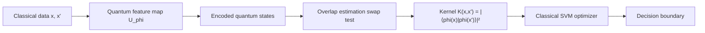
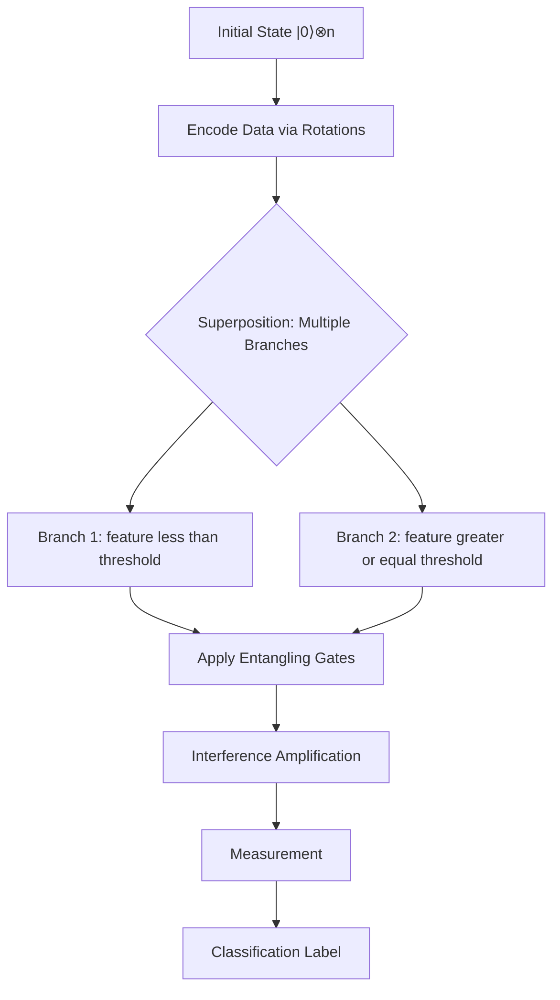

# **Chapter 11: Quantum Supervised Learning**

---

## **Introduction**

Quantum Machine Learning (QML) represents the convergence of quantum computing and machine learning, leveraging quantum mechanical phenomena—superposition, entanglement, and interference—to potentially outperform classical learning algorithms. While classical machine learning has achieved remarkable success, it faces fundamental computational barriers when dealing with exponentially large feature spaces, high-dimensional data, and complex optimization landscapes. QML algorithms aim to overcome these barriers by exploiting the exponential dimensionality of quantum Hilbert space.

This chapter surveys the core supervised learning algorithms in the QML landscape: Quantum Support Vector Machines (QSVM), which use quantum kernels to access exponentially large feature spaces; Quantum Neural Networks (QNN), which employ variational quantum circuits as trainable models; and distance-based methods like Quantum k-Nearest Neighbors (QkNN). Each algorithm represents a different strategy for translating classical learning paradigms into the quantum domain, balancing the promise of quantum advantage against the practical constraints of NISQ hardware.

Understanding these algorithms requires grasping how quantum feature maps transform data, how quantum kernels measure similarity, and how hybrid quantum-classical optimization enables learning despite the limitations of current quantum processors. This chapter provides the foundation for navigating the rapidly evolving field of quantum-enhanced supervised learning [1, 2].

---

## **Chapter Outline**

| **Sec.** | **Title** | **Core Ideas & Examples** |
|----------|-----------|---------------------------|
| **11.1** | **Quantum Support Vector Machines (QSVM)** | Quantum kernel $K(x,x') = \|\langle\phi(x)\|\phi(x')\rangle\|^2$; classical SVM optimizer with quantum kernel matrix; exponential feature space via entanglement; Swap Test for fidelity estimation. |
| **11.2** | **Quantum Kernels** | Fidelity-based kernels; quantum feature map $U_\phi(x)$; Swap Test and overlap estimation methods; intractable classical feature space; applications to QSVM and Gaussian processes. |
| **11.3** | **Quantum Decision Trees** | Superposition-based branching; amplitude encoding for decision boundaries; entanglement for correlated splits; interference for classification; NISQ implementation challenges. |
| **11.4** | **Quantum k-Nearest Neighbors (QkNN)** | Distance metric via quantum overlap: $1 - \|\langle\psi(x)\|\psi(y)\rangle\|^2$; Swap Test for distance calculation; polynomial speedup $O(\log D)$ vs. $O(D)$; amplitude encoding bottleneck. |
| **11.5** | **Quantum Neural Networks (QNN)** | VQC as trainable core; data encoding + parameterized unitary + measurement layers; expectation value $\langle M \rangle$ as output; Parameter Shift Rule for gradients; barren plateau challenges. |

---

## **11.1 Quantum Support Vector Machines (QSVM)**

---

The **Quantum Support Vector Machine (QSVM)** is a foundational supervised learning model that adapts the classical Support Vector Machine (SVM) algorithm to leverage the immense feature-mapping power of quantum mechanics. The core innovation of QSVM lies in replacing the classical kernel function with a **Quantum Kernel**.

!!! tip "QSVM's Quantum Advantage"
    QSVM doesn't change the SVM optimization—it remains classical. The quantum advantage comes entirely from the kernel: quantum feature maps can create correlations via entanglement that would require exponentially many classical basis functions to represent [3].

### **Classical SVM Review**

-----

The classical SVM is a maximum-margin linear classifier. For data that is non-linearly separable, it uses the **kernel trick** to implicitly map the input data $x$ into a high-dimensional feature space $\phi(x)$, where a separating hyperplane can be found.

The classical decision function depends on the kernel $K(x_i, x) = \langle \phi(x_i) | \phi(x) \rangle$:

$$
f(x) = \text{sign}\left( \sum_i \alpha_i y_i K(x_i, x) + b \right)
$$

where $\alpha_i$ are the support vectors' weights and $b$ is the bias.

-----

### **The Quantum Kernel Mechanism**

-----

QSVM uses the same optimization and decision function structure as the classical SVM, meaning the training (finding $\alpha_i$ and $b$) is handled by a **classical quadratic programming solver**. However, the crucial **kernel function $K(x, x')$ is calculated quantumly**.

**1. Quantum Feature Map**

The input data $x$ is mapped to a quantum state $|\phi(x)\rangle$ using a data-dependent unitary circuit $U_\phi(x)$, known as the **Quantum Feature Map**. This feature map is designed to implicitly move the data into an **exponentially large Hilbert space**.

**2. Kernel Definition**

The Quantum Kernel $K(x, x')$ is defined as the measure of **overlap (fidelity)** between the two mapped quantum feature states:

$$
K(x, x') = |\langle \phi(x) | \phi(x') \rangle|^2
$$



-----

### **Quantum Advantage**

-----

The advantage of QSVM comes entirely from the **expressiveness** of the quantum feature map.

**Intractable Feature Space**

The quantum feature map can create correlations and non-linearities via **entanglement** that would be computationally intractable to define or compute explicitly on a classical computer.

**Better Separability**

By implicitly mapping the data into this vast, high-dimensional space, QSVM may achieve better classification performance or generalization by finding complex, **non-linearly separable problems** that are difficult for classical kernels.

!!! example "QSVM Workflow"
    For dataset $\{(x_1, y_1), \ldots, (x_M, y_M)\}$ with labels $y_i \in \{-1, +1\}$:
    
    1. **Compute quantum kernel matrix:** For all pairs $(i,j)$, calculate $K_{ij} = |\langle\phi(x_i)|\phi(x_j)\rangle|^2$ using quantum circuits
    2. **Train classical SVM:** Solve quadratic program to find $\alpha_i, b$:
       
       $$
       \max_{\alpha} \sum_i \alpha_i - \frac{1}{2}\sum_{i,j} \alpha_i \alpha_j y_i y_j K_{ij}
       $$
    
    3. **Classify new point $x$:** Compute $f(x) = \text{sign}\left(\sum_i \alpha_i y_i K(x_i, x) + b\right)$

-----

### **Practical Implementation**

-----

The quantum computer's role is solely to estimate the value of $K(x, x')$ for every pair of data points in the training set. This estimation is typically done using the **Swap Test** or other fidelity estimation techniques. The calculated kernel matrix is then fed back to the classical SVM optimizer.

```
QSVM_Training(data, labels):
    M = len(data)  # Number of training points
    kernel_matrix = zeros(M, M)
    
    # Step 1: Compute quantum kernel matrix
    for i in range(M):
        for j in range(i, M):
            # Quantum kernel computation
            state_i = Quantum_Feature_Map(data[i])
            state_j = Quantum_Feature_Map(data[j])
            kernel_matrix[i][j] = Swap_Test(state_i, state_j)
            kernel_matrix[j][i] = kernel_matrix[i][j]  # Symmetric
    
    # Step 2: Classical SVM optimization
    alpha, b = Classical_SVM_Solver(kernel_matrix, labels)
    
    return alpha, b

QSVM_Prediction(x_new, alpha, b, training_data, training_labels):
    # Compute kernel between new point and all training points
    kernel_values = []
    for x_train in training_data:
        state_new = Quantum_Feature_Map(x_new)
        state_train = Quantum_Feature_Map(x_train)
        kernel_values.append(Swap_Test(state_new, state_train))
    
    # Classical decision function
    decision = b
    for i in range(len(alpha)):
        decision += alpha[i] * training_labels[i] * kernel_values[i]
    
    return sign(decision)
```

---

## **11.2 Quantum Kernels**

---

**Quantum kernels** are the core innovation underpinning Quantum Support Vector Machines (QSVMs) and related supervised learning models. They define the similarity between two data points ($x$ and $x'$) by measuring the **overlap (fidelity)** between their corresponding quantum feature states, $|\phi(x)\rangle$ and $|\phi(x')\rangle$, in the exponentially large Hilbert space.

!!! tip "The Kernel Trick Goes Quantum"
    Classical kernels compute inner products in high-dimensional spaces without explicitly constructing features. Quantum kernels take this to the extreme: the feature space has dimension $2^n$ (exponential in qubit count), making explicit classical computation impossible [4].

### **Mathematical Definition**

-----

The quantum kernel $K(x, x')$ is a function that returns a scalar value quantifying the similarity of two inputs after they have been mapped by the quantum feature map $U_\phi(x)$:

$$
K(x, x') = |\langle \phi(x) | \phi(x') \rangle|^2
$$

This is known as a **Fidelity-based Kernel**.

**Feature Map**

The state $|\phi(x)\rangle$ is created by the quantum feature map $U_\phi(x)$ acting on the initial state:

$$
|\phi(x)\rangle = U_\phi(x) |0\rangle^{\otimes n}
$$

The complexity of $U_\phi(x)$ (which often uses entanglement and data-dependent rotations) allows the kernel to capture intricate, **non-linear correlations** that are intractable to compute classically.

-----

### **Kernel Estimation Methods**

-----

Calculating the kernel value $K(x, x')$ requires a quantum circuit that efficiently measures the overlap between the two complex, high-dimensional quantum states. Since retrieving the full quantum state is exponentially difficult (quantum tomography), specialized **estimation techniques** are used:

**Swap Test**

This is the most common sub-routine for estimating state fidelity. It involves preparing both states $|\phi(x)\rangle$ and $|\phi(x')\rangle$, performing a controlled-SWAP operation with an ancillary qubit, and measuring the expectation value of the Pauli $Z$ operator on the ancilla. The resulting expectation value is linearly related to the fidelity $\langle \phi(x) | \phi(x') \rangle$.

**Measurement of Overlap**

Simpler methods involve preparing the first state $|\phi(x)\rangle$ and then applying the inverse of the second state's preparation circuit, $U_\phi(x')^\dagger$, followed by a measurement in the computational basis. The probability of measuring $|0\rangle^{\otimes n}$ yields the squared overlap.

**Sampling from Ancilla Qubits**

More sophisticated techniques use phase estimation to get more accurate fidelity estimates.

The estimation process requires **shot-based sampling** on quantum hardware and is therefore susceptible to **noise**.

```
Swap_Test(state1, state2):
    # Estimates |⟨state1|state2⟩|² using controlled-SWAP
    
    # Initialize ancilla qubit in |+⟩ state
    ancilla = Initialize_Qubit()
    Apply_H(ancilla)
    
    # Controlled-SWAP between state1 and state2
    Controlled_SWAP(ancilla, state1, state2)
    
    # Hadamard on ancilla
    Apply_H(ancilla)
    
    # Measure ancilla in Z basis
    measurement = Measure_Z(ancilla)
    
    # Expectation value relates to fidelity
    # P(0) = (1 + |⟨state1|state2⟩|²)/2
    # Therefore: |⟨state1|state2⟩|² = 2*P(0) - 1
    
    probability_zero = Estimate_Probability(measurement, num_shots)
    fidelity = 2 * probability_zero - 1
    
    return fidelity

Overlap_Estimation_Direct(state1_circuit, state2_circuit):
    # Alternative method: prepare state1, apply state2†, measure
    
    qubits = Initialize_Register(num_qubits)
    
    # Prepare |φ(x)⟩
    state1_circuit(qubits)
    
    # Apply U_φ(x')† 
    state2_circuit_dagger(qubits)
    
    # Measure in computational basis
    measurement = Measure_All(qubits)
    
    # Probability of |00...0⟩ gives |⟨φ(x)|φ(x')⟩|²
    probability_all_zero = Count_All_Zero(measurement) / num_shots
    
    return probability_all_zero
```

??? question "Why is the Swap Test necessary instead of just measuring both states?"
    Quantum states cannot be copied (no-cloning theorem), and measuring a state destroys it. The Swap Test cleverly uses an ancilla qubit and controlled operations to extract the overlap information without requiring state tomography, which would be exponentially expensive.

-----

### **Applications and Challenges**

-----

Quantum kernels are a versatile tool in supervised learning:

**Primary Applications**

They are used in **QSVM**, **Kernelized Quantum Classifiers**, and **Quantum Gaussian Processes**.

**Quantum Advantage**

The core advantage is the potential to capture **complex correlations** and utilize the exponentially expressive feature space to achieve superior classification performance compared to classical kernels.

**Challenges**

Kernel estimation can be **noisy** due to limited shot counts and hardware infidelity. Furthermore, while the kernel calculation is done quantumly, the necessary optimization remains a classical task.

---

## **11.3 Quantum Decision Trees**

---

**Quantum Decision Trees (QDTs)** are a concept under active research aiming to adapt the hierarchical structure and conditional logic of classical decision trees to leverage quantum mechanics, specifically **superposition** and **interference**.

!!! tip "Quantum Parallelism in Tree Traversal"
    Classical decision trees traverse one path at a time. Quantum decision trees can explore multiple branches simultaneously through superposition, with interference amplifying the probability of the correct classification path [5].

### **Classical Decision Tree Review**

-----

Classical decision trees classify data by navigating a series of conditional "splits" based on feature values, starting at the root and moving toward leaf nodes that contain the classification label. The traversal is sequential and deterministic.

-----

### **Quantum Mechanism**

-----

QDTs seek to exploit quantum parallelism by encoding the decision process into the quantum state itself, allowing the model to explore multiple branches of the tree simultaneously.

**Encoding**

QDTs typically use **amplitude encoding** to represent decision boundaries. The data is mapped onto the state's amplitudes, and subsequent unitary operations (gates) simulate the conditional splits.

**Branching and Interference**

Instead of following a single path, a quantum state can be placed into a superposition that corresponds to the traversal of multiple branches simultaneously. **Entanglement** is used to represent correlated splits, meaning the decision at one node influences the state of other nodes.

**Inference**

The final measurement of the quantum state yields the weighted superposition of all possible classifications, with interference effects enhancing the probability of the correct classification.



-----

### **Status and Challenges**

-----

While QDTs hold theoretical promise for efficient classification and are being actively researched, they face significant implementation hurdles:

**Complexity**

Implementing the complex conditional logic of tree branching requires deep circuits and many controlled multi-qubit gates, which is challenging on current NISQ hardware.

**Practical Application**

QDTs are not yet widely applied or benchmarked against established QML models like QSVM or QNN.

```
Quantum_Decision_Tree_Inference(x, tree_structure, num_qubits):
    # Simplified conceptual implementation
    qubits = Initialize_Register(num_qubits)
    
    # Encode data into initial state (amplitude encoding)
    for i in range(len(x)):
        angle = Normalize_Feature(x[i])
        Apply_R_y(qubits[i], angle)
    
    # Create superposition of all decision paths
    for node in tree_structure:
        # Apply conditional rotations based on node thresholds
        threshold_angle = Encode_Threshold(node.threshold)
        
        # Controlled operations for branching
        if node.is_internal:
            Apply_Controlled_Rotation(
                control=qubits[node.feature_index],
                target=qubits[node.decision_qubit],
                angle=threshold_angle
            )
        
        # Entangle correlated decisions
        if node.has_correlation:
            Apply_CNOT(qubits[node.parent], qubits[node.child])
    
    # Interference layer to amplify correct path
    Apply_Interference_Gates(qubits, tree_structure)
    
    # Measure to extract classification
    measurement = Measure_All(qubits)
    classification = Majority_Vote(measurement)
    
    return classification
```

---

## **11.4 Quantum k-Nearest Neighbors (QkNN)**

---

The **Quantum k-Nearest Neighbors (QkNN)** algorithm is a supervised learning model that adapts the classical $k$-NN classification rule—assigning a label based on the majority vote of the $k$ closest neighbors—to the quantum domain. The quantum advantage is achieved by using efficient quantum subroutines to compute the **distance** or **similarity** between data points.

!!! tip "Quantum Speedup in Distance Calculation"
    Classical k-NN requires $O(D)$ time to compute Euclidean distance in $D$ dimensions. QkNN can potentially achieve $O(\log D)$ distance calculation using quantum overlap, assuming efficient amplitude encoding [6].

### **Distance Calculation via Quantum Overlap**

-----

In classical $k$-NN, the distance is typically the Euclidean distance ($\ell_2$ norm) between feature vectors. QkNN replaces this with a measure derived from the quantum mechanical **overlap** (fidelity) between the two data states.

**1. Encoding**

Both the training and test data points ($x$ and $y$) are first encoded into **amplitude-encoded states**, $|\psi(x)\rangle$ and $|\psi(y)\rangle$.

**2. Overlap**

The core quantum measurement is the **inner product** (overlap) $\langle \psi(x) | \psi(y) \rangle$.

**3. Distance Metric**

The distance is then defined as a function of this overlap:

$$
\text{Distance} = 1 - |\langle \psi(x) | \psi(y) \rangle|^2
$$

This fidelity-based metric quantifies how similar two quantum states are, with maximum overlap (1) corresponding to zero distance.

-----

### **Quantum Implementation and Classification**

-----

The process is divided between quantum computation (for distance estimation) and classical post-processing (for classification logic):

**1. Distance Estimation**

Quantum circuits, such as the **Swap Test** or related overlap estimation techniques, are used to estimate the value of $|\langle \psi(x) | \psi(y) \rangle|^2$ for the test point against every training point.

**2. Sorting and Voting**

The classical computer takes the list of estimated overlaps/distances, sorts them to identify the **$k$ nearest neighbors**, and assigns the final label via a **majority vote** among those neighbors.

```
QkNN_Classification(x_test, training_data, training_labels, k):
    M = len(training_data)
    distances = []
    
    # Step 1: Quantum distance calculation
    state_test = Amplitude_Encode(x_test)
    
    for i in range(M):
        state_train = Amplitude_Encode(training_data[i])
        
        # Compute quantum overlap
        overlap = Swap_Test(state_test, state_train)
        
        # Convert to distance metric
        distance = 1 - overlap
        distances.append((distance, training_labels[i]))
    
    # Step 2: Classical k-NN logic
    # Sort by distance
    distances.sort(key=lambda x: x[0])
    
    # Select k nearest neighbors
    k_nearest = distances[:k]
    
    # Majority vote
    votes = {}
    for _, label in k_nearest:
        votes[label] = votes.get(label, 0) + 1
    
    # Return most common label
    predicted_label = max(votes, key=votes.get)
    
    return predicted_label
```

!!! example "QkNN Speedup Analysis"
    For dataset with $M$ training points in $D$ dimensions:
    
    - **Classical k-NN:** $O(M \cdot D)$ distance calculations
    - **Quantum k-NN:** $O(M \cdot \log D)$ assuming efficient amplitude encoding
    
    **Caveat:** The amplitude encoding itself requires $O(D)$ operations, potentially negating the speedup unless data has special structure enabling poly-logarithmic state preparation.

-----

### **Quantum Advantage**

-----

QkNN offers a potential **polynomial speedup** over classical $k$-NN, particularly in scenarios where the data dimension ($D$) is large. While the classical distance calculation takes time proportional to $O(D)$, the quantum overlap can potentially be estimated in $O(\log D)$ time, provided the data is efficiently loaded. This acceleration in the distance computation step is the primary source of the quantum advantage in QkNN.

??? question "What is the main bottleneck preventing QkNN from achieving practical speedup?"
    The **data loading bottleneck**: amplitude encoding $D$-dimensional data into $\log_2 D$ qubits typically requires $O(D)$ gates for arbitrary data, negating the $O(\log D)$ overlap computation speedup. QkNN only achieves advantage when data has structure enabling efficient (poly-logarithmic) state preparation.

---

## **11.5 Quantum Neural Networks (QNN)**

---

**Quantum Neural Networks (QNNs)** represent the quantum computing analogue of classical neural networks, utilizing **Parameterized Quantum Circuits (VQCs)** as the trainable model core for supervised learning tasks. QNNs are fundamentally **variational models**, trained within the hybrid quantum-classical paradigm to minimize a cost function.

!!! tip "QNNs Are VQCs for Supervised Learning"
    QNNs are essentially VQCs (Chapter 10) applied to supervised learning problems. The architecture, training loop, and optimization challenges are identical—what distinguishes QNNs is their specific use for classification/regression tasks [7].

### **Architecture and Operation**

-----

QNN architecture is structured in three layers, mirroring the general VQC structure established in Chapter 10:

**1. Data Encoding Layer**

Converts classical input $x$ into a quantum feature state, $|\psi(x)\rangle$.

**2. Parameterized Unitary Blocks (Hidden Layers)**

This is the **trainable core**, where alternating blocks of single-qubit rotations and entanglement gates (CNOTs) modify the state. The effect of **entanglement** and **non-linear measurement** acts as the quantum equivalent of activation functions in a classical network.

**3. Measurement Layer (Output Neurons)**

The output prediction is extracted by measuring the **expectation value** of a designated observable, $M$ (e.g., a Pauli operator like $Z$ or a sum of Pauli strings).

-----

### **Training and Cost Function**

-----

Training QNNs relies on the **hybrid quantum-classical loop**, where the classical optimizer adjusts the variational parameters $\vec{\theta}$ to minimize the difference between the quantum prediction and the true label.

**Prediction Output**

The network's prediction is the expectation value:

$$
\langle M \rangle = \langle \psi(x, \vec{\theta}) | M | \psi(x, \vec{\theta}) \rangle
$$

This must be a **real, continuous value** to allow the classical optimizer to compute the necessary gradient.

**Loss Function**

The training minimizes a cost function $C(\vec{\theta})$, often a sum of squared errors across the dataset:

$$
C(\vec{\theta}) = \sum_i \left( \langle \psi(x_i, \vec{\theta}) | M | \psi(x_i, \vec{\theta}) \rangle - y_i \right)^2
$$

**Optimization**

Training typically uses **gradient-based methods** (like Adam) or **stochastic gradient-free methods** (like SPSA), which rely on techniques like the Parameter Shift Rule to estimate the gradient.

```
QNN_Training(data, labels, initial_theta, max_iterations):
    theta = initial_theta
    num_params = len(theta)
    
    for iteration in range(max_iterations):
        # Compute cost function
        total_cost = 0
        
        for (x, y) in zip(data, labels):
            # Forward pass: quantum circuit execution
            state = Quantum_Feature_Map(x)
            state = Parameterized_Unitary(state, theta)
            
            # Measure expectation value
            prediction = Measure_Expectation(state, observable_M)
            
            # Accumulate squared error
            total_cost += (prediction - y)**2
        
        # Compute gradient via Parameter Shift Rule
        gradient = zeros(num_params)
        for k in range(num_params):
            gradient[k] = Parameter_Shift_Gradient(
                theta, k, data, labels, observable_M
            )
        
        # Update parameters
        learning_rate = 0.01
        theta = theta - learning_rate * gradient
        
        # Check convergence
        if total_cost < tolerance:
            break
    
    return theta

QNN_Prediction(x, theta, observable_M):
    state = Quantum_Feature_Map(x)
    state = Parameterized_Unitary(state, theta)
    prediction = Measure_Expectation(state, observable_M)
    
    return prediction
```

-----

### **Advantages and Challenges**

-----

QNNs are compatible with current NISQ devices, but face significant challenges:

**Advantages**

QNNs naturally model quantum data and, like VQCs, are theoretically capable of superior **expressivity** by utilizing entanglement.

**Challenges**

QNNs are highly susceptible to the **risk of barren plateaus**, where the optimization gradient vanishes exponentially, stalling training. They also require **shot-based sampling**, which introduces noise into the training process.

---

### **Summary: Comparison of Quantum Machine Learning Models**

-----

| Model | Learning Paradigm | Core Quantum Mechanism | Quantum Advantage / Speedup | Key Challenge |
| :--- | :--- | :--- | :--- | :--- |
| **QSVM** | Supervised / Kernel Method | Quantum kernel $K(x,x') = \|\langle\phi(x)\|\phi(x')\rangle\|^2$ via Swap Test | Exponential feature space ($2^n$ dimensions) for non-linear separability | Kernel estimation noise; classical optimization remains |
| **Quantum Kernels** | Feature Mapping | Fidelity-based overlap between quantum feature states $\|\phi(x)\rangle$ | Intractable classical feature correlations via entanglement | Shot-based sampling noise; no speedup in optimization |
| **Quantum Decision Trees** | Supervised / Tree-based | Superposition branching with interference amplification | Parallel exploration of all decision paths | Deep circuits required; limited NISQ implementation |
| **QkNN** | Supervised / Instance-based | Distance $= 1 - \|\langle\psi(x)\|\psi(y)\rangle\|^2$ via quantum overlap | Polynomial speedup: $O(\log D)$ vs. $O(D)$ for distance | Amplitude encoding bottleneck negates speedup |
| **QNN / VQC** | Supervised / Variational | Parameterized unitary $U(\vec{\theta})$ with expectation value output | Exponential expressivity via entanglement; NISQ-compatible | Barren plateaus; shot noise; gradient vanishing |

**General Framework Components:**

| Component | Mechanism | Role | Constraint |
| :--- | :--- | :--- | :--- |
| **Amplitude Encoding** | Store $N=2^n$ values in $n$ qubits | Exponential compression | Data loading bottleneck: $O(N)$ preparation |
| **Quantum Feature Map** | $U_\phi(x): x \to \|\phi(x)\rangle$ in $2^n$-dimensional space | Implicit high-dimensional mapping | Expressivity vs. depth trade-off |
| **Hybrid Optimization** | Classical optimizer + quantum expectation value | NISQ noise mitigation | Barren plateaus; local minima |
| **Swap Test** | Estimate $\|\langle\psi_1\|\psi_2\rangle\|^2$ via ancilla measurement | Fidelity/kernel/distance computation | Shot noise; circuit overhead |

---

## **References**

---

[1] Biamonte, J., Wittek, P., Pancotti, N., Rebentrost, P., Wiebe, N., & Lloyd, S. (2017). "Quantum machine learning." *Nature*, 549(7671), 195-202.

[2] Schuld, M., & Petruccione, F. (2018). *Supervised Learning with Quantum Computers*. Springer.

[3] Havlíček, V., Córcoles, A. D., Temme, K., Harrow, A. W., Kandala, A., Chow, J. M., & Gambetta, J. M. (2019). "Supervised learning with quantum-enhanced feature spaces." *Nature*, 567(7747), 209-212.

[4] Schuld, M., & Killoran, N. (2019). "Quantum machine learning in feature Hilbert spaces." *Physical Review Letters*, 122(4), 040504.

[5] Lu, S., & Braunstein, S. L. (2014). "Quantum decision tree classifier." *Quantum Information Processing*, 13(3), 757-770.

[6] Wiebe, N., Kapoor, A., & Svore, K. M. (2015). "Quantum algorithms for nearest-neighbor methods for supervised and unsupervised learning." *Quantum Information and Computation*, 15(3-4), 316-356.

[7] Benedetti, M., Lloyd, E., Sack, S., & Fiorentini, M. (2019). "Parameterized quantum circuits as machine learning models." *Quantum Science and Technology*, 4(4), 043001.

[8] Cerezo, M., Arrasmith, A., Babbush, R., Benjamin, S. C., Endo, S., Fujii, K., ... & Coles, P. J. (2021). "Variational quantum algorithms." *Nature Reviews Physics*, 3(9), 625-644.

[9] Lloyd, S., Mohseni, M., & Rebentrost, P. (2014). "Quantum principal component analysis." *Nature Physics*, 10(9), 631-633.

[10] Dunjko, V., & Briegel, H. J. (2018). "Machine learning & artificial intelligence in the quantum domain: A review of recent progress." *Reports on Progress in Physics*, 81(7), 074001.

