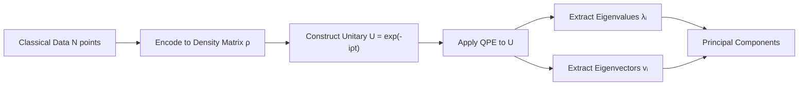
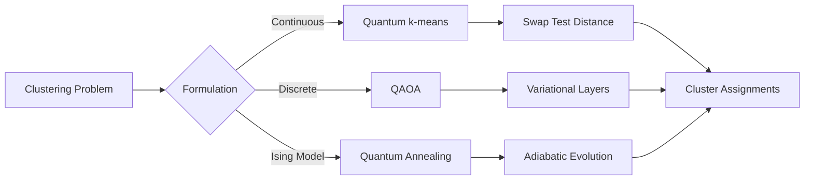

# **Chapter 12: Quantum Unsupervised Learning**

---


## **Introduction**

Unsupervised learning represents one of the most fundamental challenges in machine learning: extracting structure, patterns, and meaningful representations from unlabeled data. Classical unsupervised methods—Principal Component Analysis (PCA), $k$-means clustering, and Boltzmann machines—have proven invaluable for dimensionality reduction, clustering, and generative modeling. However, these algorithms face severe computational bottlenecks when confronted with exponentially large datasets or high-dimensional feature spaces.

Quantum unsupervised learning algorithms aim to overcome these classical limitations by exploiting quantum mechanical phenomena. **Quantum PCA (qPCA)** leverages Quantum Phase Estimation to achieve exponential speedup in finding principal components. **Quantum $k$-means** uses quantum overlap estimation to accelerate distance calculations. **Quantum Boltzmann Machines (QBMs)** harness entanglement to model complex probability distributions that are intractable classically. These algorithms represent the quantum approach to discovering hidden structure in data without supervision [1, 2].

This chapter surveys the core quantum unsupervised learning paradigms, examining their classical foundations, quantum mechanisms, potential advantages, and practical challenges. Understanding these methods is essential for recognizing when quantum computation can provide genuine advantage in exploratory data analysis and pattern discovery.

---

## **Chapter Outline**

| **Sec.** | **Title** | **Core Ideas & Examples** |
|----------|-----------|---------------------------|
| **12.1** | **Quantum Principal Component Analysis (qPCA)** | Density matrix $\rho$ representation; Quantum Phase Estimation on $U = e^{-i\rho t}$; exponential speedup $O(\text{poly}(\log N))$ vs. $O(N^3)$; eigenvector extraction via QPE. |
| **12.2** | **Quantum k-Means Clustering** | Fidelity-based distance: $1 - \|\langle\phi(x_i)\|\phi(c_j)\rangle\|^2$; Swap Test for overlap; iterative centroid update; polynomial speedup in distance calculation. |
| **12.3** | **Quantum Boltzmann Machines (QBM)** | Parameterized Hamiltonian $H(\vec{\theta})$; thermal distribution $P(x) \propto \exp(-E(x))$; entanglement for correlation modeling; generative sampling. |
| **12.4** | **Quantum Clustering Algorithms** | Variational quantum clustering; QAOA-based assignment optimization; quantum annealing for Ising minimization; discrete cluster assignment. |

---

## **12.1 Quantum Principal Component Analysis (qPCA)**

---

**Quantum Principal Component Analysis (qPCA)** is an unsupervised learning algorithm that applies quantum computation to the critical task of **dimensionality reduction**. It aims to find the dominant modes (principal components) of a dataset with a potential exponential speedup over classical PCA.

!!! tip "qPCA's Exponential Advantage"
    Classical PCA requires $O(N^3)$ operations to diagonalize an $N \times N$ covariance matrix. qPCA achieves the same result in $O(\text{poly}(\log N))$ time using Quantum Phase Estimation—an exponential speedup that could revolutionize large-scale data analysis [3].

### **Classical PCA Bottleneck**

-----

### **Classical PCA Bottleneck**

-----

Classical PCA finds the eigenvectors and eigenvalues of the data's **covariance matrix** $C$, which represents the data structure. For a dataset with $N$ points, forming and then diagonalizing the $N \times N$ matrix $C$ is computationally demanding, with complexity often scaling as:

$$
O(N^3)
$$

This cubic scaling is the primary bottleneck preventing classical PCA from handling massive datasets.

-----

### **Quantum Mechanism and Exponential Speedup**

-----

qPCA leverages the principles of **Quantum Phase Estimation (QPE)** to efficiently access the eigenvalues and eigenvectors of a quantum representation of the data.

**1. Quantum Data Representation**

Classical data is first encoded into a **data density matrix** $\rho$, which is the quantum analogue of the covariance matrix $C$. qPCA requires the ability to prepare and utilize multiple copies of this matrix $\rho$.

**2. Unitary Operator**

The algorithm simulates the time evolution operator:

$$
U = e^{-i \rho t}
$$

which uses the density matrix $\rho$ as its generator (Hamiltonian).

**3. QPE Application**

**Quantum Phase Estimation (QPE)** is applied to this unitary operator $U$. QPE is designed to extract the phases ($\phi$) corresponding to the eigenvalues of $U$. Since the eigenvalues of $U$ are related to the eigenvalues ($\lambda_i$) of $\rho$, the measurement yields the principal components (eigenvectors $|v_i\rangle$) and their associated variances (eigenvalues $\lambda_i$).

The exponential speedup originates from converting the **classical $O(N^3)$ matrix operation** into a **quantum poly-logarithmic time computation**:

$$
O(\text{poly}(\log N))
$$

This efficiency is only achieved if the data loading and matrix exponentiation steps are themselves implemented efficiently, avoiding the data loading bottleneck.



!!! example "qPCA Workflow"
    For a dataset with $N = 2^{20} \approx 1$ million points:
    
    - **Classical PCA:** $O(N^3) = O(10^{18})$ operations → impractical
    - **Quantum PCA:** $O(\text{poly}(\log N)) = O(\text{poly}(20))$ → polynomial in logarithm
    
    The exponential gap grows dramatically as dataset size increases.

-----

### **Output and Challenges**

-----

**Output**

qPCA yields the dominant eigenvalues $\lambda_i$ and the corresponding principal components (eigenstates):

$$
|v_i\rangle
$$

**Challenges**

The implementation is complex, requiring deep circuits for QPE and demanding the ability to prepare and use multiple copies of the data density matrix $\rho$. The algorithm is constrained by the same circuit depth and hardware noise limitations that affect all QPE-based algorithms.

```
qPCA_Algorithm(data_matrix, num_components):
    # Step 1: Encode data into density matrix
    rho = Construct_Density_Matrix(data_matrix)
    
    # Step 2: Construct time evolution unitary
    # U = exp(-i * rho * t) for chosen time t
    t = Choose_Evolution_Time()
    U = Exponentiate_Density_Matrix(rho, t)
    
    # Step 3: Initialize QPE circuit
    num_precision_qubits = Calculate_Precision_Requirement()
    qpe_circuit = Initialize_QPE(num_precision_qubits)
    
    # Step 4: Apply QPE to extract eigenvalues
    eigenvalues = []
    eigenvectors = []
    
    for k in range(num_components):
        # Prepare eigenvector register in superposition
        eigenvector_register = Initialize_Eigenvector_Register()
        
        # Apply QPE
        phase = Quantum_Phase_Estimation(U, eigenvector_register)
        
        # Convert phase to eigenvalue: λ = phase / t
        eigenvalue = phase / t
        eigenvalues.append(eigenvalue)
        
        # Eigenvector stored in quantum register
        eigenvectors.append(eigenvector_register)
    
    # Step 5: Return principal components
    # Sorted by eigenvalue magnitude (variance explained)
    principal_components = Sort_By_Eigenvalue(eigenvalues, eigenvectors)
    
    return principal_components
```

??? question "Why does qPCA require multiple copies of the density matrix $\rho$?"
    QPE requires repeated applications of the unitary $U = e^{-i\rho t}$ with increasing powers. Since measuring a quantum state destroys it (no-cloning theorem), fresh copies of $\rho$ must be prepared for each QPE iteration. This requirement poses a significant practical challenge.

---

## **12.2 Quantum k-Means Clustering**

---

**Quantum $k$-means (QkMC)** is an unsupervised learning algorithm that adapts the popular classical $k$-means clustering algorithm to the quantum domain. It seeks to partition data points into $k$ clusters by minimizing the sum of squared distances to the cluster centroids, leveraging quantum mechanics to perform the crucial **distance estimation** step more efficiently.

!!! tip "Quantum Parallelism in Distance Calculation"
    Classical $k$-means requires $O(Nkd)$ distance calculations per iteration ($N$ points, $k$ clusters, $d$ dimensions). Quantum overlap estimation can potentially reduce the $O(d)$ per-distance cost to $O(\log d)$, achieving polynomial speedup [4].

### **Quantum Enhancement to Distance Calculation**

-----

The core computational bottleneck in classical $k$-means is the iterative calculation of the Euclidean distance between every data point and every cluster centroid. QkMC replaces the classical distance with a measure derived from the **fidelity** (or inner product overlap) of the data's quantum state representations.

**1. State Encoding**

Both the data points ($x_i$) and the cluster centroids ($c_j$) are first encoded into **amplitude-encoded quantum states**:

$$
|\phi(x_i)\rangle \quad \text{and} \quad |\phi(c_j)\rangle
$$

**2. Quantum Distance Metric**

The distance between a data point and a centroid is computed based on the measure of their **overlap** in the quantum feature space:

$$
\text{Distance}(x_i, c_j) = 1 - |\langle \phi(x_i) | \phi(c_j) \rangle|^2
$$

This fidelity-based metric is $0$ when the states are identical (maximum overlap) and $1$ when they are orthogonal (minimum overlap).

-----

### **Algorithmic Steps and Speedup**

-----

The overall QkMC algorithm follows the iterative structure of the classical Lloyd's algorithm, but the distance and assignment steps are quantum-enhanced:

**1. Encoding and Initialization**

Encode data points as quantum states and initialize $k$ cluster centroid states.

**2. Distance Computation**

Use quantum subroutines, such as the **Swap Test** or other amplitude estimation techniques, to estimate the inner product:

$$
|\langle \phi(x_i) | \phi(c_j) \rangle|^2
$$

for all data-centroid pairs.

**3. Assignment and Update**

A classical component assigns each data point to the closest quantum centroid, and the centroids are updated classically or quantumly based on the new assignments.

QkMC offers a potential **polynomial speedup** over classical $k$-means by leveraging **quantum parallelism** to estimate the distances between many points and centroids simultaneously. This speedup is realized by reducing the time required for distance calculation, particularly important for data with very high dimensionality.

```
Quantum_k_Means(data, k, max_iterations):
    # Step 1: Initialize k centroids (random or heuristic)
    centroids = Initialize_Centroids(data, k)
    
    for iteration in range(max_iterations):
        # Step 2: Encode data and centroids as quantum states
        data_states = []
        for x in data:
            data_states.append(Amplitude_Encode(x))
        
        centroid_states = []
        for c in centroids:
            centroid_states.append(Amplitude_Encode(c))
        
        # Step 3: Quantum distance calculation
        assignments = []
        for i in range(len(data)):
            distances = []
            
            for j in range(k):
                # Compute quantum overlap using Swap Test
                overlap = Swap_Test(data_states[i], centroid_states[j])
                distance = 1 - overlap
                distances.append(distance)
            
            # Assign to nearest centroid
            closest_cluster = argmin(distances)
            assignments.append(closest_cluster)
        
        # Step 4: Update centroids (classical or quantum)
        new_centroids = []
        for j in range(k):
            # Find all points assigned to cluster j
            cluster_points = [data[i] for i in range(len(data)) 
                            if assignments[i] == j]
            
            # Compute mean (centroid)
            if len(cluster_points) > 0:
                new_centroid = Mean(cluster_points)
            else:
                new_centroid = centroids[j]  # Keep old centroid
            
            new_centroids.append(new_centroid)
        
        # Step 5: Check convergence
        if Centroids_Converged(centroids, new_centroids):
            break
        
        centroids = new_centroids
    
    return centroids, assignments
```

-----

### **Variational and Hybrid Variants**

-----

QkMC can also be implemented using **variational circuits** that are optimized classically. These **variational quantum clustering algorithms** use a parameterized circuit to serve as the clustering engine, minimizing a cost function that penalizes large distances between points and their assigned cluster centers. This hybrid approach is suitable for hard-to-cluster datasets and minimization of intra-cluster variance.

---

## **12.3 Quantum Boltzmann Machines (QBM)**

---

**Quantum Boltzmann Machines (QBMs)** are a class of **generative models** that serve as the quantum mechanical analogue of classical Boltzmann Machines (BMs). Their primary goal is to learn the underlying probability distribution of complex data, leveraging quantum entanglement to naturally model intricate correlations.

!!! tip "Entanglement as Correlation Engine"
    Classical Boltzmann Machines use stochastic sampling to model correlations, but struggle with exponentially complex distributions. QBMs exploit quantum entanglement to natively represent correlations that would require exponentially many classical parameters [5].

### **Foundation in the Parameterized Hamiltonian**

-----

A classical Boltzmann Machine defines a probability distribution $P(x)$ based on the energy $E(x)$ of a classical configuration $x$. The QBM extends this by defining its probability distribution based on the energy levels of a **parameterized quantum Hamiltonian**:

$$
H(\vec{\theta})
$$

**Ising Analogue**

The QBM Hamiltonian is typically an Ising-type model that includes terms representing local biases (fields) and interactions between qubits (couplings). The parameters $\vec{\theta}$ include these biases and couplings, which are optimized during training.

**Probability Distribution**

The probability $P(x)$ of finding the system in a classical state $|x\rangle$ is defined by the thermal equilibrium distribution (the Boltzmann factor):

$$
P(x) = \frac{1}{Z} \exp(-E(x))
$$

where:

$$
E(x) = \langle x | H(\vec{\theta}) | x \rangle
$$

Here, $E(x)$ is the energy of the classical state $|x\rangle$ with respect to the quantum Hamiltonian $H(\vec{\theta})$, and $Z$ is the partition function (normalization constant).

-----

### **Quantum Advantage: Correlation Modeling**

-----

The key advantage of the QBM over a classical BM lies in its ability to generate and model highly complex data distributions:

**Entanglement**

Unlike classical BMs, which rely on local probabilistic couplings, QBMs inherently use **entanglement** between qubits. This entanglement allows the QBM to naturally encode **complex correlations** within the data distribution that would be computationally intractable for a classical model.

**Generative Modeling**

As a generative model, the QBM, after training, can be used to sample new data points that accurately reflect the intricate dependencies and correlations learned from the training data.

!!! example "QBM for Image Generation"
    Training a QBM on handwritten digit images:
    
    1. **Encode training data:** Map pixel values to qubit states
    2. **Learn Hamiltonian:** Optimize $H(\vec{\theta})$ to match data distribution
    3. **Generate new samples:** Prepare thermal state $\exp(-H/T)$ and measure
    4. **Result:** New digit images with learned correlations (stroke patterns, topology)

-----

### **Training and Variants**

-----

Training a QBM involves adjusting the parameters $\vec{\theta}$ of the Hamiltonian $H(\vec{\theta})$ to minimize the distance (e.g., Kullback–Leibler divergence) between the model's probability distribution and the data's true distribution.

**Training Methods**

Training often involves a quantum analogue of classical optimization techniques such as **contrastive divergence**. Alternatively, QBMs can be trained using **variational optimization** methods (VQA), where the goal is to find the ground state of the Hamiltonian or minimize a variational cost function.

**Variants**

QBMs have structural variants, including **Restricted QBMs** (where visible and hidden nodes are separated) and **Deep Quantum Boltzmann Networks**.

```
QBM_Training(training_data, initial_theta, max_iterations):
    theta = initial_theta
    num_params = len(theta)
    
    for iteration in range(max_iterations):
        # Step 1: Compute data statistics
        # Average energy of data under current Hamiltonian
        data_energy = 0
        for x in training_data:
            state_x = Classical_To_Quantum_State(x)
            energy_x = Expectation_Value(state_x, Hamiltonian(theta))
            data_energy += energy_x
        data_energy /= len(training_data)
        
        # Step 2: Sample from model distribution
        # Prepare thermal state exp(-H/T) and sample
        model_samples = []
        for _ in range(num_samples):
            thermal_state = Prepare_Thermal_State(Hamiltonian(theta), temperature)
            sample = Measure_State(thermal_state)
            model_samples.append(sample)
        
        # Step 3: Compute model statistics
        model_energy = 0
        for sample in model_samples:
            state_sample = Classical_To_Quantum_State(sample)
            energy_sample = Expectation_Value(state_sample, Hamiltonian(theta))
            model_energy += energy_sample
        model_energy /= num_samples
        
        # Step 4: Compute gradient (contrastive divergence)
        gradient = zeros(num_params)
        for k in range(num_params):
            # Gradient = d/dθ (data_energy - model_energy)
            gradient[k] = Compute_Parameter_Gradient(
                theta, k, training_data, model_samples
            )
        
        # Step 5: Update parameters
        learning_rate = 0.01
        theta = theta - learning_rate * gradient
        
        # Step 6: Check convergence
        kl_divergence = Compute_KL_Divergence(training_data, model_samples)
        if kl_divergence < tolerance:
            break
    
    return theta
```

---

## **12.4 Quantum Clustering Algorithms**

---

**Quantum Clustering Algorithms** focus on leveraging quantum computational primitives to solve the unsupervised task of grouping data points based on similarity. While **Quantum $k$-means** (Section 12.2) is the canonical approach, other methods, particularly those involving **variational optimization** and discrete search, are also employed to enhance clustering performance.

!!! tip "Clustering as Optimization"
    All clustering algorithms solve the same fundamental problem: minimize intra-cluster variance while maximizing inter-cluster separation. Quantum methods offer different optimization strategies—variational, QAOA-based, or annealing—each suited to different problem structures [6].

### **Variational Quantum Clustering (VQC)**

-----

Clustering can be framed as an **optimization problem** where the goal is to find the assignment of data points to clusters that minimizes a calculated loss (e.g., intra-cluster variance). This optimization framework naturally leads to hybrid **Variational Quantum Clustering** models:

**Cost Function**

A **cost Hamiltonian** is defined that quantifies the quality of a given clustering configuration (e.g., penalizing points assigned to distant centers or points far from each other within the same cluster).

**Methodology**

A **Parameterized Quantum Circuit (VQC)** is used to prepare the cluster assignments, and a classical optimizer iteratively adjusts the circuit parameters to minimize the calculated cost. This is suitable for hard-to-cluster datasets or complex cost minimization.

-----

### **QAOA-Based Clustering**

-----

The **Quantum Approximate Optimization Algorithm (QAOA)**, introduced in optimization chapters, can be directly applied to solve clustering problems that are mapped onto a discrete optimization objective.

**Problem Mapping**

The clustering task is reformulated as finding the optimal binary assignments (e.g., a $0$ or $1$ label for each data point indicating cluster membership). The cost function $C$ is designed using Pauli operators (Ising model style) to penalize poor assignments. For instance, a term in the Hamiltonian could penalize two similar points being placed in **different** clusters.

**Advantage**

QAOA can be effective for **small datasets** or for solving clustering subroutines that are computationally intensive, leveraging its ability to achieve better approximation ratios than classical methods for discrete optimization problems.

```
QAOA_Clustering(data, k, num_layers):
    # Step 1: Construct cost Hamiltonian for clustering
    # Penalize: similar points in different clusters
    # Reward: dissimilar points in different clusters
    cost_hamiltonian = Construct_Clustering_Hamiltonian(data, k)
    
    # Step 2: Initialize QAOA parameters
    gamma = Random_Initialize(num_layers)  # Cost parameters
    beta = Random_Initialize(num_layers)   # Mixer parameters
    
    # Step 3: Define QAOA circuit
    def QAOA_Circuit(gamma, beta):
        # Initialize uniform superposition
        state = Uniform_Superposition(num_qubits)
        
        # Apply alternating layers
        for p in range(num_layers):
            # Cost layer: exp(-i * gamma[p] * H_cost)
            state = Apply_Cost_Layer(state, cost_hamiltonian, gamma[p])
            
            # Mixer layer: exp(-i * beta[p] * H_mixer)
            state = Apply_Mixer_Layer(state, beta[p])
        
        return state
    
    # Step 4: Optimize parameters
    def Cost_Function(gamma, beta):
        final_state = QAOA_Circuit(gamma, beta)
        energy = Expectation_Value(final_state, cost_hamiltonian)
        return energy
    
    # Classical optimization loop
    for iteration in range(max_iterations):
        gradient_gamma = Compute_Gradient(Cost_Function, gamma)
        gradient_beta = Compute_Gradient(Cost_Function, beta)
        
        gamma = gamma - learning_rate * gradient_gamma
        beta = beta - learning_rate * gradient_beta
    
    # Step 5: Extract clustering assignment
    optimal_state = QAOA_Circuit(gamma, beta)
    measurement = Measure_State(optimal_state, num_shots)
    
    # Most frequent bitstring represents cluster assignments
    cluster_assignment = Most_Frequent_Bitstring(measurement)
    
    return cluster_assignment
```

??? question "When is QAOA clustering preferable to quantum $k$-means?"
    QAOA excels when the clustering objective has discrete constraints or graph-based structure (e.g., community detection, constrained clustering). Quantum $k$-means is better for standard Euclidean clustering with continuous optimization. Choose based on problem structure.

-----

### **Quantum Annealing and Adiabatic Methods**

-----

Clustering problems can also be modeled using **Quantum Annealing**, which is an alternative form of quantum computing focused on finding the global minimum of an objective function.

**Mechanism**

The clustering objective is mapped directly onto an **Ising Hamiltonian** whose ground state (lowest energy level) corresponds to the optimal cluster assignment. The quantum annealer then seeks this ground state via adiabatic evolution, offering a potentially powerful solution for minimizing clustering loss functions.



---

## **Summary: Comparison of Quantum Unsupervised Learning Models**

-----

| Model / Paradigm | Primary Objective | Classical Inspiration | Core Quantum Mechanism | Quantum Advantage / Speedup |
| :--- | :--- | :--- | :--- | :--- |
| **qPCA** | Dimensionality Reduction: Find eigenvectors (principal components) and eigenvalues ($\lambda_i$) | Classical PCA (Covariance Matrix Diagonalization) | **Quantum Phase Estimation (QPE)** applied to $U=e^{-i\rho t}$ to extract eigenvalues from density matrix $\rho$ | **Exponential Speedup:** $O(\text{poly}(\log N))$ vs. classical $O(N^3)$ |
| **Quantum k-means (QkMC)** | Clustering: Partition data into $k$ groups minimizing intra-cluster variance | Classical $k$-means (Lloyd's Algorithm) | **Fidelity-Based Distance:** $1 - \|\langle \phi(x_i) \| \phi(c_j) \rangle\|^2$ via Swap Test | **Polynomial Speedup:** $O(\log d)$ vs. $O(d)$ per distance in $d$ dimensions |
| **Quantum Boltzmann Machines (QBM)** | Generative Modeling: Learn probability distribution $P(x)$ | Classical Boltzmann Machines | Parameterized Hamiltonian $H(\vec{\theta})$ with $P(x) \propto \exp(-E(x))$ | **Correlation Modeling:** Entanglement encodes complex correlations intractable classically |
| **Variational/QAOA Clustering** | Optimization-Based Clustering: Find optimal discrete assignment | Combinatorial Optimization (QUBO/Ising) | **QAOA circuit** with cost Hamiltonian minimization | **Heuristic Optimization:** Better approximation ratios for NP-hard assignment problems |
| **Quantum Annealing Clustering** | Global Optimization: Find ground state of clustering Hamiltonian | Simulated Annealing | **Adiabatic evolution** to Ising ground state | **Global Search:** Quantum tunneling escapes local minima |

---

## **References**

---

[1] Biamonte, J., Wittek, P., Pancotti, N., Rebentrost, P., Wiebe, N., & Lloyd, S. (2017). "Quantum machine learning." *Nature*, 549(7671), 195-202.

[2] Schuld, M., & Petruccione, F. (2018). *Supervised Learning with Quantum Computers*. Springer.

[3] Lloyd, S., Mohseni, M., & Rebentrost, P. (2014). "Quantum principal component analysis." *Nature Physics*, 10(9), 631-633.

[4] Wiebe, N., Kapoor, A., & Svore, K. M. (2015). "Quantum algorithms for nearest-neighbor methods for supervised and unsupervised learning." *Quantum Information and Computation*, 15(3-4), 316-356.

[5] Amin, M. H., Andriyash, E., Rolfe, J., Kulchytskyy, B., & Melko, R. (2018). "Quantum Boltzmann machine." *Physical Review X*, 8(2), 021050.

[6] Farhi, E., & Harrow, A. W. (2016). "Quantum supremacy through the quantum approximate optimization algorithm." *arXiv preprint arXiv:1602.07674*.

[7] Otterbach, J. S., Manenti, R., Alidoust, N., Bestwick, A., Block, M., Bloom, B., ... & Reagor, M. (2017). "Unsupervised machine learning on a hybrid quantum computer." *arXiv preprint arXiv:1712.05771*.

[8] Kerenidis, I., & Prakash, A. (2017). "Quantum recommendation systems." *Proceedings of the 8th Innovations in Theoretical Computer Science Conference (ITCS)*.

[9] Dunjko, V., & Briegel, H. J. (2018). "Machine learning & artificial intelligence in the quantum domain: A review of recent progress." *Reports on Progress in Physics*, 81(7), 074001.

[10] Benedetti, M., Realpe-Gómez, J., Biswas, R., & Perdomo-Ortiz, A. (2017). "Quantum-assisted learning of hardware-embedded probabilistic graphical models." *Physical Review X*, 7(4), 041052.
