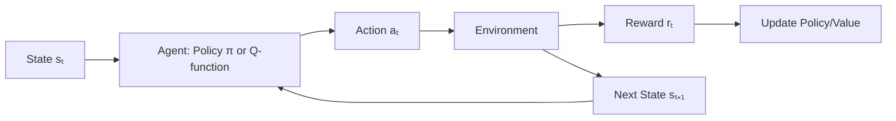
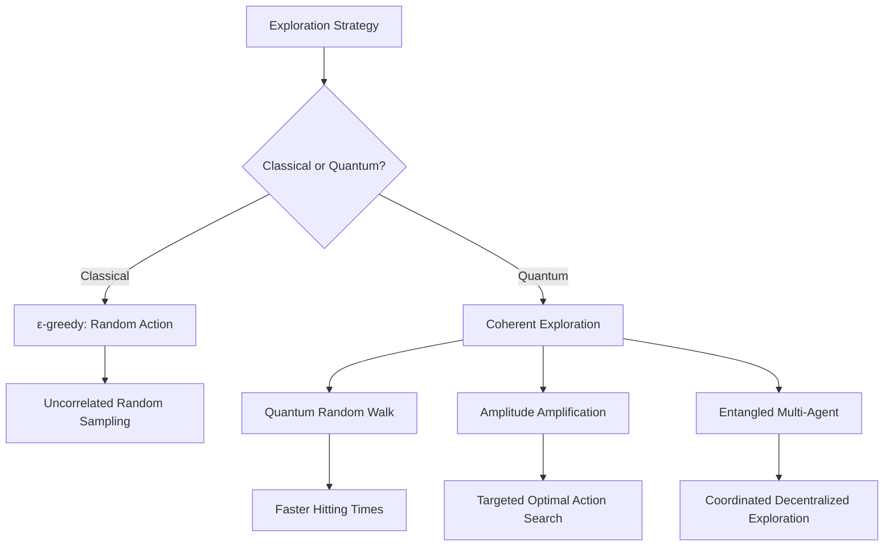
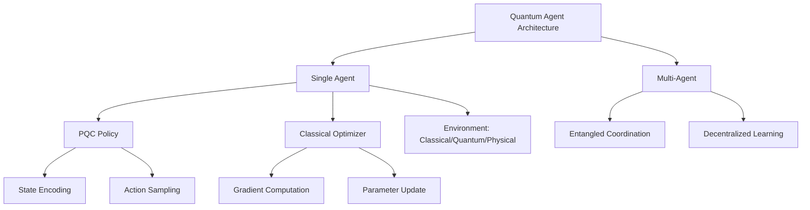

# **Chapter 13: Quantum Reinforcement Learning**

---


## **Introduction**

Reinforcement Learning (RL) represents one of the most powerful paradigms in machine learning, enabling agents to learn optimal decision-making strategies through trial-and-error interaction with an environment. Classical RL has achieved remarkable success in domains ranging from game playing to robotics. However, as state spaces grow exponentially and environments become more complex, classical function approximation methods face severe computational bottlenecks in policy optimization and value function learning.

Quantum Reinforcement Learning (QRL) emerges as a hybrid computational paradigm that integrates quantum computing resources—superposition, entanglement, and coherent evolution—into the RL framework. By representing policies and value functions as Parameterized Quantum Circuits (PQCs), QRL aims to exploit the exponential expressivity of quantum Hilbert space for richer function approximation. Moreover, quantum exploration strategies such as quantum random walks and amplitude amplification offer fundamentally different mechanisms for navigating state-action spaces compared to classical stochastic exploration [1, 2].

This chapter examines the core QRL paradigms: quantum policy gradient methods, quantum value iteration, coherent exploration strategies, and hybrid agent architectures. Understanding these quantum extensions to RL reveals how quantum computation may provide advantage in learning optimal behavior in complex, high-dimensional environments.

---

## **Chapter Outline**

| **Sec.** | **Title** | **Core Ideas & Examples** |
|----------|-----------|---------------------------|
| **13.1** | **QRL Basics** | MDP framework: state $s_t$, action $a_t$, reward $r_t$; expected return $R_t = \sum \gamma^k r_{t+k}$; PQC for policy/value approximation; hybrid quantum-classical loop. |
| **13.2** | **Quantum Policy Gradient Methods** | PQC represents policy $\pi_{\vec{\theta}}(a\|s)$; action sampling via measurement; policy gradient theorem: $\nabla_{\vec{\theta}} J = \mathbb{E}[\nabla \log \pi \cdot R]$; Parameter Shift Rule for gradients. |
| **13.3** | **Quantum Value Iteration** | PQC approximates $Q_{\vec{\theta}}(s,a)$; Quantum Bellman equation; TD error loss: $(Q - [r + \gamma Q'])^2$; VQ-DQN architecture with experience replay. |
| **13.4** | **Quantum Exploration Strategies** | Coherent exploration vs. $\epsilon$-greedy; Quantum Random Walks for path diversity; amplitude amplification for optimal action reinforcement; entanglement in multi-agent coordination. |
| **13.5** | **Quantum Agent Architectures** | Hybrid components: PQC policy, measurement-based action, classical optimizer; quantum environments: simulators, adaptive experiments; multi-agent and generative architectures. |

---

## **13.1 QRL Basics**

---

Quantum Reinforcement Learning (QRL) is a hybrid computational paradigm that integrates the decision-making framework of classical **Reinforcement Learning (RL)** with the computational power and unique resources of **quantum mechanics**. It seeks to develop agents that learn optimal behavior in an environment by maximizing a cumulative reward signal, using quantum circuits to model the underlying policies and value functions.

!!!tip "QRL's Hybrid Advantage"
    QRL doesn't replace classical RL entirely—it augments the function approximation step with quantum circuits. The exponential dimensionality of Hilbert space ($2^n$ for $n$ qubits) provides a fundamentally richer hypothesis space than classical neural networks with polynomial parameters [3].

### **The Classical RL Framework**

-----

Classical RL is modeled as an interaction process over discrete timesteps, usually formulated as a Markov Decision Process (MDP).

**Interaction Loop**

At each time step $t$, the **agent** observes the current state $s_t$, selects an **action** $a_t$, receives an immediate **reward** $r_t$, and transitions to a new state $s_{t+1}$.

**Goal**

The agent's objective is to maximize the **expected return** $R_t$, which is the discounted sum of future rewards:

$$
R_t = \sum_{k=0}^\infty \gamma^k r_{t+k}
$$

where $\gamma \in [0, 1)$ is the discount factor.

**Approximation Functions**

The agent learns by approximating either the **policy** ($\pi(a|s)$) or the **action-value function** ($Q(s, a)$), which guide decision-making.



-----

### **The QRL Extension and Policy Representation**

-----

QRL extends the classical framework by utilizing quantum resources to represent the functions governing the agent's behavior.

**Quantum Representation**

States ($s$) and actions ($a$) are represented either as **quantum states** (using encoding techniques from Chapter 9) or are encoded into **Parameterized Quantum Circuits (PQCs)**.

**Policy/Value Approximation**

The crucial function—the policy $\pi(a|s)$ or the value function $Q(s, a)$—is approximated by a PQC, often denoted as:

$$
U(\vec{\theta})
$$

This PQC acts as a quantum function approximator, leveraging the high-dimensional Hilbert space and entanglement for potentially **richer function approximation**. The parameters $\vec{\theta}$ of the PQC are optimized iteratively via a classical feedback loop to maximize the expected return:

$$
R_t
$$

!!! example "QRL Policy Circuit"
    For a grid-world environment with $4 \times 4 = 16$ states and 4 actions (up, down, left, right):
    
    1. **Encode state:** Map state index to $\log_2(16) = 4$ qubits using basis encoding
    2. **Apply PQC:** Variational layers with parameters $\vec{\theta}$ create superposition over actions
    3. **Measure:** Measurement probabilities $P(a) = |\langle a|\psi\rangle|^2$ define policy $\pi_{\vec{\theta}}(a|s)$
    4. **Sample action:** Classical sampling from measurement distribution yields $a_t$

-----

### **The Hybrid Nature**

-----

QRL models are fundamentally **hybrid systems**. The quantum computer handles the core computational tasks (encoding state information, generating action probabilities via measurement), while the classical computer manages the environment simulation and the optimization of the PQC parameters:

$$
\vec{\theta}
$$

```
QRL_Training_Loop(environment, initial_theta, max_episodes):
    theta = initial_theta
    
    for episode in range(max_episodes):
        # Reset environment
        state = environment.reset()
        episode_return = 0
        trajectory = []
        
        while not episode.done:
            # Step 1: Encode state into quantum circuit
            quantum_state = Encode_State(state)
            
            # Step 2: Execute PQC with current parameters
            pqc_output = Execute_PQC(quantum_state, theta)
            
            # Step 3: Measure to get action probabilities
            action_probs = Measure_Circuit(pqc_output)
            
            # Step 4: Sample action from distribution
            action = Sample_Action(action_probs)
            
            # Step 5: Execute action in environment
            next_state, reward, done = environment.step(action)
            
            # Step 6: Store transition
            trajectory.append((state, action, reward))
            episode_return += reward
            state = next_state
        
        # Step 7: Compute gradient (policy gradient or TD error)
        gradient = Compute_Gradient(trajectory, theta)
        
        # Step 8: Classical optimizer updates parameters
        theta = Classical_Optimizer_Update(theta, gradient)
        
        # Step 9: Log performance
        Log_Episode_Return(episode, episode_return)
    
    return theta
```

---

## **13.2 Quantum Policy Gradient Methods**

---

**Quantum Policy Gradient (QPG) Methods** are a class of Quantum Reinforcement Learning (QRL) algorithms that adapt the structure of classical policy optimization by using a **Parameterized Quantum Circuit (PQC)** to model the agent's stochastic policy. The goal is to maximize the expected cumulative reward by iteratively updating the PQC parameters based on the observed returns.

!!! tip "Why Policy Gradients in QRL?"
    Policy gradient methods are naturally suited to quantum implementation because they only require sampling from the policy (measurement) and computing gradients (Parameter Shift Rule). Unlike value-based methods, they don't require storing a Q-table, making them ideal for continuous or large action spaces [4].

### **Policy Representation and Action Sampling**

-----

**1. Quantum Policy Model**

The agent's stochastic policy, $\pi_{\vec{\theta}}(a|s)$ (the probability of taking action $a$ given state $s$), is represented by a PQC:

$$
U(\vec{\theta})
$$

The classical state $s$ is first encoded into the circuit.

**2. Action Probability**

The PQC is executed, and the probabilities of the possible actions are determined by measuring the output state in the computational basis. If the circuit outputs a state $|\psi_s\rangle$, the probability of action $a$ is:

$$
P(a) = |\langle a | \psi_s \rangle|^2
$$

This measurement-based sampling determines the agent's actual action.

**3. Superposition for Exploration**

QPG methods inherently leverage **superposition** to represent the probabilities of all possible actions simultaneously. This provides a basis for potentially enhanced **state exploration** and richer function approximation compared to purely classical methods.

-----

### **The Quantum Policy Gradient Update**

-----

The PQC parameters $\vec{\theta}$ are optimized using the **classical policy gradient theorem**, adapted to calculate gradients from quantum measurements. The objective function $J(\vec{\theta})$ (the expected cumulative reward) is maximized by following the gradient:

$$
\vec{\theta} \leftarrow \vec{\theta} + \alpha \nabla_{\vec{\theta}} J(\vec{\theta})
$$

**Policy Gradient Theorem**

The gradient $\nabla_{\vec{\theta}} J(\vec{\theta})$ is estimated using the formula (often referred to as the REINFORCE algorithm base):

$$
\nabla_{\vec{\theta}} J(\vec{\theta}) = \mathbb{E}_{\pi} [\nabla_{\vec{\theta}} \log \pi_{\vec{\theta}}(a|s) \cdot R]
$$

**Interpretation**

The term $\nabla_{\vec{\theta}} \log \pi_{\vec{\theta}}(a|s)$ (**score function**) indicates the direction to adjust parameters to make the chosen action $a$ more likely. This direction is weighted by the **return** $R$ observed after the action. If $R$ is high, the action is reinforced (made more probable); if $R$ is low, it is discouraged.

-----

### **Gradient Calculation and Efficiency**

-----

**1. Quantum Gradient Estimation**

The gradient components, $\nabla_{\vec{\theta}} \log \pi_{\vec{\theta}}(a|s)$, must be calculated efficiently on the quantum hardware. This is achieved using the **Parameter Shift Rule** (introduced in Chapter 10), which allows the calculation of the gradient of the measured expectation value by running the PQC multiple times with shifted parameters.

**2. Hybrid Optimization**

The calculated gradient is then fed to a **classical optimizer** (e.g., Adam or gradient descent) to perform the parameter update. This hybrid approach manages the high measurement noise inherent in quantum gradient estimation.

```
Quantum_Policy_Gradient(environment, initial_theta, num_episodes):
    theta = initial_theta
    
    for episode in range(num_episodes):
        # Collect trajectory using current policy
        trajectory = []
        state = environment.reset()
        
        while not done:
            # Encode state and execute PQC
            quantum_state = Encode_State(state)
            pqc_output = PQC(quantum_state, theta)
            
            # Measure to get action probabilities
            action_probs = Measure(pqc_output)
            action = Sample(action_probs)
            
            # Environment step
            next_state, reward, done = environment.step(action)
            trajectory.append((state, action, reward))
            state = next_state
        
        # Compute returns for each timestep
        returns = Compute_Discounted_Returns(trajectory)
        
        # Compute policy gradient using Parameter Shift Rule
        gradient = zeros(len(theta))
        
        for t, (state, action, reward) in enumerate(trajectory):
            # Score function gradient
            for k in range(len(theta)):
                # Parameter Shift Rule
                theta_plus = theta.copy()
                theta_plus[k] += pi/2
                theta_minus = theta.copy()
                theta_minus[k] -= pi/2
                
                # Compute log probability gradients
                log_pi_plus = Log_Policy_Prob(state, action, theta_plus)
                log_pi_minus = Log_Policy_Prob(state, action, theta_minus)
                
                # Gradient approximation
                grad_log_pi = (log_pi_plus - log_pi_minus) / 2
                
                # Weight by return
                gradient[k] += grad_log_pi * returns[t]
        
        # Average over trajectory
        gradient /= len(trajectory)
        
        # Update parameters
        learning_rate = 0.01
        theta = theta + learning_rate * gradient
    
    return theta
```

??? question "Why use the Parameter Shift Rule instead of classical finite differences?"
    The Parameter Shift Rule exploits the analytic structure of quantum gates to compute exact gradients (up to sampling noise) without approximation error. Classical finite differences require choosing a step size $\epsilon$ and suffer from truncation error. For quantum circuits, the Parameter Shift Rule is both more accurate and naturally suited to the hardware.

---

## **13.3 Quantum Value Iteration**

---

**Quantum Value Iteration** (QVI) encompasses QRL methods where the primary goal is to approximate the **optimal value function**, $V^*(s)$, or the **optimal action-value function**, $Q^*(s, a)$, using parameterized quantum circuits (PQCs). These methods are foundational to Q-Learning and Deep Q-Networks (DQNs) in the quantum domain.

!!! tip "Value-Based vs. Policy-Based QRL"
    Value-based methods (QVI) learn to estimate the value of states/actions, then derive policy greedily. Policy-based methods (QPG) directly optimize the policy. QVI is better when you need explicit value estimates; QPG is better for continuous actions or stochastic optimal policies [5].

### **Value Function Approximation**

-----

In QVI, the value functions are approximated by a PQC, $Q_{\vec{\theta}}(s, a)$, where $\vec{\theta}$ are the trainable parameters.

**Goal**

The PQC is trained to minimize the difference between its current estimate of the Q-value and a more stable estimate of the optimal future value, a concept formalized by the **Quantum Bellman Equation**.

**Methodology**

These approaches are often referred to as **Quantum Q-Learning** or **Variational Quantum Deep Q-Networks (VQ-DQN)**, replacing the core neural network approximator of a classical DQN with a PQC.

-----

### **The Quantum Bellman Equation and Temporal-Difference Error**

-----

The recursive relationship defining the optimal Q-value, $Q^*(s, a)$, forms the basis of the QVI loss function:

**1. Classical Bellman Optimality Equation (for Q-values)**

The optimal value of taking action $a$ in state $s$ is the immediate reward $r$ plus the discounted maximum expected Q-value of the next state $s'$:

$$
Q^*(s, a) = r + \gamma \max_{a'} Q^*(s', a')
$$

**2. Temporal-Difference (TD) Error Loss**

In QVI, the PQC is trained to minimize the squared difference between its prediction, $Q_{\vec{\theta}}(s, a)$, and the **TD target** (the stable estimate of the right side of the Bellman equation):

$$
\mathcal{L}(\vec{\theta}) = \left(Q_{\vec{\theta}}(s, a) - \left[r + \gamma \cdot Q_{\vec{\theta}}(s', a')\right]\right)^2
$$

The term:

$$
r + \gamma \cdot Q_{\vec{\theta}}(s', a')
$$

represents the estimated optimal Q-value of the next state, and its difference from the current estimate, $Q_{\vec{\theta}}(s, a)$, is the **temporal-difference error**.

**3. Hybrid Optimization**

The loss $\mathcal{L}$ is minimized using a classical optimizer (e.g., gradient descent or Adam), which updates the PQC parameters $\vec{\theta}$ in a hybrid variational loop.

-----

### **Quantum Deep Q-Networks (VQ-DQN)**

-----

The VQ-DQN architecture is a direct quantum adaptation of the Deep Q-Network:

**VQC Component**

The neural network traditionally used to approximate the Q-function is replaced by a **Variational Quantum Circuit (VQC)**. This VQC encodes the state $s$ and outputs the estimated Q-values.

**Stabilization Techniques**

VQ-DQN incorporates classical stabilization techniques necessary for deep learning, such as **experience replay** (storing past interactions in a buffer) and **target networks** (a separate, slowly updated network used to calculate the stable TD target). These techniques are crucial for mitigating instability and ensuring convergence.

**Action Selection**

The agent uses the approximated $Q_{\vec{\theta}}(s, a)$ values to select the optimal action $a$ by applying the $\epsilon$-greedy strategy, balancing **exploration** and **exploitation**.

The goal of VQ-DQN is to leverage quantum resources, such as superposition, to potentially process high-dimensional state spaces more efficiently than their classical counterparts.

```
VQ_DQN_Training(environment, initial_theta, max_steps):
    theta = initial_theta  # Main network parameters
    theta_target = theta.copy()  # Target network parameters
    replay_buffer = []
    
    state = environment.reset()
    
    for step in range(max_steps):
        # Step 1: Epsilon-greedy action selection
        if random() < epsilon:
            action = Random_Action()
        else:
            # Compute Q-values using VQC
            q_values = []
            for a in range(num_actions):
                q_state_action = VQC_Q_Value(state, a, theta)
                q_values.append(q_state_action)
            action = argmax(q_values)
        
        # Step 2: Execute action in environment
        next_state, reward, done = environment.step(action)
        
        # Step 3: Store transition in replay buffer
        replay_buffer.append((state, action, reward, next_state, done))
        if len(replay_buffer) > buffer_size:
            replay_buffer.pop(0)
        
        # Step 4: Sample mini-batch from replay buffer
        if len(replay_buffer) >= batch_size:
            batch = Sample_Batch(replay_buffer, batch_size)
            
            # Step 5: Compute TD error for batch
            total_loss = 0
            for (s, a, r, s_next, d) in batch:
                # Current Q-value
                q_current = VQC_Q_Value(s, a, theta)
                
                # Target Q-value (using target network)
                if d:  # Terminal state
                    q_target = r
                else:
                    q_next_values = []
                    for a_next in range(num_actions):
                        q_val = VQC_Q_Value(s_next, a_next, theta_target)
                        q_next_values.append(q_val)
                    q_target = r + gamma * max(q_next_values)
                
                # TD error loss
                loss = (q_current - q_target)**2
                total_loss += loss
            
            # Step 6: Compute gradient and update main network
            gradient = Compute_Gradient_Loss(total_loss, theta)
            theta = theta - learning_rate * gradient
        
        # Step 7: Periodically update target network
        if step % target_update_freq == 0:
            theta_target = theta.copy()
        
        # Step 8: Reset if episode done
        if done:
            state = environment.reset()
        else:
            state = next_state
    
    return theta
```

!!! example "VQ-DQN for CartPole"
    Classic CartPole environment: 4D continuous state (position, velocity, angle, angular velocity), 2 discrete actions (left, right).
    
    - **State encoding:** Amplitude encoding of 4 features into 2 qubits
    - **VQC:** 3-layer ansatz with $RY$, $RZ$ rotations and CNOT entanglement
    - **Q-value extraction:** Two separate measurements or two output qubits for $Q(s, \text{left})$ and $Q(s, \text{right})$
    - **Training:** Experience replay buffer with 10,000 transitions, target network updated every 100 steps

---

## **13.4 Quantum Exploration Strategies**

---

Exploration is fundamental to reinforcement learning—without exploring the state-action space, an agent cannot discover optimal policies. Classical RL uses stochastic exploration strategies like $\epsilon$-greedy or Boltzmann exploration. Quantum RL introduces **coherent exploration** mechanisms that exploit quantum superposition and interference to navigate state spaces in fundamentally different ways.

!!! tip "Coherent vs. Stochastic Exploration"
    Classical exploration adds random noise to decisions. Quantum exploration maintains coherent superposition over exploration paths, allowing interference to bias the search toward promising regions. This is the difference between flipping coins versus quantum walking [6].

### **Non-Classical Exploration Mechanisms**

-----

Classical exploration strategies rely on introducing random (probabilistic) actions to escape local optima. QRL replaces this purely random approach with **coherent exploration**, where the search paths are maintained in a quantum superposition, allowing for directed sampling.

**Quantum Random Walks (QRW)**

The quantum analogue of a classical random walk.

*Function:* QRWs are used to achieve **more diverse path exploration**. Unlike a classical walk, which follows one path, a QRW explores multiple paths simultaneously in superposition, biased by interference.

*Advantage:* This method can lead to faster **hitting times** (reaching a specific high-reward state) compared to the purely probabilistic nature of classical walks.

**Amplitude Amplification**

This technique (generalized from Grover's algorithm, Chapter 4) can be incorporated into the policy to favor high-reward actions.

*Function:* If the agent has observed a state-action pair that led to a high reward, amplitude amplification can be used to **increase the probability amplitude** of selecting that optimal action in similar future states.

*Advantage:* This allows the agent to search for and reinforce optimal actions in a targeted, quantum-enhanced manner, potentially improving the convergence rate of the policy.

**Entanglement for Multi-Agent Systems**

Entanglement can be used in multi-agent QRL systems to establish non-classical correlations between agents' exploration policies, potentially allowing for **coordinated and decentralized exploration** strategies that are superior to classical coordination.



-----

### **Coherent Exploration vs. $\epsilon$-Greedy**

-----

The fundamental difference lies in the nature of the uncertainty introduced:

**Classical ($\epsilon$-Greedy)**

When an agent chooses a random action (with probability $\epsilon$), that choice is purely random and uncorrelated with previous exploration paths.

**Quantum (Coherent)**

Quantum random walks and amplitude amplification maintain **coherence** over the explored path space. The decision process is not random noise but a **controlled superposition** that is weighted by interference, allowing the agent to search the state space more efficiently and purposefully.

These non-classical strategies provide a foundation for developing QRL algorithms that can more efficiently navigate large, complex state spaces, enhancing the agent's ability to find the maximum cumulative reward.

```
Quantum_Random_Walk_Exploration(graph, start_node, target_node, num_steps):
    # Initialize walker in superposition over all nodes
    num_nodes = len(graph.nodes)
    walker_state = Uniform_Superposition(num_nodes)
    
    # Coin operator (creates superposition over move directions)
    coin_dim = max([graph.degree(node) for node in graph.nodes])
    
    for step in range(num_steps):
        # Step 1: Apply coin operator (Hadamard on coin space)
        walker_state = Apply_Coin_Operator(walker_state, coin_dim)
        
        # Step 2: Apply shift operator (move based on coin)
        walker_state = Apply_Shift_Operator(walker_state, graph)
        
        # Optional: Measure to check if target reached
        if step % check_interval == 0:
            measurement = Measure_Position(walker_state)
            if measurement == target_node:
                return step  # Hitting time
    
    # Final measurement to extract node
    final_node = Measure_Position(walker_state)
    return final_node

Amplitude_Amplification_Policy(state, high_reward_actions, num_iterations):
    # Initialize uniform superposition over all actions
    num_actions = len(all_actions)
    action_state = Uniform_Superposition(num_actions)
    
    for iteration in range(num_iterations):
        # Step 1: Oracle marks high-reward actions
        action_state = Apply_Oracle(action_state, high_reward_actions)
        
        # Step 2: Diffusion operator amplifies marked amplitudes
        action_state = Apply_Diffusion(action_state)
    
    # Measure to get action with amplified probability
    action = Measure_Action(action_state)
    return action
```

??? question "How much speedup can Quantum Random Walks provide over classical random walks?"
    For certain graph structures, QRWs can achieve quadratic speedup in hitting time. For example, on a hypercube, classical random walk requires $O(N \log N)$ steps to hit all vertices, while QRW requires $O(\sqrt{N} \log N)$ steps. However, the speedup is graph-dependent and not universal.

---

## **13.5 Quantum Agent Architectures**

---

A **Quantum Agent Architecture** defines the structure of the computational components that govern a QRL agent's interaction with its environment. The architecture is inherently a **hybrid system**, utilizing classical processors for iterative learning and optimization, while reserving quantum resources for complex state representation and action generation.

!!! tip "Hybrid Architecture Necessity"
    Current quantum hardware cannot run full RL loops autonomously. The hybrid approach leverages quantum advantage where it matters most (function approximation in exponential space) while using classical processors for tasks they excel at (optimization, environment simulation, memory management) [7].

### **Core Hybrid Components**

-----

The quantum agent is characterized by the implementation method for its key functional components:

| Component | Quantum Implementation | Role in Learning |
| :--- | :--- | :--- |
| **Policy / Value Function** | **Parameterized Quantum Circuit (PQC)** | Approximates the stochastic policy $\pi(a\|s)$ or the value function $Q(s, a)$. The parameters ($\vec{\theta}$) are optimized. |
| **State Encoding** | Quantum states (encoded via amplitude or angle techniques) | Translates the observed state $s_t$ into a high-dimensional quantum feature state for processing. |
| **Action Generation** | **Measurement-based sampling** | The final output state of the PQC is measured in the computational basis. The resulting bit string is sampled probabilistically, yielding the definitive action $a_t$. |
| **Memory** | Quantum states or **QRAM** (Quantum Random Access Memory) | Stores information such as past states, policies, or the approximated Q-table. QRAM is a proposed future technology for efficient quantum data storage. |
| **Learning Mechanism** | **Classical gradient-based updates** | The gradient of the objective function (e.g., policy gradient or TD error) is computed and used by a **classical optimizer** to update the PQC parameters $\vec{\theta}$. |

-----

### **The Quantum Environment**

-----

The nature of the agent's **environment** is highly flexible in the QRL paradigm, ranging from classical simulations to real-world quantum physics experiments:

**Classical Environment**

The environment is simulated on a conventional computer (e.g., a simple grid world or a complex game). The agent's quantum state output is measured, converted to a classical action, and the environment returns a classical state $s_{t+1}$ and reward $r_t$.

**Quantum Simulator**

The environment itself is modeled by a second quantum circuit or simulator, allowing the agent to learn the dynamics of a quantum mechanical system.

**Quantum Physical System (Adaptive Experiments)**

In advanced applications, the agent interacts directly with a **physical quantum device**. The environment's state ($s_t$) might be a measurement of the device's fidelity, and the action ($a_t$) might be a parameter adjustment (e.g., adjusting laser pulse sequences), allowing the agent to perform **adaptive quantum experiments** autonomously.

!!! example "Adaptive Quantum Control"
    Task: Optimize quantum gate fidelity by adjusting pulse parameters.
    
    - **State $s_t$:** Current gate fidelity estimate from process tomography
    - **Action $a_t$:** Adjustment to pulse amplitude, duration, or phase
    - **Reward $r_t$:** Negative infidelity: $r_t = -(1 - F_{\text{gate}})$
    - **QRL agent:** Learns optimal pulse sequences faster than grid search or gradient-free optimization
    - **Result:** Automated calibration of quantum hardware

-----

### **Advanced Architectures**

-----

Beyond the single-agent PQC, QRL research extends to more complex structures:

**Multi-agent QRL**

Systems where multiple agents, potentially coordinated by **entanglement** (as discussed in Section 13.4), learn and interact simultaneously within a shared or distributed quantum environment.

**Quantum Generative Models**

Architectures that incorporate Quantum Generative Adversarial Networks (QGANs) or Quantum Boltzmann Machines (QBMs) as components for advanced environment modeling or robust policy generation.



---

## **Summary: Quantum Reinforcement Learning Paradigms**

-----

### **I. Core Paradigms and Objectives**

| QRL Paradigm | Classical Inspiration | Primary Quantum Objective | Loss Function / Optimization Target |
| :--- | :--- | :--- | :--- |
| **Quantum Policy Gradient (QPG)** | Policy Gradient (REINFORCE) | Maximize expected return $J(\vec{\theta})$ by training PQC as optimal policy $\pi_{\vec{\theta}}(a\|s)$ | **Policy Gradient Theorem:** $\nabla_{\vec{\theta}} J = \mathbb{E}_{\pi}[\nabla_{\vec{\theta}} \log \pi_{\vec{\theta}}(a\|s) \cdot R]$ |
| **Quantum Value Iteration (QVI)** | Q-Learning, DQN | Minimize difference between current Q-value and optimal future value $Q^*(s, a)$ | **TD Error Loss:** $\mathcal{L} = (Q_{\vec{\theta}}(s, a) - [r + \gamma \cdot Q_{\vec{\theta}}(s', a')])^2$ |

### **II. Mechanism and Resource Utilization**

| Component | Quantum Implementation | Role of Quantum Resource | Measurement Requirement |
| :--- | :--- | :--- | :--- |
| **Function Approximator** | **PQC** $U(\vec{\theta})$ | Exponential Hilbert space provides richer approximation via entanglement | Q-value or policy probability extracted via **Pauli measurement** |
| **Gradient Calculation** | **Parameter Shift Rule** | Analytically computes $\nabla_{\vec{\theta}} Q$ or $\nabla_{\vec{\theta}} \pi$ from measurements | Multiple circuit runs per parameter |
| **Action Generation** | **Measurement-based Sampling** | Probability amplitudes sampled to yield probabilistic classical action $a_t$ | Final measurement in computational basis |

### **III. Exploration and Architecture**

| Concept | QRL Mechanism / Advantage | Classical Equivalent & Difference | Applications |
| :--- | :--- | :--- | :--- |
| **Exploration** | **Coherent Exploration:** Quantum Random Walks with interference-biased search | Classical $\epsilon$-greedy: purely random (uncorrelated) noise | Navigating large state spaces; faster hitting times |
| **Amplitude Amplification** | Grover-style amplification increases probability of optimal actions | Classical exploration lacks targeted amplification | Accelerated convergence to optimal policy |
| **QRL Agent Architecture** | **Hybrid:** PQC for policy/value, classical CPU for optimization, QRAM for memory | Classical: ANN for policy/value, RAM for memory | **Adaptive quantum experiments:** real-time control of physical quantum systems |

---

## **References**

---

[1] Dunjko, V., Taylor, J. M., & Briegel, H. J. (2016). "Quantum-enhanced machine learning." *Physical Review Letters*, 117(13), 130501.

[2] Dong, D., Chen, C., Li, H., & Tarn, T. J. (2008). "Quantum reinforcement learning." *IEEE Transactions on Systems, Man, and Cybernetics, Part B (Cybernetics)*, 38(5), 1207-1220.

[3] Lockwood, O., & Si, M. (2020). "Reinforcement learning with quantum variational circuits." *Proceedings of the AAAI Conference on Artificial Intelligence and Interactive Digital Entertainment*, 16(1), 245-251.

[4] Chen, S. Y. C., Yang, C. H. H., Qi, J., Chen, P. Y., Ma, X., & Goan, H. S. (2020). "Variational quantum circuits for deep reinforcement learning." *IEEE Access*, 8, 141007-141024.

[5] Jerbi, S., Gyurik, C., Marshall, S., Briegel, H., & Dunjko, V. (2021). "Variational quantum policies for reinforcement learning." *arXiv preprint arXiv:2103.05577*.

[6] Paparo, G. D., Dunjko, V., Makmal, A., Martin-Delgado, M. A., & Briegel, H. J. (2014). "Quantum speedup for active learning agents." *Physical Review X*, 4(3), 031002.

[7] Skolik, A., Jerbi, S., & Dunjko, V. (2022). "Quantum agents in the Gym: a variational quantum algorithm for deep Q-learning." *Quantum*, 6, 720.

[8] Saggio, V., Asenbeck, B. E., Hamann, A., Strömberg, T., Schiansky, P., Dunjko, V., ... & Walther, P. (2021). "Experimental quantum speed-up in reinforcement learning agents." *Nature*, 591(7849), 229-233.

[9] Neukart, F., Von Dollen, D., Compostella, G., Seidel, C., Yarkoni, S., & Parney, B. (2017). "Traffic flow optimization using a quantum annealer." *Frontiers in ICT*, 4, 29.

[10] Lamata, L. (2020). "Quantum reinforcement learning with quantum photonics." *Photonics*, 8(2), 33.
