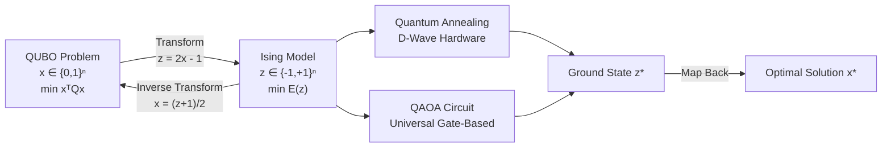
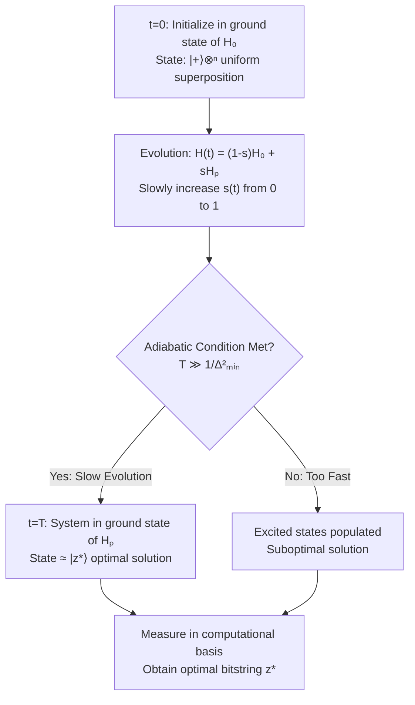
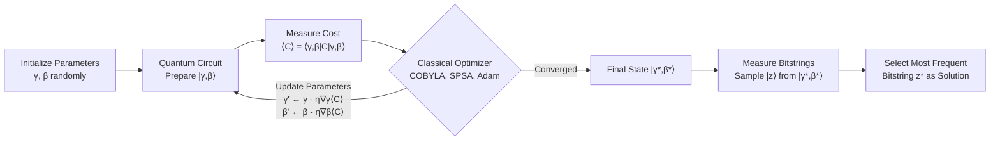

# **Chapter 14: Quantum Optimization (QUBO-Family)**

---


## **Introduction**

Quantum optimization represents a fundamental paradigm where classical NP-hard combinatorial problems are mapped onto quantum hardware to leverage quantum mechanical effects for finding optimal solutions. At the heart of this approach lie two mathematically equivalent formulations: the **Quadratic Unconstrained Binary Optimization (QUBO)** framework, which encodes problems using binary decision variables, and the **Ising model**, which expresses optimization objectives as energy minimization over spin configurations. These formulations provide a universal language for translating diverse real-world problems—ranging from graph partitioning and portfolio selection to job scheduling and constraint satisfaction—into a structure that quantum devices can natively process.

Two primary quantum approaches have emerged for solving these optimization problems. **Adiabatic Quantum Optimization (AQO)** relies on the adiabatic theorem of quantum mechanics: by slowly evolving a quantum system from an easily preparable initial state to one encoding the problem's cost function, the system remains in its instantaneous ground state, which corresponds to the optimal solution. Physical implementations of this principle, known as **quantum annealing**, have been realized in specialized analog devices such as D-Wave systems. In contrast, the **Quantum Approximate Optimization Algorithm (QAOA)** provides a digital, gate-based variational approach suitable for universal NISQ (Noisy Intermediate-Scale Quantum) computers. QAOA constructs parameterized quantum circuits that alternate between cost and mixer operators, with parameters optimized through a hybrid quantum-classical loop to approximate the problem's ground state.

This chapter explores the mathematical foundations of QUBO and Ising formulations, establishes their equivalence through variable transformations, examines both adiabatic and variational quantum optimization paradigms, and demonstrates practical applications in finance and combinatorial optimization. Understanding these quantum optimization frameworks is essential for leveraging near-term quantum hardware to address computationally challenging problems that remain intractable for classical algorithms.

---

## **Chapter Outline**

| Section | Core Concepts |
|:--------|:--------------|
| **14.1 Quadratic Unconstrained Binary Optimization (QUBO)** | Binary decision variables $x \in \{0,1\}^n$, quadratic cost function $x^T Q x$, matrix encoding of linear and quadratic costs, applications to NP-hard problems (MaxCut, portfolio optimization, graph coloring) |
| **14.2 Ising Model Formulations** | Spin variables $z_i \in \{-1,1\}$, energy function $E(z) = \sum J_{ij} z_i z_j + \sum h_i z_i$, coupling coefficients $J_{ij}$ and external fields $h_i$, mathematical equivalence to QUBO via $z_i = 2x_i - 1$, quantum solving methods (quantum annealing, QAOA) |
| **14.3 Adiabatic Quantum Optimization** | Adiabatic theorem and ground state preservation, total Hamiltonian evolution $H(t) = (1-s(t))H_0 + s(t)H_P$, initial transverse field Hamiltonian $H_0 = -\sum X_i$, problem Hamiltonian $H_P$ encoding Ising energy, quantum annealing hardware implementations (D-Wave systems) |
| **14.4 QAOA Applications in Optimization** | Variational circuit structure with alternating cost and mixer unitaries, hybrid quantum-classical optimization loop, applications to MaxCut and combinatorial problems, approximation ratio improvements with circuit depth |
| **14.5 Portfolio Optimization** | Markowitz mean-variance model adapted to QUBO, risk-return trade-off encoded as $\lambda x^T Q x - x^T R$, covariance matrix $Q$ representing risk, solution methods (QAOA, quantum annealing, hybrid solvers), constraint handling via penalty terms |
| **14.6 Constraint Encoding Strategies** | Penalty term methods for embedding constraints into unconstrained formulations, budget and resource constraints as quadratic penalty functions, embedding penalties into QUBO matrix coefficients, advanced custom mixer Hamiltonians for QAOA feasible subspace enforcement |

---

## **14.1 Quadratic Unconstrained Binary Optimization (QUBO)**

Quadratic Unconstrained Binary Optimization provides a standardized mathematical framework for encoding a wide variety of combinatorial optimization problems into a form suitable for quantum solvers. The QUBO formulation expresses optimization objectives as quadratic functions over binary decision variables, enabling direct translation to quantum annealing hardware and variational quantum algorithms.

---

### **Mathematical Formulation**

The QUBO problem seeks to minimize a quadratic cost function over binary variables:

$$
\min_{x \in \{0,1\}^n} \quad C(x) = x^T Q x
$$

where 
$$
x = (x_1, x_2, \ldots, x_n)^T
$$
is a vector of **binary decision variables** with each $x_i \in \{0,1\}$, and $Q$ is an $n \times n$ real-valued matrix encoding the problem structure.

Expanding the matrix multiplication explicitly yields the cost function:

$$
C(x) = \sum_{i=1}^n Q_{ii} x_i + \sum_{i < j} Q_{ij} x_i x_j
$$

The **diagonal elements** $Q_{ii}$ represent **linear costs** associated with individual variable assignments, while the **off-diagonal elements** $Q_{ij}$ encode **quadratic interaction terms** capturing the cost of joint assignments between variables $x_i$ and $x_j$. This structure allows QUBO to naturally represent problems involving both independent variable costs and pairwise relationships.

!!! tip "QUBO as a Universal Problem Formulation"
    Many NP-hard combinatorial optimization problems—including graph partitioning, constraint satisfaction, scheduling, and portfolio selection—can be reduced to QUBO form. This universality makes QUBO the standard input language for quantum optimization hardware and algorithms.

-----

### **Relationship to the Ising Model**

The QUBO formulation over binary variables $\{0,1\}$ is mathematically equivalent to the Ising model formulation over spin variables $\{-1,+1\}$ through a simple variable transformation. This equivalence is crucial because quantum hardware (particularly quantum annealers) physically implements Ising model energy minimization.

The transformation between representations uses:

$$
z_i = 2x_i - 1 \quad \text{or equivalently} \quad x_i = \frac{z_i + 1}{2}
$$

where $x_i \in \{0,1\}$ maps to $z_i \in \{-1,+1\}$. When this substitution is applied to the QUBO objective $C(x) = x^T Q x$ and the result is algebraically expanded, it produces the Ising energy function:

$$
E(z) = \sum_{i < j} J_{ij} z_i z_j + \sum_i h_i z_i + \text{constant}
$$

with coupling coefficients $J_{ij}$ and local fields $h_i$ derived directly from the QUBO matrix elements $Q_{ij}$ and $Q_{ii}$. The constant offset can be ignored during minimization. This bidirectional transformation allows seamless translation between the binary decision framework (QUBO) and the physical spin system (Ising) that quantum devices natively minimize.

```
Algorithm: QUBO to Ising Transformation
Input: QUBO matrix Q of size n×n
Output: Ising coefficients {J_ij, h_i}

for i = 1 to n do
    h_i ← (1/2) * Q_ii - (1/2) * sum_j(Q_ij)
end for

for i = 1 to n-1 do
    for j = i+1 to n do
        J_ij ← (1/4) * Q_ij
    end for
end for

return {J_ij, h_i}
```

-----

### **Applications**

QUBO formulations naturally capture the structure of numerous NP-hard optimization problems, making them ideal targets for quantum optimization approaches:

* **MaxCut Problem:** Given an undirected graph, partition vertices into two sets to maximize the number of edges crossing between sets. The QUBO matrix $Q$ is constructed from the graph's adjacency matrix, with $Q_{ij} = -w_{ij}$ for edge weights $w_{ij}$.

* **Graph Coloring:** Assign colors to graph vertices such that no adjacent vertices share the same color, minimizing the number of colors used. Binary variables represent color assignments, with QUBO penalty terms enforcing adjacency constraints.

* **Portfolio Optimization:** Select a subset of financial assets to balance expected return against risk (variance). The QUBO objective encodes the covariance matrix as risk penalties and expected returns as linear terms (detailed in Section 14.5).

* **Job Scheduling:** Allocate tasks to time slots or processors to minimize total completion time or resource conflicts. QUBO variables represent task-slot assignments, with penalties encoding temporal and resource constraints.

* **Feature Selection:** In machine learning, identify a subset of features maximizing model performance while minimizing redundancy. QUBO formulations can encode feature correlation matrices and performance metrics.

The NP-hard complexity of these problems validates the need for quantum solvers, as classical algorithms struggle with exponential scaling. Quantum approaches—whether through quantum annealing hardware or variational algorithms like QAOA—offer potential pathways to finding high-quality approximate solutions more efficiently than classical heuristics.

!!! example "MaxCut QUBO Encoding"
    Consider a 4-vertex graph with edges (0,1), (1,2), (2,3), (0,3), each with weight 1. The MaxCut QUBO matrix becomes:
    
    $$
    Q = \begin{pmatrix}
    0 & -1 & 0 & -1 \\
    -1 & 0 & -1 & 0 \\
    0 & -1 & 0 & -1 \\
    -1 & 0 & -1 & 0
    \end{pmatrix}
    $$
    
    A solution $x = (1,0,1,0)$ partitions vertices {0,2} versus {1,3}, cutting all 4 edges with cost $C(x) = -4$ (maximum cut).

---

## **14.2 Ising Model Formulations**

The Ising model provides a physics-based formulation for optimization problems, expressing objectives as energy functions over spin configurations. Originally developed to describe ferromagnetism in statistical mechanics, the Ising formulation has become the native language of quantum annealing hardware and serves as the foundation for adiabatic quantum optimization.

---

### **Mathematical Formulation**

The Ising model represents a system's energy as a function of **spin variables** $z_i \in \{-1, +1\}$ representing magnetic spin orientations (spin-down and spin-up, respectively):

$$
E(z) = \sum_{i < j} J_{ij} z_i z_j + \sum_i h_i z_i
$$

The energy function consists of two components:

* **Coupling Terms:** The pairwise interaction $J_{ij} z_i z_j$ encodes the energy contribution from the joint configuration of spins $z_i$ and $z_j$. The **coupling coefficient** $J_{ij}$ determines interaction strength and type:
  - $J_{ij} > 0$ (ferromagnetic): favors alignment ($z_i = z_j$), minimizing energy when spins point in the same direction
  - $J_{ij} < 0$ (antiferromagnetic): favors anti-alignment ($z_i = -z_j$), minimizing energy when spins point in opposite directions

* **External Field Terms:** The linear term $h_i z_i$ represents the energy contribution from an **external magnetic field** acting on spin $i$. The field strength $h_i$ biases the spin toward $+1$ (if $h_i < 0$) or $-1$ (if $h_i > 0$).

The optimization objective is to find the **ground state**: the spin configuration $z^* = \arg\min_z E(z)$ that minimizes the total energy. This ground state corresponds directly to the optimal solution of the encoded optimization problem.

-----

### **Mathematical Equivalence to QUBO**

The Ising model and QUBO formulations are mathematically equivalent through an invertible variable transformation. For any QUBO problem $\min_x x^T Q x$ with $x_i \in \{0,1\}$, the substitution:

$$
x_i = \frac{z_i + 1}{2} \quad \text{where } z_i \in \{-1,+1\}
$$

transforms the binary variables into spin variables. Substituting into the QUBO objective and expanding:

$$
C(x) = \sum_i Q_{ii} x_i + \sum_{i<j} Q_{ij} x_i x_j = \sum_i Q_{ii} \frac{z_i+1}{2} + \sum_{i<j} Q_{ij} \frac{z_i+1}{2} \frac{z_j+1}{2}
$$

Algebraic expansion and collection of terms yields:

$$
C(x) = \sum_{i<j} \frac{Q_{ij}}{4} z_i z_j + \sum_i \left(\frac{Q_{ii}}{2} + \frac{1}{2}\sum_j Q_{ij}\right) z_i + \text{constant}
$$

This produces an Ising energy function $E(z)$ with:

$$
J_{ij} = \frac{Q_{ij}}{4}, \quad h_i = \frac{Q_{ii}}{2} + \frac{1}{2}\sum_j Q_{ij}
$$

The constant offset can be ignored during minimization since it doesn't affect the optimal configuration. This equivalence allows **bidirectional translation**: any problem formulated in QUBO can be converted to Ising and vice versa, enabling the same optimization problem to be solved on different quantum hardware platforms.



-----

### **Solving the Model Quantumly**

The Ising energy function provides the natural input for quantum optimization approaches, which seek to prepare quantum states corresponding to low-energy spin configurations:

* **Quantum Annealing (QA):** An analog, continuous-time quantum process implemented in specialized hardware (e.g., D-Wave systems). The Ising coefficients $\{J_{ij}, h_i\}$ are physically encoded as programmable qubit couplings and local biases. The system evolves adiabatically from an initial transverse field Hamiltonian (creating a uniform superposition ground state) to the problem Hamiltonian $H_P = E(z)$. Measurement of the final quantum state yields a spin configuration approximating the ground state.

* **QAOA (Quantum Approximate Optimization Algorithm):** A digital, gate-based variational algorithm suitable for universal quantum computers (detailed in Section 14.4). The Ising Hamiltonian defines the **Cost Unitary** $U_C(\gamma) = e^{-i\gamma H_P}$ applied in alternation with a **Mixer Unitary** $U_B(\beta)$. Classical optimization of variational parameters $\{\gamma, \beta\}$ iteratively improves the quantum state to approximate the ground state energy, yielding near-optimal solutions.

Both approaches leverage quantum superposition and interference to explore the solution space, offering potential advantages over classical optimization heuristics for certain problem classes, particularly those with rugged energy landscapes where classical algorithms become trapped in local minima.

??? question "When Should You Use Ising Formulation vs QUBO?"
    The choice depends on your quantum hardware target:
    
    - **Use Ising directly** when interfacing with quantum annealing hardware (D-Wave) that natively implements spin-glass physics with programmable $J_{ij}$ and $h_i$ parameters.
    - **Use QUBO** when working with optimization software libraries (D-Wave Ocean, Qiskit Optimization) that accept binary formulations and handle the internal Ising transformation automatically.
    - **Equivalence guarantees** that the optimal solution is identical regardless of which representation you choose—select based on convenience and platform compatibility.

---

## **14.3 Adiabatic Quantum Optimization**

Adiabatic Quantum Optimization exploits a fundamental theorem of quantum mechanics—the adiabatic theorem—to solve optimization problems by slowly evolving a quantum system from an easily preparable initial state to a final state whose ground state encodes the problem's solution. This analog, continuous-time approach forms the theoretical foundation for quantum annealing hardware.

---

### **The Adiabatic Theorem Principle**

The **adiabatic theorem** of quantum mechanics states that a quantum system initially prepared in the ground state of a time-dependent Hamiltonian $H(t)$ will remain in the instantaneous ground state throughout the evolution, provided the Hamiltonian changes sufficiently slowly and a spectral gap (energy difference between ground and first excited states) persists.

Mathematically, if the system begins in the ground state $|\psi_0\rangle$ of $H(0)$ and the Hamiltonian evolves to $H(T)$ over time interval $[0,T]$, then for sufficiently large $T$, the final state $|\psi(T)\rangle$ remains arbitrarily close to the instantaneous ground state $|E_0(T)\rangle$ of $H(T)$:

$$
|\psi(T)\rangle \approx |E_0(T)\rangle
$$

The required evolution time scales inversely with the **minimum spectral gap** $\Delta_{\min}$ encountered during the evolution:

$$
T \gg \frac{\|\dot{H}\|_{\max}}{\Delta_{\min}^2}
$$

where 
$$
\|\dot{H}\|_{\max}
$$
represents the maximum rate of Hamiltonian change. Smaller gaps demand slower evolution to maintain adiabaticity.

For optimization, this principle enables solving hard problems: if we construct $H(T)$ such that its ground state encodes the optimal solution, adiabatic evolution from a simple initial state guarantees (in the ideal limit) delivery of the solution without needing to search the exponential solution space explicitly.

!!! tip "Adiabatic Condition for Successful Optimization"
    The adiabatic condition requires that the evolution time $T$ be long compared to the inverse square of the minimum energy gap. For NP-hard problems, this gap often becomes exponentially small near the problem's critical point, potentially requiring exponentially long evolution times. However, quantum annealing hardware explores whether quantum tunneling through energy barriers provides practical advantages even when perfect adiabaticity cannot be achieved.

-----

### **The Total Hamiltonian and Evolution**

Adiabatic quantum optimization constructs a **time-dependent total Hamiltonian** that interpolates between an **initial Hamiltonian** $H_0$ (with easily preparable ground state) and a **problem Hamiltonian** $H_P$ (whose ground state encodes the optimization solution):

$$
H(t) = \left(1 - s(t)\right) H_0 + s(t) H_P
$$

where $s(t)$ is the **annealing schedule**—a monotonically increasing function mapping time to the interval $[0,1]$:

$$
s(0) = 0, \quad s(T) = 1
$$

**Initial Hamiltonian $H_0$:**

The initial Hamiltonian is chosen to have a known, easily preparable ground state. The standard choice is the **transverse field Hamiltonian**:

$$
H_0 = -\sum_{i=1}^n X_i
$$

where $X_i$ is the Pauli-X operator acting on qubit $i$. This Hamiltonian's ground state is the uniform superposition over all computational basis states:

$$
|+\rangle^{\otimes n} = \frac{1}{\sqrt{2^n}} \sum_{z \in \{0,1\}^n} |z\rangle
$$

This provides maximum initial quantum superposition over all possible solutions.

**Problem Hamiltonian $H_P$:**

The problem Hamiltonian encodes the optimization objective as an Ising energy function:

$$
H_P = \sum_{i < j} J_{ij} Z_i Z_j + \sum_i h_i Z_i
$$

where $Z_i$ are Pauli-Z operators and $\{J_{ij}, h_i\}$ are the Ising coefficients derived from the QUBO formulation (Section 14.2). The computational basis states $|z\rangle$ are eigenstates of $H_P$ with eigenvalues equal to the classical Ising energy $E(z)$. Thus, the ground state of $H_P$ corresponds to the optimal solution:

$$
H_P |z^*\rangle = E_{\min} |z^*\rangle, \quad \text{where } z^* = \arg\min E(z)
$$

**Annealing Schedule $s(t)$:**

The schedule function $s(t)$ controls the interpolation rate. Common choices include:

* **Linear schedule:** 
$$
s(t) = t/T
$$

* **Nonlinear schedules:** Slower evolution near critical regions where the gap $\Delta(t)$ is smallest can improve fidelity

At $t=0$, the system is initialized in the ground state of $H_0$. As $t$ increases toward $T$, the contribution of $H_0$ decreases while $H_P$ dominates. If the evolution is sufficiently slow (adiabatic), the system tracks the instantaneous ground state, culminating in the ground state of $H_P$ at $t=T$—the optimal solution.



-----

### **Quantum Annealing Hardware**

**Quantum annealing** is the physical realization of adiabatic quantum optimization implemented in analog quantum hardware, most notably **D-Wave Systems**. Unlike universal gate-based quantum computers, quantum annealers are special-purpose devices designed specifically for optimization problems.

**Physical Implementation:**

* Quantum annealers physically implement the transverse field Hamiltonian $H_0$ using strong transverse magnetic fields applied to superconducting flux qubits.
* The problem Hamiltonian $H_P$ is encoded by programming the qubit coupling strengths $J_{ij}$ (via tunable inductive couplers) and local biases $h_i$ (via qubit flux biases).
* The annealing process physically decreases the transverse field strength while increasing the longitudinal field components, effectively implementing the schedule $s(t)$.

**Analog vs Digital:**

* **Quantum Annealing (Analog):** Continuous-time evolution of a physical system following the adiabatic trajectory. No discrete gate operations. Evolution is subject to environmental noise and thermal fluctuations but leverages quantum tunneling through energy barriers.
* **QAOA (Digital):** Discrete gate-based variational algorithm (Section 14.4) approximating adiabatic evolution using parameterized circuits on universal quantum computers. Offers more control and error mitigation but requires deeper circuits.

**Hardware Characteristics:**

* D-Wave annealers feature thousands of qubits arranged in specific connectivity topologies (Chimera, Pegasus, Zephyr graphs).
* Problem embedding: Logical QUBO variables may require multiple physical qubits (chains) to overcome limited qubit connectivity.
* Annealing time: Typically microseconds to milliseconds. Multiple annealing runs (samples) are performed to collect statistics over stochastic outcomes.

Quantum annealing provides a practical platform for testing quantum optimization on real-world problems, though the extent of quantum advantage over classical optimization heuristics remains an active area of research, particularly for problems where the energy landscape's structure impacts the minimum spectral gap.

---

## **14.4 QAOA Applications in Optimization**

The Quantum Approximate Optimization Algorithm (QAOA) represents a hybrid quantum-classical approach to combinatorial optimization, designed explicitly for Noisy Intermediate-Scale Quantum (NISQ) devices. QAOA provides a digital, gate-based approximation to adiabatic quantum optimization through parameterized quantum circuits optimized via classical feedback loops.

---

### **The Variational Circuit Structure**

QAOA constructs a parameterized quantum state by alternately applying **Cost Unitaries** (encoding the problem objective) and **Mixer Unitaries** (enabling exploration of the solution space). The resulting state depends on variational parameters $\vec{\gamma} = (\gamma_1, \ldots, \gamma_p)$ and $\vec{\beta} = (\beta_1, \ldots, \beta_p)$:

$$
|\vec{\gamma}, \vec{\beta}\rangle = U_B(\beta_p) U_C(\gamma_p) \cdots U_B(\beta_2) U_C(\gamma_2) U_B(\beta_1) U_C(\gamma_1) |+\rangle^{\otimes n}
$$

where $p$ denotes the **circuit depth** (number of QAOA layers) and the initial state is the uniform superposition:

$$
|+\rangle^{\otimes n} = \frac{1}{\sqrt{2^n}} \sum_{z \in \{0,1\}^n} |z\rangle
$$

**Cost Unitary $U_C(\gamma)$:**

The Cost Unitary encodes the optimization objective (Ising Hamiltonian or QUBO cost function) as a quantum evolution operator:

$$
U_C(\gamma) = e^{-i\gamma C}
$$

where $C$ is the **Cost Hamiltonian** corresponding to the Ising energy function:

$$
C = H_P = \sum_{i<j} J_{ij} Z_i Z_j + \sum_i h_i Z_i
$$

The operator $U_C(\gamma)$ applies phase shifts proportional to the classical cost of each computational basis state $|z\rangle$, effectively encoding problem structure into quantum amplitudes.

**Mixer Unitary $U_B(\beta)$:**

The Mixer Unitary facilitates exploration of the solution space by inducing transitions between computational basis states:

$$
U_B(\beta) = e^{-i\beta B}
$$

where the standard choice for the **Mixer Hamiltonian** is:

$$
B = \sum_{i=1}^n X_i
$$

This transverse field Hamiltonian creates superpositions and enables quantum state transitions analogous to the initial Hamiltonian in adiabatic optimization.

**Circuit Depth $p$:**

Increasing the number of QAOA layers $p$ generally improves approximation quality, allowing the algorithm to better approximate the true ground state. However, deeper circuits incur greater gate errors on NISQ devices and increase classical optimization complexity (more parameters to optimize). Typical implementations use $p \in \{1, 2, \ldots, 10\}$.

```
Algorithm: QAOA Circuit Construction
Input: Cost Hamiltonian C, circuit depth p
Output: Parameterized quantum circuit

Initialize state |ψ⟩ ← |+⟩⊗ⁿ
Initialize parameters {γ₁,...,γₚ}, {β₁,...,βₚ}

for layer = 1 to p do
    Apply Cost Unitary: |ψ⟩ ← exp(-iγₗₐᵧₑᵣ C) |ψ⟩
        // Implemented as ZZ gates for coupling terms, Z gates for field terms
    Apply Mixer Unitary: |ψ⟩ ← exp(-iβₗₐᵧₑᵣ B) |ψ⟩
        // Implemented as X-rotation gates: RX(2βₗₐᵧₑᵣ) on each qubit
end for

return Parameterized circuit preparing |γ,β⟩
```

-----

### **Hybrid Optimization and Measurement**

QAOA operates as a **variational quantum eigensolver (VQE)**-style algorithm, iteratively optimizing circuit parameters through a hybrid quantum-classical loop:

**Quantum Evaluation:**

For given parameters $(\vec{\gamma}, \vec{\beta})$, the quantum circuit prepares the state $|\vec{\gamma}, \vec{\beta}\rangle$ and measures the expectation value of the Cost Hamiltonian:

$$
\langle C \rangle_{\vec{\gamma}, \vec{\beta}} = \langle \vec{\gamma}, \vec{\beta} | C | \vec{\gamma}, \vec{\beta} \rangle
$$

This expectation value represents the average cost over the quantum state's probability distribution. Estimation requires multiple measurements (shots) to sample computational basis states $|z\rangle$ with probabilities 
$$
|\langle z | \vec{\gamma}, \vec{\beta} \rangle|^2
$$
, then computing:

$$
\langle C \rangle \approx \frac{1}{N_{\text{shots}}} \sum_{\text{samples}} C(z)
$$

**Classical Parameter Optimization:**

A classical optimizer updates the parameters to minimize the expectation value:

$$
(\vec{\gamma}^*, \vec{\beta}^*) = \arg\min_{\vec{\gamma}, \vec{\beta}} \langle C \rangle_{\vec{\gamma}, \vec{\beta}}
$$

Common optimizers include:

* **Gradient-free methods:** COBYLA (Constrained Optimization BY Linear Approximation), Nelder-Mead simplex
* **Gradient-based methods:** Simultaneous Perturbation Stochastic Approximation (SPSA), parameter-shift rule for quantum gradients, Adam optimizer

**Solution Extraction:**

After convergence, the optimized state $|\vec{\gamma}^*, \vec{\beta}^*\rangle$ is measured repeatedly in the computational basis. The bitstring $z^*$ observed with highest frequency provides the **approximate solution** to the optimization problem. For higher-quality solutions, the top-k most frequent bitstrings can be evaluated classically and the best selected.

**Approximation Quality:**

For a given circuit depth $p$, QAOA provides an **approximation ratio** $r$ to the optimal cost:

$$
r = \frac{\langle C \rangle_{\text{QAOA}}}{\langle C \rangle_{\text{optimal}}}
$$

Theoretical and empirical studies show that $r$ improves as $p$ increases, with QAOA achieving better approximation ratios than classical polynomial-time approximation algorithms for certain problems (e.g., MaxCut) at sufficient depth.



-----

### **Applications in Combinatorial Optimization**

QAOA has been applied to a wide range of NP-hard combinatorial problems, demonstrating practical utility on NISQ hardware:

* **MaxCut:** The canonical QAOA benchmark. Given a graph, partition vertices to maximize edges crossing the partition. QAOA with $p \geq 3$ layers often outperforms classical approximation algorithms like Goemans-Williamson for specific graph classes. The MaxCut cost function translates directly to:

$$
C = \sum_{(i,j) \in E} \frac{1 - Z_i Z_j}{2}
$$

* **Portfolio Optimization:** QAOA can optimize the risk-return trade-off encoded as QUBO (Section 14.5). The cost Hamiltonian incorporates the covariance matrix (risk) and expected return vector, with constraints embedded via penalty terms.

* **Other Applications:**
  - **Job Scheduling:** Minimize completion time or resource conflicts by encoding task-slot assignments as binary variables with temporal constraint penalties.
  - **Graph Coloring:** Minimize the number of colors needed while satisfying adjacency constraints, formulated as QUBO with penalty terms for conflicts.
  - **Constraint Satisfaction:** Encode Boolean satisfiability (SAT) and other CSP problems as QUBO/Ising, seeking satisfying assignments.

**Approximation Advantage:**

The primary advantage of QAOA lies in achieving **better approximation ratios** than classical polynomial-time algorithms for certain problem instances, especially as the number of layers $p$ increases. While QAOA does not guarantee exponential speedup (and the required circuit depth for advantage may scale polynomially or worse with problem size), empirical studies on NISQ hardware suggest practical benefits for moderately sized instances where classical heuristics struggle.

**NISQ Hardware Suitability:**

QAOA's shallow circuit depth (relative to fault-tolerant algorithms) makes it particularly well-suited for current noisy quantum devices. Error mitigation techniques (zero-noise extrapolation, probabilistic error cancellation) can further enhance performance, and ongoing research explores parameter initialization strategies, adaptive circuit depth, and problem-specific mixer designs to improve convergence.

!!! example "QAOA for 4-Vertex MaxCut"
    Consider the 4-vertex cycle graph with unit edge weights (edges: 0-1, 1-2, 2-3, 3-0). The MaxCut cost Hamiltonian is:
    
    $$
    C = \frac{1}{2}\left(4 - Z_0 Z_1 - Z_1 Z_2 - Z_2 Z_3 - Z_3 Z_0\right)
    $$
    
    With $p=1$ QAOA layer, classical optimization typically finds parameters yielding $\langle C \rangle \approx 3.5$, close to the optimal cut of 4 edges achieved by partition $\{0,2\}$ vs $\{1,3\}$.

---

## **14.5 Portfolio Optimization**

Portfolio Optimization represents a prime application of quantum computing within **quantum finance**, where the goal is to determine the optimal allocation of financial assets to maximize expected returns while minimizing risk. This problem naturally maps onto the QUBO framework, making it amenable to solution via quantum annealing and QAOA.

---

### **The Optimization Objective**

The classical **Markowitz mean-variance model** balances expected portfolio return against risk (measured by variance). For quantum solvers, this is adapted into a QUBO-compatible objective function.

The optimization objective seeks to maximize return while penalizing risk, which is reformulated as minimization:

$$
\text{Maximize} \quad x^T R - \lambda x^T Q x
$$

Equivalently, by negating:

$$
\min_x \quad \lambda x^T Q x - x^T R
$$

where:

* **$x = (x_1, \ldots, x_n)^T$:** Binary selection vector with $x_i \in \{0,1\}$. $x_i = 1$ indicates asset $i$ is included in the portfolio; $x_i = 0$ indicates exclusion.

* **$R = (R_1, \ldots, R_n)^T$:** Vector of **expected returns** for each asset. $R_i$ represents the anticipated return of asset $i$ over the investment horizon.

* **$Q$:** The $n \times n$ **covariance matrix** encoding risk. $Q_{ij}$ represents the covariance between assets $i$ and $j$, capturing both individual asset variance ($Q_{ii}$) and cross-asset correlation (off-diagonal $Q_{ij}$). Higher covariance increases portfolio volatility.

* **$\lambda$:** **Risk-aversion parameter** controlling the trade-off between return maximization and risk minimization. Larger $\lambda$ prioritizes risk reduction; smaller $\lambda$ prioritizes return maximization.

The quadratic term $x^T Q x$ quantifies portfolio variance (total risk), while the linear term $x^T R$ captures total expected return. The QUBO formulation directly encodes this objective, with the covariance matrix $Q$ serving as the QUBO matrix and the return vector $R$ adjusting the diagonal or being incorporated via penalty terms.

!!! tip "Risk-Return Trade-off Tuning"
    The parameter $\lambda$ is critical for balancing investor risk tolerance. Conservative investors (higher $\lambda$) obtain portfolios with lower variance but potentially lower returns, while aggressive investors (lower $\lambda$) accept higher volatility for greater expected gains. Sensitivity analysis over $\lambda$ can generate an efficient frontier of Pareto-optimal portfolios.

-----

### **Solution on Quantum Solvers**

Once formulated as QUBO, the portfolio optimization problem is converted to an equivalent Ising Hamiltonian (via the transformation in Section 14.2) and solved using quantum methods:

**QAOA (Quantum Approximate Optimization Algorithm):**

The portfolio's QUBO cost function defines the **Cost Hamiltonian** $C$ for QAOA:

$$
C = \lambda \sum_{i,j} Q_{ij} Z_i Z_j - \sum_i R_i Z_i + \text{offset}
$$

(after translating binary variables to spin variables). The QAOA circuit (Section 14.4) alternates between applying $U_C(\gamma)$ (encoding portfolio cost) and $U_B(\beta)$ (mixer for exploration). Classical optimization of parameters $(\vec{\gamma}, \vec{\beta})$ minimizes the expected cost $\langle C \rangle$, yielding an optimized quantum state. Measurement produces a bitstring $x^*$ representing the selected asset subset.

**Quantum Annealing (D-Wave Systems):**

Quantum annealers directly accept Ising Hamiltonian specifications. The portfolio's Ising coefficients $\{J_{ij}, h_i\}$ (derived from $Q$ and $R$) are programmed into the device's qubit couplings and biases. The annealing process physically evolves from a transverse field superposition to the problem Hamiltonian's ground state (Section 14.3), with final measurement yielding an approximate optimal portfolio $x^*$.

**Hybrid Quantum-Classical Solvers:**

Modern quantum software frameworks (e.g., **PennyLane**, **Qiskit Optimization**, **D-Wave Ocean SDK**) provide hybrid solvers that:

* Automatically convert high-level portfolio optimization models into QUBO/Ising formulations
* Interface with quantum hardware (simulators or physical QPUs)
* Implement classical pre-processing (problem reduction, constraint embedding) and post-processing (solution refinement, feasibility repair)
* Manage the iterative optimization loop for variational approaches (QAOA)

These tools enable finance practitioners to leverage quantum optimization without requiring deep expertise in quantum algorithm design.

-----

### **The Constraint Challenge**

Real-world portfolio optimization includes critical **constraints** that must be satisfied for practical viability:

* **Budget Constraint:** Total investment must not exceed available capital: 
$$
\sum_i c_i x_i \leq B
$$
 where $c_i$ is the cost of asset $i$ and $B$ is the budget.

* **Cardinality Constraint:** Limit the number of assets selected (for diversification or transaction cost reasons): 
$$
\sum_i x_i \leq k
$$

* **Sector Exposure Limits:** Constrain allocation to specific asset classes or industries: 
$$
\sum_{i \in \text{sector}} x_i \leq L_{\text{sector}}
$$

* **Holding Constraints:** Require inclusion/exclusion of specific assets (e.g., mandated holdings or exclusions based on ESG criteria).

Since the native QUBO formulation is **unconstrained**, these requirements must be incorporated into the objective function via **penalty terms**. The total cost becomes:

$$
C_{\text{total}}(x) = \left(\lambda x^T Q x - x^T R\right) + \lambda_{\text{penalty}} \cdot \text{Penalty}(x)
$$

The penalty function $\text{Penalty}(x)$ is designed to:

* Equal **zero** when all constraints are satisfied (feasible solution)
* Become **large and positive** when constraints are violated (infeasible solution)

The penalty weight $\lambda_{\text{penalty}}$ must be chosen sufficiently large to ensure that violating constraints always results in higher cost than any feasible solution, thereby guiding the quantum solver toward the feasible region. Constraint encoding strategies are detailed in Section 14.6.

??? question "Why Not Use Constrained Quantum Optimization Directly?"
    Current quantum optimization hardware (quantum annealers) and algorithms (QAOA) are inherently designed for unconstrained problems encoded as QUBO or Ising models. While active research explores constrained quantum optimization via quantum linear programming and specialized mixer Hamiltonians (Section 14.6.3), penalty-based constraint embedding remains the most mature and widely deployed approach. The challenge lies in tuning penalty weights: too small allows constraint violations, too large creates numerical ill-conditioning that hinders optimization.

---

## **14.6 Constraint Encoding Strategies**

Real-world optimization problems invariably include constraints—budget limits, resource capacities, logical dependencies—that restrict the feasible solution space. Since QUBO and Ising formulations are inherently **unconstrained**, these constraints must be embedded into the optimization objective to ensure quantum solvers find valid solutions. This section explores the primary strategies for constraint encoding and their implementation in quantum optimization frameworks.

---

### **Penalty Term Encoding**

The most common and flexible approach to constraint handling is **penalty term encoding**, where constraint violations are penalized by adding a penalty function to the original objective.

**Mechanism:**

For a constraint $g(x) \leq 0$ (inequality constraint) or $h(x) = 0$ (equality constraint), construct a penalty function $P(x)$ such that:

$$
P(x) = \begin{cases} 0 & \text{if constraint is satisfied} \\ > 0 & \text{if constraint is violated} \end{cases}
$$

The total optimization objective becomes:

$$
C_{\text{total}}(x) = C_{\text{objective}}(x) + \lambda_{\text{penalty}} \cdot P(x)
$$

where $\lambda_{\text{penalty}}$ is a **penalty weight coefficient** that must be chosen large enough to ensure constraint violations always result in higher total cost than any feasible solution.

**Common Penalty Functions:**

* **Equality Constraint** 
$$
h(x) = 0
$$
: Use quadratic penalty 
$$
P(x) = h(x)^2
$$
. Example: For budget constraint 
$$
\sum_i x_i = B
$$
, use:

$$
P(x) = \left(\sum_i x_i - B\right)^2
$$

* **Inequality Constraint** 
$$
g(x) \leq 0
$$
: Use quadratic penalty on the positive violation:

$$
P(x) = \max(0, g(x))^2
$$

For constraints already in sum form, this often simplifies to a quadratic function of the binary variables.

* **Logical Constraints:** Boolean constraints (e.g., "at most one of $x_1, x_2, x_3$ can be 1") can be encoded using quadratic penalty terms. Example: 
$$
\sum_i x_i \leq 1
$$
 can be penalized via:

$$
P(x) = \sum_{i < j} x_i x_j
$$

(which equals zero only when at most one variable is 1).

**Penalty Weight Selection:**

Choosing $\lambda_{\text{penalty}}$ is critical:

* **Too small:** Constraint violations may yield lower total cost than feasible solutions, producing invalid results.
* **Too large:** Numerical ill-conditioning can occur, and the optimization landscape becomes dominated by penalty terms, hindering convergence.

Empirical tuning strategies include:

* Setting $\lambda_{\text{penalty}}$ proportional to the maximum objective value range
* Using adaptive penalty methods that increase $\lambda_{\text{penalty}}$ if infeasible solutions persist
* Analyzing the penalty contribution relative to objective contribution in preliminary runs

```
Algorithm: Constraint Embedding via Penalty Terms
Input: Original objective C(x), constraint g(x) ≤ 0, penalty weight λ
Output: Constrained QUBO objective C_total(x)

Construct penalty function:
    if constraint is equality h(x) = 0:
        P(x) ← h(x)²
    else if constraint is inequality g(x) ≤ 0:
        P(x) ← max(0, g(x))²
    end if

Expand P(x) into quadratic form:
    P(x) = ∑ᵢ pᵢ xᵢ + ∑ᵢ<ⱼ pᵢⱼ xᵢxⱼ

Combine with original objective:
    C_total(x) ← C(x) + λ · P(x)

return C_total(x)
```

-----

### **Embedding into the QUBO Matrix**

For the penalty function to be compatible with QUBO and Ising solvers, it must be expressible as a **quadratic function of binary variables**. This requires algebraically expanding the penalty term and incorporating it into the QUBO matrix $Q$.

**Process:**

1. **Expand the Penalty:** Express $P(x)$ explicitly in terms of binary variables. For example, the budget constraint penalty:

$$
P(x) = \left(\sum_i x_i - B\right)^2 = \sum_i x_i^2 + \sum_{i \neq j} x_i x_j - 2B\sum_i x_i + B^2
$$

Since $x_i^2 = x_i$ for binary variables (idempotence), this simplifies to:

$$
P(x) = \sum_i (1 - 2B) x_i + \sum_{i \neq j} x_i x_j + B^2
$$

The constant $B^2$ can be dropped (doesn't affect optimization).

2. **Extract Coefficients:** Identify the linear coefficients (affecting $Q_{ii}$) and quadratic coefficients (affecting $Q_{ij}$ for $i \neq j$).

3. **Update QUBO Matrix:** Add the penalty coefficients to the original QUBO matrix:

$$
Q_{\text{total}, ii} = Q_{\text{objective}, ii} + \lambda_{\text{penalty}} \cdot p_i
$$

$$
Q_{\text{total}, ij} = Q_{\text{objective}, ij} + \lambda_{\text{penalty}} \cdot p_{ij}
$$

where $p_i$ and $p_{ij}$ are the linear and quadratic coefficients extracted from $P(x)$.

**Result:**

The final constrained optimization problem remains in standard QUBO form:

$$
\min_x \quad x^T Q_{\text{total}} x
$$

This can be directly converted to Ising format (Section 14.2) and solved on quantum hardware without modification to the solver interface.

**Example:**

For portfolio optimization with budget constraint 
$$
\sum_i x_i = 3
$$
 (exactly 3 assets selected):

* Penalty: 
$$
P(x) = (\sum_i x_i - 3)^2 = \sum_i x_i - 6\sum_i x_i + \sum_{i<j} 2x_i x_j + 9
$$

* Coefficients: Diagonal terms get $-5$ (from $1 - 6$), off-diagonal terms get $+2$
* Add these to the original portfolio QUBO matrix $Q$ with weight $\lambda_{\text{penalty}}$

-----

### **Custom Mixer Hamiltonians (Advanced QAOA)**

An advanced strategy for constraint handling in **QAOA** involves modifying the algorithm's **Mixer Hamiltonian** to enforce constraints dynamically during quantum evolution, rather than relying solely on static penalty terms.

**Concept:**

In standard QAOA (Section 14.4), the Mixer Hamiltonian is:

$$
B = \sum_i X_i
$$

which allows arbitrary transitions between computational basis states. For constrained problems, this mixer may waste quantum resources exploring infeasible regions.

A **custom mixer** is constructed to permit only transitions that preserve constraint satisfaction, effectively restricting quantum evolution to the **feasible subspace** of the optimization problem.

**Construction:**

For a constraint like "exactly $k$ variables equal 1" (cardinality constraint), the custom mixer uses **exchange operators** that swap the values of variables in and out of the selected set while maintaining the total count:

$$
B_{\text{custom}} = \sum_{i \in \text{selected}, j \in \text{unselected}} (X_i X_j + Y_i Y_j)
$$

This operator swaps the states of qubits $i$ and $j$, preserving the Hamming weight (number of 1s).

**Benefits:**

* **Feasible Subspace Exploration:** The quantum state remains within valid configurations throughout evolution, eliminating the need for large penalty weights $\lambda_{\text{penalty}}$.
* **Improved Convergence:** Focusing quantum resources on feasible solutions may accelerate convergence and improve solution quality.
* **Reduced Parameter Sensitivity:** Eliminates the need to manually tune penalty coefficients, which can be problem-dependent and challenging to calibrate.

**Challenges:**

* **Problem-Specific Design:** Custom mixers must be designed for each constraint type, requiring deeper understanding of the problem structure.
* **Circuit Complexity:** Exchange operators may require more quantum gates than the standard $X$ mixer, potentially increasing circuit depth and error rates on NISQ devices.
* **Limited Tooling:** Software support for custom mixers is less mature than penalty-based methods, though frameworks like Qiskit and PennyLane are adding support.

**Research Directions:**

Ongoing research explores:

* Automatic construction of custom mixers from constraint specifications
* Hybrid approaches combining custom mixers with small penalty terms for soft constraints
* Theoretical analysis of approximation guarantees for constrained QAOA variants

Custom mixer strategies represent the frontier of constrained quantum optimization, offering potential advantages for problems where constraint structure is well-understood and feasible subspaces are not too restrictive.

!!! example "Custom Mixer for Cardinality Constraint"
    Consider portfolio optimization requiring exactly $k=5$ assets selected from $n=20$ candidates. The feasible subspace consists of all bitstrings with Hamming weight 5 (e.g., 11110000... configurations). A custom mixer using XY-exchange operators allows transitions like $|110100...\rangle \leftrightarrow |101100...\rangle$ (swapping asset selections) while preserving the count of selected assets. This keeps the quantum state within the 
    $$
    \binom{20}{5} = 15504
    $$
     valid configurations, avoiding exploration of the 
    $$
    2^{20} - 15504
    $$
     infeasible states.

---

## **Summary of Quantum Optimization Methods (Chapter 14)**

This table summarizes the core formulations, translation methods, quantum algorithms, and practical applications within the quantum optimization paradigm.

| Concept Area | Component | Mathematical Formulation / Equivalent | Quantum Mechanism & Advantage |
|:-------------|:----------|:--------------------------------------|:------------------------------|
| **I. Problem Formulation** | **QUBO** (Quadratic Unconstrained Binary Optimization) | $\min_{x \in \{0,1\}^n} x^T Q x$ (Quadratic cost over **binary** variables) | Standardized **input form** for diverse problems (MaxCut, scheduling, portfolio optimization) |
| | **Ising Model** | $E(z) = \sum_{i < j} J_{ij} z_i z_j + \sum_i h_i z_i$ (Linear/quadratic cost over **spin** variables $z_i \in \{-1,+1\}$) | **Native energy function** that quantum hardware (annealers) physically minimizes via spin-glass dynamics |
| | **Equivalence Mapping** | $z_i = 2x_i - 1$ (bidirectional transformation) | Translates binary decision space (QUBO) into spin system (Ising) that **quantum hardware is physically designed to solve** |
| **II. Quantum Solvers** | **Adiabatic Optimization (AQO)** | $H(t) = (1 - s(t)) H_0 + s(t) H_P$ where $H_0 = -\sum X_i$ (initial transverse field) and $H_P = E(z)$ (problem Hamiltonian) | Relies on **Adiabatic Theorem**: system initialized in ground state of $H_0$ remains in instantaneous ground state if evolution is **sufficiently slow**, yielding ground state of $H_P$ (optimal solution) at $t=T$ |
| | **QAOA** (Quantum Approximate Optimization Algorithm) | Iterative digital circuit: $U_B(\beta) U_C(\gamma)$ repeated $p$ times. $U_C = e^{-i\gamma C}$ (Cost Unitary from $H_P$); $U_B = e^{-i\beta B}$ (Mixer Unitary from $H_0$) | **Variational, digital approximation** of AQO for universal NISQ computers. Heuristically achieves better approximation ratios than classical polynomial-time algorithms for combinatorial problems as $p$ increases |
| **III. Constraint Handling** | **Penalty Terms** | $C_{\text{total}}(x) = C_{\text{objective}}(x) + \lambda_{\text{penalty}} \cdot P(x)$ where $P(x) = 0$ if constraints satisfied, $P(x) > 0$ otherwise | Embeds hard constraints (budget limits, cardinality) into unconstrained QUBO/Ising formulation, ensuring minimization occurs only among **valid solutions**. Penalty weight $\lambda_{\text{penalty}}$ must be tuned |
| | **Custom Mixer (Advanced QAOA)** | Modified $U_B$ operator using exchange operations (e.g., XY Hamiltonian terms) | Enforces constraints dynamically during quantum evolution, restricting search to **feasible subspace**. Eliminates penalty weight tuning but requires problem-specific mixer design |
| **IV. Applications** | **MaxCut** | Maximize cut value: partition graph vertices to maximize edges crossing partition. Cost: $C = \sum_{(i,j) \in E} \frac{1 - Z_i Z_j}{2}$ | Standard benchmark for QAOA and quantum annealing. QAOA with $p \geq 3$ layers can outperform classical approximation algorithms on specific graph instances |
| | **Portfolio Optimization** | Minimize $\lambda x^T Q x - x^T R$ where $Q$ is covariance matrix (risk), $R$ is expected return vector, $\lambda$ is risk-aversion parameter | Applied in **quantum finance** to balance portfolio risk (variance from $Q$) and return (from $R$). Constraints (budget, cardinality, sector limits) embedded via penalty terms |
| | **General NP-Hard Problems** | Any problem reducible to Ising/QUBO ground state search (job scheduling, graph coloring, constraint satisfaction, feature selection) | Quantum approaches (annealing, QAOA) leverage **quantum tunneling** and **superposition** to explore solution landscapes, seeking advantages over classical heuristics for exponentially difficult problems |

---

## **References**

[1] Lucas, A. (2014). Ising formulations of many NP problems. *Frontiers in Physics*, 2, 5. https://doi.org/10.3389/fphy.2014.00005

[2] Glover, F., Kochenberger, G., & Du, Y. (2019). Quantum bridge analytics I: A tutorial on formulating and using QUBO models. *4OR*, 17(4), 335-371. https://doi.org/10.1007/s10288-019-00424-y

[3] Kadowaki, T., & Nishimori, H. (1998). Quantum annealing in the transverse Ising model. *Physical Review E*, 58(5), 5355. https://doi.org/10.1103/PhysRevE.58.5355

[4] Farhi, E., Goldstone, J., & Gutmann, S. (2014). A quantum approximate optimization algorithm. *arXiv preprint arXiv:1411.4028*. https://arxiv.org/abs/1411.4028

[5] Albash, T., & Lidar, D. A. (2018). Adiabatic quantum computation. *Reviews of Modern Physics*, 90(1), 015002. https://doi.org/10.1103/RevModPhys.90.015002

[6] Guerreschi, G. G., & Matsuura, A. Y. (2019). QAOA for Max-Cut requires hundreds of qubits for quantum speed-up. *Scientific Reports*, 9(1), 6903. https://doi.org/10.1038/s41598-019-43176-9

[7] Orús, R., Mugel, S., & Lizaso, E. (2019). Quantum computing for finance: Overview and prospects. *Reviews in Physics*, 4, 100028. https://doi.org/10.1016/j.revip.2019.100028

[8] Hauke, P., Katzgraber, H. G., Lechner, W., Nishimori, H., & Oliver, W. D. (2020). Perspectives of quantum annealing: Methods and implementations. *Reports on Progress in Physics*, 83(5), 054401. https://doi.org/10.1088/1361-6633/ab85b8

[9] Zhou, L., Wang, S. T., Choi, S., Pichler, H., & Lukin, M. D. (2020). Quantum approximate optimization algorithm: Performance, mechanism, and implementation on near-term devices. *Physical Review X*, 10(2), 021067. https://doi.org/10.1103/PhysRevX.10.021067

[10] Glover, F., Kochenberger, G., Hennig, R., & Du, Y. (2022). Quantum bridge analytics I: A tutorial on formulating and using QUBO models. *Annals of Operations Research*, 314(1), 141-183. https://doi.org/10.1007/s10479-022-04634-2
