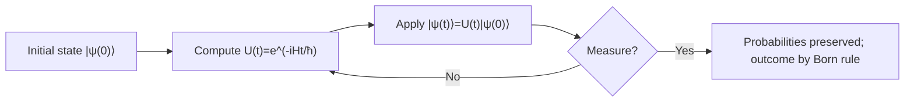
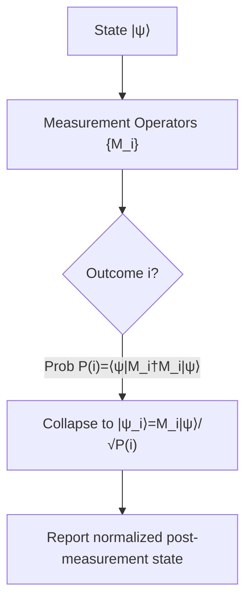

# **Chapter 2: State and Operators**

---

The goal of this chapter is to establish concepts in quantum states and operators, which are fundamental to quantum computation. We will explore the mathematical representations of quantum states, including state vectors and density matrices, and how operators act on these states to perform quantum operations.

---


## **2.1 State Vectors, Dirac Notation, and Density Matrices** {.heading-with-pill}

> **Difficulty:** ★★★☆☆
> 
> **Concept:** Quantum States via Bras, Kets, and Ensembles
> 
> **Summary:** Quantum states are represented by kets |ψ⟩ and bras ⟨ψ|, with inner/outer products defining amplitudes and projectors. Density matrices ρ unify pure and mixed states, enabling expectation values and open-system descriptions.

---

### **Theoretical Background**

A single-qubit state is a unit vector in a complex Hilbert space. Using Dirac notation, a state vector (ket) |ψ⟩ has a conjugate transpose (bra) ⟨ψ|. The canonical computational basis is {|0⟩, |1⟩}.

Inner product (overlap) produces a complex scalar and encodes measurement amplitudes:

$$
\langle \phi | \psi \rangle \in \mathbb{C}
$$

Outer product creates a rank-1 operator (projector):

$$
|\psi\rangle\langle\phi| \quad \in \; \mathbb{C}^{2\times 2}
$$

A pure state density operator is a projector onto the state:

$$
\rho_{\text{pure}} = |\psi\rangle\langle\psi|
$$

More generally, a mixed state (classical ensemble of pure states) with probabilities p_i is described by:

$$
\rho = \sum_i p_i\, |\psi_i\rangle\langle\psi_i|, \qquad p_i \ge 0, \; \sum_i p_i = 1
$$

Key properties of any valid density matrix ρ:

- Hermitian: $\rho = \rho^\dagger$
- Positive semidefinite: $\langle v|\rho|v\rangle \ge 0$ for all |v⟩
- Unit trace: $\mathrm{Tr}(\rho) = 1$

Purity diagnoses pure vs. mixed:

$$
\mathrm{Tr}(\rho^2) = \begin{cases}
1, & \text{pure state} \\
< 1, & \text{mixed state}
\end{cases}
$$

Expectation values of observable $A$ are computed as:

$$
\langle A \rangle = \mathrm{Tr}(\rho A)
$$

-----

### **Comprehension Check**

!!! note "Quiz"
    **1. Which expression equals the overlap between two states?**

    - A. $|\psi\rangle\langle\phi|$  
    - B. $|\psi\rangle|\phi\rangle$  
    - C. $\langle\phi|\psi\rangle$  
    - D. $\rho^2$

    ??? info "See Answer"
        **Correct: C**

-----

!!! note "Quiz"
    **2. Which property must any density matrix satisfy?**

    - A. $\rho = iI$  
    - B. $\rho^2 = \rho$  
    - C. $\mathrm{Tr}(\rho) = 1$  
    - D. $\det(\rho)=1$

    ??? info "See Answer"
        **Correct: C**

-----

!!! note "Quiz"
    **3. For a pure state $\rho = |\psi\rangle\langle\psi|$, what is $\mathrm{Tr}(\rho^2)$?**

    - A. 0  
    - B. $<1$  
    - C. 1  
    - D. Undefined

    ??? info "See Answer"
        **Correct: C**

-----

!!! abstract "Interview-Style Question"

    **Q:** Why are density matrices necessary to describe mixed states, and how do you distinguish pure from mixed using matrix identities?

    ???+ info "Answer Strategy"
        **Pure vs. Mixed States:**  
        A **pure state** has maximal knowledge and is described by a single ket $|\psi\rangle$. A **mixed state** represents classical uncertainty over an ensemble of quantum states $|\psi_i\rangle$ with probabilities $p_i$, requiring the density matrix:
        
        $$
        \rho = \sum_i p_i |\psi_i\rangle\langle\psi_i|
        $$

        **Mathematical Properties:**  
        All valid density matrices satisfy: (1) Hermiticity $\rho = \rho^\dagger$, (2) Positive semidefiniteness $\langle\phi|\rho|\phi\rangle \geq 0$, (3) Unit trace $\mathrm{Tr}(\rho) = 1$.

        **Distinguishing Pure from Mixed:**  
        Use the purity test:
        
        $$
        \mathrm{Tr}(\rho^2) = \begin{cases} 1 & \text{pure state} \\ < 1 & \text{mixed state} \end{cases}
        $$
        
        For pure states, $\rho^2 = \rho$ (idempotent). Mixed states arise from decoherence when environmental interactions entangle the system with unobserved degrees of freedom.

---

### **<i class="fa-solid fa-flask"></i> Hands-On Projects**

#### **Project Blueprint**

| **Section**              | **Description** |
| ------------------------ | --------------- |
| **Objective**            | Construct density matrices for given states and verify purity and trace properties. |
| **Mathematical Concept** | $\rho_{\text{pure}}=\|\psi\rangle\langle\psi\|$, $\rho=\sum_i p_i \|\psi_i\rangle\langle\psi_i\|$, $\mathrm{Tr}(\rho)=1$, $\mathrm{Tr}(\rho^2)\le 1$. |
| **Experiment Setup**     | Choose $\|\psi\rangle = \tfrac{1}{\sqrt{2}}(\|0\rangle - i\|1\rangle)$ and a mixed ensemble: $p_1=0.5, \|0\rangle$; $p_2=0.5, \|1\rangle$. |
| **Process Steps**        | Form $\rho_{\text{pure}}$; compute $\mathrm{Tr}(\rho_{\text{pure}})$ and $\mathrm{Tr}(\rho_{\text{pure}}^2)$. Form $\rho_{\text{mixed}}$ and compute same metrics. |
| **Expected Behavior**    | Pure: $\mathrm{Tr}(\rho)=1$, $\mathrm{Tr}(\rho^2)=1$. Mixed: $\mathrm{Tr}(\rho)=1$, $\mathrm{Tr}(\rho^2)<1$. |
| **Tracking Variables**   | $\rho_{\text{pure}}$, $\rho_{\text{mixed}}$, $\mathrm{Tr}(\rho)$, $\mathrm{Tr}(\rho^2)$. |
| **Verification Goal**    | Confirm purity and trace criteria across both cases. |
| **Output**               | Report matrices and numeric values for trace and purity. |

-----

#### **Pseudocode Implementation**

```pseudo-code
FUNCTION Analyze_State_Properties(pure_state_vector, mixed_state_ensemble):
    # Part 1: Analyze the pure state
    rho_pure = Outer_Product(pure_state_vector, Conjugate_Transpose(pure_state_vector))
    trace_pure = Calculate_Trace(rho_pure)
    purity_pure = Calculate_Trace(Matrix_Multiply(rho_pure, rho_pure))

    PRINT "Pure State Density Matrix:", rho_pure
    PRINT "Trace of Pure State:", trace_pure
    PRINT "Purity of Pure State (Tr(rho^2)):", purity_pure

    # Part 2: Analyze the mixed state
    rho_mixed = Zero_Matrix(size_of(pure_state_vector))
    for (probability, state_vector) in mixed_state_ensemble:
        projector = Outer_Product(state_vector, Conjugate_Transpose(state_vector))
        rho_mixed = rho_mixed + probability * projector
    
    trace_mixed = Calculate_Trace(rho_mixed)
    purity_mixed = Calculate_Trace(Matrix_Multiply(rho_mixed, rho_mixed))

    PRINT "Mixed State Density Matrix:", rho_mixed
    PRINT "Trace of Mixed State:", trace_mixed
    PRINT "Purity of Mixed State (Tr(rho^2)):", purity_mixed

    # Verification
    ASSERT trace_pure == 1
    ASSERT purity_pure == 1
    ASSERT trace_mixed == 1
    ASSERT purity_mixed < 1

    RETURN (rho_pure, purity_pure), (rho_mixed, purity_mixed)
```

-----

#### **Outcome and Interpretation**

- Pure states yield unity trace and purity: $\mathrm{Tr}(\rho)=\mathrm{Tr}(\rho^2)=1$.  
- Mixed ensembles preserve unit trace but reduce purity below 1, quantifying statistical uncertainty.  
- Expectation values for any observable follow $\langle A\rangle=\mathrm{Tr}(\rho A)$, independent of pure/mixed representation.

---

## **2.2 Unitary Operators and Time Evolution** {.heading-with-pill}
> **Concept:** Norm-Preserving Reversible Dynamics • **Difficulty:** ★★☆☆☆
> 
> **Summary:** Closed-system evolution is unitary: $U^\dagger U=I$. Time evolution under Hamiltonian $H$ is $U(t)=e^{-iHt/\hbar}$, conserving probability and enabling reversible quantum gates.

---

### **Theoretical Background**

Unitary operators preserve inner products and thus total probability. A matrix $U$ is unitary if:

$$
U^{\dagger}U = UU^{\dagger} = I
$$

Time evolution of a closed quantum system governed by Hamiltonian $H$ is:

$$
U(t) = e^{-iHt/\hbar}, \qquad |\psi(t)\rangle = U(t)|\psi(0)\rangle
$$

Because $U(t)$ is unitary for Hermitian $H$, norms and inner products are invariant in time. Typical one-qubit gates (X, Y, Z, H) and controlled operations are unitary and reversible.



-----

### **Comprehension Check**

!!! note "Quiz"
    **1. Which identity defines unitarity?**

    - A. $U=U^\dagger$  
    - B. $U^2=I$  
    - C. $U^\dagger U = I$  
    - D. $\mathrm{Tr}(U)=1$

    ??? info "See Answer"
        **Correct: C**

-----

!!! note "Quiz"
    **2. Why is unitary evolution essential for quantum computing?**

    - A. It creates mixed states  
    - B. It ensures reversibility and probability conservation  
    - C. It implements measurement collapse  
    - D. It breaks linearity

    ??? info "See Answer"
        **Correct: B**

-----

!!! abstract "Interview-Style Question"

    **Q:** Provide one unitary example from the Pauli set and justify why it preserves norm.

    ???+ info "Answer Strategy"
        **The Pauli-X Gate:**  
        The Pauli-X gate (quantum NOT) has matrix:
        
        $$
        X = \begin{pmatrix} 0 & 1 \\ 1 & 0 \end{pmatrix}
        $$
        
        It swaps basis states: $X|0\rangle = |1\rangle$ and $X|1\rangle = |0\rangle$ (a $\pi$ rotation about the Bloch sphere's $x$-axis).

        **Unitarity Verification:**  
        The Pauli-X is both Hermitian ($X^\dagger = X$) and involutory ($X^2 = I$), so:
        
        $$
        X^\dagger X = X^2 = I
        $$

        **Norm Preservation:**  
        For any state $|\psi\rangle = \alpha|0\rangle + \beta|1\rangle$:
        
        $$
        \langle\psi|X^\dagger X|\psi\rangle = \langle\psi|I|\psi\rangle = 1
        $$
        
        Unitarity preserves inner products, ensuring total probability conservation—a mandatory requirement for all quantum gates.

---

### **<i class="fa-solid fa-flask"></i> Hands-On Projects**

#### **Project Blueprint**

| **Section**              | **Description** |
| ------------------------ | --------------- |
| **Objective**            | Verify that time evolution $U(t)=e^{-iHt/\hbar}$ preserves state norm for a one-qubit Hamiltonian. |
| **Mathematical Concept** | $U^\dagger U=I$, $\|\psi(t)\rangle=U(t)\|\psi(0)\rangle$, $\\\|\|\psi(t)\rangle\\\|^2=\\\|\|\psi(0)\rangle\\\|^2$. |
| **Experiment Setup**     | Choose $H=\tfrac{\omega}{2}Z$, initial $\|\psi(0)\rangle=\tfrac{1}{\sqrt{2}}(\|0\rangle+\|1\rangle)$. Set $t=\pi/\omega$. |
| **Process Steps**        | Compute $U(t)$; apply to $\|\psi(0)\rangle$; evaluate norms before/after. |
| **Expected Behavior**    | Norms match exactly; only a relative phase accumulates. |
| **Tracking Variables**   | $U(t)$, $\|\psi(0)\rangle$, $\|\psi(t)\rangle$, norms. |
| **Verification Goal**    | Show $\langle\psi(t)\|\psi(t)\rangle=1$ given normalized initial state. |
| **Output**               | Report states and norms; confirm unitarity. |

-----

#### **Pseudocode Implementation**

```pseudo-code
FUNCTION Verify_Unitary_Evolution(initial_state, hamiltonian, time):
    # 1. Compute the unitary evolution operator
    # U(t) = exp(-i * H * t / h_bar), assuming h_bar = 1
    unitary_operator = Matrix_Exponentiate(-1j * hamiltonian * time)

    # 2. Compute the final state
    # |psi(t)> = U(t) |psi(0)>
    final_state = Matrix_Vector_Multiply(unitary_operator, initial_state)

    # 3. Calculate norms
    initial_norm_sq = Calculate_Norm_Squared(initial_state)
    final_norm_sq = Calculate_Norm_Squared(final_state)

    PRINT "Initial State:", initial_state
    PRINT "Final State:", final_state
    PRINT "Initial Norm Squared:", initial_norm_sq
    PRINT "Final Norm Squared:", final_norm_sq

    # 4. Verification
    ASSERT abs(initial_norm_sq - 1.0) < 1e-9
    ASSERT abs(final_norm_sq - 1.0) < 1e-9
    
    RETURN final_state, final_norm_sq
```

-----

#### **Outcome and Interpretation**

- Time evolution under Hermitian $H$ preserves norms and inner products.  
- Global phases do not affect measurement; relative phases can.  
- Unitary gates are reversible, enabling error backtracking and algorithmic uncomputation.

---

## **2.3 Measurement and State Collapse** {.heading-with-pill}
> **Concept:** Born Rule and Post-Measurement Normalization • **Difficulty:** ★★☆☆☆
> 
> **Summary:** Measurements yield probabilistic outcomes with $P(i)=\langle\psi|M_i^\dagger M_i|\psi\rangle$. Post-measurement states normalize to $M_i|\psi\rangle/\sqrt{P(i)}$.

---

### **Theoretical Background**

A projective measurement with projectors $\{\Pi_i\}$ satisfies $\Pi_i^2=\Pi_i$, $\Pi_i^\dagger=\Pi_i$, and $\sum_i \Pi_i=I$. For generalized measurements, $M_i$ are measurement operators with $\sum_i M_i^\dagger M_i=I$.

Outcome probabilities and post-measurement states are:

$$
P(i)=\langle\psi|M_i^\dagger M_i|\psi\rangle, \qquad |\psi_i\rangle=\frac{M_i|\psi\rangle}{\sqrt{P(i)}}
$$

For a qubit measured in the computational basis, $M_0=|0\rangle\langle 0|$, $M_1=|1\rangle\langle 1|$, yielding $P(0)=|\alpha|^2$, $P(1)=|\beta|^2$ for $|\psi\rangle=\alpha|0\rangle+\beta|1\rangle$.



-----

### **Comprehension Check**

!!! note "Quiz"
    **1. For $|\psi\rangle=\tfrac{1}{\sqrt{5}}|0\rangle+\tfrac{2i}{\sqrt{5}}|1\rangle$, what is $P(1)$?**

    - A. $1/5$  
    - B. $1/\sqrt{5}$  
    - C. $4/5$  
    - D. $2i/\sqrt{5}$

    ??? info "See Answer"
        **Correct: C**

-----

!!! note "Quiz"
    **2. What does $\sum_i M_i^\dagger M_i=I$ ensure?**

    - A. Orthogonality of $M_i$  
    - B. Completeness of measurement and probability conservation  
    - C. Hermiticity of $M_i$  
    - D. Deterministic outcomes

    ??? info "See Answer"
        **Correct: B**

-----

!!! abstract "Interview-Style Question"

    **Q:** Explain the role of the denominator $\sqrt{P(i)}$ in the post-measurement state.

    ???+ info "Answer Strategy"
        **Measurement-Induced Collapse:**  
        When measurement operator $M_i$ acts on $|\psi\rangle$, the post-measurement state is:
        
        $$
        |\psi_i\rangle = \frac{M_i|\psi\rangle}{\sqrt{P(i)}}
        $$
        
        where $P(i) = \langle\psi|M_i^\dagger M_i|\psi\rangle$. The denominator provides **renormalization**.

        **Why Renormalization is Necessary:**  
        $M_i$ is not unitary—it extracts a state component, changing the norm. For example, with $M_0 = |0\rangle\langle 0|$ acting on $|\psi\rangle = \alpha|0\rangle + \beta|1\rangle$:
        
        $$
        M_0|\psi\rangle = \alpha|0\rangle
        $$
        
        This has norm $|\alpha|^2 \neq 1$. Dividing by $\sqrt{P(i)}$ restores unit normalization:
        
        $$
        \langle\psi_i|\psi_i\rangle = \frac{P(i)}{P(i)} = 1
        $$
        
        This is analogous to Bayesian updating: $P(A|B) = P(A \cap B)/P(B)$ renormalizes conditional probabilities.

---

### **<i class="fa-solid fa-flask"></i> Hands-On Projects**

#### **Project Blueprint**

| **Section**              | **Description** |
| ------------------------ | --------------- |
| **Objective**            | Compute measurement probabilities and post-measurement states for a qubit in superposition. |
| **Mathematical Concept** | $P(i)=\langle\psi\|M_i^\dagger M_i\|\psi\rangle$, $\\\| \psi_i \rangle =M_i\|\psi\rangle/\sqrt{P(i)}$. |
| **Experiment Setup**     | $\|\psi\rangle=\tfrac{1}{\sqrt{5}}\|0\rangle+\tfrac{2i}{\sqrt{5}}\|1\rangle$, $M_0=\|0\rangle\langle 0\|$, $M_1=\|1\rangle\langle 1\|$. |
| **Process Steps**        | Evaluate $P(0),P(1)$; compute $\|\psi_0\rangle$, $\|\psi_1\rangle$. |
| **Expected Behavior**    | $P(0)+P(1)=1$; post-measurement states equal basis vectors. |
| **Tracking Variables**   | $P(0)$, $P(1)$, $\|\psi_i\rangle$. |
| **Verification Goal**    | Verify normalization and completeness. |
| **Output**               | Report probabilities and collapsed states. |

-----

#### **Pseudocode Implementation**

```pseudo-code
FUNCTION Simulate_Measurement(initial_state, measurement_operators):
    # 1. Calculate probabilities for each outcome
    probabilities = []
    for M_i in measurement_operators:
        M_dagger_M = Matrix_Multiply(Conjugate_Transpose(M_i), M_i)
        prob_i = Real_Part(Expectation_Value(M_dagger_M, initial_state))
        probabilities.append(prob_i)

    # 2. Verify completeness
    total_probability = sum(probabilities)
    ASSERT abs(total_probability - 1.0) < 1e-9
    PRINT "Probabilities:", probabilities

    # 3. Determine post-measurement states
    post_measurement_states = []
    for i, M_i in enumerate(measurement_operators):
        prob_i = probabilities[i]
        if prob_i > 1e-9:
            # |psi_i> = M_i |psi> / sqrt(P(i))
            unnormalized_state = Matrix_Vector_Multiply(M_i, initial_state)
            norm_factor = 1.0 / sqrt(prob_i)
            normalized_state = norm_factor * unnormalized_state
            post_measurement_states.append(normalized_state)
        else:
            post_measurement_states.append(None) # Outcome is impossible

    PRINT "Post-measurement states:", post_measurement_states
    RETURN probabilities, post_measurement_states
```

-----

#### **Outcome and Interpretation**

- The Born rule yields $P(0)=1/5$, $P(1)=4/5$.  
- Post-measurement states $|\psi_0\rangle=|0\rangle$, $|\psi_1\rangle=|1\rangle$ confirm projective collapse.  
- Completeness ensures total probability $=1$.

---

## **2.4 The No-Cloning Theorem** {.heading-with-pill}
> **Concept:** Impossibility of Universal Copying • **Difficulty:** ★★★☆☆
> 
> **Summary:** Linearity and unitarity forbid a universal cloning operation $U|\psi\rangle|0\rangle=|\psi\rangle|\psi\rangle$ for all $|\psi\rangle$. Inner products cannot be preserved under such a map.

---

### **Theoretical Background**

Assume a universal cloner $U$ exists with $U|\psi\rangle|0\rangle=|\psi\rangle|\psi\rangle$ and $U|\phi\rangle|0\rangle=|\phi\rangle|\phi\rangle$ for arbitrary pure states |ψ⟩, |φ⟩. Taking inner products and using unitarity gives:

$$
\langle\psi|\phi\rangle = \langle\psi|\phi\rangle^2
$$

This holds only when $\langle\psi|\phi\rangle\in\{0,1\}$ (orthogonal or identical states). Therefore, no unitary can clone arbitrary unknown states.

Consequences: quantum information cannot be duplicated like classical data; quantum error correction must use entanglement and syndrome extraction rather than copying.

-----

### **Comprehension Check**

!!! note "Quiz"
    **1. Which principle underlies the no-cloning theorem?**

    - A. Measurement collapse  
    - B. Linearity/unitarity of quantum evolution  
    - C. Trace preservation  
    - D. Entanglement

    ??? info "See Answer"
        **Correct: B**

-----

!!! note "Quiz"
    **2. The equation $\langle\psi|\phi\rangle = \langle\psi|\phi\rangle^2$ implies what for distinct non-orthogonal states?**

    - A. They can be cloned  
    - B. They are orthogonal  
    - C. A contradiction, hence cloning is impossible  
    - D. They are identical

    ??? info "See Answer"
        **Correct: C**

-----

!!! abstract "Interview-Style Question"

    **Q:** State two practical implications of no-cloning for quantum computing.

    ???+ info "Answer Strategy"
        **The No-Cloning Theorem:**  
        No unitary $U$ exists such that $U|\psi\rangle|0\rangle = |\psi\rangle|\psi\rangle$ for all $|\psi\rangle$. This follows from linearity and unitarity: cloning would require $\langle\psi|\phi\rangle \to (\langle\psi|\phi\rangle)^2$, violating unitarity for non-orthogonal states.

        **Implication 1: No Quantum Backup via Copying:**  
        Quantum information cannot be duplicated like classical bits. Unknown qubit states cannot be copied before measurement or destructive operations. This enables **quantum key distribution (QKD)** security—eavesdroppers cannot copy states without disturbance—but prevents lossless amplification, requiring **quantum repeaters** with entanglement swapping.

        **Implication 2: Quantum Error Correction Requires Entangled Encoding:**  
        QEC cannot use classical majority voting. Instead, logical qubits are encoded into **entangled subspaces** of physical qubits (e.g., 9-qubit Shor code). Error **syndrome measurements** reveal which error occurred without collapsing the encoded state, using stabilizer operators. No-cloning forces QEC to use correlations (entanglement) rather than copies, making it fundamentally different and more resource-intensive than classical error correction.

---

### **<i class="fa-solid fa-flask"></i> Hands-On Projects**

#### **Project Blueprint**

| **Section**              | **Description** |
| ------------------------ | --------------- |
| **Objective**            | Demonstrate the no-cloning contradiction for a specific non-orthogonal pair. |
| **Mathematical Concept** | If universal cloner existed: $U\|\psi\rangle\|0\rangle\to\|\psi\rangle\|\psi\rangle$, then inner products would square. |
| **Experiment Setup**     | Choose $\|\psi\rangle=\|0\rangle$, $\|\phi\rangle=\|+\rangle=\tfrac{1}{\sqrt{2}}(\|0\rangle+\|1\rangle)$ with $\langle\psi\|\phi\rangle=1/\sqrt{2}$. |
| **Process Steps**        | Compute $\langle\psi\|\phi\rangle$ and its square; show inequality $\langle\psi\|\phi\rangle\ne \langle\psi\|\phi\rangle^2$. |
| **Expected Behavior**    | $1/\sqrt{2} \ne 1/2$. |
| **Tracking Variables**   | Overlaps before/after hypothetical cloning. |
| **Verification Goal**    | Conclude contradiction; cloning impossible. |
| **Output**               | Report values and conclusion. |

-----

#### **Pseudocode Implementation**

```pseudo-code
FUNCTION Demonstrate_No_Cloning_Contradiction(state_psi, state_phi):
    # Assume a universal cloning operator U exists
    # U(|psi>|0>) = |psi>|psi>
    # U(|phi>|0>) = |phi>|phi>

    # 1. Calculate the inner product of the initial combined states
    # <psi|phi> * <0|0> = <psi|phi>
    initial_inner_product = Inner_Product(state_psi, state_phi)
    PRINT "Initial Inner Product <psi|phi>:", initial_inner_product

    # 2. Calculate the inner product of the hypothetically cloned states
    # (<psi|<psi|) * (|phi>|phi>) = <psi|phi> * <psi|phi> = (<psi|phi>)^2
    final_inner_product = initial_inner_product * initial_inner_product
    PRINT "Hypothetical Final Inner Product (<psi|phi>)^2:", final_inner_product

    # 3. Check for contradiction
    # Unitarity requires the inner product to be preserved.
    is_preserved = (abs(initial_inner_product - final_inner_product) < 1e-9)
    
    IF is_preserved:
        PRINT "Inner product is preserved. States might be orthogonal or identical."
    ELSE:
        PRINT "Contradiction: Inner product is NOT preserved."
        PRINT "Therefore, a universal cloning operator cannot exist."

    ASSERT is_preserved == False
    RETURN is_preserved
```

-----

#### **Outcome and Interpretation**

- For non-orthogonal states, inner products lie strictly between 0 and 1; squaring changes the value, violating unitarity if cloning were possible.  
- No-cloning secures quantum communication (eavesdropping detection) and shapes error correction strategies.
