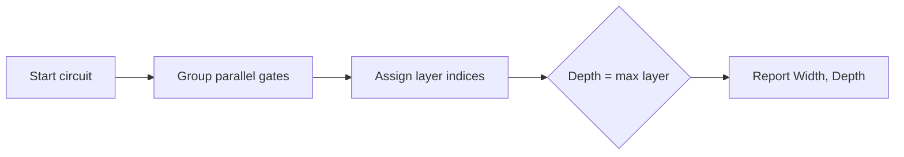
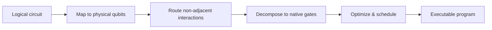

# **Chapter 3: Quantum Gates and Circuits**

---

The goal of this chapter is to establish concepts in quantum gates and circuits, which are the building blocks for quantum computation. We will explore various types of quantum gates, their mathematical representations, and how they can be combined to form quantum circuits that perform specific computational tasks.

---


## **3.1 Single-Qubit Gates (X, Y, Z, H, S, T)** {.heading-with-pill}

> **Difficulty:** ★★☆☆☆
> 
> **Concept:** Unitary rotations on the Bloch sphere; Pauli, Hadamard, and phase gates
> 
> **Summary:** Single-qubit gates are $2\times2$ unitary operators that rotate the quantum state on the Bloch sphere. $H$ builds superposition; $S$ and $T$ shift relative phase and enable universality when combined with entangling gates.


### **Theoretical Background**
We work in the computational basis $\{|0\rangle, |1\rangle\}$. The Pauli operators and the Hadamard, phase, and $\pi/8$ gates are

$$
\mathbf{X}=\begin{pmatrix}0&1\\ 1&0\end{pmatrix},\quad
\mathbf{Y}=\begin{pmatrix}0&-i\\ i&0\end{pmatrix},\quad
\mathbf{Z}=\begin{pmatrix}1&0\\ 0&-1\end{pmatrix},\quad
\mathbf{H}=\tfrac{1}{\sqrt{2}}\begin{pmatrix}1&1\\ 1&-1\end{pmatrix}
$$

$$
\mathbf{S}=\begin{pmatrix}1&0\\ 0&i\end{pmatrix},\quad
\mathbf{T}=\begin{pmatrix}1&0\\ 0&e^{i\pi/4}\end{pmatrix}
$$

Actions on basis states include $\mathbf{X}|0\rangle=|1\rangle$, $\mathbf{X}|1\rangle=|0\rangle$, and $\mathbf{Z}|1\rangle=-|1\rangle$. Geometrically, $\mathbf{X},\mathbf{Y},\mathbf{Z}$ realize $\pi$-rotations about $x,y,z$ axes. Global phase is physically irrelevant; only relative phase affects interference.

### **Comprehension Check**

!!! note "Quiz"
    **1. Which gate performs a bit-flip and a phase-flip?**

    - A. $\mathbf{X}$  
    - B. $\mathbf{Z}$  
    - C. $\mathbf{Y}$  
    - D. $\mathbf{H}$  

    ??? info "See Answer"
        **Correct: C.** $\mathbf{Y}$ combines the actions of $\mathbf{X}$ and $\mathbf{Z}$ up to a phase.


!!! note "Quiz"
    **2. $\mathbf{H}|1\rangle$ equals which state?**

    - A. $|0\rangle$  
    - B. $\tfrac{1}{\sqrt{2}}(|0\rangle+|1\rangle)$  
    - C. $\tfrac{1}{\sqrt{2}}(|0\rangle-|1\rangle)$  
    - D. $\tfrac{1}{\sqrt{2}}(|0\rangle+i|1\rangle)$  

    ??? info "See Answer"
        **Correct: C.** $\mathbf{H}|1\rangle=\tfrac{1}{\sqrt{2}}(|0\rangle-|1\rangle)$.

-----

!!! abstract "Interview-Style Question"

    **Q:** Contrast the physical actions of $\mathbf{X}$ and $\mathbf{Z}$ on basis and superposition states. Why is $\mathbf{Z}$ called a phase-flip?

    ???+ info "Answer Strategy"
        **Action on Computational Basis:**  
        Pauli-X performs a bit-flip: $\mathbf{X}|0\rangle = |1\rangle$ and $\mathbf{X}|1\rangle = |0\rangle$, swapping basis states via $\pi$ rotation about the Bloch $x$-axis. Pauli-Z leaves $|0\rangle$ unchanged but multiplies $|1\rangle$ by $-1$: $\mathbf{Z}|0\rangle = |0\rangle$ and $\mathbf{Z}|1\rangle = -|1\rangle$, a $z$-axis rotation that changes only relative phase, not populations.
        
        **Action on Superposition:**  
        For $|\psi\rangle = \alpha|0\rangle + \beta|1\rangle$, Pauli-X swaps amplitudes: $\mathbf{X}|\psi\rangle = \beta|0\rangle + \alpha|1\rangle$. Pauli-Z introduces sign change: $\mathbf{Z}|\psi\rangle = \alpha|0\rangle - \beta|1\rangle$, preserving $|\alpha|^2$ and $|\beta|^2$ but altering interference.
        
        $$
        \mathbf{Z}|+\rangle = \frac{1}{\sqrt{2}}(|0\rangle - |1\rangle) = |-\rangle
        $$

        **Why Phase-Flip:**  
        Z modifies interference without changing computational basis probabilities. Observable in different bases—e.g., $X$-basis measurement shows flipped outcomes. Essential for Grover's oracle (phase marking) and error correction (phase errors complement bit-flips).

-----

### **<i class="fa-solid fa-flask"></i> Hands-On Projects**

#### **Project Blueprint**
| **Section**              | **Description** |
| ------------------------ | --------------- |
| **Objective**            | Apply $\mathbf{H}$, then $\mathbf{S}$, then $\mathbf{H}$ to $\|0\rangle$ and report the final state. |
| **Mathematical Concept** | Matrix action on kets; phase vs amplitude; $\mathbf{H},\mathbf{S}$. |
| **Experiment Setup**     | Initialize $\|\psi_0\rangle=\|0\rangle$. |
| **Process Steps**        | Compute $\|\psi_1\rangle=\mathbf{H}\|\psi_0\rangle$, $\|\psi_2\rangle=\mathbf{S}\|\psi_1\rangle$, $\|\psi_3\rangle=\mathbf{H}\|\psi_2\rangle$. |
| **Expected Behavior**    | Relative phase introduced by $\mathbf{S}$ alters interference after the second $\mathbf{H}$. |
| **Tracking Variables**   | State amplitudes $(\alpha,\beta)$ in $\|\psi\rangle=\alpha\|0\rangle+\beta\|1\rangle$. |
| **Verification Goal**    | Check normalization $\\|\alpha\\|^2+\\|\beta\\|^2=1$ and compare to analytic calculation. |
| **Output**               | Final state vector and measurement probabilities. |

#### **Pseudocode Implementation**
```pseudo-code
FUNCTION Simulate_HSH_Sequence(initial_state):
    # Assert input is a valid single-qubit state vector
    ASSERT Is_Valid_Qubit(initial_state)

    # Define single-qubit gates as matrices
    H_gate = [[1, 1], [1, -1]] / sqrt(2)
    S_gate = [[1, 0], [0, 1j]]

    # Step 1: Apply first Hadamard gate
    state_after_H1 = Matrix_Vector_Multiply(H_gate, initial_state)
    LOG "State after H: ", state_after_H1

    # Step 2: Apply the Phase gate S
    state_after_S = Matrix_Vector_Multiply(S_gate, state_after_H1)
    LOG "State after S: ", state_after_S

    # Step 3: Apply second Hadamard gate
    final_state = Matrix_Vector_Multiply(H_gate, state_after_S)
    LOG "Final state after H: ", final_state

    # Verify normalization
    ASSERT Is_Normalized(final_state)

    # Return the final state vector and measurement probabilities
    probabilities = Compute_Probabilities(final_state)
    RETURN final_state, probabilities
END FUNCTION
```

#### **Outcome and Interpretation**
The phase gate $\mathbf{S}$ shifts the phase of the $|1\rangle$ component; the second $\mathbf{H}$ converts this phase difference into amplitude differences, illustrating interference.

---

## **3.2 Multi-Qubit Gates (CNOT, CZ, SWAP, Toffoli)** {.heading-with-pill}

> **Difficulty:** ★★☆☆☆
> 
> **Concept:** Controlled operations and entanglement generation
> 
> **Summary:** Two- and three-qubit gates enable conditional logic and entanglement. CNOT flips the target conditioned on the control; CZ flips phase on $|11\rangle$; SWAP exchanges states; Toffoli (CCNOT) is universal for classical reversible computation.

### **Theoretical Background**
Controlled gates act on tensor-product spaces. With control on the first qubit and target on the second, the CNOT matrix in the ordered basis $\{|00\rangle,|01\rangle,|10\rangle,|11\rangle\}$ is

$$
\mathrm{CNOT}=\begin{pmatrix}
1&0&0&0\\
0&1&0&0\\
0&0&0&1\\
0&0&1&0
\end{pmatrix},\quad
\mathrm{CZ}=\operatorname{diag}(1,1,1,-1)
$$

Applying $(\mathbf{H}\otimes\mathbf{I})$ then CNOT to $|00\rangle$ creates the Bell state $|\Phi^+\rangle=\tfrac{1}{\sqrt{2}}(|00\rangle+|11\rangle)$, demonstrating entanglement.

### **Comprehension Check**

!!! note "Quiz"
    **1. What does CNOT do to $|10\rangle$ (control-target ordering)?**

    - A. $|10\rangle$  
    - B. $|11\rangle$  
    - C. $|00\rangle$  
    - D. $|01\rangle$  

    ??? info "See Answer"
        **Correct: B.** The control is $|1\rangle$, so the target flips: $|10\rangle\mapsto|11\rangle$.

!!! note "Quiz"
    **2. Which three-qubit gate is universal for classical reversible logic?**

    - A. SWAP  
    - B. CNOT  
    - C. Toffoli  
    - D. CZ  

    ??? info "See Answer"
        **Correct: C.** The Toffoli (CCNOT) gate is universal for classical reversible computation.

-----

!!! abstract "Interview-Style Question"

    **Q:** Why is entanglement not producible by single-qubit gates alone, and how does CNOT generate it?

    ???+ info "Answer Strategy"
        **Tensor Product Limitation:**  
        Single-qubit gates act as $U_1 \otimes U_2$, preserving separability: $(U_1 \otimes U_2)(|\psi_1\rangle \otimes |\psi_2\rangle) = (U_1|\psi_1\rangle) \otimes (U_2|\psi_2\rangle)$. Product states remain factorized—no correlations between subsystems can emerge.
        
        $$
        \text{CNOT} = \begin{pmatrix} 1 & 0 & 0 & 0 \\ 0 & 1 & 0 & 0 \\ 0 & 0 & 0 & 1 \\ 0 & 0 & 1 & 0 \end{pmatrix}
        $$

        **CNOT Creates Entanglement:**  
        CNOT's matrix cannot factor as $U_1 \otimes U_2$—it's genuinely two-qubit. Starting from $(\mathbf{H} \otimes \mathbf{I})|00\rangle = \frac{1}{\sqrt{2}}(|00\rangle + |10\rangle)$ (separable), CNOT yields $|\Phi^+\rangle = \frac{1}{\sqrt{2}}(|00\rangle + |11\rangle)$, which cannot be written as $|\psi_1\rangle \otimes |\psi_2\rangle$.
        
        **Physical Significance:**  
        CNOT creates conditional dynamics where target evolution depends on control state, establishing non-local correlations. Enables teleportation, superdense coding, and error correction—impossible with separable states.

-----

### **<i class="fa-solid fa-flask"></i> Hands-On Projects**

#### **Project Blueprint**
| **Section**              | **Description** |
| ------------------------ | --------------- |
| **Objective**            | Prepare $\|\Phi^+\rangle$ from $\|00\rangle$ using $(\mathbf{H}\otimes\mathbf{I})$ followed by CNOT. |
| **Mathematical Concept** | Tensor products; controlled operations; entanglement. |
| **Experiment Setup**     | Initialize $\|\psi_0\rangle=\|00\rangle$. |
| **Process Steps**        | Apply $\mathbf{H}$ on qubit 0, then CNOT with control 0, target 1. |
| **Expected Behavior**    | Output approaches $\|\Phi^+\rangle$; marginals are maximally mixed. |
| **Tracking Variables**   | Amplitudes of $\|00\rangle,\|01\rangle,\|10\rangle,\|11\rangle$; concurrence or entanglement entropy. |
| **Verification Goal**    | Check state equals $\tfrac{1}{\sqrt{2}}(\|00\rangle+\|11\rangle)$ up to global phase. |
| **Output**               | Statevector and two-qubit measurement histograms. |

#### **Pseudocode Implementation**
```pseudo-code
FUNCTION Generate_Bell_State(initial_state):
    # Assert input is a valid two-qubit state, e.g., |00>
    ASSERT Is_Valid_Two_Qubit_State(initial_state)

    # Define gate operations
    H_on_q0 = Tensor_Product(H_gate, I_gate)
    CNOT_q0_q1 = CNOT_Matrix(control=0, target=1)

    # Step 1: Apply Hadamard to the first qubit
    # This creates superposition on the control qubit
    state_after_H = Matrix_Vector_Multiply(H_on_q0, initial_state)
    LOG "State after H on q0: ", state_after_H
    # Expected: 1/sqrt(2) * (|00> + |10>)

    # Step 2: Apply CNOT gate with q0 as control and q1 as target
    # This entangles the two qubits
    final_state = Matrix_Vector_Multiply(CNOT_q0_q1, state_after_H)
    LOG "Final Bell state: ", final_state
    # Expected: 1/sqrt(2) * (|00> + |11>)

    # Verify the resulting state is the expected Bell state |Φ+>
    ASSERT Is_Equal(final_state, Bell_State_Phi_Plus)

    # Return the final state and measurement statistics
    probabilities = Compute_Probabilities(final_state)
    RETURN final_state, probabilities
END FUNCTION
```

#### **Outcome and Interpretation**
You obtain $|\Phi^+\rangle$, whose single-qubit reduced states are maximally mixed. Correlations manifest in joint measurements only.

---

## **3.3 Parameterized Rotation Gates ($R_x, R_y, R_z$)** {.heading-with-pill}

> **Difficulty:** ★★☆☆☆
> 
> **Concept:** Continuous rotations and variational parameters
> 
> **Summary:** Euler-axis rotations $R_x(\theta),R_y(\theta),R_z(\theta)$ generate arbitrary single-qubit states and serve as tunable knobs in variational circuits.


### **Theoretical Background**
Parameterized rotations are

$$
\begin{align}
R_x(\theta)&=e^{-i\theta\mathbf{X}/2}=\begin{pmatrix}\cos(\tfrac{\theta}{2})&-i\sin(\tfrac{\theta}{2})\\-i\sin(\tfrac{\theta}{2})&\cos(\tfrac{\theta}{2})\end{pmatrix}\\
R_y(\theta)&=e^{-i\theta\mathbf{Y}/2}=\begin{pmatrix}\cos(\tfrac{\theta}{2})&-\sin(\tfrac{\theta}{2})\\\sin(\tfrac{\theta}{2})&\cos(\tfrac{\theta}{2})\end{pmatrix}\\
R_z(\theta)&=e^{-i\theta\mathbf{Z}/2}=\begin{pmatrix}e^{-i\theta/2}&0\\0&e^{i\theta/2}\end{pmatrix}
\end{align}
$$

These implement rotations on the Bloch sphere about $x,y,z$. In hybrid algorithms, classical optimization adjusts angles $\theta$ to minimize a task-specific loss.

### **Comprehension Check**

!!! note "Quiz"
    **1. $R_x(\theta)$ equals which exponential?**

    - A. $e^{-i\theta\mathbf{Z}/2}$  
    - B. $e^{-i\theta\mathbf{Y}/2}$  
    - C. $e^{-i\theta\mathbf{X}/2}$  
    - D. $e^{-i\theta\mathbf{H}/2}$  

    ??? info "See Answer"
        **Correct: C.** $R_x(\theta)=e^{-i\theta\mathbf{X}/2}$.

    **2. Why are parameterized rotations crucial in VQE?**

    - A. They reduce circuit width  
    - B. They provide tunable degrees of freedom  
    - C. They eliminate decoherence  
    - D. They replace measurements  

    ??? info "See Answer"
        **Correct: B.** Parameters supply the optimization variables for the classical loop.

-----

!!! abstract "Interview-Style Question"

    **Q:** Give a physical interpretation of $R_y(\theta)$ acting on $|0\rangle$, and describe the measurement probabilities in the $Z$ basis.

    ???+ info "Answer Strategy"
        **Y-Axis Rotation:**  
        $R_y(\theta)$ rotates by angle $\theta$ about the Bloch $y$-axis, creating real-amplitude superposition:
        
        $$
        R_y(\theta)|0\rangle = \cos\left(\tfrac{\theta}{2}\right)|0\rangle + \sin\left(\tfrac{\theta}{2}\right)|1\rangle
        $$

        **Measurement Probabilities:**  
        Real amplitudes yield simple $Z$-basis probabilities: $P(0) = \cos^2(\tfrac{\theta}{2})$ and $P(1) = \sin^2(\tfrac{\theta}{2})$, automatically satisfying normalization.
        
        **Physical Interpretation:**  
        Angle $\theta$ directly controls probability: $\theta=0$ gives $|0\rangle$, $\theta=\pi/2$ gives equal superposition, $\theta=\pi$ gives $|1\rangle$. Unlike $R_z$ (phase-only changes), $R_y$ alters computational basis probabilities, making it essential for state preparation in variational algorithms.

-----

### **<i class="fa-solid fa-flask"></i> Hands-On Projects**

#### **Project Blueprint**
| **Section**              | **Description** |
| ------------------------ | --------------- |
| **Objective**            | Apply $R_x(\pi/2)$ to $\|0\rangle$ and report the resulting state and probabilities. |
| **Mathematical Concept** | Exponentials of generators; Bloch rotations. |
| **Experiment Setup**     | Initialize $\|\psi_0\rangle=\|0\rangle$; set $\theta=\pi/2$. |
| **Process Steps**        | Form $R_x(\pi/2)$; compute $\|\psi'\rangle=R_x(\pi/2)\|0\rangle$; normalize and record $P(0),P(1)$. |
| **Expected Behavior**    | Equal populations up to a phase: $P(0)=P(1)=1/2$. |
| **Tracking Variables**   | Angle $\theta$; amplitudes; probabilities. |
| **Verification Goal**    | Compare to analytic formula $\cos^2(\tfrac{\pi}{4})=\sin^2(\tfrac{\pi}{4})=1/2$. |
| **Output**               | Statevector and probability bar chart description. |

#### **Pseudocode Implementation**
```pseudo-code
FUNCTION Apply_Rx_Rotation(initial_state, theta):
    # Assert input is a valid single-qubit state
    ASSERT Is_Valid_Qubit(initial_state)

    # Define the Rx rotation matrix as a function of theta
    FUNCTION Rx_Matrix(angle):
        cos_half = cos(angle / 2)
        sin_half = sin(angle / 2)
        RETURN [[cos_half, -1j * sin_half],
                [-1j * sin_half, cos_half]]
    END FUNCTION

    # Step 1: Construct the Rx(π/2) gate
    Rx_pi_half_gate = Rx_Matrix(theta)
    LOG "Rx gate for theta=", theta, ": ", Rx_pi_half_gate

    # Step 2: Apply the gate to the initial state |0>
    final_state = Matrix_Vector_Multiply(Rx_pi_half_gate, initial_state)
    LOG "Final state after Rx: ", final_state
    # Expected: 1/sqrt(2) * (|0> - i|1>)

    # Step 3: Compute measurement probabilities in the Z-basis
    probabilities = Compute_Probabilities(final_state)
    LOG "Probabilities P(0), P(1): ", probabilities
    # Expected: P(0) = 0.5, P(1) = 0.5

    # Verify final state is normalized and probabilities sum to 1
    ASSERT Is_Normalized(final_state)
    ASSERT abs(probabilities[0] + probabilities[1] - 1.0) < 1e-9

    RETURN final_state, probabilities
END FUNCTION
```

#### **Outcome and Interpretation**
The rotation about $x$ by $\pi/2$ produces equal $Z$-basis populations; relative phase matches the $R_x$ definition and does not affect $Z$-basis probabilities.

---

## **3.4 Universal Gate Sets and Decomposition** {.heading-with-pill}
> **Concept:** Approximate universality and Euler-angle factorization • **Difficulty:** ★★★☆☆
> 
> **Summary:** Clifford+$T$ with an entangling two-qubit gate forms a universal set. Any single-qubit unitary can be decomposed as a sequence of $R_z$ and $R_y$ rotations.

### **Theoretical Background**
Universality means approximating any target unitary to arbitrary accuracy. A standard single-qubit factorization is

$$
U\in SU(2)\;\Rightarrow\; \exists\; \alpha,\beta,\gamma:\; U=e^{i\alpha}R_z(\beta)R_y(\gamma)R_z(\delta)
$$

Together with an entangling gate (e.g., CNOT), $\{R_z,R_y,\text{CNOT}\}$ is universal. The Solovay–Kitaev theorem guarantees polylogarithmic sequence lengths to approximate a given unitary from a finite universal set.

### **Comprehension Check**

!!! note "Quiz"
    **1. Which of the following is a universal gate set (with an entangler)?**

    - A. $\{\mathbf{H},\mathbf{S}\}$  
    - B. $\{\mathbf{H},\mathbf{T},\mathrm{CNOT}\}$  
    - C. $\{\mathbf{X},\mathbf{Z}\}$  
    - D. $\{\mathrm{CZ},\mathrm{SWAP}\}$  

    ??? info "See Answer"
        **Correct: B.** Clifford+$\mathbf{T}$ with an entangling gate is universal.

    **2. What does Solovay–Kitaev guarantee?**

    - A. Exact synthesis in linear time  
    - B. Polynomial-time classical compilation  
    - C. Polylogarithmic gate count in the inverse error  
    - D. No need for entangling gates  

    ??? info "See Answer"
        **Correct: C.** Approximation length scales polylogarithmically in $1/\varepsilon$.

-----

!!! abstract "Interview-Style Question"

    **Q:** Explain the difference between exact and approximate universality, and why approximate universality suffices in practice.

    ???+ info "Answer Strategy"
        **Exact vs Approximate:**  
        Exact universality synthesizes any $U$ to arbitrary $\varepsilon$ via finite sequences (Solovay-Kitaev: $\mathcal{O}(\log^{3.97}(1/\varepsilon))$ gates). Approximate universality achieves $\varepsilon$-close implementations, e.g., Clifford+T with $\mathcal{O}(\log(1/\varepsilon))$ T-gates.
        
        **Why Approximation Suffices:**  
        Hardware noise dominates: gate fidelities $\sim 99\%$ (error $\varepsilon_{\text{hw}} \sim 10^{-3}$) dwarf synthesis precision below $10^{-5}$. Measurement statistics, algorithmic tolerance (VQE, QAOA accept small errors), and practical compilation all favor approximate synthesis at $\varepsilon \sim \varepsilon_{\text{hw}}$.
        
        **Example:**  
        Implementing $R_y(\theta)$ with Clifford+T: $\varepsilon = 10^{-3}$ needs $\sim 25$ T-gates; $\varepsilon = 10^{-10}$ needs $100+$ T-gates. Hardware errors make the latter wasteful—match approximation to noise floor.

-----

### **<i class="fa-solid fa-flask"></i> Hands-On Projects**

#### **Project Blueprint**
| **Section**              | **Description** |
| ------------------------ | --------------- |
| **Objective**            | Verify a Z–Y–Z decomposition of $\mathbf{H}$ up to global phase. |
| **Mathematical Concept** | Euler decomposition $R_z(\beta)R_y(\gamma)R_z(\delta)$. |
| **Experiment Setup**     | Target unitary $\mathbf{H}$; choose angles $\beta=\pi,\gamma=\tfrac{\pi}{2},\delta=0$. |
| **Process Steps**        | Form $U'=R_z(\pi)R_y(\tfrac{\pi}{2})R_z(0)$; compare $U'$ to $\mathbf{H}$ up to a global phase. |
| **Expected Behavior**    | $U'$ equals $e^{i\phi}\mathbf{H}$ for some real $\phi$. |
| **Tracking Variables**   | Angles $(\beta,\gamma,\delta)$; matrix elements; phase $\phi$. |
| **Verification Goal**    | Max elementwise error $<10^{-12}$ after optimal global-phase alignment. |
| **Output**               | Reported angles and numeric error metric. |

#### **Pseudocode Implementation**
```pseudo-code
FUNCTION Verify_ZYZ_Decomposition(target_U, beta, gamma, delta):
    # Define parameterized rotation matrices
    FUNCTION Rz_Matrix(angle):
        RETURN [[exp(-1j * angle / 2), 0],
                [0, exp(1j * angle / 2)]]
    END FUNCTION

    FUNCTION Ry_Matrix(angle):
        cos_half = cos(angle / 2)
        sin_half = sin(angle / 2)
        RETURN [[cos_half, -sin_half],
                [sin_half, cos_half]]
    END FUNCTION

    # Step 1: Construct the decomposed unitary from Z-Y-Z rotations
    Rz_delta = Rz_Matrix(delta)
    Ry_gamma = Ry_Matrix(gamma)
    Rz_beta = Rz_Matrix(beta)
    
    # U' = Rz(beta) * Ry(gamma) * Rz(delta)
    U_prime = Matrix_Multiply(Rz_beta, Matrix_Multiply(Ry_gamma, Rz_delta))
    LOG "Constructed U': ", U_prime

    # Step 2: Align U' with target_U by removing global phase difference
    # Find phi such that U ≈ e^(i*phi) * U'
    # phi = -arg(Tr(U'.conj().T @ U))
    phase_difference = Global_Phase_Difference(U_prime, target_U)
    U_prime_aligned = Apply_Global_Phase(U_prime, -phase_difference)
    LOG "Phase-aligned U': ", U_prime_aligned

    # Step 3: Calculate the error between the aligned and target matrices
    error = Frobenius_Norm(target_U - U_prime_aligned)
    LOG "Decomposition error: ", error

    # Assert that the error is below a small tolerance
    ASSERT error < 1e-9

    RETURN error
END FUNCTION
```

#### **Outcome and Interpretation**
You confirm Euler-angle factorization for a nontrivial target, illustrating how continuous rotations plus an entangler yield universality.

---

## **3.5 Circuit Width, Depth, and Cost** {.heading-with-pill}

> **Difficulty:** ★★☆☆☆
> 
> **Concept:** Parallelism, critical path length, and error accumulation
> 
> **Summary:** Width counts qubits; depth counts sequential layers. On noisy hardware, fidelity typically decreases with greater depth, motivating parallelization and gate cancellations.

### **Theoretical Background**
Let depth $D$ be the maximum number of gate layers any qubit experiences. If each layer takes time $\tau$, a crude runtime is $T\approx D\tau$. With error-per-gate $p$, success probability can scale like $\approx (1-p)^G$ with total gate count $G$, emphasizing shallow circuits.



### **Comprehension Check**

!!! note "Quiz"
    **1. Why is minimizing depth important on NISQ devices?**

    - A. It increases Hilbert-space dimension  
    - B. It reduces decoherence exposure  
    - C. It increases qubit count  
    - D. It guarantees exact results  

    ??? info "See Answer"
        **Correct: B.** Shorter depth reduces accumulated noise before measurement.

    **2. What does circuit width measure?**

    - A. The number of time steps  
    - B. The number of qubits  
    - C. The number of measurements  
    - D. The number of entangling gates  

    ??? info "See Answer"
        **Correct: B.** Width is the number of qubits used.

-----

!!! abstract "Interview-Style Question"

    **Q:** Give two compiler strategies to reduce effective depth without changing the circuit's logical function.

    ???+ info "Answer Strategy"
        **Gate Cancellation:**  
        Involutory gates ($X^2 = I$, $H^2 = I$, $\text{CNOT}^2 = I$) cancel when adjacent. Compilers commute gates on disjoint qubits (e.g., $Z_i Z_j = Z_j Z_i$) to expose cancellations via symbolic pattern matching.
        
        $$
        X_1 \to H_2 \to X_1 \quad \Rightarrow \quad H_2 \quad \text{(cancel } X_1\text{)}
        $$

        **Parallelization via Rescheduling:**  
        Commuting gates execute in parallel. Example: CNOT$(q0,q1)$ and CNOT$(q2,q3)$ commute (disjoint qubits), reducing sequential depth 3 to parallel depth 2.
        
        **Impact:**  
        Critical for NISQ coherence budgets ($50{-}500~\mu$s). Depth reduction from 100 to 50 layers distinguishes success from decoherence-dominated failure. Modern compilers (Qiskit, t|ket>) apply dozens of passes combining these strategies.

-----

### **<i class="fa-solid fa-flask"></i> Hands-On Projects**

#### **Project Blueprint**
| **Section**              | **Description** |
| ------------------------ | --------------- |
| **Objective**            | Compute width and depth of a 4-qubit circuit with layered gates. |
| **Mathematical Concept** | Partial order and critical path; parallel layers. |
| **Experiment Setup**     | Four layers: H/X/H/I (parallel); two CNOTs in parallel; T and S sequential; two $R_y$ rotations in parallel. |
| **Process Steps**        | Assign layers respecting dependencies and qubit conflicts; count qubits for width and layers for depth. |
| **Expected Behavior**    | Width $=4$; depth equals number of layers after parallel grouping. |
| **Tracking Variables**   | Layer index per gate; depth $D$; width $W$. |
| **Verification Goal**    | Cross-check by drawing a timing diagram. |
| **Output**               | $W$ and $D$ with a short textual justification. |

#### **Pseudocode Implementation**
```pseudo-code
FUNCTION Analyze_Circuit_Resources(gate_list):
    # Assert gate_list is a valid list of gate operations
    ASSERT Is_Valid_Gate_List(gate_list)

    # Step 1: Calculate circuit width
    # Width is the total number of unique qubits involved
    qubits = Get_All_Qubits(gate_list)
    width = count(unique(qubits))
    LOG "Circuit width (number of qubits): ", width

    # Step 2: Calculate circuit depth by scheduling gates
    layers = []
    qubit_busy_until_layer = map(qubit -> 0 for qubit in qubits)

    for gate in gate_list:
        # Find the earliest layer this gate can be placed in
        # A gate can be placed in layer L if all its qubits are free at L
        gate_qubits = gate.qubits
        required_layer = 0
        for q in gate_qubits:
            required_layer = max(required_layer, qubit_busy_until_layer[q])
        
        # Place gate in the next available layer (required_layer + 1)
        placement_layer = required_layer + 1
        
        # Update the layer until which the qubits are busy
        for q in gate_qubits:
            qubit_busy_until_layer[q] = placement_layer
            
        LOG "Gate ", gate.name, " on qubits ", gate_qubits, " placed in layer ", placement_layer

    # Depth is the maximum layer index used
    depth = max(qubit_busy_until_layer.values())
    LOG "Circuit depth (number of layers): ", depth

    RETURN width, depth
END FUNCTION
```

#### **Outcome and Interpretation**
You quantify resource metrics that govern feasibility on real hardware and guide optimization passes.

---

## **3.6 Compilation: Qubit Mapping and Routing** {.heading-with-pill}

> **Difficulty:** ★★★☆☆
> 
> **Concept:** From logical circuits to hardware-native programs
> 
> **Summary:** Compilers map logical qubits to hardware qubits, insert SWAPs to satisfy connectivity, and rewrite gates into native sets, trading off depth and error.

### **Theoretical Background**
Real devices have limited connectivity represented by a coupling graph. When a two-qubit gate targets non-adjacent qubits, routing inserts SWAPs to bring them together, increasing depth. Transpilation also decomposes high-level gates into the device’s native basis and performs peephole optimizations.



### **Comprehension Check**

!!! note "Quiz"
    **1. Which step most directly increases depth during compilation?**

    - A. Basis change  
    - B. Routing with SWAP insertion  
    - C. Measurement  
    - D. Classical post-processing  

    ??? info "See Answer"
        **Correct: B.** Added SWAPs lengthen the critical path on constrained topologies.

    **2. What is a logical–physical mapping?**

    - A. Choosing the gate set  
    - B. Assigning code variables to registers  
    - C. Assigning abstract qubits to hardware qubits  
    - D. Selecting measurement bases  

    ??? info "See Answer"
        **Correct: C.** It binds algorithm qubits to specific device qubits.

-----

!!! abstract "Interview-Style Question"

    **Q:** How does hardware connectivity shape algorithm design (e.g., linear array vs 2D lattice)? Give an example impact on depth.

    ???+ info "Answer Strategy"
        **Connectivity Topologies:**  
        Limited connectivity requires SWAP insertion for non-adjacent gates. Linear chains need $\mathcal{O}(d)$ SWAPs for distance $d$; 2D lattices achieve $\mathcal{O}(\sqrt{d})$ via Manhattan routing.
        
        **Depth Example:**  
        CNOT at $d=10$: linear chain adds $\sim 30$ CNOTs (depth +30); 2D lattice adds $\sim 18$ CNOTs (depth +18)—quadratic improvement favors 2D for long-range interactions.
        
        **Algorithmic Adaptation:**  
        QAOA/VQE use hardware-aware ansatze restricting gates to connected qubits, avoiding SWAP overhead. Native 2D Hamiltonian simulation maps naturally to 2D hardware; linear chains explode depth. On NISQ devices ($T_2 \sim 100~\mu$s), 30 SWAPs (+45 $\mu$s) can exceed coherence, causing failure.

-----

### **<i class="fa-solid fa-flask"></i> Hands-On Projects**

#### **Project Blueprint**
| **Section**              | **Description** |
| ------------------------ | --------------- |
| **Objective**            | Route a CNOT between non-adjacent qubits on a linear chain using SWAPs. |
| **Mathematical Concept** | Graph routing; SWAP as three CNOTs. |
| **Experiment Setup**     | Linear topology $q_0-q_1-q_2$; need CNOT($q_0\to q_2$). |
| **Process Steps**        | Insert SWAP($q_1,q_2$); CNOT($q_0\to q_1$); SWAP($q_1,q_2$) to restore order. |
| **Expected Behavior**    | Depth increases; logical operation realized physically. |
| **Tracking Variables**   | SWAP count; resulting depth; mapping permutation. |
| **Verification Goal**    | Simulate before/after and confirm identical overall unitary up to wire relabeling. |
| **Output**               | Gate sequence and depth comparison. |

#### **Pseudocode Implementation**
```pseudo-code
FUNCTION Route_Distant_CNOT(logical_cnot, connectivity_graph):
    # Assert inputs are valid
    ASSERT Is_Valid_CNOT(logical_cnot)
    ASSERT Is_Valid_Graph(connectivity_graph)

    control, target = logical_cnot.qubits
    LOG "Routing CNOT(", control, ", ", target, ") on topology: ", connectivity_graph

    # Step 1: Check if qubits are adjacent
    IF are_adjacent(control, target, connectivity_graph):
        LOG "Qubits are adjacent. No routing needed."
        RETURN [logical_cnot], 1

    # Step 2: Find a path of SWAPs to make qubits adjacent
    # For CNOT(q0, q2) on q0-q1-q2, we need to move q2 to q1's position
    # Path: SWAP(q1, q2) brings q2 adjacent to q0
    swap_path = Find_Swap_Path(control, target, connectivity_graph)
    LOG "SWAP path found: ", swap_path

    # Step 3: Construct the full gate sequence
    # The routed CNOT becomes CNOT(q0, q1) after the swap
    routed_cnot_qubits = (control, swap_path[0].qubits[1]) # e.g., (q0, q1)
    routed_cnot = CNOT(routed_cnot_qubits)
    
    # Sequence: SWAPs to bring qubits together, CNOT, inverse SWAPs to restore
    final_gate_sequence = swap_path + [routed_cnot] + inverse(swap_path)
    LOG "Final gate sequence: ", final_gate_sequence

    # Step 4: Calculate the new depth
    # Original depth = 1 (for the CNOT)
    # New depth depends on SWAP decomposition (1 SWAP = 3 CNOTs)
    new_depth = Calculate_Depth(final_gate_sequence)
    LOG "Original depth: 1, New depth after routing: ", new_depth

    # Verify the final circuit is equivalent to the logical one
    ASSERT Verify_Circuit_Equivalence(logical_cnot, final_gate_sequence)

    RETURN final_gate_sequence, new_depth
END FUNCTION
```

#### **Outcome and Interpretation**
You observe the compilation overhead introduced by routing and appreciate why connectivity-aware design reduces depth and error.


