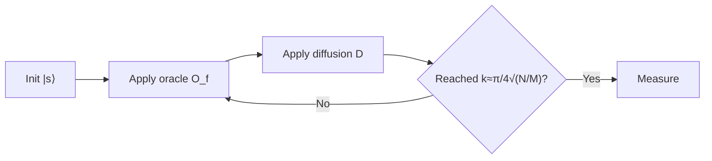
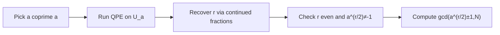

# **Chapter 4: Foundational Quantum Algorithms**

---

The goal of this chapter is to introduce foundational quantum algorithms, including Deutsch-Jozsa, Bernstein-Vazirani, and Simon's algorithm. These algorithms, while simple, demonstrate the core principles of quantum parallelism and interference that enable quantum speedups.

---

## **4.1 Deutsch–Deutsch–Jozsa Algorithm** {.heading-with-pill}

> **Difficulty:** ★★☆☆☆
> 
> **Concept:** Promise problems via global phase interference
> 
> **Summary:** The algorithm distinguishes constant from balanced Boolean functions with a single oracle query by encoding $f(x)$ into phases and using interference to select or suppress the $|0\rangle^{\otimes n}$ component.

### **Theoretical Background**
Let $f: \{0,1\}^n\to\{0,1\}$. The oracle acts as

$$
U_f|x\rangle|y\rangle=|x\rangle|y\oplus f(x)\rangle.
$$

Prepare $|\psi_0\rangle=|0\rangle^{\otimes n}\otimes|1\rangle$ and apply Hadamards:

$$
|\psi_1\rangle=(\mathbf{H}^{\otimes n}\otimes\mathbf{H})|\psi_0\rangle=\frac{1}{2^{n/2}}\sum_{x\in\{0,1\}^n}|x\rangle\otimes\frac{|0\rangle-|1\rangle}{\sqrt{2}}.
$$

After $U_f$ the ancilla imparts a phase $(-1)^{f(x)}$ on $|x\rangle$:

$$
|\psi_2\rangle=\frac{1}{2^{n/2}}\sum_{x}(-1)^{f(x)}|x\rangle\otimes\frac{|0\rangle-|1\rangle}{\sqrt{2}}.
$$

Applying $\mathbf{H}^{\otimes n}$ to the first register yields amplitudes

$$
\alpha_y=\frac{1}{2^{n}}\sum_{x}(-1)^{f(x)}(-1)^{x\cdot y}.
$$

If $f$ is constant, $\alpha_{0^n}=\pm1$ and all others vanish; if balanced, $\alpha_{0^n}=0$ by cancellation.

### **Comprehension Check**

!!! note "Quiz"
    **1. How many oracle calls does Deutsch–Jozsa need?**

    - A. Two  
    - B. One  
    - C. $n$  
    - D. $2^{n-1}+1$  

    ??? info "See Answer"
        **Correct: B.** A single query suffices under the promise.

    **2. Measuring $|0\rangle^{\otimes n}$ indicates what?**

    - A. Balanced  
    - B. Constant  
    - C. Random  
    - D. Periodic  

    ??? info "See Answer"
        **Correct: B.** Only constant functions yield the all-zeros outcome deterministically.

-----

!!! abstract "Interview-Style Question"

    **Q:** Why is the ancilla prepared in $|1\rangle$ and then Hadamarded to $|{-}\rangle$?

    ???+ info "Answer Strategy"
        **Phase Kickback Mechanism:**  
        Ancilla $|-\rangle = \frac{1}{\sqrt{2}}(|0\rangle - |1\rangle)$ enables phase kickback. For oracle $U_f|x\rangle|y\rangle = |x\rangle|y \oplus f(x)\rangle$:
        
        $$
        U_f|x\rangle|-\rangle = (-1)^{f(x)}|x\rangle|-\rangle
        $$
        
        Function value becomes global phase on control register, leaving ancilla unentangled and factorizable.
        
        **Quantum Interference:**  
        Phases $(-1)^{f(x)}$ imprinted on $|x\rangle$ interfere under final Hadamards: $H^{\otimes n}\sum_x (-1)^{f(x)}|x\rangle = \sum_y \alpha_y |y\rangle$ where $\alpha_y = 2^{-n/2}\sum_x (-1)^{f(x)+x \cdot y}$. Distinguishes constant vs balanced (Deutsch-Jozsa) or reveals hidden string (Bernstein-Vazirani).
        
        **Alternatives Fail:**  
        $|0\rangle$ ancilla entangles: $U_f|x,0\rangle = |x,f(x)\rangle$, destroying interference. Only antisymmetric $|-\rangle$ converts XOR to phase.

-----

### **<i class="fa-solid fa-flask"></i> Hands-On Projects**

#### **Project Blueprint**
| **Section**              | **Description** |
| ------------------------ | --------------- |
| **Objective**            | Verify $\alpha_{0^n}=0$ for a balanced oracle and $\pm1$ for a constant oracle. |
| **Mathematical Concept** | Phase kickback; Walsh–Hadamard transform. |
| **Experiment Setup**     | Choose $n=3$. Define constant $f(x)=0$ and balanced $f(x)=x_0\oplus x_1\oplus x_2$. |
| **Process Steps**        | Prepare $\|0\rangle^{\otimes 3}\|1\rangle$; apply $\mathbf{H}^{\otimes 4}$, then $U_f$, then $\mathbf{H}^{\otimes 3}$ on data. |
| **Expected Behavior**    | Constant: output $\|000\rangle$ with prob. 1; balanced: $P(000)=0$. |
| **Tracking Variables**   | Amplitudes $\alpha_y$; probability of $y=000$. |
| **Verification Goal**    | Match analytical sum $\alpha_y=2^{-3}\sum_x(-1)^{f(x)+x\cdot y}$. |
| **Output**               | Measured histogram and analytic comparison. |

#### **Pseudocode Implementation**
```pseudo-code
FUNCTION Run_Deutsch_Jozsa(oracle_function, n_qubits):
    # Assert the oracle is a valid function for n_qubits
    ASSERT Is_Valid_Oracle(oracle_function, n_qubits)

    # Step 1: Initialize quantum registers
    # n data qubits in state |0> and 1 ancilla qubit in state |1>
    data_register = Initialize_Qubits(n_qubits, state=0)
    ancilla_register = Initialize_Qubits(1, state=1)
    initial_state = Tensor_Product(data_register, ancilla_register)
    LOG "Initial state: |0...0>|1>"

    # Step 2: Apply Hadamard transform to all qubits
    # Creates superposition: 1/sqrt(2^n) * Σ|x> * (|0> - |1>)/sqrt(2)
    state_after_H = Apply_Hadamard_To_All(initial_state)
    LOG "State after initial Hadamards: Superposition created"

    # Step 3: Apply the oracle U_f
    # This imparts the phase (-1)^f(x) to the corresponding |x> state
    state_after_oracle = oracle_function(state_after_H)
    LOG "State after oracle call: Phase kickback applied"

    # Step 4: Apply Hadamard transform to the data register again
    final_data_state = Apply_Hadamard_To_Data(state_after_oracle)
    LOG "State after final Hadamards: Interference computed"

    # Step 5: Measure the data register
    measurement_result = Measure(final_data_state)
    LOG "Measurement result: ", measurement_result

    # Step 6: Interpret the result
    # If result is |0...0>, the function is constant. Otherwise, it's balanced.
    IF measurement_result == All_Zeros(n_qubits):
        RETURN "Constant"
    ELSE:
        RETURN "Balanced"
    END IF
END FUNCTION
```

#### **Outcome and Interpretation**
Constructive vs destructive interference at $y=0^n$ realizes the promise decision in one query.

---

## **4.2 Bernstein–Vazirani Algorithm** {.heading-with-pill}

> **Difficulty:** ★★☆☆☆
> 
> **Concept:** Hidden-string extraction via phase kickback
> 
> **Summary:** With oracle $f_s(x)=s\cdot x\;(\bmod\;2)$, one query suffices to learn $s\in\{0,1\}^n$ by converting function values to phases and applying Hadamards.

### **Theoretical Background**

The Bernstein-Vazirani algorithm solves the hidden string problem: given a black-box function $f_s:\{0,1\}^n \to \{0,1\}$ defined by $f_s(x) = s \cdot x \pmod{2}$ for some unknown $s \in \{0,1\}^n$, determine $s$ with minimal queries.

**Circuit Construction:**  
Initialize the state $|\psi_0\rangle = |0\rangle^{\otimes n} \otimes |1\rangle$ where the first $n$ qubits form the data register and the last qubit is the ancilla. Apply Hadamard gates to all qubits:

$$
|\psi_1\rangle = (\mathbf{H}^{\otimes n} \otimes \mathbf{H})|\psi_0\rangle = \frac{1}{2^{n/2}}\sum_{x \in \{0,1\}^n} |x\rangle \otimes \frac{|0\rangle - |1\rangle}{\sqrt{2}} = \frac{1}{2^{n/2}}\sum_{x \in \{0,1\}^n} |x\rangle \otimes |{-}\rangle
$$

**Oracle Application and Phase Kickback:**  
The oracle $U_{f_s}$ acts as $U_{f_s}|x\rangle|y\rangle = |x\rangle|y \oplus f_s(x)\rangle = |x\rangle|y \oplus (s \cdot x)\rangle$. When applied to the state with ancilla $|{-}\rangle$:

$$
U_{f_s}\big(|x\rangle \otimes |{-}\rangle\big) = U_{f_s}\left(|x\rangle \otimes \frac{|0\rangle - |1\rangle}{\sqrt{2}}\right) = |x\rangle \otimes \frac{|s \cdot x\rangle - |1 \oplus (s \cdot x)\rangle}{\sqrt{2}} = (-1)^{s \cdot x}|x\rangle \otimes |{-}\rangle
$$

The full state after oracle application becomes:

$$
|\psi_2\rangle = \frac{1}{2^{n/2}}\sum_{x \in \{0,1\}^n} (-1)^{s \cdot x}|x\rangle \otimes |{-}\rangle
$$

**Final Hadamard and Measurement:**  
Applying $\mathbf{H}^{\otimes n}$ to the data register performs the transformation $|x\rangle \mapsto \frac{1}{2^{n/2}}\sum_{y \in \{0,1\}^n} (-1)^{x \cdot y}|y\rangle$:

$$
|\psi_3\rangle = \frac{1}{2^n}\sum_{x,y \in \{0,1\}^n} (-1)^{s \cdot x + x \cdot y}|y\rangle \otimes |{-}\rangle = \frac{1}{2^n}\sum_{y \in \{0,1\}^n} \left(\sum_{x \in \{0,1\}^n} (-1)^{x \cdot (s \oplus y)}\right)|y\rangle \otimes |{-}\rangle
$$

By the orthogonality property of the Walsh-Hadamard transform, $\sum_{x \in \{0,1\}^n} (-1)^{x \cdot z} = 2^n \delta_{z,0^n}$, the amplitude is nonzero only when $s \oplus y = 0^n$, i.e., $y = s$:

$$
|\psi_3\rangle = |s\rangle \otimes |{-}\rangle
$$

Measuring the data register yields $s$ with certainty.

### **Comprehension Check**

!!! note "Quiz"
    **1. What operation defines $f_s(x)$?**

    - A. Integer product  
    - B. Real dot product  
    - C. Bitwise dot product mod 2  
    - D. Convolution  

    ??? info "See Answer"
        **Correct: C.** $f_s(x)=\sum_i s_ix_i\;\bmod\;2$.

    **2. How many oracle calls to recover $s$?**

    - A. $n$  
    - B. 2  
    - C. 1  
    - D. $\Theta(\log n)$  

    ??? info "See Answer"
        **Correct: C.** A single query suffices.

-----

!!! abstract "Interview-Style Question"

    **Q:** Why is the ancilla fixed in $|{-}\rangle$ rather than $|0\rangle$?

    ???+ info "Answer Strategy"
        **Phase Kickback Requirement:**  
        To extract hidden string $s$ from $f_s(x) = s \cdot x \pmod{2}$ in one query, convert function output to phase:
        
        $$
        U_f|x\rangle|{-}\rangle = (-1)^{s \cdot x}|x\rangle|{-}\rangle
        $$
        
        Ancilla factors out—state remains separable $(\text{phase})|x\rangle \otimes |{-}\rangle$ rather than entangled.
        
        **Hadamard Decoding:**  
        Data register holds clean superposition $\frac{1}{\sqrt{2^n}}\sum_x (-1)^{s \cdot x}|x\rangle$. Applying $H^{\otimes n}$ yields $\alpha_y = 2^{-n}\sum_x (-1)^{s \cdot x + x \cdot y}$, nonzero only when $y = s$ (Walsh-Hadamard property), giving deterministic measurement.
        
        **$|0\rangle$ Fails:**  
        Creates entanglement $|x\rangle|f_s(x)\rangle$, collapsing superposition upon measurement, preventing interference. Phase kickback uniquely requires antisymmetric $|{-}\rangle$.

-----

### **<i class="fa-solid fa-flask"></i> Hands-On Projects**

#### **Project Blueprint**
| **Section**              | **Description** |
| ------------------------ | --------------- |
| **Objective**            | Recover a hidden string $s$ for $n=5$ with one oracle call. |
| **Mathematical Concept** | Phase kickback and Hadamard decoding. |
| **Experiment Setup**     | Choose $s=10110$. Implement $U_{f_s}$. |
| **Process Steps**        | Initialize $\|0\rangle^{\otimes5}\|1\rangle$; apply $\mathbf{H}^{\otimes6}$; call $U_{f_s}$; apply $\mathbf{H}^{\otimes5}$; measure. |
| **Expected Behavior**    | Outcome $\|s\rangle$ with probability 1. |
| **Tracking Variables**   | Bitstring estimate; success probability. |
| **Verification Goal**    | Deterministic recovery of $s$. |
| **Output**               | Measured $s$ and single-shot success. |

#### **Pseudocode Implementation**
```pseudo-code
FUNCTION Run_Bernstein_Vazirani(oracle_s, n_qubits):
    # Assert the oracle corresponds to a hidden string s of length n_qubits
    ASSERT Is_Valid_BV_Oracle(oracle_s, n_qubits)

    # Step 1: Initialize registers
    # n data qubits to |0>, 1 ancilla to |1>
    initial_state = Initialize_State(n_qubits, ancilla_state=1)
    LOG "Initial state: |0...0>|1>"

    # Step 2: Apply Hadamard to all qubits
    # Creates uniform superposition in data register and |-> in ancilla
    state_after_H = Apply_Hadamard_To_All(initial_state)
    LOG "State after Hadamards: Σ|x>|->"

    # Step 3: Apply the Bernstein-Vazirani oracle U_f
    # Oracle computes f(x) = s·x mod 2 via phase kickback
    # Resulting state: Σ(-1)^(s·x)|x>|->
    state_after_oracle = oracle_s(state_after_H)
    LOG "State after oracle: Phases encoded with s·x"

    # Step 4: Apply Hadamard to the data register
    # This transform reveals the hidden string s
    # H^n (Σ(-1)^(s·x)|x>) = |s>
    final_data_state = Apply_Hadamard_To_Data(state_after_oracle)
    LOG "State after final Hadamards: |s> isolated"

    # Step 5: Measure the data register
    # The measurement outcome is the hidden string s with probability 1
    hidden_string_s = Measure(final_data_state)
    LOG "Measured string: ", hidden_string_s

    # Verify the result
    ASSERT Is_Correct_String(hidden_string_s, oracle_s.s)

    RETURN hidden_string_s
END FUNCTION
```

#### **Outcome and Interpretation**
BV exemplifies quantum parallelism: a single oracle call encodes all $2^n$ evaluations into phases that decode to $s$.

---

## **4.3 Simon’s Algorithm** {.heading-with-pill}

> **Difficulty:** ★★★☆☆
> 
> **Concept:** Period finding over $\mathbb{Z}_2^n$ via parity constraints
> 
> **Summary:** Given a 2-to-1 oracle with hidden shift $s\neq0$ such that $f(x)=f(x\oplus s)$, Simon’s algorithm recovers $s$ in polynomial time by collecting random $y$ with $y\cdot s=0\;(\bmod\;2)$ and solving a linear system.

### **Theoretical Background**

Simon's algorithm addresses the period-finding problem over $\mathbb{Z}_2^n$: given a function $f:\{0,1\}^n \to \{0,1\}^m$ satisfying the promise that $f(x) = f(y)$ if and only if $y \in \{x, x \oplus s\}$ for some unknown nonzero $s \in \{0,1\}^n$, determine $s$.

**Quantum Circuit:**  
Initialize $|\psi_0\rangle = |0\rangle^{\otimes n} \otimes |0\rangle^{\otimes m}$ where the first register is the input and the second is the output. Apply Hadamard gates to the input register:

$$
|\psi_1\rangle = (\mathbf{H}^{\otimes n} \otimes \mathbf{I}^{\otimes m})|\psi_0\rangle = \frac{1}{2^{n/2}}\sum_{x \in \{0,1\}^n} |x\rangle \otimes |0\rangle^{\otimes m}
$$

**Oracle Query:**  
Apply the oracle $U_f|x\rangle|0^m\rangle = |x\rangle|f(x)\rangle$:

$$
|\psi_2\rangle = \frac{1}{2^{n/2}}\sum_{x \in \{0,1\}^n} |x\rangle \otimes |f(x)\rangle
$$

**Measurement-Induced Collapse:**  
Measure the output register, obtaining some value $f(x_0)$. By the promise, exactly two inputs map to this value: $x_0$ and $x_0 \oplus s$. The input register collapses to the equal superposition:

$$
|\psi_3\rangle = \frac{1}{\sqrt{2}}\big(|x_0\rangle + |x_0 \oplus s\rangle\big)
$$

Note that this state is symmetric under XOR with $s$, independent of the particular $x_0$ measured.

**Final Hadamard Transform:**  
Apply $\mathbf{H}^{\otimes n}$ to the input register. Using $\mathbf{H}^{\otimes n}|x\rangle = \frac{1}{2^{n/2}}\sum_{y \in \{0,1\}^n} (-1)^{x \cdot y}|y\rangle$:

$$
|\psi_4\rangle = \frac{1}{2^{(n+1)/2}}\sum_{y \in \{0,1\}^n} \Big[(-1)^{x_0 \cdot y} + (-1)^{(x_0 \oplus s) \cdot y}\Big]|y\rangle
$$

Expanding the exponent:

$$
(x_0 \oplus s) \cdot y = x_0 \cdot y \oplus s \cdot y = x_0 \cdot y + s \cdot y \pmod{2}
$$

Thus:

$$
|\psi_4\rangle = \frac{1}{2^{(n+1)/2}}\sum_{y \in \{0,1\}^n} (-1)^{x_0 \cdot y}\Big[1 + (-1)^{s \cdot y}\Big]|y\rangle
$$

**Orthogonality Constraint:**  
The amplitude of $|y\rangle$ is proportional to $1 + (-1)^{s \cdot y}$, which equals $2$ when $s \cdot y = 0 \pmod{2}$ and $0$ when $s \cdot y = 1 \pmod{2}$. Therefore, measurement yields only states $y$ satisfying:

$$
y \cdot s = 0 \pmod{2}
$$

Each run provides one linear constraint over $\mathbb{F}_2$. The subspace orthogonal to $s$ has dimension $n-1$, so collecting $n-1$ linearly independent constraints determines $s$ uniquely (up to verification) via Gaussian elimination.

### **Comprehension Check**

!!! note "Quiz"
    **1. What promise defines Simon’s oracle?**

    - A. $f$ is constant or balanced  
    - B. $f(x)=s\cdot x$  
    - C. $f(x)=f(x\oplus s)$ with $s\neq0$  
    - D. $f$ is one-to-one  

    ??? info "See Answer"
        **Correct: C.** The oracle is 2-to-1 with period $s$.

    **2. The measurement outcomes $y$ satisfy:**

    - A. $y=s$  
    - B. $y\cdot s=1$  
    - C. $y\cdot s=0$  
    - D. $y=0$  

    ??? info "See Answer"
        **Correct: C.** Each sample provides a parity constraint orthogonal to $s$.

-----

!!! abstract "Interview-Style Question"

    **Q:** How does Simon's algorithm foreshadow Shor's period finding?

    ???+ info "Answer Strategy"
        **Common Theme: Hidden Periodicity:**  
        Both exploit periodic structure via quantum interference. Simon finds XOR period $s$ over $\mathbb{Z}_2^n$ where $f(x) = f(x \oplus s)$; Shor finds multiplicative order $r$ over $\mathbb{Z}_N$ where $a^r \equiv 1 \pmod{N}$.
        
        **Simon's Approach:**  
        Measurement collapses to $\frac{1}{\sqrt{2}}(|x\rangle + |x \oplus s\rangle)$. Hadamards yield outcomes $y$ satisfying $y \cdot s = 0 \pmod{2}$. Collecting $\mathcal{O}(n)$ equations and Gaussian elimination over $\mathbb{F}_2$ recovers $s$ in polynomial time vs classical $\Omega(2^{n/2})$.
        
        **Shor's Generalization:**  
        QPE extracts eigenphases $e^{2\pi ik/r}$ of $U_a|x\rangle = |ax \bmod N\rangle$. Inverse QFT concentrates probability at $k/r$; continued fractions recover $r$ from measured phase. Speedup: $\mathcal{O}(\log N)$ precision vs exponential classical.
        
        **Historical Impact:**  
        Simon (1994) demonstrated first exponential separation for structured problems, inspiring Shor to extend period-finding to modular arithmetic, proving quantum advantage for cryptographic problems.

-----

### **<i class="fa-solid fa-flask"></i> Hands-On Projects**

#### **Project Blueprint**
| **Section**              | **Description** |
| ------------------------ | --------------- |
| **Objective**            | Recover $s$ for a 3-bit Simon oracle. |
| **Mathematical Concept** | Linear constraints $y\cdot s=0$ over $\mathbb{F}_2$. |
| **Experiment Setup**     | Choose hidden $s=011$; construct 2-to-1 oracle. |
| **Process Steps**        | Sample $y$ values; assemble linear system; solve via Gaussian elimination mod 2. |
| **Expected Behavior**    | With $\ge n-1$ independent equations, unique nonzero $s$ is recovered. |
| **Tracking Variables**   | Collected $y$ rows; rank; solution for $s$. |
| **Verification Goal**    | Substitute recovered $s$ into oracle property $f(x)=f(x\oplus s)$. |
| **Output**               | Estimated $s$ and constraint residuals. |

#### **Pseudocode Implementation**
```pseudo-code
FUNCTION Run_Simons_Algorithm(oracle_f, n_qubits):
    # Assert oracle f has a period s: f(x) = f(x⊕s)
    ASSERT Is_Valid_Simons_Oracle(oracle_f, n_qubits)

    collected_vectors = []
    linear_system_rank = 0
    
    # Loop until n-1 linearly independent vectors are found
    WHILE linear_system_rank < n_qubits - 1:
        # Step 1: Prepare initial state |0...0>|0...0>
        initial_state = Initialize_State(n_qubits, ancilla_qubits=n_qubits)
        
        # Step 2: Apply Hadamard to the first (data) register
        state_after_H1 = Apply_Hadamard_To_Data(initial_state)
        
        # Step 3: Query the oracle U_f
        state_after_oracle = oracle_f(state_after_H1)
        
        # Step 4: Measure the second (ancilla) register
        # This collapses the first register into 1/sqrt(2) * (|x> + |x⊕s>)
        measurement, collapsed_data_state = Measure_Ancilla(state_after_oracle)
        
        # Step 5: Apply Hadamard to the collapsed data register
        final_data_state = Apply_Hadamard_To_Data(collapsed_data_state)
        
        # Step 6: Measure the data register to get a vector y
        y = Measure(final_data_state)
        LOG "Collected vector y: ", y
        
        # Step 7: Add y to our system of linear equations if it's linearly independent
        IF Is_Linearly_Independent(y, collected_vectors):
            Add_Vector(y, collected_vectors)
            linear_system_rank = Rank(collected_vectors)
            LOG "System rank is now: ", linear_system_rank
        END IF
    END WHILE

    # Step 8: Solve the linear system y·s = 0 (mod 2) for s
    # The system has a non-trivial solution s
    hidden_period_s = Solve_Linear_System(collected_vectors)
    LOG "Found hidden period s: ", hidden_period_s

    # Verify the solution
    ASSERT oracle_f.Verify_Period(hidden_period_s)

    RETURN hidden_period_s
END FUNCTION
```

#### **Outcome and Interpretation**
Simon’s exponential advantage over classical exemplifies the power of interference plus linear algebra over finite fields.

---

## **4.4 Grover’s Unstructured Search** {.heading-with-pill}

> **Difficulty:** ★★☆☆☆
> 
> **Concept:** Amplitude rotation toward marked subspace
> 
> **Summary:** Repeated reflections about the solution set and the mean rotate amplitude by $2\theta$ per iteration, reaching $\mathcal{O}(\sqrt{N/M})$ queries for $M$ marked items in $N$.

### **Theoretical Background**

Grover's algorithm provides a quadratic speedup for unstructured search: given an oracle that recognizes $M$ marked items among $N$ total items, find a marked item with high probability using $\mathcal{O}(\sqrt{N/M})$ queries.

**State Space Decomposition:**  
Define the uniform superposition $|s\rangle = \frac{1}{\sqrt{N}}\sum_{x=0}^{N-1} |x\rangle$ and decompose the Hilbert space into a 2D subspace spanned by:

$$
|\alpha\rangle = \frac{1}{\sqrt{M}}\sum_{x \in \text{marked}} |x\rangle, \quad |\beta\rangle = \frac{1}{\sqrt{N-M}}\sum_{x \in \text{unmarked}} |x\rangle
$$

The initial state can be written as:

$$
|s\rangle = \sqrt{\frac{M}{N}}|\alpha\rangle + \sqrt{\frac{N-M}{N}}|\beta\rangle = \sin\theta |\alpha\rangle + \cos\theta |\beta\rangle
$$

where $\sin^2\theta = M/N$ defines the angle $\theta$ from the unmarked subspace to the initial state.

**Oracle Operator:**  
The phase oracle $O_f$ flips the sign of marked states:

$$
O_f = \mathbf{I} - 2\sum_{x \in \text{marked}} |x\rangle\langle x| = \mathbf{I} - 2|\alpha\rangle\langle\alpha|
$$

In the 2D subspace, this acts as reflection about the $|\beta\rangle$ axis:

$$
O_f\big(\sin\theta|\alpha\rangle + \cos\theta|\beta\rangle\big) = -\sin\theta|\alpha\rangle + \cos\theta|\beta\rangle
$$

**Diffusion Operator:**  
The diffusion operator (inversion about average) is:

$$
D = 2|s\rangle\langle s| - \mathbf{I} = -\mathbf{I} + 2\sum_{x,y=0}^{N-1} \frac{1}{N}|x\rangle\langle y|
$$

This reflects about the $|s\rangle$ state. In the 2D subspace:

$$
D = 2(\sin\theta|\alpha\rangle + \cos\theta|\beta\rangle)(\sin\theta\langle\alpha| + \cos\theta\langle\beta|) - \mathbf{I}
$$

**Grover Iteration as Rotation:**  
One Grover iteration $G = D \circ O_f$ is the composition of two reflections, which geometrically is a rotation by twice the angle between the reflection axes. Computing $G$ in the 2D subspace:

$$
G = \begin{pmatrix} \cos 2\theta & -\sin 2\theta \\ \sin 2\theta & \cos 2\theta \end{pmatrix}
$$

Each iteration rotates the state vector by $2\theta$ toward $|\alpha\rangle$. After $k$ iterations:

$$
G^k|s\rangle = \sin\big((2k+1)\theta\big)|\alpha\rangle + \cos\big((2k+1)\theta\big)|\beta\rangle
$$

**Optimal Iteration Count:**  
The probability of measuring a marked state is $P_{\text{success}}(k) = \sin^2\big((2k+1)\theta\big)$. This is maximized when $(2k+1)\theta = \pi/2$, yielding:

$$
k_{\text{opt}} = \left\lfloor \frac{\pi}{4\theta} - \frac{1}{2} \right\rfloor \approx \left\lfloor \frac{\pi}{4}\sqrt{\frac{N}{M}} \right\rfloor
$$

For $M=1$, this gives $k \approx \frac{\pi}{4}\sqrt{N}$, compared to the classical $\mathcal{O}(N)$ expected queries for random search.



### **Comprehension Check**

!!! note "Quiz"
    **1. Expected query complexity for one marked item?**

    - A. $O(N)$  
    - B. $O(\sqrt{N})$  
    - C. $O(\log N)$  
    - D. $O(1)$  

    ??? info "See Answer"
        **Correct: B.** Quadratic speedup over linear search.

    **2. The diffusion operator equals:**

    - A. $\mathbf{H}$  
    - B. $2|s\rangle\langle s|-\mathbf{I}$  
    - C. $O_f$  
    - D. QFT  

    ??? info "See Answer"
        **Correct: B.** Reflection about the mean.

-----

!!! abstract "Interview-Style Question"

    **Q:** Why does over-iterating reduce success and how can one mitigate this?

    ???+ info "Answer Strategy"
        **Rotation Mechanism:**  
        Grover iterates $G = -D \cdot O_f$ rotate state by $2\theta$ where $\sin^2\theta = M/N$. After $k$ iterations: $P_{\text{success}}(k) = \sin^2((2k+1)\theta)$. Optimal $k_{\text{opt}} \approx \lfloor\frac{\pi}{4\sqrt{N/M}}\rfloor$ maximizes success. Beyond this, rotation continues past $|m\rangle$, returning toward $|u\rangle$, reducing probability.
        
        **Mitigation Strategies:**  
        **1. Estimate $M$ first:** Use quantum counting or sample-based estimation to compute $k_{\text{opt}}$ precisely.  
        **2. Fixed-point search:** Modified Grover-Long operators prevent over-rotation, guaranteeing $P \geq 1-\epsilon$ without knowing $M$.  
        **3. Variable-iteration:** Use random $k \in \{1, \ldots, k_{\max}\}$ or doubling scheme ($k = 1, 2, 4, 8, \ldots$) to hit near-optimal with good probability.
        
        **Practical Impact:**  
        On NISQ devices, precise iteration control is critical. Over-iterating wastes coherence; fixed-point or adaptive methods ensure reliable performance when $M$ unknown.

-----

### **<i class="fa-solid fa-flask"></i> Hands-On Projects**

#### **Project Blueprint**
| **Section**              | **Description** |
| ------------------------ | --------------- |
| **Objective**            | Compute optimal $k$ for $N=10^6$, $M=10$. |
| **Mathematical Concept** | Amplitude rotation and success probability $\sin^2((2k+1)\theta)$. |
| **Experiment Setup**     | $\sin^2\theta=M/N$. |
| **Process Steps**        | Compute $\theta$; choose $k\approx\lfloor\tfrac{\pi}{4\theta}-\tfrac{1}{2}\rfloor$; report success. |
| **Expected Behavior**    | Success near 1 at optimal $k$. |
| **Tracking Variables**   | $\theta$, $k$, success probability. |
| **Verification Goal**    | Compare exact success to approximation. |
| **Output**               | $k$ and predicted success. |

#### **Pseudocode Implementation**
```pseudo-code
FUNCTION Calculate_Grover_Iterations(N, M):
    # N: size of the search space
    # M: number of marked items
    ASSERT N > 0 AND M > 0 AND N >= M

    # Step 1: Calculate the angle theta
    # sin(theta) = sqrt(M/N)
    theta = arcsin(sqrt(M / N))
    LOG "Rotation angle theta: ", theta

    # Step 2: Calculate the optimal number of iterations, k
    # k is the integer closest to (π / (4 * theta)) - 1/2
    optimal_k_float = (PI / (4 * theta)) - 0.5
    k = round(optimal_k_float)
    LOG "Optimal number of iterations k: ", k

    # Step 3: Calculate the theoretical success probability at k iterations
    # P_success = sin^2((2k + 1) * theta)
    success_probability = (sin((2 * k + 1) * theta))^2
    LOG "Predicted success probability: ", success_probability

    # Assert that the success probability is high
    ASSERT success_probability > 0.9 # Or a suitable threshold

    RETURN k, success_probability
END FUNCTION
```

#### **Outcome and Interpretation**
The quadratic speedup appears as $\mathcal{O}(\sqrt{N/M})$ oracle uses to approach unit success.

---

## **4.5 Quantum Amplitude Amplification** {.heading-with-pill}

> **Difficulty:** ★★☆☆☆
> 
> **Concept:** Generic success-boosting via alternating reflections
> 
> **Summary:** For initial success $a$, $k$ iterations of $Q=(2|\psi\rangle\langle\psi|-\mathbf{I})O$ produce success $\sin^2((2k+1)\theta)$ with $\sin^2\theta=a$, requiring $\mathcal{O}(1/\sqrt{a})$ oracle uses.

### **Theoretical Background**

Quantum Amplitude Amplification generalizes Grover's algorithm to arbitrary initial states. Given a unitary preparation operator $\mathcal{A}$ that produces state $|\psi\rangle = \mathcal{A}|0\rangle$ with success amplitude $a$ for measuring a "good" outcome, amplification increases this probability to near unity in $\mathcal{O}(1/\sqrt{a})$ iterations.

**State Decomposition:**  
Let $\chi: \mathcal{H} \to \{0,1\}$ be a Boolean function marking good states. Decompose the Hilbert space:

$$
|\psi\rangle = \sin\theta |\psi_1\rangle + \cos\theta |\psi_0\rangle
$$

where $|\psi_1\rangle$ is the normalized projection onto the good subspace (states with $\chi(x)=1$), $|\psi_0\rangle$ is the normalized projection onto the bad subspace, and $\sin^2\theta = a$ is the initial success probability.

**Oracle Operator:**  
The marking oracle selectively flips the phase of good states:

$$
O|x\rangle = (-1)^{\chi(x)}|x\rangle = \begin{cases} -|x\rangle & \text{if } \chi(x)=1 \\ |x\rangle & \text{if } \chi(x)=0 \end{cases}
$$

In the 2D subspace spanned by $\{|\psi_1\rangle, |\psi_0\rangle\}$:

$$
O = \mathbf{I} - 2|\psi_1\rangle\langle\psi_1|
$$

This reflects about the bad subspace axis.

**State Preparation Inversion:**  
Define the inversion-about-$|\psi\rangle$ operator:

$$
S_\psi = 2|\psi\rangle\langle\psi| - \mathbf{I} = \mathcal{A}(2|0\rangle\langle 0| - \mathbf{I})\mathcal{A}^\dagger
$$

This reflects about $|\psi\rangle$. The expression on the right shows it can be implemented by conjugating a simple reflection by the preparation circuit.

**Amplification Operator:**  
The amplification iteration is $Q = S_\psi \circ O$. As a composition of two reflections in 2D, it acts as a rotation:

$$
Q = \begin{pmatrix} \cos 2\theta & -\sin 2\theta \\ \sin 2\theta & \cos 2\theta \end{pmatrix}
$$

rotating by $2\theta$ toward $|\psi_1\rangle$. After $k$ iterations:

$$
Q^k|\psi\rangle = \sin\big((2k+1)\theta\big)|\psi_1\rangle + \cos\big((2k+1)\theta\big)|\psi_0\rangle
$$

**Success Probability and Query Complexity:**  
The probability of measuring a good state is:

$$
P_{\text{success}}(k) = \sin^2\big((2k+1)\theta\big)
$$

Maximized when $(2k+1)\theta \approx \pi/2$, requiring:

$$
k \approx \frac{\pi}{4\theta} - \frac{1}{2} \approx \frac{\pi}{4\arcsin\sqrt{a}} \approx \frac{\pi}{4\sqrt{a}} \quad \text{for } a \ll 1
$$

Thus $\mathcal{O}(1/\sqrt{a})$ iterations suffice, compared to $\mathcal{O}(1/a)$ repetitions classically.

### **Comprehension Check**

!!! note "Quiz"
    **1. If $a=1/25$, iterations needed are $k\sim$?**

    - A. 1  
    - B. 3  
    - C. 5  
    - D. 25  

    ??? info "See Answer"
        **Correct: C.** $1/\sqrt{a}=5$.

    **2. Amplitude amplification generalizes which algorithm?**

    - A. Shor  
    - B. BV  
    - C. Grover  
    - D. Simon  

    ??? info "See Answer"
        **Correct: C.** It subsumes Grover as a special case.

-----

!!! abstract "Interview-Style Question"

    **Q:** Why is knowing $a$ useful and how to proceed if $a$ is unknown?

    ???+ info "Answer Strategy"
        **Role of Success Amplitude $a$:**  
        Amplification operator $Q = S_\psi \cdot O$ rotates by $2\theta$ where $\sin^2\theta = a$. Optimal iterations $k_{\text{opt}} \approx \lfloor\frac{\pi}{4\sqrt{a}}\rfloor$ maximize $P_{\text{success}} \approx 1$. Without knowing $a$, risk over-rotation (success drops) or under-amplification (low success).
        
        **Strategy 1: Doubling Search (Unknown $a$):**  
        Run with $k = 1, 2, 4, 8, \ldots$ until success. Total queries $\sim 4K = \mathcal{O}(1/\sqrt{a})$, constant-factor worse than optimal but no $a$ needed.
        
        **Strategy 2: Amplitude Estimation First:**  
        Use quantum amplitude estimation (QAE) to estimate $a$ with precision $\epsilon$ using $\mathcal{O}(1/(\epsilon\sqrt{a}))$ queries, then compute $k_{\text{opt}}$ and run once. Valuable for repeated instances.
        
        **Strategy 3: Fixed-Point Amplification:**  
        Modified operators converge to good subspace without knowing $a$, achieving $P \geq 1-\delta$ in $\mathcal{O}(1/\sqrt{a})$ iterations with robustness.

-----

### **<i class="fa-solid fa-flask"></i> Hands-On Projects**

#### **Project Blueprint**
| **Section**              | **Description** |
| ------------------------ | --------------- |
| **Objective**            | Compute $k$ for $a=1/25$ and estimate success. |
| **Mathematical Concept** | $\sin^2((2k+1)\theta)$ with $\sin^2\theta=a$. |
| **Experiment Setup**     | Choose $a=0.04$. |
| **Process Steps**        | Set $\theta=\arcsin(\sqrt{a})$; compute success for $k=5$. |
| **Expected Behavior**    | Success close to 1. |
| **Tracking Variables**   | $\theta$, $k$, $P_{\text{success}}$. |
| **Verification Goal**    | Numeric evaluation vs approximation. |
| **Output**               | $k$ and $P_{\text{success}}(k)$. |

#### **Pseudocode Implementation**
```pseudo-code
FUNCTION Run_Amplitude_Amplification(initial_success_prob_a, num_iterations_k):
    # a: The initial probability of measuring a "good" state
    # k: The number of amplification iterations to perform
    ASSERT 0 < initial_success_prob_a < 1
    ASSERT num_iterations_k >= 0

    # Step 1: Calculate the angle theta from the initial success probability
    # sin(theta) = sqrt(a)
    theta = arcsin(sqrt(initial_success_prob_a))
    LOG "Initial angle theta: ", theta

    # Step 2: Calculate the success probability after k iterations
    # The angle is rotated by (2k + 1) * theta
    final_angle = (2 * num_iterations_k + 1) * theta
    
    # The new success probability is sin^2 of the final angle
    final_success_prob = (sin(final_angle))^2
    LOG "Success probability after ", k, " iterations: ", final_success_prob

    # Verify that the probability is within valid bounds
    ASSERT 0 <= final_success_prob <= 1

    RETURN final_success_prob
END FUNCTION
```

#### **Outcome and Interpretation**
Generic amplitude amplification boosts arbitrary procedure success with quadratic reduction in iterations.

---

## **4.6 Shor’s Factoring via Period Finding** {.heading-with-pill}

> **Difficulty:** ★★★★☆
> 
> **Concept:** QPE-based period discovery for modular exponentiation
> 
> **Summary:** Factoring $N$ reduces to estimating the order $r$ of $a\in\mathbb{Z}_N^\times$ via Quantum Phase Estimation on $U_a:|x\rangle\mapsto|ax\bmod N\rangle$, then deriving nontrivial factors by $\gcd(a^{r/2}\pm1,N)$.

### **Theoretical Background**

Shor's algorithm factors an integer $N$ by reducing factorization to period finding in modular exponentiation. The quantum speedup arises from Quantum Phase Estimation (QPE) applied to the unitary operator implementing multiplication modulo $N$.

**Problem Reduction:**  
For odd composite $N$, choose random $a \in \{2, 3, \ldots, N-1\}$ with $\gcd(a,N)=1$. The goal is to find the multiplicative order $r$, the smallest positive integer satisfying:

$$
a^r \equiv 1 \pmod{N}
$$

If $r$ is even and $a^{r/2} \not\equiv -1 \pmod{N}$, then $a^r - 1 = (a^{r/2}-1)(a^{r/2}+1) \equiv 0 \pmod{N}$ implies $N$ divides the product but not the individual factors, so:

$$
\gcd(a^{r/2} \pm 1, N)
$$

yields nontrivial factors with probability $\geq 1/2$ over random choice of $a$.

**Modular Multiplication as Unitary:**  
Define the operator $U_a: \mathbb{Z}_N \to \mathbb{Z}_N$ by:

$$
U_a|y\rangle = |ay \bmod N\rangle \quad \text{for } y \in \{0, 1, \ldots, N-1\}
$$

This is unitary on the subspace of states coprime to $N$. Controlled powers $U_a^{2^j}$ can be implemented efficiently using repeated squaring and modular arithmetic in $\mathcal{O}(\log^2 N)$ gates.

**Eigenvalue Structure:**  
The eigenstates of $U_a$ are:

$$
|\psi_k\rangle = \frac{1}{\sqrt{r}}\sum_{j=0}^{r-1} e^{-2\pi ijk/r}|a^j \bmod N\rangle \quad \text{for } k \in \{0, 1, \ldots, r-1\}
$$

with corresponding eigenvalues:

$$
U_a|\psi_k\rangle = e^{2\pi ik/r}|\psi_k\rangle
$$

The eigenphases $\phi_k = k/r$ encode the period $r$ as the denominator.

**Quantum Phase Estimation:**  
Prepare registers $|0\rangle^{\otimes t} \otimes |1\rangle$ where $t \approx 2\log N$ counting qubits provide precision. Apply Hadamards to the counting register and controlled-$U_a^{2^j}$ operations:

$$
\frac{1}{2^{t/2}}\sum_{x=0}^{2^t-1} |x\rangle \otimes U_a^x|1\rangle
$$

Since $|1\rangle$ is not an eigenstate, decompose it as $|1\rangle = \sum_{k=0}^{r-1} c_k|\psi_k\rangle$. The phase estimation circuit produces:

$$
\sum_{k=0}^{r-1} c_k \left(\frac{1}{2^{t/2}}\sum_{x=0}^{2^t-1} e^{2\pi ixk/r}|x\rangle\right) \otimes |\psi_k\rangle
$$

**Inverse QFT and Measurement:**  
Applying inverse QFT to the counting register concentrates amplitude near $\tilde{k}/r \approx 2^t k/r$ for each $k$. Measuring yields a random $\tilde{\phi} \approx k/r$ for some $k \in \{0, \ldots, r-1\}$.

**Continued Fractions Algorithm:**  
From measured $\tilde{\phi}/2^t$, use continued fractions expansion to find the best rational approximation $k'/r'$ with denominator $r' < N$. If $a^{r'} \equiv 1 \pmod{N}$, then $r'$ is the order (or a divisor thereof). Repeating $\mathcal{O}(1)$ times with high probability yields $r$.

**Complexity:**  
The quantum circuit uses $\mathcal{O}(t \cdot \log^2 N) = \mathcal{O}(\log^3 N)$ gates, exponentially faster than the best known classical algorithms which require super-polynomial time.



### **Comprehension Check**

!!! note "Quiz"
    **1. Shor reduces factoring to what subproblem?**

    - A. Discrete log  
    - B. Order/period finding  
    - C. SAT  
    - D. Graph isomorphism  

    ??? info "See Answer"
        **Correct: B.** Period finding enables factor extraction.

    **2. The classical component used at the end is:**

    - A. Gradient descent  
    - B. Euclid’s algorithm (gcd)  
    - C. FFT  
    - D. Gaussian elimination over reals  

    ??? info "See Answer"
        **Correct: B.** $\gcd$ yields factors from $a^{r/2}\pm1$.

-----

!!! abstract "Interview-Style Question"

    **Q:** Why is QPE suitable for period finding in modular exponentiation?

    ???+ info "Answer Strategy"
        **Modular Exponentiation as Unitary:**  
        Define $U_a|y\rangle = |a \cdot y \bmod N\rangle$ for $a$ coprime to $N$. Eigenstates are $|\psi_k\rangle = \frac{1}{\sqrt{r}}\sum_{j=0}^{r-1} e^{-2\pi ijk/r}|a^j \bmod N\rangle$ with eigenvalues $e^{2\pi ik/r}$.
        
        $$
        U_a|\psi_k\rangle = e^{2\pi ik/r}|\psi_k\rangle
        $$

        **Rational Eigenphases:**  
        Eigenphase $\phi_k = k/r$ has denominator exactly equal to period $r$! QPE extracts this via controlled-$U_a^{2^j}$ building phase $2^j \cdot 2\pi k/r$ in counting register, then inverse QFT yields binary fraction $k/r$. Continued fractions recover $r$ from measured approximation.
        
        **Why This Works:**  
        $U_a$ efficiently implementable ($\mathcal{O}(\log^2 N)$ gates). Eigenvalues have phases $k/r$ where denominator is the period. With $n \approx 2\log N$ counting qubits, QPE estimates to sufficient precision that continued fractions recovers $r$ with high probability. Classical methods need exponential queries; QPE leverages superposition over entire periodic structure.

-----

### **<i class="fa-solid fa-flask"></i> Hands-On Projects**

#### **Project Blueprint**
| **Section**              | **Description** |
| ------------------------ | --------------- |
| **Objective**            | Factor $N=15$ using $a=2$ by reasoning about $r$. |
| **Mathematical Concept** | Orders in $\mathbb{Z}_N^\times$; gcd extraction. |
| **Experiment Setup**     | Compute successive $2^x\bmod15$ to find $r$. |
| **Process Steps**        | Find minimal $r$ with $2^r\equiv1\pmod{15}$; compute $\gcd(2^{r/2}\pm1,15)$. |
| **Expected Behavior**    | $r=4$; factors $3$ and $5$. |
| **Tracking Variables**   | Sequence $2^x\bmod15$; $r$; gcd values. |
| **Verification Goal**    | Confirm $3\cdot5=15$. |
| **Output**               | $r$ and factors. |

#### **Pseudocode Implementation**
```pseudo-code
FUNCTION Factor_Integer_With_Shor(N, a):
    # N: The integer to factor
    # a: A random integer coprime to N
    ASSERT Is_Coprime(a, N)

    # Step 1: Find the period 'r' of the function f(x) = a^x mod N
    # This is the quantum part of the algorithm (using QPE)
    r = Quantum_Period_Finding(a, N)
    LOG "Found period r: ", r

    # Step 2: Check if the period is trivial
    IF r % 2 != 0:
        RETURN "Failure: Period is odd."
    
    y = a^(r/2)
    IF y % N == N - 1: # Corresponds to a^(r/2) ≡ -1 (mod N)
        RETURN "Failure: Trivial case (a^(r/2) = -1 mod N)."

    # Step 3: Compute the non-trivial factors using GCD
    # The factors are gcd(a^(r/2) ± 1, N)
    factor1 = GCD(y - 1, N)
    factor2 = GCD(y + 1, N)
    LOG "Potential factors: ", factor1, ", ", factor2

    # Verify that the factors are non-trivial and correct
    ASSERT factor1 * factor2 == N
    ASSERT factor1 > 1 AND factor2 > 1

    RETURN factor1, factor2
END FUNCTION
```

#### **Outcome and Interpretation**
The quantum speedup lies in period estimation; the final gcd step is classically efficient.

---

## **4.7 Quantum Random Walks** {.heading-with-pill}

> **Difficulty:** ★★★☆☆
> 
> **Concept:** Interference-driven transport on graphs
> 
> **Summary:** Quantum walks (discrete or continuous) exploit superposition and interference for faster mixing and hitting times on certain graphs compared to classical random walks.

### **Theoretical Background**

Quantum walks are the quantum analog of classical random walks, exhibiting fundamentally different spreading behavior due to quantum interference. Two main models exist: discrete-time coined walks and continuous-time walks.

**Discrete-Time Coined Quantum Walk:**  
On a line (or general graph), the state space is $\mathcal{H} = \mathcal{H}_c \otimes \mathcal{H}_p$ where $\mathcal{H}_c$ is the coin space (direction) and $\mathcal{H}_p$ is the position space. For a walk on $\mathbb{Z}$, use two-dimensional coin $\mathcal{H}_c = \text{span}\{|L\rangle, |R\rangle\}$ and position basis $\{|x\rangle : x \in \mathbb{Z}\}$.

**Walk Operators:**  
The coin operator $\mathbf{C}$ acts on the coin space. The Hadamard coin is:

$$
\mathbf{C}_H = \frac{1}{\sqrt{2}}\begin{pmatrix} 1 & 1 \\ 1 & -1 \end{pmatrix}
$$

mapping $|L\rangle \to \frac{1}{\sqrt{2}}(|L\rangle + |R\rangle)$ and $|R\rangle \to \frac{1}{\sqrt{2}}(|L\rangle - |R\rangle)$.

The conditional shift operator $\mathbf{S}$ moves the walker based on coin state:

$$
\mathbf{S}|L\rangle|x\rangle = |L\rangle|x-1\rangle, \quad \mathbf{S}|R\rangle|x\rangle = |R\rangle|x+1\rangle
$$

or more compactly:

$$
\mathbf{S} = |L\rangle\langle L| \otimes \sum_{x \in \mathbb{Z}} |x-1\rangle\langle x| + |R\rangle\langle R| \otimes \sum_{x \in \mathbb{Z}} |x+1\rangle\langle x|
$$

**Single Step Evolution:**  
One timestep applies the coin then shifts:

$$
\mathbf{U} = \mathbf{S} \circ (\mathbf{C} \otimes \mathbf{I}_p)
$$

Starting from $|\psi_0\rangle = |R\rangle|0\rangle$, the state after $t$ steps is $|\psi_t\rangle = \mathbf{U}^t|\psi_0\rangle$.

**Ballistic Spreading:**  
Unlike classical random walks where position variance grows as $\sigma^2 \sim t$, quantum walks exhibit ballistic spreading:

$$
\langle x^2 \rangle_t \sim t^2
$$

The position distribution develops two symmetric peaks propagating outward at constant velocity, with characteristic interference patterns between them. The probability distribution at time $t$ has width $\mathcal{O}(t)$ rather than $\mathcal{O}(\sqrt{t})$.

**Continuous-Time Quantum Walk:**  
On a graph $G=(V,E)$ with adjacency matrix $A$, the continuous-time walk evolves under Hamiltonian $H = \gamma A$ where $\gamma$ is the hopping rate:

$$
|\psi(t)\rangle = e^{-iHt}|\psi(0)\rangle = e^{-i\gamma At}|\psi(0)\rangle
$$

For a vertex $v \in V$, the transition amplitude to vertex $w$ is:

$$
\langle w|e^{-i\gamma At}|v\rangle
$$

**Hitting Time and Mixing Advantages:**  
On certain graphs (e.g., hypercube, $d$-dimensional lattices), quantum walks achieve exponentially or polynomially faster hitting times compared to classical walks. For example:

- **Line ($\mathbb{Z}$):** Classical hitting time from 0 to $n$ is $\Theta(n^2)$; quantum is $\Theta(n)$
- **Hypercube:** Classical mixing time is $\Theta(n\log n)$; quantum is $\Theta(n)$  
- **2D Grid:** Quantum spatial search finds marked vertex in $\mathcal{O}(\sqrt{N}\log N)$ vs classical $\Theta(N)$

These speedups underpin algorithmic applications including element distinctness, collision finding, and graph property testing.

### **Comprehension Check**

!!! note "Quiz"
    **1. A key advantage of quantum walks is:**

    - A. Guaranteed optimal path  
    - B. Faster mixing/hitting on some graphs  
    - C. Fewer nodes needed  
    - D. Deterministic outcomes  

    ??? info "See Answer"
        **Correct: B.** Interference accelerates exploration.

    **2. Discrete-time walks use which ingredients?**

    - A. Coin and shift  
    - B. Only shift  
    - C. Only coin  
    - D. Measurement alone  

    ??? info "See Answer"
        **Correct: A.** A unitary coin followed by a conditional shift.

-----

!!! abstract "Interview-Style Question"

    **Q:** Name an application of quantum walks in algorithms and explain the role of interference.

    ???+ info "Answer Strategy"
        **Spatial Search on Grids:**  
        Coined quantum walk on $\sqrt{N} \times \sqrt{N}$ 2D grid finds marked vertex in $\mathcal{O}(\sqrt{N})$ steps vs classical $\mathcal{O}(N)$. Coin operator (e.g., Grover diffusion on 4-direction space) + shift operator creates coherent evolution. Oracle marks target vertex with phase flip.
        
        **Interference Dynamics:**  
        After $\mathcal{O}(\sqrt{N})$ steps, constructive interference amplifies amplitude at marked vertex; destructive interference suppresses unmarked vertices. Quantum walk operator $U = S \cdot C$ creates coherent paths where phase differences from marking cause amplitude addition (converging at target) or cancellation (avoiding target).
        
        **Other Applications:**  
        **Element distinctness** ($\mathcal{O}(N^{2/3})$ queries on Johnson graph), **triangle finding** ($\mathcal{O}(N^{1.3})$), **collision finding** ($\mathcal{O}(N^{1/3})$). Interference enables wavelike propagation (ballistic $\propto t$ vs diffusive $\propto \sqrt{t}$), phase-dependent amplification at solutions, directional bias via engineered coins. Without coherence, walks collapse to classical random walks.

-----

### **<i class="fa-solid fa-flask"></i> Hands-On Projects**

#### **Project Blueprint**
| **Section**              | **Description** |
| ------------------------ | --------------- |
| **Objective**            | Compare spread of classical vs quantum walk on a line after $t$ steps. |
| **Mathematical Concept** | Diffusive vs ballistic variance growth. |
| **Experiment Setup**     | Classical simple random walk vs Hadamard-coin quantum walk. |
| **Process Steps**        | Derive/lookup variance scaling: classical $\sigma\sim\sqrt{t}$, quantum $\sigma\sim t$. |
| **Expected Behavior**    | Quantum distribution has two peaks and wider support. |
| **Tracking Variables**   | Variance $\sigma(t)$; peak positions. |
| **Verification Goal**    | Asymptotic scaling comparison. |
| **Output**               | Qualitative plot description and scaling laws. |

#### **Pseudocode Implementation**
```pseudo-code
FUNCTION Compare_Walk_Spreads(num_steps_t):
    # Assert number of steps is a positive integer
    ASSERT num_steps_t > 0

    # --- Classical Random Walk ---
    # Step 1: Simulate a classical random walk on a line for t steps
    classical_positions = Simulate_Classical_Walk(num_steps_t)
    
    # Step 2: Calculate the variance of the final positions
    # For a classical walk, variance is proportional to t
    classical_variance = Variance(classical_positions)
    LOG "Classical walk variance after ", t, " steps: ", classical_variance
    LOG "Expected scaling: O(t)"

    # --- Quantum Random Walk ---
    # Step 3: Simulate a quantum walk (e.g., with Hadamard coin) for t steps
    quantum_final_state = Simulate_Quantum_Walk(num_steps_t)
    
    # Step 4: Calculate the variance of the position distribution
    # For a quantum walk, variance is proportional to t^2 (ballistic spread)
    quantum_variance = Variance_From_State(quantum_final_state)
    LOG "Quantum walk variance after ", t, " steps: ", quantum_variance
    LOG "Expected scaling: O(t^2)"

    # Step 5: Compare the scaling behavior
    IF quantum_variance > classical_variance:
        LOG "Quantum walk spreads faster than classical walk, as expected."
    END IF

    RETURN classical_variance, quantum_variance
END FUNCTION
```

#### **Outcome and Interpretation**
Superposition and interference yield faster propagation than classical diffusion on many topologies.
