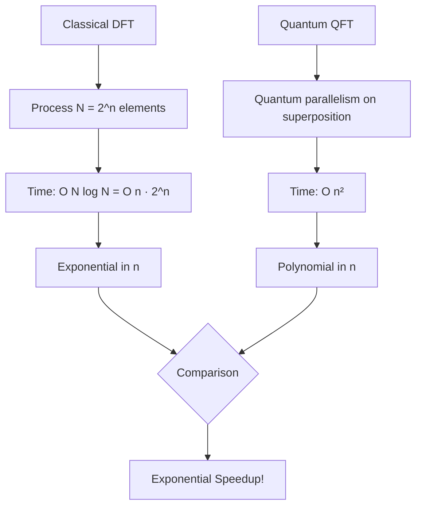
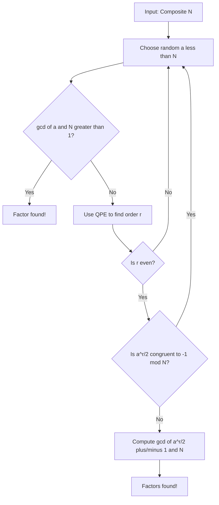

# **Chapter 5: Quantum Fourier Transform and Phase Estimation**

---


## **Introduction**

The Quantum Fourier Transform (QFT) stands as one of the most powerful primitives in quantum computing, serving an analogous role to the Fast Fourier Transform in classical computation but with exponential efficiency advantages. This chapter explores the QFT and its central application in Quantum Phase Estimation (QPE), which together form the computational backbone of exponential speedup algorithms like Shor's factoring algorithm. We begin by examining the mathematical structure of the QFT and its efficient decomposition into quantum gates, achieving polynomial complexity where classical methods require exponential time. The Quantum Phase Estimation algorithm, built upon the QFT, enables the extraction of eigenvalues from unitary operators—a capability that transforms intractable classical problems into tractable quantum ones. Through detailed analysis of order finding and factoring applications, we demonstrate how the subtle mechanism of phase kickback, combined with the QFT's frequency analysis capabilities, unlocks exponential computational advantages. This chapter bridges abstract quantum primitives with concrete algorithmic applications, revealing how quantum mechanical principles translate into revolutionary computational power [1, 2].

---

## **Chapter Outline**

| Sec. | Title | Core Ideas & Examples |
|------|-------|----------------------|
| **5.1** | Discrete Fourier Transform in Quantum | QFT definition, bit-wise decomposition, exponential speedup $O(n^2)$ vs $O(n 2^n)$, twiddle factors |
| **5.2** | Quantum Phase Estimation (QPE) | Eigenvalue estimation, controlled-unitary operations, inverse QFT, phase kickback mechanism |
| **5.3** | Applications in Order Finding and Factoring | Order finding problem, modular exponentiation, period extraction, Shor's algorithm reduction |
| **5.4** | Phase Kickback and QFT-based Algorithms | Phase kickback mechanism, eigenstate requirements, applications in hidden subgroup problems |

---

## **5.1 Discrete Fourier Transform in Quantum**

---

The **Quantum Fourier Transform (QFT)** is an indispensable quantum primitive that plays the same role in quantum computation as the Fast Fourier Transform (FFT) does in classical signal processing, data compression, and analysis. The QFT transforms a quantum state vector from its basis representation to its frequency domain representation, enabling the extraction of periodicity and phase information.

!!! tip "Intuition Boost"
    Think of the QFT as a quantum "frequency analyzer"—it takes a superposition encoded in the computational basis and reveals the hidden periodic patterns by transforming it into the frequency domain, all in polynomial time instead of exponential.

### **Definition of the Quantum Fourier Transform**

-----

The QFT is the unitary transformation acting on a quantum state that corresponds mathematically to the **Discrete Fourier Transform (DFT)** acting on the state's amplitude vector.

The transformation acts on a computational basis state $|j\rangle$, where $j \in \{0, 1, \ldots, N-1\}$ and $N = 2^n$ is the dimension of the Hilbert space defined by $n$ qubits:

$$
\text{QFT}(|j\rangle) = \frac{1}{\sqrt{N}} \sum_{k=0}^{N-1} e^{2\pi i j k / N} |k\rangle
$$

* **Amplitude Transformation:** For a general state $|\psi\rangle = \sum_{j=0}^{N-1} x_j |j\rangle$, the QFT produces a new state $|\phi\rangle = \sum_{k=0}^{N-1} y_k |k\rangle$, where the new amplitudes $y_k$ are given by the classical DFT of the original amplitudes $x_j$.
* **Root of Unity:** The complex coefficient $W_{N}^{j k} = e^{2\pi i j k / N}$ is the $N$-th root of unity (often called the **twiddle factor** in signal processing). This complex phase factor dictates the rotation applied to each component of the superposition.

!!! example "QFT on a Single Qubit"
    For $n=1$ (single qubit), the QFT reduces to the Hadamard gate:
    
    $$
    \text{QFT}(|0\rangle) = \frac{1}{\sqrt{2}}(|0\rangle + |1\rangle), \quad \text{QFT}(|1\rangle) = \frac{1}{\sqrt{2}}(|0\rangle - |1\rangle)
    $$
    
    This shows the QFT generalizes the familiar Hadamard transformation to higher-dimensional spaces.

### **Decomposition into Bit-wise Product**

-----

The power of the QFT lies in its ability to be decomposed into a product of single-qubit Hadamard and Controlled-Phase gates. This allows the overall operation to be executed in polynomial time.

For an $n$-qubit system, where $|j\rangle = |j_{n-1} j_{n-2} \ldots j_0\rangle$ (with $j_{n-1}$ being the most significant bit), the QFT can be written as a tensor product of terms:

$$
\text{QFT}(|j_{n-1} \ldots j_0\rangle) = \frac{1}{\sqrt{N}} \left( \bigotimes_{k=0}^{n-1} \left( |0\rangle + e^{2\pi i j / 2^{k+1}} |1\rangle \right) \right)
$$

This decomposition leads to a highly efficient circuit composed of:

1. **Hadamard gates** on each qubit.
2. **Controlled-Phase rotations** between pairs of qubits, where the rotation angle is precisely $\theta = 2\pi / 2^k$ (for $k=2, 3, \ldots, n$).

Here is the circuit structure for implementing the QFT:

```
QFT_Circuit(n_qubits):
    for i = 0 to n_qubits - 1:
        Apply H to qubit[i]
        for j = i + 1 to n_qubits - 1:
            Apply Controlled-R(2π / 2^(j-i+1)) with control=qubit[j], target=qubit[i]
    Reverse the order of qubits (SWAP operations)
    return quantum_state
```

??? question "Why does the QFT require a final qubit reversal?"
    The natural output of the QFT circuit produces qubits in reversed order compared to the standard basis ordering. SWAP gates reorder them to match conventional notation, though this reversal can sometimes be absorbed into subsequent operations for efficiency.

### **Exponential Speedup in Implementation**

-----

While the QFT performs the exact same mathematical transformation as the DFT, the way it processes the information provides a massive complexity advantage.

| Algorithm | Runtime (in terms of $N$) | Runtime (in terms of bits $n=\log_2 N$) | Speedup Over Classical FFT |
| :--- | :--- | :--- | :--- |
| **Classical FFT** | $O(N \log N)$ | $O(n 2^n)$ | N/A |
| **Quantum QFT** | $O(N \cdot (\text{polynomial in } n))$ (implicit) | $O(n^2)$ | **Exponential** |

The QFT achieves a runtime of **$O(n^2)$** (polynomial in the number of bits $n$), while the classical Fast Fourier Transform (FFT) has a runtime of $O(N \log N)$, which is **exponential** in the number of bits ($O(n 2^n)$).

This exponential speedup is possible because the QFT transforms the vector's **amplitudes** simultaneously using **quantum parallelism** and interference, rather than processing the $N$ individual data points sequentially. This efficiency is what makes QFT the crucial primitive in algorithms seeking exponential advantage, such as Shor's algorithm (Section 4.5).




---

The **Quantum Phase Estimation (QPE)** algorithm is one of the most significant quantum primitives, providing a method to estimate the unknown phase (eigenvalue) associated with a given unitary operator. QPE is the core subroutine that grants exponential speedups in structural algorithms like **Shor's factoring algorithm**.

!!! tip "Key Insight"
    QPE transforms the difficult problem of finding eigenvalues (which requires exponential classical resources) into a problem of measuring quantum phases—a task the QFT performs in polynomial time. This conversion is the secret behind many exponential quantum speedups.

### **Problem Statement**

-----

QPE estimates the unknown phase $\phi$ in the expression:

$$
U|\psi\rangle = e^{2\pi i \phi} |\psi\rangle
$$

where $U$ is a **unitary operator** (the black box) and $|\psi\rangle$ is an unknown, or known, **eigenstate** of $U$. The algorithm yields an $n$-bit binary approximation of $\phi$.

### **Algorithmic Structure**

-----

The QPE circuit requires two quantum registers and follows a distinct four-step process:

**1. Initialization and Superposition:**

* **First Register (Counting Register):** An $n$-qubit register initialized to $|0\rangle^{\otimes n}$. This register will eventually store the estimate of $\phi$.
* **Second Register (Target Register):** An $m$-qubit register initialized to the eigenstate $|\psi\rangle$ of the unitary operator $U$.
* **Hadamard Transform:** Hadamard gates are applied to all $n$ qubits of the first register to create a uniform superposition.

**2. Controlled-Unitary Operations (Phase Encoding):**

* This is the core information transfer step. A sequence of $n$ controlled unitary gates, $\text{Controlled-}U^{2^j}$, is applied.
* The $j$-th qubit of the counting register (starting with $j=0$) acts as the control qubit, and the target register $|\psi\rangle$ is the target.
* The exponent of the unitary operator must be scaled exponentially ($2^j$) to encode the phase $\phi$ with increasing precision. The state of the counting register after this process contains the phase $\phi$ encoded in the relative phases of its superposition components.

**3. Inverse Quantum Fourier Transform (IQFT):**

* The first register is now in a state $|\tilde{\phi}\rangle$ where the probability amplitudes have encoded the binary expansion of $\phi$.
* The **inverse QFT** is applied to the counting register. This operation transforms the register from the frequency domain back to the basis domain, effectively decoding the encoded phase $\phi$ into the computational basis.

**4. Measurement:**

* The first register is measured. The measurement result yields an $n$-bit binary approximation of the phase $\phi$ with high probability.

!!! example "QPE Circuit Flow"
    The QPE algorithm can be visualized as a four-stage pipeline:
    
    ```
    Stage 1: |0⟩⊗ⁿ → H⊗ⁿ → Uniform Superposition
    Stage 2: Apply Controlled-U^(2^j) for j=0...n-1 → Phase Encoding
    Stage 3: Apply Inverse QFT → Phase Decoding
    Stage 4: Measure → n-bit approximation of φ
    ```

Here is the complete QPE algorithm structure:

```
QPE_Algorithm(U, ψ, n_precision_bits):
    # Initialize registers
    counting_reg = |0⟩⊗n
    target_reg = |ψ⟩
    
    # Step 1: Create superposition
    for i = 0 to n-1:
        Apply H to counting_reg[i]
    
    # Step 2: Controlled-Unitary operations
    for i = 0 to n-1:
        Apply Controlled-U^(2^i) with control=counting_reg[i], target=target_reg
    
    # Step 3: Inverse QFT
    Apply IQFT to counting_reg
    
    # Step 4: Measurement
    measured_value = Measure(counting_reg)
    estimated_phase = measured_value / 2^n
    
    return estimated_phase
```

### **The Role of Phase Kickback**

-----

QPE relies heavily on the principle of **Phase Kickback**. When a controlled-unitary $U$ is applied with a control qubit in the $|1\rangle$ state and a target in an eigenstate $|\psi\rangle$, the operation is:

$$
|1\rangle \otimes |\psi\rangle \xrightarrow{\text{Controlled-}U} |1\rangle \otimes U|\psi\rangle = e^{2\pi i \phi} |1\rangle \otimes |\psi\rangle
$$

The phase $e^{2\pi i \phi}$ is effectively "kicked back" to the control qubit, allowing the algorithm to manipulate $\phi$ without disturbing the target eigenstate $|\psi\rangle$. The controlled-$U^{2^j}$ sequence uses this kickback repeatedly to encode each binary digit of $\phi$ onto the $j$-th control qubit.

??? question "What happens if the target state is not an exact eigenstate?"
    If $|\psi\rangle$ is not an exact eigenstate but a superposition of eigenstates, QPE will output one of the corresponding eigenvalues probabilistically. The measurement outcome depends on the decomposition weights, and repeating QPE multiple times can reveal the full eigenspectrum.

### **Efficiency and Applications**

-----

QPE is performed in **polynomial time**, specifically $O(n^2)$ gate applications (excluding the complexity of $U$ itself), where $n$ is the number of bits of precision required.

The ability to extract eigenvalues efficiently is essential for several exponentially faster quantum algorithms:

* **Order Finding:** QPE is used to find the period $r$ in Shor's algorithm (Section 4.5).
* **Hamiltonian Simulation:** QPE can estimate the eigenvalues (energy levels) of a system's Hamiltonian.
* **Quantum Counting and Quantum Factoring:** It is the core mechanism enabling exponential speedups in these problems.

---

## **5.3 Applications in Order Finding and Factoring**

---

The **Quantum Phase Estimation (QPE)** algorithm is the computational engine behind the exponential speedup achieved by **Shor's factoring algorithm**. This section explains how QPE is applied to solve the intermediate, computationally hard problem of **Order Finding**.

!!! tip "Connecting QPE to Factoring"
    The genius of Shor's algorithm lies in recognizing that factoring can be reduced to period finding, and period finding can be solved by QPE. This chain of reductions transforms an intractable problem into a tractable one through quantum phase estimation.

### **The Order Finding Problem**

-----

Factoring a large composite number $N$ is classically difficult. Shor's insight was that factoring can be efficiently **reduced** to the problem of **Order Finding**.

The **Order Finding** problem is: Given two relatively prime integers $a$ and $N$, find the smallest positive integer $r$ (called the **order**) such that

$$
a^r \equiv 1 \pmod{N}
$$

Classically, this is believed to take **sub-exponential time**. But quantumly, QPE can solve it in **polynomial time**, enabling efficient factoring.

### **QPE as the Order Finding Subroutine**

-----

To apply QPE to this problem, we must encode the modular exponentiation function $f(x) = a^x \bmod N$ into a **unitary operator** $U$.

**Step 1: Construct the Unitary Operator**

The operator $U$ acts on basis states $\lvert x \rangle$ as follows:

$$
U \lvert x \rangle = \lvert ax \bmod N \rangle
$$

This operator is unitary and has special eigenstates that are **periodic superpositions** of modular powers of $a$:

$$
\lvert \psi_k \rangle = \frac{1}{\sqrt{r}} \sum_{j=0}^{r-1} e^{-2\pi i j k / r} \lvert a^j \bmod N \rangle
$$

**Step 2: Identify the Phase**

Each eigenstate $\lvert \psi_k \rangle$ satisfies:

$$
U \lvert \psi_k \rangle = e^{2\pi i (k/r)} \lvert \psi_k \rangle
$$

Comparing this to the general QPE setting, we identify the eigenvalue phase as

$$
\phi = \frac{k}{r}
$$

Thus, the goal of QPE becomes extracting this fractional phase $\phi$.

!!! example "Order Finding for N=15, a=7"
    For $N=15$ and $a=7$, the order is $r=4$ because $7^4 = 2401 \equiv 1 \pmod{15}$.
    
    QPE would measure phases $\phi \in \{0/4, 1/4, 2/4, 3/4\}$ depending on which eigenstate $|\psi_k\rangle$ the system collapses to. The continued fractions algorithm then extracts the common denominator $r=4$ from any non-zero measurement.

**Step 3: Apply QPE and Extract $r$**

The QPE algorithm measures an estimate of $\phi = k/r$. Then, using the **continued fractions algorithm**, we extract the denominator $r$ from the estimated $\phi$ with high probability.

```
Order_Finding(N, a):
    # Choose precision
    n = 2 * ceil(log₂(N)) + 1
    
    # Prepare eigenstate (or uniform superposition approximation)
    ψ = Prepare_Eigenstate_Approximation(a, N)
    
    # Apply QPE to extract phase φ = k/r
    φ_estimate = QPE(U_modular_exp, ψ, n)
    
    # Extract denominator r using continued fractions
    r = Continued_Fractions(φ_estimate)
    
    # Verify that a^r ≡ 1 (mod N)
    if Power_Mod(a, r, N) == 1:
        return r
    else:
        retry with different eigenstate
```

### **The Factoring Process**

-----

Once the order $r$ is known, we can **classically compute the factors** of $N$ efficiently.

From $a^r \equiv 1 \pmod{N}$, if $r$ is even and $a^{r/2} \not\equiv -1 \pmod{N}$, then:

$$
a^r - 1 \equiv 0 \pmod{N} \quad \Rightarrow \quad (a^{r/2} - 1)(a^{r/2} + 1) \equiv 0 \pmod{N}
$$

We can then compute:

$$
\text{Factors} = \gcd(a^{r/2} \pm 1, N)
$$

Using the **Euclidean algorithm**, which runs in polynomial time, we recover a non-trivial factor of $N$.



??? question "Why might the algorithm need to retry?"
    QPE might measure a phase corresponding to $k=0$ (yielding no information), or the order $r$ might be odd, or $a^{r/2} \equiv -1 \pmod{N}$. In these cases, we simply choose a different random $a$ and retry. Statistically, success occurs with high probability after a few attempts.

In summary, **QPE reduces factoring to period finding**, which is efficient on a quantum computer. The **quantum speedup** lies in this core exponential advantage over classical algorithms [3, 4].

---

## **5.4 Phase Kickback and QFT-based Algorithms**

---

The technique of **Phase Kickback** is a subtle but foundational quantum mechanical trick that enables the efficient extraction of phase information, making it indispensable for QPE and all related QFT-based algorithms.

!!! tip "The Hidden Trick"
    Phase kickback exploits the eigenstructure of controlled operations to transfer phase information from the target register to the control qubit—a quantum-mechanical sleight of hand that makes eigenvalue estimation possible without directly measuring the target state [5].

### **The Mechanism of Phase Kickback**

-----

Phase kickback refers to the process by which the **eigenphase** of a unitary operator $U$, which acts on a **target qubit** (or register), is transferred to the **control qubit**.

**Requirement: Eigenstate and Control Superposition**

The mechanism requires two components:
* A control qubit initialized in the state $|1\rangle$ (often part of a superposition state like $\frac{1}{\sqrt{2}}(|0\rangle + |1\rangle)$).
* A target qubit (or register) initialized in an **eigenstate** $|\psi\rangle$ of the unitary operator $U$.

**The Controlled Operation**

When the Controlled-$U$ operation is applied to the composite state $|1\rangle \otimes |\psi\rangle$, it uses the property $U|\psi\rangle = e^{2\pi i \phi}|\psi\rangle$. The outcome is:

$$
\text{Controlled-}U: |1\rangle \otimes |\psi\rangle \longrightarrow |1\rangle \otimes U|\psi\rangle = e^{2\pi i \phi} |1\rangle \otimes |\psi\rangle
$$

**Phase Transfer**

Since the phase $e^{2\pi i \phi}$ is a global factor on the entire final state, it can be viewed as having been transferred, or "**kicked back**," from the target register $|\psi\rangle$ onto the control qubit $|1\rangle$. Crucially, the target state $|\psi\rangle$ itself is left undisturbed (except for the global phase).

-----

### **Role in Quantum Phase Estimation**

-----

Phase kickback is the essential step in **Quantum Phase Estimation (QPE)** (Section 5.2):

* The sequence of $\text{Controlled-}U^{2^j}$ operations uses kickback to encode the unknown phase $\phi$ into the **phase** of the counting register's superposition.
* The phase information is then manipulated into the computational basis by the **Inverse QFT** (IQFT).

Without phase kickback, the phase information would remain trapped in the target register, unable to be accessed or measured directly by the final computational basis measurement.

!!! example "Phase Kickback in Action"
    Consider a controlled-$Z$ gate acting on $|+\rangle \otimes |1\rangle$:
    $$
    C-Z: \frac{1}{\sqrt{2}}(|0\rangle + |1\rangle) \otimes |1\rangle \rightarrow \frac{1}{\sqrt{2}}(|0\rangle - |1\rangle) \otimes |1\rangle
    $$
    The phase $e^{i\pi} = -1$ kicked back to the control qubit, transforming $|+\rangle$ into $|-\rangle$ while leaving the target state $|1\rangle$ unchanged.

-----

### **QFT-based Algorithms**

-----

The combination of phase kickback, which converts eigenvalues to phase, and the QFT, which converts phase to measurable bits, forms the basis for the most powerful structural quantum algorithms.

| Algorithm | Role of Phase Kickback / QFT | Speedup Rationale |
| :--- | :--- | :--- |
| **Shor's Factoring** (via Order Finding) | QPE uses kickback to encode the period $r$ of $a^x \pmod N$ into the phase $\phi=k/r$; QFT then decodes $\phi$. | The QFT performs an exponential-size frequency analysis in polynomial time. |
| **Hidden Subgroup Problem** | QFT is used to measure the global properties of functions with hidden symmetries (subgroups). | Measures the frequency spectrum of the superposition, revealing the hidden structure. |
| **Quantum Counting** | QPE is adapted to estimate the number of solutions to a search problem. | Provides a quadratic speedup over classical counting methods. |
| **Quantum Hidden Shift** | QFT is used to efficiently find a shift $\vec{s}$ between two functions $f_1(x) = f_2(x \oplus \vec{s})$. | Extends periodicity extraction to different algebraic groups. |

These QFT-based algorithms transform the exponential nature of structural problems (like finding periodicity or factoring) into a polynomial-time search, cementing the QFT and its prerequisite, phase kickback, as fundamental building blocks of quantum computation.

```
QFT_Based_Workflow():
    # General structure for QFT-based algorithms
    
    # Step 1: Prepare quantum state encoding problem structure
    ψ = Prepare_Problem_State()
    
    # Step 2: Apply controlled operations to encode phase
    for j in range(n):
        Apply_Controlled_U^(2^j)(control_qubit[j], ψ)
    
    # Step 3: Apply Inverse QFT to decode phase
    Apply_IQFT(control_register)
    
    # Step 4: Measure to extract solution
    result = Measure(control_register)
    
    # Step 5: Classical post-processing
    solution = Classical_Decode(result)
    return solution
```

??? question "What happens if the target state is not an eigenstate?"
    If the target state $|\psi\rangle$ is not an eigenstate of $U$, it can be expressed as a superposition of eigenstates: $|\psi\rangle = \sum_k c_k |\psi_k\rangle$. The phase kickback mechanism still works, but QPE will measure one of the eigenphases $\phi_k$ probabilistically with probability $|c_k|^2$. This is actually exploited in applications where we want to sample from the eigenspectrum [6].

-----

## Comparison and Analysis of Quantum Fourier Transform Applications

This table summarizes the core components and complexity advantages of the algorithms presented in Chapter 5, focusing on routines that rely centrally on the **Quantum Fourier Transform (QFT)** and **Phase Kickback**.

---

| Routine / Algorithm | Function / Goal | Core Mechanism of QFT Usage | Quantum Complexity (in terms of bits $n$) | Classical Complexity (in terms of bits $n$) | Speedup Type |
| :--- | :--- | :--- | :--- | :--- | :--- |
| **Quantum Fourier Transform (QFT)** | Transform quantum state amplitudes to the frequency domain. | Decomposed into $O(n^2)$ Hadamard and Controlled-Phase gates. | $O(n^2)$ | $O(n 2^n)$ (FFT) | **Exponential** |
| **Quantum Phase Estimation (QPE)** | Estimate the unknown eigenphase $\phi$ of a unitary operator $U$. | **Inverse QFT** decodes the phase $\phi$ from the counting register's complex amplitudes. | $O(n^2 \cdot \text{poly}(U))$ | $O(2^n)$ (Requires exponential queries) | **Exponential** |
| **Order Finding** | Find the smallest integer $r$ such that $a^r \equiv 1 \pmod N$. | Solved by QPE, which extracts the frequency (periodicity) of the modular exponentiation function. | $O((\log N)^3)$ (Polynomial) | Sub-exponential (GNFS) | **Exponential** |

---

## Analysis of Core QFT Components

| Component | Function within QFT Routine | Physical Basis | Mathematical Implication |
| :--- | :--- | :--- | :--- |
| **Phase Kickback** | Transfers the unitary operator's eigenvalue phase $e^{2\pi i \phi}$ from the target register $|\psi\rangle$ to the control qubit. | Controlled-Unitary operation on an eigenstate. | Converts the computational problem (finding $\phi$) into a **phase problem** (encoding $\phi$ in the state's phase). |
| **Controlled-$U^{2^j}$** | Sequentially encodes the binary representation of the phase $\phi$ onto the counting register. | Uses exponential scaling of the unitary operator. | Necessary for high **precision**; ensures that the resulting superposition state accurately represents the phase $\phi$ in the frequency domain. |
| **Inverse QFT (IQFT)** | Converts the phase information encoded in the amplitudes back into the computational basis. | Interference. | Decodes the $\phi$ value into a measurable string of bits, yielding the final approximation. |

The ability of the **QFT** to convert an exponential-time problem (classical frequency analysis) into a polynomial-time circuit operation is the source of the speedup in **QPE**, which in turn makes **Order Finding** the first step toward polynomial-time factoring [7, 8].

---

## **References**

---

[1] Nielsen, M. A., & Chuang, I. L. (2010). *Quantum Computation and Quantum Information*. Cambridge University Press.

[2] Shor, P. W. (1997). Polynomial-time algorithms for prime factorization and discrete logarithms on a quantum computer. *SIAM Journal on Computing*, 26(5), 1484-1509.

[3] Ekert, A., & Jozsa, R. (1996). Quantum computation and Shor's factoring algorithm. *Reviews of Modern Physics*, 68(3), 733-753.

[4] Kitaev, A. Y. (1995). Quantum measurements and the Abelian Stabilizer Problem. *arXiv preprint quant-ph/9511026*.

[5] Cleve, R., Ekert, A., Macchiavello, C., & Mosca, M. (1998). Quantum algorithms revisited. *Proceedings of the Royal Society of London A*, 454(1969), 339-354.

[6] Aspuru-Guzik, A., Dutoi, A. D., Love, P. J., & Head-Gordon, M. (2005). Simulated quantum computation of molecular energies. *Science*, 309(5741), 1704-1707.

[7] Griffiths, R. B., & Niu, C. S. (1996). Semiclassical Fourier transform for quantum computation. *Physical Review Letters*, 76(17), 3228-3231.

[8] Coppersmith, D. (2002). An approximate Fourier transform useful in quantum factoring. *IBM Research Report RC19642*.

[9] Mosca, M., & Ekert, A. (1999). The hidden subgroup problem and eigenvalue estimation on a quantum computer. *Lecture Notes in Computer Science*, 1509, 174-188.

[10] Jozsa, R. (1998). Quantum algorithms and the Fourier transform. *Proceedings of the Royal Society of London A*, 454(1969), 323-337.
