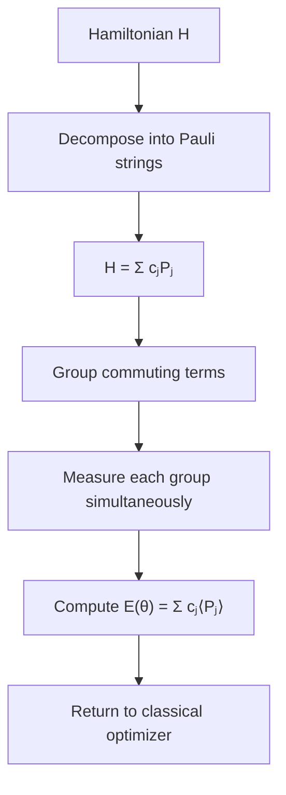
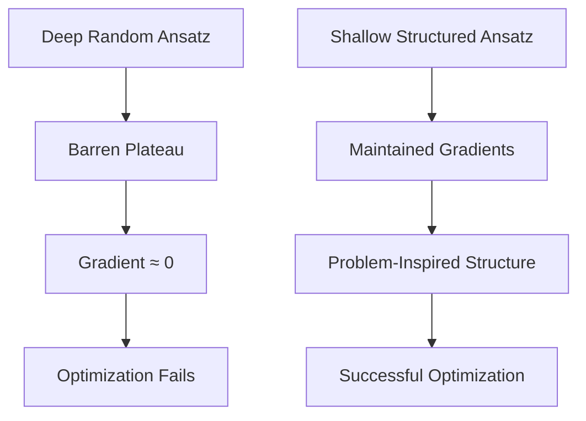

# **Chapter 6: Variational Quantum Algorithms**

---


## **Introduction**

Variational Quantum Algorithms (VQAs) represent a paradigm-shifting approach to quantum computation, specifically designed to extract computational value from Noisy Intermediate-Scale Quantum (NISQ) devices that lack the error correction capabilities required for fault-tolerant quantum computing. Unlike their fault-tolerant counterparts such as Shor's algorithm, VQAs embrace a hybrid quantum-classical strategy that leverages the complementary strengths of both computational paradigms: quantum processors excel at preparing and manipulating complex superposition states, while classical optimizers navigate the parameter landscape to minimize or maximize objective functions. This chapter explores the two foundational VQAs—the Variational Quantum Eigensolver (VQE) for eigenvalue problems and the Quantum Approximate Optimization Algorithm (QAOA) for combinatorial optimization—along with the critical design considerations that determine their success. We examine how ansatz design balances expressibility against trainability, how classical optimizers overcome noisy measurement landscapes, and how convergence criteria guide the hybrid optimization loop toward meaningful solutions. Through detailed analysis of cost functions, Hamiltonian decomposition, and the notorious barren plateau phenomenon, we reveal both the promise and the practical challenges of variational quantum computing in the current technological landscape [1, 2].

---

## **Chapter Outline**

| Sec. | Title | Core Ideas & Examples |
|------|-------|----------------------|
| **6.1** | Variational Quantum Eigensolver (VQE) | Variational principle, hybrid quantum-classical loop, Hamiltonian decomposition, Pauli string measurement |
| **6.2** | Quantum Approximate Optimization Algorithm (QAOA) | Combinatorial optimization, alternating cost/mixer unitaries, QUBO formulation, depth-accuracy tradeoff |
| **6.3** | Ansatz Design (Hardware Efficient, UCC, etc.) | Expressibility vs trainability, hardware-efficient circuits, Unitary Coupled Cluster, barren plateaus |
| **6.4** | Classical Optimizers | Gradient-free (COBYLA), gradient-based (BFGS), stochastic (SPSA), parameter-shift rule, noise resilience |
| **6.5** | Cost Functions and Convergence | Expectation value estimation, shot-based measurement, commuting term grouping, convergence criteria |

---

## **6.1 Variational Quantum Eigensolver (VQE)**

---

The **Variational Quantum Eigensolver (VQE)** is a pivotal algorithm for the **Noisy Intermediate-Scale Quantum (NISQ)** era. It estimates the **ground state energy** (lowest eigenvalue) of a quantum system described by a **Hamiltonian** $H$. VQE is a **hybrid quantum-classical** algorithm, combining quantum state preparation with classical optimization.

!!! tip "NISQ-Era Workhorse"
    VQE circumvents the need for deep quantum circuits and error correction by offloading the computationally expensive optimization task to classical processors, making it one of the most practical algorithms for current quantum hardware [3].

### **The Variational Principle and Objective Function**

-----

VQE is based on the **variational principle** from quantum mechanics, which guarantees:

$$
E(\vec{\theta}) = \langle \psi(\vec{\theta}) \lvert H \rvert \psi(\vec{\theta}) \rangle \ge E_0
$$

Here:

* $|\psi(\vec{\theta})\rangle$ is a **parameterized trial state** (the **ansatz**).
* $E_0$ is the **true ground state energy**.
* $E(\vec{\theta})$ is the **expectation value** of $H$ with respect to the ansatz.

The optimization goal is:

$$
\vec{\theta}^* = \arg\min_{\vec{\theta}} E(\vec{\theta})
$$

That is, find the parameters $\vec{\theta}$ that minimize $E(\vec{\theta})$, bringing the trial state as close as possible to the true ground state.

!!! example "VQE for Molecular Hydrogen"
    For the H₂ molecule, the Hamiltonian can be mapped to a 2-qubit operator. VQE uses a simple ansatz like:
    
    $$
    |\psi(\theta)\rangle = \cos(\theta/2)|01\rangle + \sin(\theta/2)|10\rangle
    $$
    
    By varying $\theta$ and measuring $\langle H \rangle$, the classical optimizer finds the angle that minimizes the energy, yielding the ground state energy of H₂.

-----

### **The Hybrid VQE Loop**

-----

The VQE algorithm proceeds through a hybrid **quantum–classical loop**:

**Classical Initialization**

A classical computer selects an ansatz circuit $U(\vec{\theta})$ and initializes parameters $\vec{\theta}$.

**Quantum Evaluation**

* The parameter vector $\vec{\theta}$ is sent to the quantum device.
* The circuit $U(\vec{\theta})$ is executed, preparing $|\psi(\vec{\theta})\rangle$.
* The device measures the expectation value $E(\vec{\theta}) = \langle \psi(\vec{\theta}) \lvert H \rvert \psi(\vec{\theta}) \rangle$ using repeated **shots** (circuit executions).
* This estimated energy is returned to the classical optimizer.

**Classical Optimization**

An optimizer (e.g., COBYLA, SPSA, or BFGS) updates $\vec{\theta}$ to reduce $E(\vec{\theta})$.

Steps 2–3 are repeated until **convergence**, i.e., the energy plateaus or gradients vanish.

```
VQE_Algorithm(H, ansatz, initial_θ, optimizer):
    # Initialize parameters
    θ = initial_θ
    
    # Hybrid optimization loop
    while not converged:
        # Quantum step: Prepare state and measure energy
        ψ_θ = Prepare_State(ansatz, θ)
        E_θ = Measure_Expectation(H, ψ_θ)
        
        # Classical step: Update parameters
        θ = optimizer.update(θ, E_θ)
        
        # Check convergence
        if |E_θ - E_prev| < tolerance:
            converged = True
    
    return θ, E_θ
```

??? question "Why not use a purely quantum approach?"
    Purely quantum eigenvalue algorithms like QPE require deep circuits with extensive error correction—capabilities beyond current NISQ devices. VQE's hybrid approach sidesteps these requirements by using shallow quantum circuits and leveraging classical optimization, making it practical for near-term hardware.

-----

### **Hamiltonian Decomposition and Measurement**

-----

To compute $E(\vec{\theta})$ on a quantum device, the Hamiltonian $H$ must be **decomposed** into measurable components.

**Pauli Decomposition**

The Hamiltonian is expressed as a **linear combination of Pauli strings**:

$$
H = \sum_j c_j P_j
$$

where:

* $c_j \in \mathbb{R}$ are coefficients.
* Each $P_j$ is a **tensor product of Pauli operators**, e.g., $X \otimes I \otimes Z$.

**Measurement of Expectation Values**

The energy expectation is:

$$
E(\vec{\theta}) = \sum_j c_j \langle \psi(\vec{\theta}) \lvert P_j \rvert \psi(\vec{\theta}) \rangle
$$

Each term requires measuring the observable $P_j$ on the prepared state $|\psi(\vec{\theta})\rangle$.

**Measurement Grouping (Optimization)**

Only **mutually commuting** Pauli strings can be measured simultaneously. Therefore:

* Group commuting $P_j$ together.
* Assign each group to a shared measurement basis.
* This reduces the number of required **quantum circuit runs (shots)**, improving efficiency.



**Applications**

VQE is widely used in **quantum chemistry**, particularly for estimating molecular ground state energies (e.g., hydrogen, lithium hydride). But the VQE framework also generalizes to:

* Solving general eigenvalue problems
* Materials simulation
* Variational quantum machine learning

---

## **6.2 Quantum Approximate Optimization Algorithm (QAOA)**

---

The **Quantum Approximate Optimization Algorithm (QAOA)** is a hybrid quantum-classical algorithm specifically designed to find approximate solutions to **combinatorial optimization problems**, such as MaxCut, satisfiability (SAT), and various graph problems. Like VQE, QAOA operates within the **NISQ** paradigm by utilizing a parameterized circuit optimized by a classical loop.

!!! tip "Optimization in the NISQ Era"
    QAOA represents a fundamentally different approach than classical approximation algorithms—it uses quantum interference to explore the solution space in ways classical methods cannot, potentially offering polynomial speedups for certain hard combinatorial problems [4].

### **Problem Formulation**

-----

QAOA is applied to problems that can be mapped onto a **Quadratic Unconstrained Binary Optimization (QUBO)** form, or equivalently, an **Ising Hamiltonian**. The goal is to maximize the value of a cost function $C(z)$ over a binary string $z \in \{0,1\}^n$, where the cost function $C$ is a sum of terms corresponding to the problem constraints:

$$
\text{Maximize} \quad \langle C \rangle = \langle \vec{\gamma}, \vec{\beta} | C | \vec{\gamma}, \vec{\beta} \rangle
$$

The cost function $C$ is treated as a diagonal Hamiltonian in the computational basis, meaning its eigenvalues correspond to the possible objective values $C(z)$ for each configuration $z$.

!!! example "MaxCut as QAOA Problem"
    For a graph with edges $(i,j)$, the MaxCut cost Hamiltonian is:
    
    $$
    C = \sum_{(i,j) \in E} \frac{1}{2}(1 - Z_i Z_j)
    $$
    
    Each term equals 1 when qubits $i$ and $j$ differ (edge is "cut"), and 0 when they match. QAOA seeks the bitstring $|z\rangle$ that maximizes the number of cut edges.

-----

### **The QAOA Circuit and Alternating Unitaries**

-----

The QAOA circuit prepares a final state $|\vec{\gamma}, \vec{\beta}\rangle$ by starting from an initial uniform superposition and iteratively applying two types of unitary operators in an alternating sequence. The algorithm structure is defined by the number of alternating layers, $p$:

$$
|\vec{\gamma}, \vec{\beta}\rangle = U_M(\beta_p) U_C(\gamma_p) \cdots U_M(\beta_1) U_C(\gamma_1) |+\rangle^{\otimes n}
$$

The initial state is the uniform superposition $|\psi_0\rangle = |+\rangle^{\otimes n}$, created by applying $H^{\otimes n}$ to $|0\rangle^{\otimes n}$.

**The Two Alternating Unitaries**

**Cost Unitary ($U_C(\gamma)$):**

* **Generator:** The problem's cost Hamiltonian $C$.
* **Action:** $U_C(\gamma) = e^{-i \gamma C}$. This unitary applies a phase to each basis state $|z\rangle$ proportional to its cost $C(z)$, thereby encoding the optimization objective into the quantum state.
* **Role:** **Encodes the constraints** and drives the state toward the low-energy (optimal) solutions of the problem Hamiltonian $C$.

**Mixer Unitary ($U_M(\beta)$):**

* **Generator:** A simple, non-commuting operator, typically the sum of Pauli X matrices across all qubits: $B = \sum_i X_i$.
* **Action:** $U_M(\beta) = e^{-i \beta B}$. This operation is a product of single-qubit $R_x$ rotations.
* **Role:** Introduces **quantum fluctuations** and entanglement, enabling the state to explore the entire solution space and preventing it from becoming trapped in local minima found by the cost unitary. It ensures the circuit is **ergodic** and **trainable**.

```
QAOA_Circuit(C, p, γ, β):
    # Initialize uniform superposition
    ψ = H⊗ⁿ|0⟩⊗ⁿ
    
    # Apply p layers of alternating unitaries
    for layer = 1 to p:
        # Apply cost unitary
        ψ = exp(-i·γ[layer]·C)·ψ
        
        # Apply mixer unitary
        ψ = exp(-i·β[layer]·B)·ψ
    
    # Measure in computational basis
    return Measure(ψ)
```

-----

### **Trade-offs and Performance**

-----

QAOA is a **variational** algorithm, meaning the parameters $\vec{\gamma}$ and $\vec{\beta}$ are optimized classically to maximize the measured objective function $\langle C \rangle$.

* **Accuracy vs. Depth:** The accuracy of the approximation found by QAOA is typically proportional to the number of layers, $p$. However, increasing $p$ leads to a **deeper circuit depth**, which increases the computational cost and the risk of accumulating errors on NISQ devices.
* **Performance Guarantee:** QAOA has theoretical performance guarantees, showing that for a sufficient number of layers $p$, it can often outperform simple classical approximation algorithms for certain optimization problems, especially graph-based problems like MaxCut.

??? question "How does QAOA compare to classical algorithms?"
    For MaxCut on 3-regular graphs, QAOA with $p=1$ achieves an approximation ratio of 0.6924, which already beats simple classical greedy algorithms. As $p \to \infty$, QAOA approaches the optimal solution, though practical implementations are limited by circuit depth and noise on NISQ hardware [5].

---

## **6.3 Ansatz Design (Hardware Efficient, UCC, etc.)**

---

The **ansatz** ($|\psi(\vec{\theta})\rangle$) is the parameterized quantum circuit that defines the space of trial solutions in variational quantum algorithms (VQAs). Designing an effective ansatz is crucial because it determines both the **expressibility** (ability to reach the optimal solution) and the **trainability** (ease of optimization) of the VQA.

!!! tip "The Ansatz Dilemma"
    Ansatz design embodies a fundamental tradeoff: circuits must be expressive enough to approximate the target state, yet structured enough to avoid barren plateaus where gradients vanish exponentially. This balance determines whether a VQA succeeds or fails [6].

### **Desirable Properties of an Ansatz**

-----

A well-designed ansatz must balance competing requirements to be successful on Noisy Intermediate-Scale Quantum (NISQ) hardware:

* **Expressibility:** The ansatz must be capable of generating a state that is arbitrarily close to the true target state (e.g., the ground state in VQE).
* **Trainability:** The optimization landscape (cost function surface) generated by the ansatz should not suffer from **Barren Plateaus**, where the gradient approaches zero exponentially with system size. It needs structure and locality to maintain gradients in the search space.
* **Hardware Compatibility:** The circuit depth must be shallow to minimize errors from decoherence, and the gate sequence must adhere to the physical **connectivity** (topology) of the quantum processor.

-----

### **Types of Ansatz Structures**

-----

Ansatz structures are typically classified based on their underlying design philosophy:

**Hardware-Efficient Ansatz**

This type of ansatz prioritizes **depth and connectivity** over physical fidelity to the target problem.

* **Structure:** It consists of alternating layers of parameterized single-qubit rotations (e.g., $R_x, R_y, R_z$) and fixed, multi-qubit entangling gates (e.g., CNOTs) that match the native connectivity of the device (e.g., linear or grid).
* **Advantage:** **Shallow depth** and **high expressibility** relative to its circuit volume, making it highly compatible with NISQ devices.
* **Disadvantage:** Lack of a problem-specific structure means it might require a large number of variational parameters ($\vec{\theta}$).

**Unitary Coupled Cluster (UCC) Ansatz**

The UCC ansatz is **problem-inspired**, deriving its structure directly from established quantum chemistry methods.

* **Structure:** The trial state is generated by applying a unitary operator based on the coupled cluster excitation operator ($T$) to a reference state $|\phi\rangle$ (usually the Hartree-Fock ground state).

$$
|\psi(\vec{\theta})\rangle = e^{T - T^\dagger} |\phi\rangle
$$

where $T$ contains single, double, and higher-order excitation operators.

* **Advantage:** **Guarantees chemical accuracy** and is scalable in principle because the parameter count is controlled by the physical model (number of excitations).
* **Disadvantage:** Requires deep circuits and complex gate sequences to implement the exponential operator, often making it prohibitive on current NISQ hardware.

!!! example "Hardware-Efficient vs UCC"
    For a 4-qubit chemistry problem:
    - **Hardware-Efficient:** 10-20 parameters, circuit depth ~5-10, works on any topology
    - **UCC (UCCSD):** 3-8 parameters (chemically motivated), circuit depth ~20-50, requires high connectivity
    
    The hardware-efficient ansatz trades parameter efficiency for shallower circuits, while UCC prioritizes physical accuracy at the cost of depth.

**Problem-Inspired Ansatz**

This general category includes structures tailored to encode known symmetries or constraints of the problem. **QAOA's circuit structure** (alternating cost and mixer unitaries) is the most prominent example of a problem-inspired ansatz designed for combinatorial optimization. These ansätze are generally shallow and incorporate known symmetries, thereby maintaining larger gradients and mitigating the risk of **Barren Plateaus**.

-----

### **Mitigation of Barren Plateaus**

-----

The choice of ansatz is the primary method for confronting the **Barren Plateau** phenomenon, where the optimization landscape flattens exponentially with circuit size. By preferring **shallow**, **structured** (problem-inspired or UCC-based), and **local** designs over deep, random, or high-connectivity circuits, designers restrict the search space to a manageable, trainable subspace, ensuring the classical optimizer can efficiently find the direction of the minimum.



??? question "Can we detect barren plateaus before optimization?"
    Yes! Recent research shows that gradient variance scales inversely with the Hilbert space dimension for certain ansatz types. By analyzing the ansatz structure—particularly its depth, entanglement pattern, and parameter distribution—we can predict susceptibility to barren plateaus before running expensive optimization [7].

---

## **6.4 Classical Optimizers**

---

Classical optimization is the indispensable counterpart to the quantum computation step in **Variational Quantum Algorithms (VQAs)**, forming the "classical engine" that drives the minimization of the cost function $C(\vec{\theta})$. The choice of optimizer significantly impacts the algorithm's **convergence speed, resilience to noise**, and ability to avoid local minima or **Barren Plateaus**.

!!! tip "The Classical Engine"
    While quantum processors prepare superpositions and measure expectation values, classical optimizers navigate the parameter landscape—often a rugged, noisy terrain littered with local minima. The optimizer's sophistication often determines whether a VQA succeeds or fails [8].

### **Role of the Optimizer**

-----

The optimizer's task is to efficiently determine the next set of improved parameters $\vec{\theta}'$ to send back to the quantum hardware, based on the cost function value $C(\vec{\theta})$ measured in the previous quantum step.

The classical optimizer manages several critical challenges inherent to VQAs:

* **Noise and Shot Fluctuation:** The cost function $C(\vec{\theta})$ is not evaluated exactly but is **estimated** via finite sampling (shots) on noisy quantum hardware, leading to statistical fluctuations.
* **Barren Plateaus:** In large circuits, the optimization landscape becomes exponentially flat, making the calculated gradient near zero and ineffective.
* **Computational Cost:** Calculating the analytic gradient on a quantum computer can be expensive, motivating the use of gradient-free or stochastic methods.

-----

### **Classification of Classical Optimizers**

-----

Classical optimizers used in VQAs are broadly classified by how they interact with the cost function to determine the descent direction:

**Gradient-Free Optimizers**

These methods rely solely on function evaluations ($C(\vec{\theta})$) rather than explicit gradient calculation. They are often robust to noise and suitable for scenarios where parameter count is small or gradients are too difficult to compute.

* **COBYLA (Constrained Optimization By Linear Approximation):** A common example that iteratively approximates the objective function with a linear model within a trust region.
* **Nelder-Mead and Powell:** Other direct search methods that evolve a set of test points (simplex) to find the minimum.

**Gradient-Based Optimizers**

These methods use the gradient ($\nabla C(\vec{\theta})$) to determine the steepest descent direction, typically leading to faster convergence near the minimum.

* **BFGS (Broyden–Fletcher–Goldfarb–Shanno):** A quasi-Newton method that approximates the Hessian matrix (second derivatives) using past gradient information.
* **Adam (Adaptive Moment Estimation):** Popular in deep learning, this method calculates adaptive learning rates for each parameter, using momentum to stabilize updates.

**Stochastic Optimizers**

These methods estimate the gradient using only a limited number of function evaluations, making them highly effective when dealing with noisy, high-dimensional search spaces.

* **SPSA (Simultaneous Perturbation Stochastic Approximation):** This method is particularly well-suited for VQAs due to its resilience to noise. It estimates the gradient by sampling the cost function at only two points in a randomly perturbed direction for each iteration, making it highly efficient in terms of quantum circuit executions.

!!! example "SPSA vs Parameter-Shift Gradient"
    For a VQA with 100 parameters:
    - **Parameter-Shift Rule:** Requires 200 circuit evaluations per gradient (2 per parameter)
    - **SPSA:** Requires only 2 circuit evaluations per iteration (independent of parameter count)
    
    This 100× reduction in quantum circuit calls makes SPSA especially valuable for NISQ devices where circuit executions are expensive.

```
SPSA_Optimizer(C, θ, max_iterations):
    for iteration = 1 to max_iterations:
        # Generate random perturbation
        Δ = Random_Direction()
        
        # Evaluate cost at perturbed points
        C_plus = Evaluate(θ + c·Δ)
        C_minus = Evaluate(θ - c·Δ)
        
        # Estimate gradient
        gradient_estimate = (C_plus - C_minus) / (2·c·Δ)
        
        # Update parameters
        θ = θ - learning_rate · gradient_estimate
    
    return θ
```

-----

### **Trade-offs and Best Practices**

-----

The choice of optimizer often involves a trade-off between the number of calls to the quantum processor (convergence speed) and the tolerance for noisy measurements:

* **SPSA vs. Gradient-Free:** SPSA often outperforms purely gradient-free methods when the number of parameters is large and the quantum noise is significant.
* **Gradient Calculation Cost:** Even for gradient-based methods, the gradient is often calculated using the **parameter-shift rule** on the quantum hardware itself, which requires multiple circuit evaluations per gradient component. This overhead motivates the use of SPSA, which only requires two evaluations, irrespective of the parameter count.

The optimal choice of optimizer is therefore often empirical, depending on the specific VQA problem, the chosen **ansatz**, and the noise characteristics of the underlying quantum hardware.

??? question "When should I use gradient-free vs gradient-based optimizers?"
    Use gradient-free optimizers (COBYLA, Nelder-Mead) for low-dimensional problems (<10 parameters) or when gradients are unreliable due to noise. Use gradient-based methods (BFGS, Adam) with parameter-shift rule when gradients are trustworthy and the landscape is smooth. Use SPSA when you have many parameters (>20) and need to minimize quantum circuit evaluations [9].

---

## **6.5 Cost Functions and Convergence**

---

In **Variational Quantum Algorithms (VQAs)**, the **Cost Function** $C(\vec{\theta})$ is the scalar objective quantity that the hybrid quantum-classical loop seeks to optimize (minimize for VQE, maximize for QAOA). **Convergence** is the final stage of the optimization where the parameters stabilize, indicating that a satisfactory solution has been found.

!!! tip "Measurement is Everything"
    The cost function in VQAs is fundamentally statistical—it emerges from finite sampling of quantum measurements. Understanding shot noise, measurement grouping, and convergence criteria is essential for extracting reliable results from NISQ hardware [10].

### **Cost Function Definition and Evaluation**

-----

The VQA cost function is typically an **expectation value** of a quantum observable, measured from the parameterized quantum state $|\psi(\vec{\theta})\rangle$.

* **For VQE:** The cost function is the expectation value of the Hamiltonian $H$:

$$
C(\vec{\theta}) = E(\vec{\theta}) = \langle \psi(\vec{\theta}) | H | \psi(\vec{\theta}) \rangle
$$

* **For QAOA:** The cost function is the expectation value of the combinatorial cost Hamiltonian $C$.

**Shot-Based Estimation**

Since quantum hardware cannot measure the expectation value exactly, the cost function is determined using **shot-based estimation** (finite sampling). The quantum circuit is run a finite number of times (shots), and the expectation value is computed as the statistical mean of the measurement results.

**Measurement Optimization via Commuting Terms**

To make the cost function evaluation efficient, especially when the Hamiltonian $H$ is a long sum of Pauli strings ($H = \sum_j c_j P_j$):

* **Grouping Commuting Terms:** The primary measurement optimization is to **group mutually commuting Pauli strings** ($P_j$). Quantum mechanics allows operators that commute (i.e., $P_j P_k = P_k P_j$) to be measured simultaneously in a single circuit run.
* **Efficiency Gain:** This grouping significantly reduces the total number of required measurement circuit executions (shots), drastically lowering the time and cost of the optimization loop.

!!! example "Measurement Grouping Efficiency"
    Consider a Hamiltonian with 20 Pauli terms:
    
    $$
    H = 0.5·Z_0 + 0.3·Z_1 + 0.2·X_0X_1 + \ldots
    $$
    
    Without grouping: 20 separate measurement bases required.
    With grouping: Terms like $Z_0, Z_1, Z_0Z_1$ commute and can be measured together in Z-basis, reducing to ~5-7 measurement bases.

-----

### **Convergence Criteria**

-----

The optimization loop continues until predefined **convergence criteria** are met, signaling that the classical optimizer has settled near a local or global minimum.

* **Cost Plateau:** The most common criterion is when the energy ($E(\vec{\theta})$) or cost **plateaus**, meaning subsequent changes in the cost function value fall below a set tolerance.

$$
|C(\vec{\theta}_{\text{new}}) - C(\vec{\theta}_{\text{old}})| < \epsilon
$$

* **Parameter Stability:** **Convergence** is also indicated when the updates to the parameter vector $\vec{\theta}$ become negligible, meaning the parameters have stabilized.

$$
||\vec{\theta}_{\text{new}} - \vec{\theta}_{\text{old}}|| < \delta
$$

* **Gradient Norm:** If using a gradient-based optimizer (e.g., SPSA or BFGS), convergence is often declared when the norm of the gradient, $||\nabla C(\vec{\theta})||$, approaches zero.

$$
||\nabla C(\vec{\theta})|| < \gamma
$$

The inherent **noise and statistical fluctuation** of VQA measurements mean that true convergence may not achieve the mathematical precision of classical optimization; instead, the process aims to find a robust minimum within the constraints of the NISQ device.

```
Check_Convergence(C_current, C_previous, θ_current, θ_previous):
    # Cost plateau criterion
    if |C_current - C_previous| < ε_cost:
        return True
    
    # Parameter stability criterion
    if ||θ_current - θ_previous|| < ε_param:
        return True
    
    # Maximum iterations reached
    if iteration > max_iterations:
        return True
    
    return False
```

??? question "How many shots are needed for reliable cost function estimation?"
    The required shot count depends on the desired precision. For chemical accuracy ($\sim$1 kcal/mol), typically 10³-10⁴ shots suffice for small molecules. The uncertainty scales as $1/\sqrt{N_{\text{shots}}}$, so reducing error by 10× requires 100× more shots. Adaptive shot allocation—using fewer shots early in optimization and more near convergence—can significantly reduce total quantum circuit evaluations.

---

## Summary of Variational Algorithms

This table contrasts the two primary variational algorithms—**VQE** and **QAOA**—highlighting their goals, unitary structures, ansatz strategies, optimization roles, and key implementation challenges. A third column summarizes general insights applicable to all **Variational Quantum Algorithms (VQAs)**.

---

| **Component / Algorithm** | **VQE** (Variational Quantum Eigensolver) | **QAOA** (Quantum Approximate Optimization Algorithm) | **General VQA Concepts** |
| :------------------------ | :-------------------------------------------------------------------------------------------------------------------------- | :-------------------------------------------------------------------------------------------------------------------------------------- | :--------------------------------------------------------------------------------------------------------------- |
| **Primary Goal** | Find the **ground state energy** $E_0$ of a Hamiltonian $H$. | Approximate the optimal solution $\vec{z}^*$ to a **combinatorial optimization** problem (e.g., MaxCut). | Hybrid quantum-classical method tailored for **NISQ** devices. |
| **Objective Function** | Minimize the expectation value: $$E(\vec{\theta}) = \langle \psi(\vec{\theta}) \lvert H \rvert \psi(\vec{\theta}) \rangle$$ | Maximize the cost function: $$\langle C \rangle = \langle \vec{\gamma}, \vec{\beta} \lvert C \rvert \vec{\gamma}, \vec{\beta} \rangle$$ | Objective is estimated via **shot-based measurement** on the quantum processor. |
| **Key Unitary 1: Cost** | Encoded directly in the Hamiltonian $H$ (diagonal in energy basis). | **Cost unitary:** $$U_C(\gamma) = e^{-i\gamma C}$$ applies phase based on solution quality. | Hamiltonian or cost operator is decomposed as $$H = \sum_j c_j P_j$$ for measurement. |
| **Key Unitary 2: Mixer** | Implicit within the ansatz (e.g., in UCC circuits). | **Mixer unitary:** $$U_M(\beta) = e^{-i\beta B}$$ where $B = \sum X_i$ (drives exploration). | Mixer provides **quantum fluctuation**, ensuring **trainability and ergodicity**. |
| **Ansatz Type** | Chemistry-inspired (**UCC**) or **hardware-efficient** circuits. | Alternating layers of $U_C$ and $U_M$ (problem-inspired). | Trade-off between **expressibility** and **trainability**; overly deep circuits may suffer from barren plateaus. |
| **Classical Optimizer** | Updates parameters $\vec{\theta}$ based on measured $E(\vec{\theta})$. Needs to be **noise-resilient**. | Optimizers like **SPSA** are popular (only 2 circuit evaluations per iteration). | Convergence occurs when the cost function plateaus or gradient norms become small. |
| **Dominant Challenge** | **Barren plateaus**: vanishing gradients in large ansätze. | Trade-off between **circuit depth** $p$ and solution quality. | **Measurement overhead** is reduced by **grouping commuting Pauli terms** into joint bases. |

This table provides a conceptual map for comparing and designing variational algorithms under hardware and resource constraints.

---

## **References**

---

[1] Cerezo, M., et al. (2021). Variational quantum algorithms. *Nature Reviews Physics*, 3(9), 625-644.

[2] Bharti, K., et al. (2022). Noisy intermediate-scale quantum algorithms. *Reviews of Modern Physics*, 94(1), 015004.

[3] Peruzzo, A., et al. (2014). A variational eigenvalue solver on a photonic quantum processor. *Nature Communications*, 5(1), 4213.

[4] Farhi, E., Goldstone, J., & Gutmann, S. (2014). A quantum approximate optimization algorithm. *arXiv preprint arXiv:1411.4028*.

[5] Zhou, L., Wang, S. T., Choi, S., Pichler, H., & Lukin, M. D. (2020). Quantum approximate optimization algorithm: Performance, mechanism, and implementation on near-term devices. *Physical Review X*, 10(2), 021067.

[6] Sim, S., Johnson, P. D., & Aspuru-Guzik, A. (2019). Expressibility and entangling capability of parameterized quantum circuits for hybrid quantum-classical algorithms. *Advanced Quantum Technologies*, 2(12), 1900070.

[7] McClean, J. R., Boixo, S., Smelyanskiy, V. N., Babbush, R., & Neven, H. (2018). Barren plateaus in quantum neural network training landscapes. *Nature Communications*, 9(1), 4812.

[8] Nakanishi, K. M., Fujii, K., & Todo, S. (2020). Sequential minimal optimization for quantum-classical hybrid algorithms. *Physical Review Research*, 2(4), 043158.

[9] Spall, J. C. (1998). Implementation of the simultaneous perturbation algorithm for stochastic optimization. *IEEE Transactions on Aerospace and Electronic Systems*, 34(3), 817-823.

[10] Yen, T. C., Verteletskyi, V., & Izmaylov, A. F. (2020). Measuring all compatible operators in one series of single-qubit measurements using unitary transformations. *Journal of Chemical Theory and Computation*, 16(4), 2400-2409.


