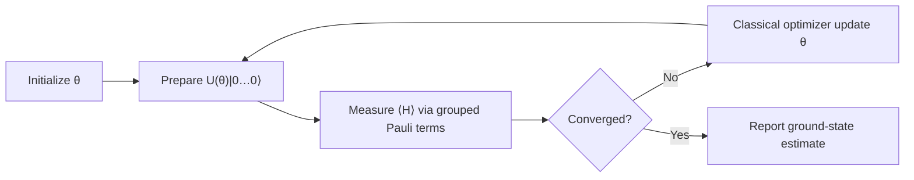
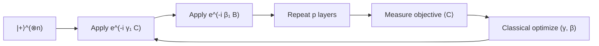

# **Chapter 6: Variational Quantum Algorithms**

---

> **Summary:** This chapter explores Variational Quantum Algorithms (VQAs), a hybrid quantum-classical approach designed for NISQ-era devices. We delve into the two foundational VQAs—the Variational Quantum Eigensolver (VQE) for eigenvalue problems and the Quantum Approximate Optimization Algorithm (QAOA) for combinatorial optimization. The chapter examines the critical design considerations of ansatz design, classical optimizers, cost functions, and the challenges posed by barren plateaus, providing a comprehensive overview of this leading paradigm in near-term quantum computing.

---

The goal of this chapter is to establish concepts in variational quantum algorithms and their applications. These algorithms leverage parameterized quantum circuits optimized via classical methods to solve problems in quantum chemistry, combinatorial optimization, and machine learning.

---


## **6.1 Variational Quantum Eigensolver (VQE)** {.heading-with-pill}

> **Difficulty:** ★★★☆☆
> 
> **Concept:** Hybrid minimization of ground-state energy via parameterized circuits
> 
> **Summary:** VQE estimates the ground-state energy of a Hamiltonian by preparing an ansatz state, measuring the expectation value of the Hamiltonian, and updating parameters with a classical optimizer until convergence.

### **Theoretical Background**

The Variational Quantum Eigensolver (VQE) is a hybrid quantum-classical algorithm that exploits the variational principle to approximate the ground state energy of quantum systems, enabling quantum chemistry and materials science simulations on NISQ hardware.

**Variational Principle Foundation:**  
For a Hermitian Hamiltonian $\mathbf{H}$ acting on $n$ qubits with eigenstates $|\phi_k\rangle$ and eigenvalues $E_k$ ordered as $E_0 \leq E_1 \leq \cdots \leq E_{2^n-1}$, the Rayleigh-Ritz variational principle states:

$$
E_0 = \min_{|\psi\rangle \in \mathcal{H}} \frac{\langle\psi|\mathbf{H}|\psi\rangle}{\langle\psi|\psi\rangle}
$$

For normalized states $\langle\psi|\psi\rangle = 1$, expanding in the energy eigenbasis:

$$
|\psi\rangle = \sum_{k=0}^{2^n-1} \alpha_k |\phi_k\rangle \quad \text{with} \quad \sum_k |\alpha_k|^2 = 1
$$

The energy expectation becomes:

$$
\langle\psi|\mathbf{H}|\psi\rangle = \sum_{k=0}^{2^n-1} |\alpha_k|^2 E_k \geq E_0 \sum_{k=0}^{2^n-1} |\alpha_k|^2 = E_0
$$

with equality if and only if $|\psi\rangle = |\phi_0\rangle$ (the ground state).

**Pauli Decomposition:**  
Any Hermitian operator on $n$ qubits admits a unique decomposition into Pauli tensor products:

$$
\mathbf{H} = \sum_{j=0}^{4^n-1} c_j \mathbf{P}_j, \quad \mathbf{P}_j \in \{\mathbf{I}, \mathbf{X}, \mathbf{Y}, \mathbf{Z}\}^{\otimes n}, \quad c_j \in \mathbb{R}
$$

where coefficients are obtained via:

$$
c_j = \frac{1}{2^n} \text{Tr}(\mathbf{H} \mathbf{P}_j)
$$

For molecular Hamiltonians, the Jordan-Wigner or Bravyi-Kitaev transformation maps fermionic operators to Pauli strings, typically yielding $\mathcal{O}(n^4)$ terms for $n$ spin-orbitals.

**Parameterized Ansatz:**  
Define a quantum circuit $\mathbf{U}(\vec{\theta})$ with $m$ tunable parameters $\vec{\theta} = (\theta_1, \ldots, \theta_m)$ preparing trial states:

$$
|\psi(\vec{\theta})\rangle = \mathbf{U}(\vec{\theta})|0\rangle^{\otimes n}
$$

The energy landscape is:

$$
E(\vec{\theta}) = \langle\psi(\vec{\theta})|\mathbf{H}|\psi(\vec{\theta})\rangle = \sum_{j=0}^{4^n-1} c_j \langle\psi(\vec{\theta})|\mathbf{P}_j|\psi(\vec{\theta})\rangle
$$

**Measurement and Estimation:**  
Each Pauli expectation $\langle\mathbf{P}_j\rangle$ is estimated from $N$ measurements via:

$$
\widehat{\langle\mathbf{P}_j\rangle} = \frac{1}{N}\sum_{k=1}^{N} \lambda_k^{(j)}, \quad \lambda_k^{(j)} \in \{\pm 1\}
$$

The estimator variance is bounded by:

$$
\text{Var}[\widehat{\langle\mathbf{P}_j\rangle}] = \frac{1 - \langle\mathbf{P}_j\rangle^2}{N} \leq \frac{1}{N}
$$

Total energy variance becomes:

$$
\text{Var}[\widehat{E}(\vec{\theta})] = \sum_j c_j^2 \text{Var}[\widehat{\langle\mathbf{P}_j\rangle}] \leq \frac{1}{N}\sum_j c_j^2
$$

**Gradient Computation via Parameter-Shift:**  
For gates generated by Pauli operators $\mathbf{U}(\theta) = e^{-i\theta \mathbf{G}/2}$ with $\mathbf{G}^2 = \mathbf{I}$, the parameter-shift rule provides exact gradients:

$$
\frac{\partial E}{\partial \theta_i} = \frac{E(\vec{\theta} + \frac{\pi}{2}\hat{e}_i) - E(\vec{\theta} - \frac{\pi}{2}\hat{e}_i)}{2}
$$

This enables gradient-based optimization using only circuit evaluations, requiring $2m$ measurements per iteration for $m$ parameters.

**Convergence Criterion:**  
Optimization terminates when:

$$
|E(\vec{\theta}_{k+1}) - E(\vec{\theta}_k)| < \epsilon \quad \text{and} \quad \|\nabla E(\vec{\theta}_k)\| < \delta
$$

for tolerance thresholds $\epsilon, \delta > 0$, ensuring both energy stabilization and vanishing gradients.



### **Comprehension Check**

!!! note "Quiz"
	**1. What quantity does VQE minimize?**

	- A. Circuit depth  
	- B. Number of entangling gates  
	- C. The variance of measurements  
	- D. The expected energy $E(\mathbf{\theta})$  

	**2. Why decompose $\mathbf{H}$ into Pauli strings?**

	- A. To reduce qubit count  
	- B. To enable term-wise measurement on hardware  
	- C. To avoid using unitaries  
	- D. To remove non-commuting terms  

	??? info "See Answer"
		**1: D** — The VQE objective is $E(\mathbf{\theta}) = \langle \psi(\mathbf{\theta}) \rvert \mathbf{H} \lvert \psi(\mathbf{\theta}) \rangle$.  
		**2: B** — Pauli decomposition allows hardware-friendly expectation estimation term by term (with grouping when commuting).

-----

!!! abstract "Interview-Style Question"

	**Q:** Define the role of the classical optimizer in VQE and discuss when gradient-based vs. gradient-free methods are preferable on NISQ devices.

	???+ info "Answer Strategy"
		**The Classical Optimizer Role**  
		In VQE's hybrid loop, the classical optimizer navigates the energy landscape $E(\vec{\theta}) = \langle\psi(\vec{\theta})|H|\psi(\vec{\theta})\rangle$ toward the ground state minimum. It processes noisy quantum measurements and updates ansatz parameters $\vec{\theta}$ iteratively until convergence.

		**Gradient-Based Methods (Adam, L-BFGS)**  
		These use the parameter-shift rule to compute gradients: $\frac{\partial E}{\partial \theta_i} = \frac{E(\vec{\theta} + \frac{\pi}{2}\hat{e}_i) - E(\vec{\theta} - \frac{\pi}{2}\hat{e}_i)}{2}$, requiring $2d$ circuit evaluations for $d$ parameters. They converge rapidly when shot noise is small ($N_{\text{shots}} \sim 10^4$), gradients are measurable (not in barren plateaus where $|\nabla E| \sim e^{-n}$), and the landscape is smooth. Best for small problems ($n \leq 6$ qubits, $d \leq 12$ parameters).

		**Gradient-Free Methods (COBYLA, SPSA, Nelder-Mead)**  
		SPSA estimates gradients via random perturbations using only 2 evaluations per iteration regardless of dimension, versus $2d$ for parameter-shift. These methods naturally average out shot noise and make progress even in barren plateau regions by using finite-difference scales larger than vanishing gradients. Preferred when shot noise is high, parameter count exceeds 50, or barren plateaus are suspected.

		**NISQ Recommendations**  
		For $n > 15$ qubits on noisy hardware, gradient-free methods (especially SPSA) dominate due to superior scaling and noise resilience. Medium problems ($7 \leq n \leq 15$) balance with COBYLA. Only small, low-noise scenarios favor gradient-based approaches. Device calibration drift and limited coherence make minimizing circuit repetitions critical, giving gradient-free methods a decisive advantage.

### **<i class="fa-solid fa-flask"></i> Hands-On Projects**

#### **Project Blueprint**

| **Section**              | **Description** |
| ------------------------ | --------------- |
| **Objective**            | Estimate the ground-state energy of $\mathbf{H}=\tfrac{1}{2}\,\mathbf{Z}_0 + \tfrac{1}{2}\,\mathbf{Z}_1$ using a two-qubit hardware-efficient ansatz. |
| **Mathematical Concept** | Variational principle: $E(\mathbf{\theta}) \ge E_0$; measurement of $\langle \mathbf{Z}_i \rangle$. |
| **Experiment Setup**     | Start in $\lvert 00\rangle$; ansatz with layers $\mathbf{R}_y(\theta_i)$ and a CNOT; measure $\langle \mathbf{Z}_0 \rangle$, $\langle \mathbf{Z}_1 \rangle$. |
| **Process Steps**        | Prepare ansatz $\mathbf{U}(\mathbf{\theta})$; estimate $E(\mathbf{\theta})$ from Pauli terms; update $\mathbf{\theta}$; repeat until convergence. |
| **Expected Behavior**    | Energy decreases monotonically (up to noise) and stabilizes near the minimum consistent with the ansatz. |
| **Tracking Variables**   | Parameters $\mathbf{\theta}$, energy $E$, shot count $N$, gradient norm $\|\nabla E\|$. |
| **Verification Goal**    | Final $E$ within a tolerance of the analytical minimum ($-1$ for this $\mathbf{H}$) given ansatz expressivity. |
| **Output**               | Best parameters $\mathbf{\theta}^*$ and estimated energy $E(\mathbf{\theta}^*)$. |

#### **Pseudocode Implementation**
```pseudo-code
FUNCTION Run_VQE(Hamiltonian, Ansatz, Optimizer, initial_params, convergence_criteria):
    # Assert inputs are valid
    ASSERT Is_Valid_Hamiltonian(Hamiltonian)
    ASSERT Is_Valid_Ansatz(Ansatz)
    
    params = initial_params
    energy_history = []

    FOR epoch IN 1..max_epochs:
        # Step 1: Prepare the quantum state using the ansatz
        # The ansatz is a parameterized circuit U(θ)
        quantum_state = Ansatz(params)
        LOG "Epoch ", epoch, ": Prepared state with params ", params

        # Step 2: Measure the expectation value of the Hamiltonian
        # This is done by measuring each Pauli term and summing with coefficients
        # <H> = Σ c_j * <P_j>
        estimated_energy = Measure_Hamiltonian_Expectation(quantum_state, Hamiltonian)
        energy_history.append(estimated_energy)
        LOG "Estimated Energy: ", estimated_energy

        # Step 3: Check for convergence
        IF Has_Converged(energy_history, convergence_criteria):
            LOG "Convergence reached."
            BREAK
        END IF

        # Step 4: Use the classical optimizer to update the parameters
        # The optimizer uses the energy to suggest the next set of parameters
        new_params = Optimizer.step(params, estimated_energy)
        params = new_params
        LOG "Updated parameters: ", params
    END FOR

    # Return the best parameters found and the final energy
    best_energy = min(energy_history)
    best_params = Get_Params_For_Energy(best_energy, history)
    
    RETURN best_params, best_energy
END FUNCTION
```

#### **Outcome and Interpretation**

The optimization loop steadily reduces the empirical energy and converges to a parameter set that approximates the ground state permitted by the ansatz. Deviations from the true ground energy quantify expressibility limits and sampling noise.

---

## **6.2 Quantum Approximate Optimization Algorithm (QAOA)** {.heading-with-pill}

> **Difficulty:** ★★★★☆
> 
> **Concept:** Alternating operator ansatz for combinatorial optimization
> 
> **Summary:** QAOA alternates between a cost unitary driven by a problem Hamiltonian and a mixer unitary that explores the state space; parameters are optimized to maximize the expected objective.

### **Theoretical Background**

The Quantum Approximate Optimization Algorithm (QAOA) is a variational algorithm specifically designed for combinatorial optimization problems, using an alternating ansatz structure inspired by quantum annealing and the adiabatic theorem.

**Problem Encoding:**  
Given a binary optimization problem over $n$ bits, encode the objective function as a diagonal Hamiltonian $\mathbf{C}$ (the cost or problem Hamiltonian) whose eigenstates correspond to feasible solutions and eigenvalues encode solution quality:

$$
\mathbf{C}|z\rangle = C(z)|z\rangle, \quad z \in \{0,1\}^n
$$

The goal is to find $z^* = \arg\max_z C(z)$ or approximate it.

**Alternating Operator Ansatz:**  
For depth $p$, QAOA interleaves $p$ applications of two non-commuting unitaries:

$$
U_C(\gamma) = e^{-i\gamma \mathbf{C}}, \quad U_B(\beta) = e^{-i\beta \mathbf{B}}
$$

where $\mathbf{B}$ is the mixer Hamiltonian (typically $\mathbf{B} = \sum_{i=1}^n \mathbf{X}_i$). The QAOA state is:

$$
|\psi_p(\vec{\gamma}, \vec{\beta})\rangle = \left[\prod_{k=1}^{p} U_B(\beta_k) U_C(\gamma_k)\right] |s_0\rangle
$$

with initial state $|s_0\rangle = |+\rangle^{\otimes n} = \frac{1}{2^{n/2}}\sum_{z\in\{0,1\}^n} |z\rangle$, the equal superposition over all computational basis states.

**State Evolution Mechanism:**  
The cost unitary $U_C(\gamma)$ induces phases proportional to solution quality:

$$
U_C(\gamma)|z\rangle = e^{-i\gamma C(z)}|z\rangle
$$

which imprints the objective function as relative phases. The mixer unitary creates transitions between computational basis states:

$$
U_B(\beta) = e^{-i\beta \sum_i \mathbf{X}_i} = \prod_{i=1}^n e^{-i\beta \mathbf{X}_i} = \prod_{i=1}^n \begin{pmatrix} \cos\beta & -i\sin\beta \\ -i\sin\beta & \cos\beta \end{pmatrix}_i
$$

Alternation between phase imprinting and basis mixing enables quantum interference, constructively amplifying high-quality solutions.

**MaxCut Formulation:**  
For a graph $G=(V,E)$, the MaxCut objective is:

$$
C(z) = \sum_{(i,j)\in E} \frac{1}{2}(1 - z_i z_j), \quad z_i \in \{\pm 1\}
$$

Encoding $z_i = (-1)^{x_i}$ for computational basis $x_i \in \{0,1\}$:

$$
\mathbf{C} = \sum_{(i,j)\in E} \frac{1}{2}(\mathbf{I} - \mathbf{Z}_i \mathbf{Z}_j)
$$

The mixer is:

$$
\mathbf{B} = \sum_{i\in V} \mathbf{X}_i
$$

**Objective Function:**  
Optimize the expected cut value:

$$
\mathcal{F}_p(\vec{\gamma}, \vec{\beta}) = \langle\psi_p(\vec{\gamma}, \vec{\beta})|\mathbf{C}|\psi_p(\vec{\gamma}, \vec{\beta})\rangle
$$

Measuring in the computational basis yields bitstring $z$ with probability:

$$
P(z|\vec{\gamma}, \vec{\beta}) = |\langle z|\psi_p(\vec{\gamma}, \vec{\beta})\rangle|^2
$$

The expected value is:

$$
\mathcal{F}_p = \sum_{z\in\{0,1\}^n} P(z|\vec{\gamma}, \vec{\beta}) \cdot C(z)
$$

**Performance Analysis:**  
For MaxCut on 3-regular graphs:
- $p=1$: Approximation ratio $\geq 0.6924$ (guaranteed)  
- $p\to\infty$: Approximation ratio $\to 1$ (optimal solution)

The number of parameters scales as $2p$, making optimization tractable even for $p \sim 10-20$.

**Non-Commutativity Requirement:**  
QAOA performance requires $[\mathbf{C}, \mathbf{B}] \neq 0$. When operators commute, they share eigenbases and the product $\prod_{k} U_B(\beta_k)U_C(\gamma_k)$ collapses to depth-1 regardless of $p$, eliminating the benefits of deeper circuits.



### **Comprehension Check**

!!! note "Quiz"
	**1. Which unitary encodes the problem constraints?**

	- A. $e^{-i\beta \mathbf{B}}$  
	- B. $e^{-i\gamma \mathbf{C}}$  
	- C. Hadamards only  
	- D. Identity  

	**2. What is the main trade-off when increasing depth $p$?**

	- A. Fewer parameters  
	- B. Lower expressibility  
	- C. Greater depth and noise accumulation  
	- D. Elimination of barren plateaus  

	??? info "See Answer"
		**1: B** — The cost unitary contains the problem Hamiltonian.  
		**2: C** — Deeper circuits increase error rates and runtime on NISQ hardware.

-----

!!! abstract "Interview-Style Question"

	**Q:** Explain why $[\mathbf{C},\mathbf{B}] \ne 0$ is essential for QAOA performance. What happens if they commute?

	???+ info "Answer Strategy"
		**The Commutativity Collapse**  
		QAOA alternates cost $U_C(\gamma) = e^{-i\gamma C}$ and mixer $U_B(\beta) = e^{-i\beta B}$ unitaries. If $[C,B] = 0$, they share an eigenbasis and the Baker-Campbell-Hausdorff formula simplifies: $U_B(\beta) U_C(\gamma) = e^{-i(\beta B + \gamma C)}$. A $p$-layer circuit collapses to depth-1 regardless of $p$, reducing the parameter space from $2p$ dimensions to just 2.

		**Loss of Expressibility**  
		Non-commuting operators enable exploration of a richer state manifold. When $[C,B] \neq 0$, each layer rotates the state in different directions, interpolating between mixer eigenstates and cost eigenstates through complex superpositions. With commuting operators, the ansatz remains confined to a 2D submanifold—no entanglement patterns or interference structures needed for hard optimization emerge.

		**Physical Mechanism**  
		Non-commutativity means $C$ and $B$ don't share eigenstates. Applying $U_C$ rotates $B$ eigenstates into superpositions over $C$ eigenstates, creating quantum interference: the cost unitary imprints computational-basis phases while the mixer creates superpositions that interfere constructively on low-cost states. For MaxCut with $C = \sum_{(i,j)} \frac{1-Z_i Z_j}{2}$ and $B = \sum_i X_i$, we have $[Z_i Z_j, X_k] \neq 0$—essential for transitioning between cut configurations.

		**Performance Impact**  
		QAOA's approximation ratio improves with depth for non-commuting operators ($p=1$ achieves $\geq 0.6924$ on 3-regular graphs, $p=2$ reaches $\geq 0.7559$). If $[C,B] = 0$, increasing $p$ beyond 1 yields zero improvement—the algorithm cannot escape the depth-1 performance ceiling. Designing mixers that preserve non-commutativity while respecting problem constraints is a core QAOA design principle.

### **<i class="fa-solid fa-flask"></i> Hands-On Projects**

#### **Project Blueprint**

| **Section**              | **Description** |
| ------------------------ | --------------- |
| **Objective**            | Implement depth-$p=1$ QAOA for MaxCut on a 3-cycle and estimate the cut value. |
| **Mathematical Concept** | Expectation $\langle \mathbf{C} \rangle$ for $\mathbf{C}=\tfrac{1}{2}\sum (\mathbf{I}-\mathbf{Z}_i\mathbf{Z}_j)$. |
| **Experiment Setup**     | $n=3$ qubits; initial $\lvert + \rangle^{\otimes 3}$; apply $e^{-i\gamma \mathbf{C}}$, then $e^{-i\beta \mathbf{B}}$. |
| **Process Steps**        | Sweep $(\gamma,\beta)$ on a grid; measure $\langle \mathbf{C} \rangle$; report best parameters. |
| **Expected Behavior**    | Optimal angles cluster near known analytic optima for the 3-cycle. |
| **Tracking Variables**   | Angles $(\gamma,\beta)$, mean objective, shot count $N$. |
| **Verification Goal**    | Achieve expected approximation ratio for the 3-cycle under shot noise. |
| **Output**               | Best $(\gamma,\beta)$ and corresponding objective value. |

#### **Pseudocode Implementation**
```pseudo-code
FUNCTION Run_QAOA_for_MaxCut(graph, p_layers, initial_gamma_beta):
    # graph: The graph for the MaxCut problem
    # p_layers: The number of QAOA layers (depth p)
    # initial_gamma_beta: Starting parameters [gamma_1..p, beta_1..p]
    
    # Define the cost and mixer Hamiltonians for MaxCut
    Cost_Hamiltonian_C = Build_MaxCut_Cost_Hamiltonian(graph)
    Mixer_Hamiltonian_B = Build_Standard_Mixer_Hamiltonian(num_qubits=graph.num_nodes)

    FUNCTION evaluate_qaoa_objective(params):
        gamma = params[0:p_layers]
        beta = params[p_layers:2*p_layers]

        # Step 1: Prepare the initial state |+⟩^n
        initial_state = Prepare_Uniform_Superposition(graph.num_nodes)
        
        # Step 2: Apply the QAOA circuit layers
        current_state = initial_state
        FOR i FROM 0 TO p_layers - 1:
            # Apply cost layer: e^(-i * gamma_i * C)
            current_state = Apply_Unitary(current_state, exp(-1j * gamma[i] * Cost_Hamiltonian_C))
            # Apply mixer layer: e^(-i * beta_i * B)
            current_state = Apply_Unitary(current_state, exp(-1j * beta[i] * Mixer_Hamiltonian_B))
        END FOR
        final_state = current_state

        # Step 3: Measure the expectation value of the cost Hamiltonian <C>
        expected_cut_value = Measure_Hamiltonian_Expectation(final_state, Cost_Hamiltonian_C)
        
        # Optimizer will minimize, so we return -<C>
        RETURN -expected_cut_value
    END FUNCTION

    # Step 4: Use a classical optimizer to find the best gamma and beta
    optimizer = Classical_Optimizer(objective_function=evaluate_qaoa_objective)
    best_params = optimizer.run(initial_gamma_beta)
    
    best_gamma = best_params[0:p_layers]
    best_beta = best_params[p_layers:2*p_layers]
    max_cut_value = -evaluate_qaoa_objective(best_params)

    LOG "Optimal gamma: ", best_gamma
    LOG "Optimal beta: ", best_beta
    LOG "Maximum cut value found: ", max_cut_value

    RETURN best_gamma, best_beta, max_cut_value
END FUNCTION
```

#### **Outcome and Interpretation**

The grid search reveals an angle basin yielding near-optimal cut value for the cycle graph. Differences from the ideal arise from finite sampling and hardware noise.

---

## **6.3 Ansatz Design** {.heading-with-pill}
> **Difficulty:** ★★★☆☆
> 
> **Concept:** Circuit expressibility and trainability via architectural choices
> 
> **Summary:** Ansatz families balance depth, entanglement, and inductive bias. Hardware-efficient designs are shallow and native-gate-friendly; chemistry-inspired UCC encodes physically meaningful excitations.

### **Theoretical Background**

Ansatz design is the art of constructing parameterized quantum circuits $\mathbf{U}(\vec{\theta})$ that balance expressibility (ability to represent relevant quantum states) with trainability (ability to optimize parameters efficiently).

**Expressibility Framework:**  
An ansatz $\mathbf{U}(\vec{\theta})$ defines a parameterized manifold $\mathcal{M} = \{|\psi(\vec{\theta})\rangle : \vec{\theta} \in \Theta\}$ within the $2^n$-dimensional Hilbert space. Expressibility quantifies how uniformly $\mathcal{M}$ covers the state space.

The Haar expressibility measure compares the distribution of states $P_{\mathcal{M}}(|\psi\rangle)$ to the uniform Haar measure $P_{\text{Haar}}(|\psi\rangle)$ via the Kullback-Leibler divergence:

$$
\mathcal{E} = D_{KL}(P_{\mathcal{M}} \| P_{\text{Haar}}) = \int P_{\mathcal{M}}(|\psi\rangle) \log\frac{P_{\mathcal{M}}(|\psi\rangle)}{P_{\text{Haar}}(|\psi\rangle)} d\psi
$$

Lower $\mathcal{E}$ indicates higher expressibility. Universal gate sets achieve $\mathcal{E} \to 0$ as circuit depth $L \to \infty$.

**Hardware-Efficient Ansätze:**  
Designed to match native gate sets and qubit connectivity of NISQ devices:

$$
\mathbf{U}_{\text{HE}}(\vec{\theta}) = \left[\prod_{\ell=1}^L \mathbf{E}_{\mathcal{G}} \cdot \mathbf{R}(\vec{\theta}_\ell)\right]
$$

where:
- $\mathbf{R}(\vec{\theta}_\ell) = \bigotimes_{i=1}^n R_{y}(\theta_{\ell,i})$ are single-qubit rotations  
- $\mathbf{E}_{\mathcal{G}} = \prod_{(i,j)\in\mathcal{G}} \text{CNOT}_{i,j}$ is the entangling layer matching hardware connectivity graph $\mathcal{G}$

For $L$ layers with $n$ qubits, parameter count is $m = nL$. Circuit depth is $D = \mathcal{O}(L)$ for linear connectivity, $\mathcal{O}(L \cdot \log n)$ for all-to-all.

**Unitary Coupled Cluster (UCC) Ansatz:**  
Inspired by quantum chemistry, UCC generalizes classical coupled cluster theory:

$$
\mathbf{U}_{\text{UCC}}(\vec{\theta}) = e^{\mathbf{T}(\vec{\theta}) - \mathbf{T}^\dagger(\vec{\theta})}
$$

where the cluster operator includes single and double excitations:

$$
\mathbf{T}(\vec{\theta}) = \sum_{a>F, i\leq F} \theta_{a}^{i} (\mathbf{a}_a^\dagger \mathbf{a}_i) + \sum_{\substack{a>b>F \\ i<j\leq F}} \theta_{ab}^{ij} (\mathbf{a}_a^\dagger \mathbf{a}_b^\dagger \mathbf{a}_j \mathbf{a}_i)
$$

Here $i,j$ index occupied orbitals and $a,b$ index virtual orbitals, with Fermi level $F$. For $n$ spin-orbitals:
- Singles: $\mathcal{O}(n^2)$ terms  
- Doubles (UCCSD): $\mathcal{O}(n^4)$ terms

After fermion-to-qubit mapping (Jordan-Wigner or Bravyi-Kitaev), each term becomes a Pauli string product. Trotterization yields circuit depth $D \sim \mathcal{O}(n^4)$ for first-order, $\mathcal{O}(n^8)$ for second-order.

**Barren Plateau Phenomenon:**  
For deep random circuits, the variance of gradients vanishes exponentially:

$$
\text{Var}\left[\frac{\partial E}{\partial \theta_i}\right] \sim \mathcal{O}\left(\frac{1}{2^n}\right)
$$

McClean et al. proved this for circuits with polynomial depth in $n$ forming approximate 2-designs. The cost landscape becomes exponentially flat, requiring exponentially many measurements to distinguish gradient from noise.

**Entanglement Structure Impact:**  
Pesah et al. showed ansätze with bounded entanglement growth avoid barren plateaus. For circuits with entanglement entropy scaling as $S(\rho_A) \sim \mathcal{O}(L)$ (linear in depth, not volume), gradient variance remains:

$$
\text{Var}\left[\frac{\partial E}{\partial \theta_i}\right] \sim \mathcal{O}\left(\frac{1}{\text{poly}(n)}\right)
$$

Enabling polynomial-time optimization.

**Design Principles:**  
1. **Problem-adapted structure:** Encode symmetries (particle number, spin, spatial)  
2. **Shallow initialization:** Start with $L=1$, add layers adaptively  
3. **Local cost functions:** Use layer-wise training or local observables  
4. **Warm starts:** Initialize near known solutions (Hartree-Fock for chemistry)

### **Comprehension Check**

!!! note "Quiz"
	**1. What is a primary advantage of hardware-efficient ansätze?**

	- A. Exact ground states for any $\mathbf{H}$  
	- B. Shallow depth matching native gates  
	- C. Guaranteed convex optimization  
	- D. Zero-shot variance  

	**2. UCC ansätze are most useful for which domain?**

	- A. MaxCut on graphs  
	- B. Quantum chemistry electronic structure  
	- C. Shallow image classifiers  
	- D. Hash functions  

	??? info "See Answer"
		**1: B** — They reduce compilation overhead on NISQ devices.  
		**2: B** — UCC originates from many-body quantum chemistry.

-----

!!! abstract "Interview-Style Question"

	**Q:** Describe how ansatz depth and entanglement pattern influence both expressibility and barren plateau risk.

	???+ info "Answer Strategy"
		**The Expressibility-Trainability Tradeoff**  
		Deeper circuits with more entangling gates expand the accessible state manifold (higher expressibility) but create exponentially flat cost landscapes where gradients vanish. McClean et al. showed that for random-like deep circuits, gradient variance scales as $\text{Var}[\partial L/\partial \theta_i] \sim O(1/2^n)$—for $n=50$ qubits, gradients disappear into noise.

		**Depth Impact**  
		Shallow circuits ($d \sim O(1)$) avoid plateaus with $O(1)$ gradients but have low expressibility. Moderate depth ($d \sim O(\text{poly}(n))$) balances both. Deep circuits ($d \gg n$) achieve near-universal expressibility via Solovay-Kitaev but suffer severe barren plateaus. The critical threshold beyond which additional layers don't improve outcomes is problem-dependent.

		**Entanglement Pattern Effects**  
		Global all-to-all entanglement creates Haar-random-like states inducing barren plateaus. Local nearest-neighbor patterns restrict entanglement to bounded regions, preserving gradients. Problem-adapted structures (e.g., UCCSD for molecules) focus on relevant subspaces, mitigating plateaus. Pesah et al. proved ansätze with bounded entanglement growth (linear light-cone) avoid exponential gradient suppression even at large $n$.

		**Design Strategies**  
		Use problem-inspired ansätze encoding domain knowledge, adaptive depth starting shallow and adding layers only if needed, local cost functions whose gradients don't vanish, and parameter initialization near known solutions. For molecular VQE: hardware-efficient depth-20 circuits suffer plateaus for $n>20$, while UCCSD maintains trainability for 50+ qubits despite lower general expressibility.

### **<i class="fa-solid fa-flask"></i> Hands-On Projects**

#### **Project Blueprint**

| **Section**              | **Description** |
| ------------------------ | --------------- |
| **Objective**            | Compare $L=1$ vs. $L=3$ hardware-efficient layers on a two-qubit $\mathbf{H}=\tfrac{1}{2}(\mathbf{Z}_0+\mathbf{Z}_1) + \tfrac{1}{2}\,\mathbf{Z}_0\mathbf{Z}_1$. |
| **Mathematical Concept** | Expressibility vs. trainability; proxy via best attainable $E(\mathbf{\theta})$ and empirical gradient norms. |
| **Experiment Setup**     | Two-qubit line connectivity; layers of $\mathbf{R}_y$ and CNOT; fixed shot budget per evaluation. |
| **Process Steps**        | Optimize $E(\mathbf{\theta})$ for each $L$; record convergence speed and final energy. |
| **Expected Behavior**    | $L=3$ attains lower energy but converges more slowly and exhibits noisier gradients. |
| **Tracking Variables**   | Depth $L$, energy trajectory, gradient norms $\|\nabla E\|$, iteration count. |
| **Verification Goal**    | Demonstrate a depth–performance trade-off consistent with theory. |
| **Output**               | Comparative table of final energies and iterations for $L=1$ vs. $L=3$. |

#### **Pseudocode Implementation**
```pseudo-code
FUNCTION Compare_Ansatz_Performance(Hamiltonian, L_layers_list, optimizer):
    # Hamiltonian: The problem Hamiltonian to solve
    # L_layers_list: A list of layer depths to compare, e.g., [1, 3]
    # optimizer: The classical optimizer to use for VQE
    
    results = {}

    FOR L IN L_layers_list:
        LOG "Testing ansatz with L = ", L, " layers."

        # Step 1: Define the hardware-efficient ansatz for depth L
        # Consists of L layers of single-qubit rotations and entanglers (CNOTs)
        Ansatz_L = Build_Hardware_Efficient_Ansatz(depth=L)
        initial_params = Random_Initialize_Params(Ansatz_L.num_params)

        # Step 2: Run VQE to find the best energy for this ansatz
        # The VQE function will handle the optimization loop
        best_params, best_energy = Run_VQE(
            Hamiltonian, 
            Ansatz_L, 
            optimizer, 
            initial_params,
            convergence_criteria={"tolerance": 1e-4, "max_epochs": 100}
        )
        
        LOG "Best energy for L=", L, ": ", best_energy

        # Step 3: (Optional) Empirically estimate gradient norm near the minimum
        # This can be a proxy for trainability and barren plateaus
        gradient_norm = Estimate_Gradient_Norm(Hamiltonian, Ansatz_L, best_params)
        LOG "Final gradient norm for L=", L, ": ", gradient_norm

        # Step 4: Store the results for comparison
        results[L] = {
            "best_energy": best_energy,
            "num_iterations": optimizer.get_num_iterations(),
            "gradient_norm": gradient_norm
        }
    END FOR

    # Step 5: Analyze and report the comparison
    # e.g., Deeper ansatz (L=3) should find a lower energy but might take more iterations
    # or show smaller gradients, indicating a flatter landscape.
    LOG "Comparison Results: ", results
    
    RETURN results
END FUNCTION
```

#### **Outcome and Interpretation**

Results illustrate that deeper ansätze expand the reachable low-energy set but may degrade optimizer efficiency under shot noise, reflecting an expressibility–trainability balance.

---

## **6.4 Classical Optimizers for VQAs** {.heading-with-pill}
> **Difficulty:** ★★★☆☆
> 
> **Concept:** Noisy objective minimization with low-query methods
> 
> **Summary:** Gradient-free (COBYLA, Nelder–Mead) and stochastic-gradient (SPSA) methods are robust under sampling noise; parameter-shift gradients enable quasi-exact derivatives when affordable.

### **Theoretical Background**

Optimizing the VQA energy landscape $E(\vec{\theta})$ under shot noise requires specialized classical optimization techniques balancing query efficiency with noise resilience.

**Gradient Estimation Landscape:**  
The fundamental challenge is computing $\nabla E(\vec{\theta})$ when only noisy measurements $\tilde{E}(\vec{\theta}) = E(\vec{\theta}) + \eta$ with $\eta \sim \mathcal{N}(0, \sigma^2/N)$ are available, where $N$ is shot count.

**Parameter-Shift Rule (Exact Gradients):**  
For parameterized gates generated by Pauli operators $\mathbf{U}(\theta) = e^{-i\theta \mathbf{G}/2}$ with generator satisfying $\mathbf{G}^2 = \mathbf{I}$ (eigenvalues $\pm 1$), the derivative of expectation values follows:

$$
\frac{\partial}{\partial\theta_j} \langle\psi(\vec{\theta})|\mathbf{O}|\psi(\vec{\theta})\rangle = \frac{1}{2}\left[\langle\psi(\vec{\theta}^+)|\mathbf{O}|\psi(\vec{\theta}^+)\rangle - \langle\psi(\vec{\theta}^-)|\mathbf{O}|\psi(\vec{\theta}^-)\rangle\right]
$$

where $\vec{\theta}^\pm = \vec{\theta} \pm \frac{\pi}{2}\hat{e}_j$. This is proven via eigenvalue decomposition:

$$
\mathbf{U}(\theta) = \cos(\theta/2)\mathbf{I} - i\sin(\theta/2)\mathbf{G}
$$

Differentiating and using $\mathbf{G}|\psi_\pm\rangle = \pm|\psi_\pm\rangle$ yields the shift formula.

**Query Complexity:**  
For $m$ parameters, computing full gradient requires:
- Parameter-shift: $2m$ circuit evaluations  
- Finite differences: $m+1$ evaluations (forward) or $2m$ (central)

**Simultaneous Perturbation Stochastic Approximation (SPSA):**  
SPSA estimates all gradient components using only 2 function evaluations per iteration:

$$
\widehat{\nabla}E(\vec{\theta}_k) = \frac{E(\vec{\theta}_k + c_k\vec{\Delta}_k) - E(\vec{\theta}_k - c_k\vec{\Delta}_k)}{2c_k} \vec{\Delta}_k
$$

where $\vec{\Delta}_k = (\Delta_{k,1}, \ldots, \Delta_{k,m})$ with $\Delta_{k,i}$ drawn independently from Rademacher distribution:

$$
P(\Delta_{k,i} = +1) = P(\Delta_{k,i} = -1) = 1/2
$$

The update rule is:

$$
\vec{\theta}_{k+1} = \vec{\theta}_k - a_k \widehat{\nabla}E(\vec{\theta}_k)
$$

with gain sequences satisfying Robbins-Monro conditions:

$$
a_k = \frac{a}{(k+A)^\alpha}, \quad c_k = \frac{c}{k^\gamma}
$$

typically $\alpha = 0.602$, $\gamma = 0.101$.

**Convergence Properties:**  
Under regularity conditions, SPSA achieves:

$$
\mathbb{E}[\widehat{\nabla}E] = \nabla E + \mathcal{O}(c_k^2)
$$

Convergence rate is $\mathcal{O}(1/k^\alpha)$, matching gradient descent despite using $\mathcal{O}(1)$ vs $\mathcal{O}(m)$ queries.

**Gradient-Free Methods:**  
**COBYLA (Constrained Optimization BY Linear Approximations):**  
Builds local linear models of the objective via simplex interpolation. Requires $\sim m+1$ evaluations per iteration but handles bounded constraints naturally.

**Nelder-Mead Simplex:**  
Maintains a simplex of $m+1$ points in parameter space, iteratively reflecting, expanding, or contracting based on objective values. No gradient information needed.

**Comparison:**

| Method | Queries/Iter | Shot Efficiency | Barren Plateau Resilience | Best For |
|--------|--------------|-----------------|---------------------------|----------|
| Parameter-Shift | $2m$ | High (exact grads) | Poor (needs $\|\nabla E\| > \text{noise}$) | $m < 30$, low noise |
| SPSA | 2 | Medium | Good (finite-diff averages noise) | $m > 50$, high noise |
| COBYLA | $m+1$ | Medium | Excellent (gradient-free) | Moderate $m$, constraints |
| Nelder-Mead | $m+1$ | Low (many iters) | Good | Small $m < 10$ |

**Shot Budget Considerations:**  
Total measurement cost is:

$$
N_{\text{total}} = N_{\text{iter}} \times Q_{\text{iter}} \times N_{\text{shots}}
$$

where $N_{\text{iter}}$ is iteration count, $Q_{\text{iter}}$ is queries per iteration. SPSA reduces $Q$ by factor of $m$, enabling $m\times$ larger $N_{\text{shots}}$ for same budget, dramatically improving gradient signal-to-noise.

### **Comprehension Check**

!!! note "Quiz"
	**1. SPSA estimates gradients using how many function evaluations per step (dimension-free)?**

	- A. One  
	- B. Two  
	- C. $2d$  
	- D. $d$  

	**2. Parameter-shift rules apply when generators satisfy which property?**

	- A. Non-unitary  
	- B. Nilpotent  
	- C. Involutory with two-point spectrum  
	- D. Non-Hermitian  

	??? info "See Answer"
		**1: B** — SPSA uses two queries irrespective of dimension.  
		**2: C** — Generators with eigenvalues $\pm 1$ (up to scale) admit parameter-shift.

-----

!!! abstract "Interview-Style Question"

	**Q:** When would you prefer SPSA over parameter-shift in VQE, and why?

	???+ info "Answer Strategy"
		**Query Complexity Tradeoff**  
		Parameter-shift provides exact gradients via $\frac{\partial L}{\partial \theta_i} = \frac{L(\theta_i + \pi/4) - L(\theta_i - \pi/4)}{2}$, requiring $2m$ circuit evaluations for $m$ parameters. SPSA estimates all components simultaneously using random perturbations $\Delta\vec{\theta}$ with only 2 evaluations: $\nabla L \approx \frac{L(\vec{\theta} + c\Delta\vec{\theta}) - L(\vec{\theta} - c\Delta\vec{\theta})}{2c} \Delta\vec{\theta}$. This is $O(1)$ vs $O(m)$ query complexity.

		**Prefer SPSA When**  
		Tight shot budgets ($N_{\text{shots}} < 10^4$), high-dimensional parameters ($m > 50$), and noisy NISQ devices favor SPSA. For a 100-parameter ansatz, SPSA uses 2 circuits per iteration versus 200 for parameter-shift—a 100× reduction. Random perturbations naturally average out measurement noise and help escape noise-induced local minima. Early-stage exploratory optimization benefits from SPSA's rough gradient directions.

		**Prefer Parameter-Shift When**  
		Sufficient shot budget ($N_{\text{shots}} > 10^5$), low-to-moderate dimensions ($m < 30$), and fine-tuning near convergence favor parameter-shift. Exact gradients enable faster convergence with fewer iterations and are more compatible with error mitigation techniques. Late-stage refinement requires the precision SPSA's stochastic noise hinders.

		**Practical Hybrid Strategy**  
		Use SPSA for 50-100 iterations to identify promising regions, then switch to parameter-shift for final 20-50 iterations. For a 12-qubit molecule with 80-parameter UCCSD: SPSA achieves 20× shot reduction (4×10^6 total shots) versus parameter-shift (8×10^7 shots), making it essential for resource-constrained NISQ demonstrations.

### **<i class="fa-solid fa-flask"></i> Hands-On Projects**

#### **Project Blueprint**

| **Section**              | **Description** |
| ------------------------ | --------------- |
| **Objective**            | Compare SPSA vs. parameter-shift on the same two-qubit VQE task under a fixed shot budget. |
| **Mathematical Concept** | Stochastic gradient estimation vs. exact derivative by shifts. |
| **Experiment Setup**     | Same ansatz and $\mathbf{H}$ as in §6.1; equal total measurement budget across methods. |
| **Process Steps**        | Run both methods for the same wall-clock or shot budget; record convergence curves. |
| **Expected Behavior**    | SPSA converges with higher noise but similar final energy; parameter-shift converges smoother but costs more per step. |
| **Tracking Variables**   | Energy per iteration, total shots, time per iteration. |
| **Verification Goal**    | Empirically validate trade-offs predicted by theory. |
| **Output**               | Overlay plot description and summary statistics. |

#### **Pseudocode Implementation**
```pseudo-code
FUNCTION Compare_Optimizers_VQE(Hamiltonian, Ansatz, shot_budget):
    # Hamiltonian, Ansatz: Define the VQE problem
    # shot_budget: The total number of circuit executions allowed for each optimizer
    
    results = {}
    initial_params = Random_Initialize_Params(Ansatz.num_params)

    # --- Optimizer 1: SPSA (Stochastic Perturbative Approximation) ---
    LOG "Running VQE with SPSA optimizer..."
    spsa_optimizer = SPSA_Optimizer(max_shots=shot_budget)
    spsa_params, spsa_energy = Run_VQE(Hamiltonian, Ansatz, spsa_optimizer, initial_params)
    results["SPSA"] = {
        "final_energy": spsa_energy,
        "energy_history": spsa_optimizer.get_energy_history()
    }
    LOG "SPSA final energy: ", spsa_energy

    # --- Optimizer 2: Parameter-Shift Gradient Descent ---
    LOG "Running VQE with Parameter-Shift optimizer..."
    # Note: Parameter-shift requires 2*d shots per gradient, where d is num_params.
    # We must manage the shot budget within the optimizer or VQE loop.
    ps_optimizer = ParameterShift_Optimizer(max_shots=shot_budget)
    ps_params, ps_energy = Run_VQE(Hamiltonian, Ansatz, ps_optimizer, initial_params)
    results["ParameterShift"] = {
        "final_energy": ps_energy,
        "energy_history": ps_optimizer.get_energy_history()
    }
    LOG "Parameter-Shift final energy: ", ps_energy

    # --- Analysis ---
    # Step 1: Compare final energies
    LOG "Final Energy Comparison: SPSA=", spsa_energy, ", Param-Shift=", ps_energy

    # Step 2: Compare convergence curves (energy vs. number of shots used)
    # Plotting results["SPSA"]["energy_history"] vs. shots
    # and results["ParameterShift"]["energy_history"] vs. shots
    # will show which optimizer converges faster for the given budget.
    # SPSA is expected to make more progress with fewer shots in high-noise/high-dim cases.
    # Parameter-Shift is expected to be more accurate per step if shots are sufficient.
    
    RETURN results
END FUNCTION
```

#### **Outcome and Interpretation**

Results demonstrate complementary regimes: SPSA suits noisy, high-dimensional settings; parameter-shift excels when precise gradients are affordable.

---

## **6.5 Cost Functions, Measurement, and Convergence** {.heading-with-pill}
> **Difficulty:** ★★★☆☆
> 
> **Concept:** Estimating expectations with commuting-group measurements
> 
> **Summary:** Cost functions are estimated from finite shots; grouping commuting Pauli terms reduces the number of measurement settings and accelerates convergence diagnostics.

### **Theoretical Background**

Efficient Hamiltonian expectation estimation is critical for VQA performance, requiring careful measurement basis selection and shot allocation to minimize variance under hardware constraints.

**Pauli Measurement Framework:**  
A Pauli string $\mathbf{P} = \bigotimes_{i=1}^n P_i$ with $P_i \in \{\mathbf{I}, \mathbf{X}, \mathbf{Y}, \mathbf{Z}\}$ has eigenvalues $\pm 1$. Measuring $\mathbf{P}$ on state $|\psi\rangle$ yields outcome $\lambda \in \{\pm 1\}$ with probabilities:

$$
P(\lambda = +1) = \frac{1 + \langle\mathbf{P}\rangle}{2}, \quad P(\lambda = -1) = \frac{1 - \langle\mathbf{P}\rangle}{2}
$$

where $\langle\mathbf{P}\rangle = \langle\psi|\mathbf{P}|\psi\rangle \in [-1, 1]$.

**Commuting Group Partitioning:**  
Two Pauli strings $\mathbf{P}_i, \mathbf{P}_j$ commute if and only if they differ on an even number of qubits where both are non-identity and non-equal:

$$
[\mathbf{P}_i, \mathbf{P}_j] = 0 \iff |\{k : P_{i,k}, P_{j,k} \in \{\mathbf{X}, \mathbf{Y}, \mathbf{Z}\} \text{ and } P_{i,k} \neq P_{j,k}\}| \equiv 0 \pmod{2}
$$

Commuting operators share eigenbases and can be measured simultaneously via basis rotation to their common eigenbasis.

Partition the Hamiltonian into $M$ maximal commuting groups:

$$
\mathbf{H} = \sum_{m=1}^M \sum_{\mathbf{P}_j \in \mathcal{G}_m} c_j \mathbf{P}_j
$$

where all $\mathbf{P}_j, \mathbf{P}_k \in \mathcal{G}_m$ satisfy $[\mathbf{P}_j, \mathbf{P}_k] = 0$.

**Optimal Grouping (NP-Hard):**  
Finding the minimum number of groups is equivalent to graph coloring the commutativity graph $G = (V, E)$ where:
- Vertices: Pauli terms  
- Edges: Non-commuting pairs

Heuristics include:
1. **Greedy coloring:** $\mathcal{O}(T^2)$ for $T$ terms  
2. **Sorted insertion:** Sort by term weight, add to first compatible group  
3. **Qubit-wise grouping:** Group terms sharing Pauli type on each qubit

**Variance Analysis:**  
With $N_m$ shots allocated to group $m$, the unbiased estimator is:

$$
\widehat{E}(\vec{\theta}) = \sum_{m=1}^M \sum_{\mathbf{P}_j \in \mathcal{G}_m} c_j \widehat{\langle\mathbf{P}_j\rangle}_m
$$

where each $\widehat{\langle\mathbf{P}_j\rangle}_m = \frac{1}{N_m}\sum_{k=1}^{N_m} \lambda_k^{(j)}$.

The total variance is:

$$
\text{Var}[\widehat{E}] = \sum_{m=1}^M \frac{1}{N_m} \text{Var}\left[\sum_{\mathbf{P}_j \in \mathcal{G}_m} c_j \mathbf{P}_j\right]
$$

Define group variance:

$$
\sigma_m^2 = \langle\psi|\left(\sum_{\mathbf{P}_j \in \mathcal{G}_m} c_j \mathbf{P}_j\right)^2|\psi\rangle - \left(\sum_{\mathbf{P}_j \in \mathcal{G}_m} c_j \langle\mathbf{P}_j\rangle\right)^2
$$

**Optimal Shot Allocation:**  
Under total budget $N = \sum_m N_m$, minimize $\text{Var}[\widehat{E}]$ via Lagrange multipliers:

$$
\mathcal{L} = \sum_m \frac{\sigma_m^2}{N_m} + \lambda\left(\sum_m N_m - N\right)
$$

Solving $\frac{\partial\mathcal{L}}{\partial N_m} = 0$ yields:

$$
N_m^* = N \cdot \frac{\sigma_m}{\sum_{k=1}^M \sigma_k}
$$

Allocate shots proportional to group standard deviation (not variance).

**Minimum Total Variance:**

$$
\text{Var}[\widehat{E}]_{\min} = \frac{1}{N}\left(\sum_{m=1}^M \sigma_m\right)^2
$$

For uniform allocation $N_m = N/M$:

$$
\text{Var}[\widehat{E}]_{\text{uniform}} = \frac{M}{N}\sum_{m=1}^M \sigma_m^2
$$

The improvement factor is:

$$
\frac{\text{Var}_{\text{uniform}}}{\text{Var}_{\text{optimal}}} = \frac{M\sum_m \sigma_m^2}{(\sum_m \sigma_m)^2} \geq 1
$$

with equality when all $\sigma_m$ are equal.

**Convergence Diagnostics:**  
Monitor:
1. **Energy plateau:** $|E_k - E_{k-1}| < \epsilon$ for $\epsilon \sim 10^{-4}$ Hartree  
2. **Gradient norm:** $\|\nabla E\| < \delta$ for $\delta \sim 10^{-3}$  
3. **Parameter stability:** $\|\vec{\theta}_k - \vec{\theta}_{k-1}\| < \tau$

### **Comprehension Check**

!!! note "Quiz"
	**1. Why group commuting Pauli terms before measurement?**

	- A. To change the Hamiltonian  
	- B. To reduce distinct measurement bases  
	- C. To increase variance  
	- D. To avoid tomography  

	**2. Which indicator best signals convergence in VQE?**

	- A. Increasing depth during optimization  
	- B. Oscillating energy with growing amplitude  
	- C. Stabilized energy and small $\|\nabla E\|$  
	- D. Random parameter jumps  

	??? info "See Answer"
		**1: B** — Commuting groups share a basis and can be measured together.  
		**2: C** — Plateaued energy and vanishing gradients indicate convergence.

-----

!!! abstract "Interview-Style Question"

	**Q:** Outline an adaptive measurement strategy to allocate shots across commuting groups under a fixed budget.

	???+ info "Answer Strategy"
		**The Allocation Problem**  
		Measuring Hamiltonian $H = \sum_j c_j P_j$ grouped into $M$ commuting sets $\{G_1, \ldots, G_M\}$ under total budget $N_{\text{total}}$ requires optimal shot allocation $\{N_1, \ldots, N_M\}$ to minimize total variance $\text{Var}[\widehat{L}] = \sum_m \frac{\sigma_m^2}{N_m}$.

		**Optimal Allocation (Known Variances)**  
		With known group variances $\{\sigma_m^2\}$, minimize via Lagrange multipliers: $N_m^* = N_{\text{total}} \cdot \frac{\sigma_m}{\sum_k \sigma_k}$. Allocate shots proportional to group standard deviation (not variance)—high-variance groups receive more shots.

		**Adaptive Strategy (Unknown Variances)**  
		**Step 1**: Pilot exploration with $N_{\text{pilot}}/M$ shots per group to estimate $\widehat{\sigma}_m^2 = \frac{1}{N_m-1} \sum_k (L_m^{(k)} - \widehat{L}_m)^2$. **Step 2**: For remaining budget, allocate proportionally: $N_m = N_m^{(0)} + N_{\text{remaining}} \cdot \frac{\widehat{\sigma}_m}{\sum_k \widehat{\sigma}_k}$. **Step 3**: Update variance estimates at each optimization iteration based on recent measurements. Enforce minimum allocation $N_m \geq N_{\text{min}}$ to avoid under-sampling.

		**Impact**  
		For a 12-qubit molecule with 20 commuting groups, adaptive allocation with $10^5$ shots achieves variance comparable to $3\times10^5$ shots under equal allocation—a 3× effective shot economy. This is critical for scaling VQE to larger molecules on shot-limited NISQ hardware.

### **<i class="fa-solid fa-flask"></i> Hands-On Projects**

#### **Project Blueprint**

| **Section**              | **Description** |
| ------------------------ | --------------- |
| **Objective**            | Implement commuting-group measurement for a 3-term Hamiltonian and compare variance vs. naive per-term measurement. |
| **Mathematical Concept** | Variance reduction via grouping; budgeted estimation of $\widehat{E}$. |
| **Experiment Setup**     | $\mathbf{H}=\mathbf{Z}_0 + \mathbf{Z}_1 + \mathbf{Z}_0\mathbf{Z}_1$; two groups: $\{\mathbf{Z}_0,\mathbf{Z}_1,\mathbf{Z}_0\mathbf{Z}_1\}$. |
| **Process Steps**        | Estimate $\widehat{E}$ with the same total shots using (i) grouped and (ii) per-term bases; compare empirical variances. |
| **Expected Behavior**    | Grouped approach achieves lower variance for equal budgets. |
| **Tracking Variables**   | Group variances $\sigma_m^2$, total variance, shot allocation $N_m$. |
| **Verification Goal**    | Demonstrate reduced estimator variance with grouping. |
| **Output**               | Table summarizing variance vs. method under fixed budget. |

#### **Pseudocode Implementation**
```pseudo-code
FUNCTION Estimate_Hamiltonian_With_Grouping(Hamiltonian, state, total_shot_budget):
    # Hamiltonian: H = Σ c_j * P_j
    # state: The quantum state |ψ> to measure
    # total_shot_budget: Total number of measurements allowed
    
    # Step 1: Partition the Hamiltonian's Pauli terms into commuting groups
    # e.g., {Z0, Z1, Z0Z1} can be measured simultaneously in the Z-basis
    commuting_groups = Partition_Into_Commuting_Groups(Hamiltonian.terms)
    num_groups = len(commuting_groups)
    LOG "Partitioned into ", num_groups, " commuting groups."

    # Step 2: Allocate the shot budget among the groups
    # For simplicity, we use equal allocation here.
    # A better strategy would be adaptive allocation based on variance.
    shots_per_group = total_shot_budget / num_groups
    LOG "Allocating ", shots_per_group, " shots per group."

    # Step 3: Measure each group and calculate expectation values
    total_expected_energy = 0
    total_variance = 0

    FOR group IN commuting_groups:
        # For each group, there is a single measurement circuit basis
        measurement_basis = Get_Shared_Basis(group)
        
        # Perform one set of measurements for the entire group
        measurement_outcomes = Measure_In_Basis(state, measurement_basis, shots=shots_per_group)
        
        # From the single set of outcomes, calculate expectation for each Pauli string in the group
        FOR pauli_string, coefficient IN group.items():
            # <P_j> is calculated from the measurement outcomes
            exp_val = Calculate_Expectation(pauli_string, measurement_outcomes)
            variance = Calculate_Variance(pauli_string, measurement_outcomes)
            
            total_expected_energy += coefficient * exp_val
            total_variance += (coefficient**2) * variance / shots_per_group
        END FOR
    END FOR

    LOG "Total Estimated Energy: ", total_expected_energy
    LOG "Total Estimated Variance: ", total_variance

    # Compare this variance to a naive approach where each Pauli term is measured
    # independently, which would require more distinct measurement circuits and
    # likely result in higher overall variance for the same shot budget.

    RETURN total_expected_energy, total_variance
END FUNCTION
```

#### **Outcome and Interpretation**

Grouping commuting terms reduces the number of measurement settings and achieves lower estimator variance for a fixed budget, improving optimization efficiency on NISQ hardware.

