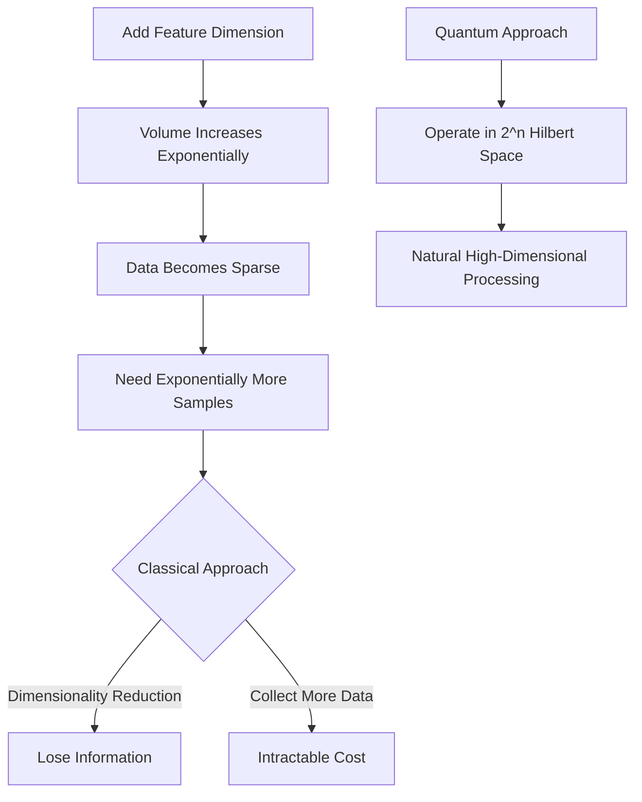
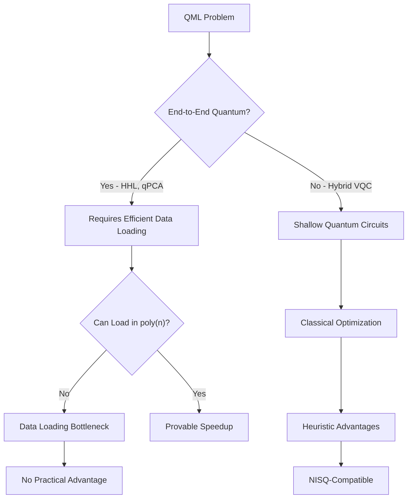

# **Chapter 8: Quantum Machine Learning Foundations**

---

## **Introduction**

Quantum Machine Learning (QML) represents a convergence of two transformative computational paradigms: quantum computing and machine learning. This nascent field seeks to harness quantum mechanical phenomena—superposition, entanglement, and interference—to overcome fundamental limitations that plague classical machine learning algorithms when confronted with high-dimensional data spaces, intractable quantum systems, and exponentially complex optimization landscapes. The theoretical foundations of QML rest on provable speedups for critical subroutines like linear algebra operations and unstructured search, while its practical implementations leverage the unique representational power of quantum states to encode and process information in ways fundamentally inaccessible to classical computers. This chapter establishes the conceptual framework for understanding QML by examining the motivations driving its development, the computational bottlenecks it aims to resolve, and the distinctive characteristics that differentiate quantum learning paradigms from their classical counterparts. We explore both the rigorously proven quantum advantages—such as the exponential speedup offered by the HHL algorithm for solving linear systems—and the heuristic benefits emerging from enhanced expressivity of variational quantum circuits operating in exponentially large Hilbert spaces. Through systematic comparison of quantum and classical learning paradigms across supervised, unsupervised, and reinforcement learning domains, we reveal how hybrid quantum-classical models navigate the constraints of current NISQ hardware while pursuing the promise of quantum-enhanced intelligence [1, 2].

---

## **Chapter Outline**

| Sec. | Title | Core Ideas & Examples |
|------|-------|----------------------|
| **8.1** | Motivation for Quantum Machine Learning | Computational speedups (HHL, Grover), exponential feature spaces, quantum-native data, representational advantages |
| **8.2** | Bottlenecks in Classical Machine Learning | Curse of dimensionality, data sparsity, quantum system simulation intractability, expensive matrix operations |
| **8.3** | What Makes QML Different? | Quantum states in Hilbert space, unitary evolution, superposition and entanglement, hybrid training paradigms |
| **8.4** | Quantum Learning Paradigms | Supervised (QSVM, QNN), unsupervised (qPCA, QBM), reinforcement learning, hybrid quantum-classical models |
| **8.5** | Quantum Advantages (Provable and Heuristic) | HHL exponential speedup, qPCA speedup, Grover quadratic speedup, enhanced VQC expressivity, quantum kernels |
| **8.6** | Practical Considerations | NISQ constraints, data loading bottleneck, measurement complexity, dominance of hybrid models |

---

## **8.1 Motivation for Quantum Machine Learning**

---

The field of **Quantum Machine Learning (QML)** is motivated by the prospect of harnessing unique quantum mechanical resources—namely **superposition** and **entanglement**—to overcome fundamental limitations in classical machine learning (ML). These motivations fall into three key categories: computational speedups, representational power, and the nature of the data itself.

!!! tip "The Quantum ML Promise"
    QML doesn't just make classical ML faster—it fundamentally changes what problems are tractable by operating in an exponentially larger computational space where $n$ qubits access $2^n$ dimensional feature spaces [3].

### **Computational Speedups**

-----

The primary theoretical motivation for QML is the potential for **provable speedups** in crucial, large-scale computational subroutines that bottleneck classical ML pipelines.

**Linear Algebra Acceleration (HHL)**

Many fundamental ML tasks, such as linear regression, principal component analysis (PCA), and support vector machines (SVM), rely heavily on solving large **linear systems of equations** (LSEs) or performing **matrix inversion**. The **HHL algorithm** (Harrow, Hassidim, and Lloyd) offers a proven exponential speedup for solving LSEs, provided the input data can be efficiently loaded into quantum states.

**Efficient Sampling and Probability Estimation**

Quantum computing can offer superior methods for generating samples or estimating probability distributions, which is relevant for **Quantum Boltzmann Machines (QBM)** and **Quantum Generative Adversarial Networks (QGANs)**. This capability leverages the quantum advantage in probability amplitude manipulation.

**Search and Optimization**

Algorithms like **Grover's search** provide a quadratic speedup in optimization and search settings, which can be applied to feature selection or model training.

!!! example "HHL Speedup in Linear Regression"
    For a linear regression problem with $N$ data points and $d$ features, solving the normal equations requires inverting a $d \times d$ matrix classically in $O(d^3)$ time. The HHL algorithm can solve this in $O(\log(N) \cdot \text{poly}(\kappa))$ time, where $\kappa$ is the condition number—an exponential speedup when $N$ is large.

-----

### **Representational Advantage and High-Dimensional Space**

-----

A crucial motivation for QML stems from the exponential scaling of the quantum state space, which directly addresses the classical **curse of dimensionality**.

**Exponential Feature Space**

A quantum state defined by $n$ qubits resides in a complex Hilbert space of dimension $2^n$. This provides a massive capacity for storing and manipulating information: $n$ qubits can represent a feature space that is exponentially larger than the number of qubits used.

**Enhanced Expressivity (Quantum Kernels)**

QML leverages this high dimensionality through **Quantum Feature Maps** (or **Quantum Kernels**). These circuits map classical input data into this exponentially large feature space, where complex relationships between data points may become linearly separable. This representational power can lead to enhanced expressiveness and potential better generalization in models like the **Quantum Support Vector Machine (QSVM)**.

```
Quantum_Feature_Map(x):
    # Encode classical data into quantum state
    ψ = |0⟩⊗ⁿ
    
    # Apply encoding gates
    for i in range(n):
        Apply R_y(x[i]) to qubit[i]
        Apply R_z(x[i]²) to qubit[i]
    
    # Apply entangling layers
    for layer in range(depth):
        for i in range(n-1):
            Apply CNOT(qubit[i], qubit[i+1])
        for i in range(n):
            Apply R_y(x[i] · layer) to qubit[i]
    
    return ψ  # State in exponential feature space
```

-----

### **Data and Modeling Advantages**

-----

QML is uniquely positioned to handle data that is either intrinsically quantum or classically intractable to model.

**Quantum-Native Data**

Certain physical systems naturally produce quantum data (e.g., quantum chemistry, condensed matter physics, and some financial and biological models). QML models are designed to process and learn from these quantum states directly, without the need for high-cost classical simulation.

**Modeling Quantum Systems**

Classical ML is intractable when trying to simulate or model complex quantum systems. QML offers the potential to use the quantum computer itself as the simulator and learning engine to model these difficult physical problems.

??? question "Why can't we just use classical ML on quantum simulation data?"
    Classical simulation of even 50-qubit quantum systems requires storing $2^{50} \approx 10^{15}$ complex amplitudes—far exceeding available memory. QML operates directly on quantum states, bypassing this exponential memory requirement entirely.

---

## **8.2 Bottlenecks in Classical Machine Learning**

---

Despite the extraordinary success of classical machine learning (ML) across numerous domains, the paradigm encounters fundamental scaling limitations when dealing with extremely large datasets, high-dimensional feature spaces, and intrinsically quantum phenomena. These bottlenecks serve as the core motivation for developing Quantum Machine Learning (QML) models.

!!! tip "Classical Walls"
    Classical ML hits three fundamental walls: exponential growth of feature space volume (curse of dimensionality), exponential cost of quantum system simulation, and polynomial-to-exponential complexity of matrix operations in high dimensions [4].

### **The Curse of Dimensionality**

-----

The most significant theoretical bottleneck is the **curse of dimensionality**. This term describes phenomena that arise when analyzing and organizing data in high-dimensional feature spaces:

**Data Sparsity**

As the number of features (dimensions) increases linearly, the volume of the feature space increases exponentially. This means the available training data becomes exponentially sparse, requiring exponentially more data to maintain consistent statistical density.

**Scaling Issues**

This exponential scaling leads to **scalability issues** when attempting to model complex datasets and find meaningful patterns or generalizations. Finding effective feature representations and measuring distances in high-dimensional spaces becomes computationally expensive and statistically unreliable.

**HHL and Feature Encoding**

The bottleneck is particularly relevant for algorithms requiring operations in high dimensions, where quantum techniques like the HHL algorithm offer an exponential speedup for linear algebra operations. However, the initial step of encoding massive classical data into the quantum state (the **data loading bottleneck**) remains a practical, costly challenge that QML must overcome.



-----

### **Computational Intractability of Quantum Systems**

-----

Classical resources are fundamentally limited in their ability to model or simulate systems governed by quantum mechanics.

**Exponential State Vector**

A classical computer simulating a quantum system must explicitly store and manipulate the full state vector, which grows exponentially ($2^n$ complex amplitudes) with the number of particles (or qubits) $n$. Simulating even a few dozen qubits exceeds the capacity of the largest classical supercomputers.

**Expensive Training**

Furthermore, the training of deep classical models on large datasets is often **computationally expensive**. Tasks such as optimizing the kernel matrix in high dimensions—a core operation in Support Vector Machines—can be prohibitively slow, motivating the development of algorithms like the **Quantum Support Vector Machine (QSVM)** to handle these matrix operations more efficiently.

!!! example "Classical Simulation Limits"
    A 60-qubit quantum system requires $2^{60} \approx 10^{18}$ complex numbers (16 bytes each) = 16 exabytes of memory just to store the state vector. The world's fastest supercomputers have ~1 petabyte of RAM—three orders of magnitude too small.

-----

### **Motivation for the Quantum Paradigm**

-----

The failure of classical methods to scale efficiently in high dimensions and the inability to model quantum systems directly drive the shift toward QML. Quantum computation offers an alternative approach, where:

* **Superposition and Entanglement** provide the exponential feature space necessary to overcome the curse of dimensionality.
* **Unitary Evolution** is used to process data, offering new computational pathways for linear algebra and optimization tasks.

---

## **8.3 What Makes QML Different?**

---

Quantum Machine Learning (QML) fundamentally differs from classical ML by replacing core computational components and paradigms with quantum mechanical analogues, resulting in a unique algorithmic structure operating over an exponentially large state space. The distinctions lie primarily in the nature of the data representation, the mathematical operations performed, and the resources leveraged.

!!! tip "Paradigm Shift"
    QML isn't classical ML with quantum acceleration—it's a fundamentally different computational model where probability amplitudes replace probabilities, unitary matrices replace activation functions, and entanglement replaces feature correlations [5].

### **Shift in Mathematical and Representational Basis**

-----

QML is built upon **quantum states** and **unitary evolution**, introducing a radical departure from classical information processing:

**State Space**

Classical ML operates on vectors in a real vector space, $\mathbb{R}^n$. QML operates on **quantum states** (vectors) within a complex Hilbert space, $\mathbb{C}^{2^n}$. This exponential scaling allows $n$ qubits to define a feature space vastly larger than $n$ classical bits.

**Computation Model**

Classical models use **Boolean logic** and traditional **linear algebra** operations. QML models use **unitary evolution** (quantum gates) to transform the probability amplitudes of the quantum state.

**Data Encoding**

Classical models rely on **feature maps** to transform data. QML uses **quantum encodings** (like Amplitude Encoding or Basis Encoding) to load classical data into the quantum state's amplitudes or phases.

| Aspect | Classical ML | Quantum ML |
|--------|-------------|------------|
| **State Space** | $\mathbb{R}^n$ or $\mathbb{R}^{N}$ | $\mathbb{C}^{2^n}$ (exponential) |
| **Operations** | Matrix multiplication, activation functions | Unitary gates, quantum measurements |
| **Information** | Bits, probabilities | Qubits, probability amplitudes |
| **Parallelism** | Limited by hardware | Quantum superposition (exponential) |

-----

### **Unique Quantum Resources**

-----

QML models leverage properties that have no classical equivalent, providing the source of their potential advantage:

**Superposition and Parallelism**

QML models can represent and perform computations across all $2^n$ possible inputs simultaneously due to **superposition**. This enables tasks like measuring complex inner products or evaluating high-dimensional feature maps in one quantum step.

**Entanglement and Correlation**

**Entanglement** introduces non-classical correlations between qubits. This unique resource enhances the **expressiveness** of Quantum Neural Networks (QNNs) and other QML models, potentially leading to better generalization and model performance by capturing complex data correlations impossible to model classically.

**Amplitude Distributions**

Where classical ML models manipulate **probability distributions** (e.g., in Boltzmann Machines), QML models manipulate **amplitude distributions**. The interference effects resulting from amplitude manipulation are essential for finding and amplifying optimal solutions.

!!! example "Superposition Advantage"
    A classical 10-bit feature vector requires processing $2^{10} = 1024$ separate computations to evaluate a function on all possible inputs. A 10-qubit quantum state exists in superposition over all 1024 basis states simultaneously, enabling parallel evaluation in a single quantum operation.

-----

### **Hybrid Nature and Training**

-----

The dominant paradigm in QML, the **hybrid quantum-classical model**, further distinguishes it from traditional ML:

**Parameterized Quantum Circuits (VQC)**

The core of many QML models (like QNNs and QSVMs) is the **Variational Quantum Circuit (VQC)**, a quantum analogue of a neural network. These circuits contain **parameterized quantum gates** whose parameters are optimized.

**Classical Optimization**

Instead of training the entire model on the quantum hardware, the **classical computer** performs the actual **optimization** (e.g., gradient descent) by iteratively adjusting the VQC parameters based on measurements sent back from the quantum processor. This approach mitigates the noise and limited depth of current NISQ quantum computers.

```
Hybrid_QML_Training(data, labels, VQC, optimizer):
    # Initialize quantum circuit parameters
    θ = Random_Initialize()
    
    # Training loop
    for epoch in range(max_epochs):
        total_loss = 0
        
        for (x, y) in zip(data, labels):
            # Quantum step: Encode and process
            ψ = VQC(x, θ)  # Quantum circuit execution
            prediction = Measure(ψ)
            
            # Classical step: Compute loss and gradient
            loss = Loss_Function(prediction, y)
            gradient = Compute_Gradient(loss, θ)
            
            # Classical optimization
            θ = optimizer.update(θ, gradient)
            total_loss += loss
        
        if total_loss < convergence_threshold:
            break
    
    return θ  # Optimized parameters
```

??? question "Why use classical optimization instead of quantum optimization?"
    Current NISQ devices have limited circuit depth and high noise levels. Classical optimizers can perform thousands of gradient descent steps reliably, while implementing optimization entirely on quantum hardware would require deep circuits that exceed NISQ capabilities. The hybrid approach exploits the best of both worlds.

The combination of the exponential Hilbert space and the utilization of quantum phenomena like entanglement and interference defines the distinct identity and potential power of Quantum Machine Learning.

---

## **8.4 Quantum Learning Paradigms**

---

Quantum Machine Learning (QML), much like its classical counterpart, is categorized into different **learning paradigms** based on the nature of the data and the objective of the learning process. These paradigms guide the design of QML algorithms, which are often structured as **hybrid quantum-classical models** in the current NISQ era.

!!! tip "Quantum Paradigm Parallels"
    QML mirrors classical ML's taxonomy—supervised, unsupervised, and reinforcement learning—but each paradigm operates in exponentially larger spaces and leverages quantum resources like entanglement for enhanced expressivity [6].

### **Supervised Quantum Learning**

-----

In **Supervised Learning**, the goal is to learn a mapping from input data ($x$) to known output labels ($y$), based on a dataset of labeled examples.

**Objective**

To minimize the error between the QML model's prediction and the true label.

**Key Algorithms**

* **Quantum Support Vector Machines (QSVM):** These utilize the exponential dimensionality of the quantum Hilbert space via a **quantum kernel method** to potentially achieve better classification boundaries than classical SVMs.
* **Quantum Neural Networks (QNNs) / Variational Quantum Classifiers:** These use **Variational Quantum Circuits (VQCs)**—parameterized circuits trained via a classical optimizer—as the core processing unit to classify data.


-----

### **Unsupervised Quantum Learning**

-----

**Unsupervised Learning** focuses on identifying hidden patterns, structure, or relationships within unlabeled data.

**Objective**

Dimensionality reduction, clustering, or density estimation.

**Key Algorithms**

* **Quantum Principal Component Analysis (qPCA):** This quantum algorithm is provably exponentially faster than classical PCA for finding the principal components of a low-rank matrix, enabling efficient **dimensionality reduction**.
* **Quantum $k$-means Clustering:** These algorithms leverage quantum distance measures and search algorithms to accelerate the clustering of data points by efficiently estimating distances in the quantum feature space.
* **Quantum Boltzmann Machines (QBM):** These are quantum analogs of classical generative models used for probabilistic modeling and learning complex data distributions.

!!! example "Quantum PCA Advantage"
    For a dataset with $N = 2^{20}$ samples and $d = 1000$ features, classical PCA requires $O(Nd^2 + d^3) \approx 10^{15}$ operations. Quantum PCA (qPCA) using QPE can reduce this to $O(\text{poly}(d) \cdot \log N) \approx 10^9$ operations—a million-fold speedup.

-----

### **Quantum Reinforcement Learning (QRL)**

-----

**Reinforcement Learning** involves an agent learning optimal actions through interaction with an environment, maximizing a cumulative reward.

**Objective**

To optimize a quantum state or circuit representing the action-value function (Q-Learning) or the policy itself (Policy Gradient Methods).

**Key Approach**

**Quantum Agents** use quantum states to represent complex action-value functions or policies, leveraging the high-dimensional Hilbert space to potentially capture more complex strategies or accelerate training through quantum subroutines.

-----

### **Hybrid Quantum-Classical Models**

-----

The **Hybrid Model** is the most common and practical paradigm in QML today, particularly for NISQ devices.

**Structure**

It combines a quantum component (a shallow VQC for feature extraction or kernel calculation) with a classical component (a powerful optimizer or neural network).

**Advantage**

This paradigm effectively manages the limitations of current quantum hardware by offloading the heavy computational burden of **optimization** (like parameter tuning) to the classical computer, while reserving the quantum resource for tasks where it offers a unique advantage, such as mapping data to a high-dimensional feature space.

---

## **8.5 Quantum Advantages (Provable and Heuristic)**

---

The adoption of Quantum Machine Learning (QML) is driven by the potential for two distinct categories of advantages over classical methods: **provable speedups**, which are mathematically guaranteed, and **heuristic advantages**, which stem from the unique representational power of quantum mechanics.

!!! tip "Two Types of Advantage"
    Provable advantages (HHL, qPCA, Grover) come with rigorous complexity proofs but often require idealized conditions. Heuristic advantages (quantum kernels, VQC expressivity) lack formal guarantees but show empirical promise on NISQ hardware [7].

### **Provable Quantum Speedups**

-----

**Provable speedups** refer to quantum algorithms that have been rigorously demonstrated to solve specific computational problems in an asymptotically shorter time (either polynomially or exponentially shorter) than the best known classical algorithm.

**HHL Algorithm (Exponential Speedup)**

The **Harrow-Hassidim-Lloyd (HHL) algorithm** provides a proven exponential speedup for solving **linear systems of equations (LSEs)**. This is highly relevant to classical ML tasks like linear regression, least-squares fitting, and the calculation of matrix inverses, where solving LSEs is a central bottleneck.

For solving $Ax = b$ where $A$ is an $N \times N$ matrix:

$$
\text{Classical complexity: } O(N^2) \text{ to } O(N^3)
$$

$$
\text{Quantum complexity (HHL): } O(\log N \cdot \kappa^2)
$$

where $\kappa$ is the condition number of $A$.

**Quantum Principal Component Analysis (qPCA)**

This algorithm offers an **exponential speedup** over classical PCA for finding the principal components of a low-rank matrix, enabling efficient **dimensionality reduction**.

**Grover's Search (Quadratic Speedup)**

Grover's algorithm provides a **quadratic speedup** ($O(\sqrt{N})$ vs. $O(N)$) for unstructured search and optimization. This can be applied to ML optimization settings, such as finding the optimal parameters or performing efficient **feature selection**.

These provable speedups are guaranteed in the asymptotic limit, assuming the key step of efficiently loading the data into the quantum state (the **data loading bottleneck**) can be resolved.

```
HHL_Algorithm(A, b):
    # Encode matrix A and vector b into quantum states
    ρ_A = Quantum_Matrix_Encoding(A)
    |b⟩ = Quantum_Vector_Encoding(b)
    
    # Apply Quantum Phase Estimation to A
    |λ⟩|ψ⟩ = QPE(ρ_A, precision_bits)
    
    # Controlled rotation based on eigenvalues
    for each eigenvalue λ:
        Apply R_y(arcsin(C/λ)) controlled on |λ⟩
    
    # Uncompute QPE
    Apply QPE_inverse()
    
    # Measure and extract solution
    |x⟩ = Post_Select_Success()
    
    return |x⟩  # Quantum state encoding solution
```

-----

### **Heuristic Quantum Advantages**

-----

**Heuristic advantages** are non-provable benefits derived from the unique way quantum mechanics represents information. They often translate into better model performance or generalization in practice.

**Enhanced Expressivity of VQCs**

**Variational Quantum Circuits (VQCs)**, which form the basis of many QML models, leverage **superposition** and **entanglement** to represent complex, high-dimensional functions and correlations. This gives them a non-classical **expressive power** that is difficult for classical models to replicate, potentially leading to better fit and generalization capability.

**Quantum Kernels**

In algorithms like the **Quantum Support Vector Machine (QSVM)**, a quantum computer calculates the **kernel matrix** by mapping input data into a vastly high-dimensional **quantum feature space**. Since the dimensionality is exponential ($2^n$), this feature map is computationally intractable for classical devices. This separation often leads to superior classification performance by making complex data linearly separable in the quantum space.

The quantum kernel is computed as:

$$
K_Q(x_i, x_j) = |\langle \phi(x_j) | \phi(x_i) \rangle|^2
$$

where $|\phi(x)\rangle = U(x)|0\rangle$ is the quantum feature map.

**Better Generalization**

The use of **entanglement** introduces non-classical correlations, which some research suggests can lead to QML models with enhanced ability to generalize from limited training data.

??? question "Why aren't heuristic advantages formally proven?"
    Heuristic advantages depend on problem-specific properties (data distribution, feature correlations) that vary across applications. Unlike provable speedups based on computational complexity theory, heuristic benefits emerge from quantum mechanical properties (entanglement, interference) whose impact on generalization and expressivity is difficult to formalize for arbitrary datasets.

While not mathematically guaranteed to be exponentially faster for all inputs, these heuristic advantages are the primary reason for experimenting with hybrid QML models on current NISQ hardware.

---

## **8.6 Practical Considerations**

---

While the theoretical promise of Quantum Machine Learning (QML) is immense, the field operates today under significant constraints imposed by current hardware technology. These **practical considerations** govern which QML models are feasible and why the hybrid quantum-classical paradigm is currently dominant.

!!! tip "NISQ Reality Check"
    The gap between theoretical QML promises and practical implementation is dominated by three factors: limited qubit counts (~100s), shallow circuit depths (~10-100 gates), and the data loading bottleneck that can negate exponential speedups [8].

### **Constraints of NISQ Devices**

-----

QML research and deployment are fundamentally limited by the characteristics of **Noisy Intermediate-Scale Quantum (NISQ) devices**:

**Limited Qubit Count (Width)**

Current quantum processors have a restricted number of high-quality, usable qubits. This limits the size and complexity of the feature space ($2^n$) that can be fully leveraged.

**Noise and Decoherence (Depth)**

Qubits are highly susceptible to environmental noise, leading to **decoherence** (loss of quantum information). Since noise accumulates with each operation, this limits the practical **circuit depth** and forces QML models to utilize shallow circuits, such as those in **Variational Quantum Circuits (VQCs)**.

**Measurement Complexity**

Extracting the cost function in VQAs requires multiple circuit runs (shots) and **measurement optimization** techniques like grouping commuting Pauli strings, adding computational overhead that affects the speed of the optimization loop.

| Hardware Limitation | Impact on QML | Mitigation Strategy |
|---------------------|---------------|---------------------|
| Qubit count (~100) | Limits feature space to $2^{100}$ | Use efficient encodings, focus on structured data |
| Gate fidelity (~99%) | Noise accumulates exponentially with depth | Shallow VQC architectures, error mitigation |
| Coherence time (~100 μs) | Limits total computation time | Fast gate operations, circuit optimization |
| Connectivity | Requires SWAP gates for distant qubits | Hardware-aware compilation, topology-optimized ansätze |

-----

### **The Data Loading Bottleneck**

-----

A critical challenge facing algorithms with **provable exponential speedups** (like HHL or qPCA) is the **data loading bottleneck**.

**The Problem**

These quantum algorithms often assume that classical data (e.g., a massive vector or matrix) has already been efficiently encoded into the **amplitudes** of a quantum state.

**The Constraint**

The classical complexity of preparing an arbitrary quantum state from scratch is $O(N)$ (or $O(2^n)$ in terms of bits $n$), where $N$ is the dimension of the data. If the quantum algorithm's runtime is polynomial in $n$ (e.g., $O(n^2)$), the exponential time required for the initial data loading step can negate the overall speedup.

To achieve a true end-to-end quantum advantage, this data loading step must also be performed efficiently, often relying on structured data that can be loaded with $\text{poly}(n)$ gates.

!!! example "Data Loading Reality"
    To load a general 20-qubit quantum state (1,048,576 complex amplitudes) requires at least $O(2^{20})$ operations classically. Even if HHL solves a linear system in $O(20^2) = 400$ quantum operations, the initial loading dominates the total runtime, negating the quantum advantage.

-----

### **Dominance of Hybrid Models**

-----

These hardware and loading constraints explain why **hybrid quantum-classical models** remain the most promising path forward for QML.

**Workload Division**

The hybrid model utilizes shallow VQCs on the quantum hardware for tasks leveraging quantum resources (e.g., exponential feature mapping).

**Noise Mitigation**

The computationally intensive task of **optimization** (parameter tuning) is safely performed on the classical computer, minimizing the overall runtime and exposure to quantum noise. This pragmatic approach enables QML research despite the limitations of current hardware.



---

## Comparative Analysis: Classical vs Quantum Machine Learning

This comprehensive comparison highlights the fundamental differences between classical and quantum approaches across major ML paradigms, emphasizing the mechanisms behind quantum advantages and the practical constraints that govern current implementations.

---

### Supervised Learning Comparison

| Model | Classical Version | Quantum Version | Quantum Advantage & Mechanism | Current Limitations |
| :--- | :--- | :--- | :--- | :--- |
| **Support Vector Machine** | Uses kernel function (RBF, polynomial) computed classically. Complexity $O(N^2)$ to $O(N^3)$ for $N$ data points. | **QSVM:** Quantum kernel $K_Q(x_i, x_j) = \|\langle \phi(x_j) \| \phi(x_i) \rangle\|^2$ computed via circuit overlap measurement in exponential feature space $2^n$. | **Heuristic:** Access to exponentially large Hilbert space enables complex feature mappings classically intractable. Can achieve superior classification on certain datasets [9]. | Data loading bottleneck; requires $O(N^2)$ quantum circuit evaluations for kernel matrix. |
| **Neural Networks** | Matrix multiplication and non-linear activations (ReLU, sigmoid). Trained via backpropagation. | **QNN/VQC:** Parameterized unitary gates with entanglement as non-linearity. Hybrid training with classical optimizer and parameter-shift gradients. | **Expressivity:** Entanglement captures non-classical correlations. Potential for better generalization on structured data with limited training samples. | Shallow circuits limit expressivity; gradient estimation requires multiple shots; barren plateaus in deep VQCs. |

---

### Unsupervised Learning Comparison

| Model | Classical Version | Quantum Version | Quantum Advantage & Mechanism | Current Limitations |
| :--- | :--- | :--- | :--- | :--- |
| **Principal Component Analysis** | Computes covariance matrix and performs eigendecomposition. Complexity $O(d^3)$ for $d$ features or $O(Nd^2)$ for $N$ samples. | **qPCA:** Encodes covariance into density matrix $\rho$. Uses QPE to extract eigenvalues/eigenvectors. Complexity $O(\text{poly}(d) \log N)$. | **Provable Exponential:** Asymptotic speedup for large $N$, low-rank matrices. Enables dimensionality reduction on massive datasets [10]. | Requires efficient state preparation; advantage only for low-rank, well-conditioned matrices; data loading bottleneck. |
| **k-means Clustering** | Lloyd's algorithm with $O(kNdI)$ complexity per iteration. | **Quantum k-means:** Swap test for distance calculation, quantum parallelism for centroid updates. Complexity reduction to $O(k\log(Nd)I)$. | **Polynomial:** Logarithmic speedup in distance calculations. Potential for global optimum via quantum tunneling effects. | Requires amplitude encoding of all data points; measurement overhead; NISQ depth limits. |
| **Boltzmann Machines** | Stochastic generative model. Training is NP-hard; sampling requires MCMC. | **QBM:** Quantum annealing or VQA for sampling. Exploits quantum tunneling through energy barriers. | **Sampling Efficiency:** Faster convergence to thermal equilibrium; can model entangled distributions classically intractable. | Requires specialized quantum annealers or deep VQC; scaling to large problems unclear. |

---

This comparative analysis reveals that while QML offers compelling theoretical advantages—particularly for problems involving high-dimensional spaces, low-rank structures, or quantum-native data—practical implementation on NISQ hardware requires careful algorithm selection, efficient data encoding, and hybrid architectures that balance quantum resource utilization with classical computational power.

---

## **References**

---

[1] Biamonte, J., et al. (2017). Quantum machine learning. *Nature*, 549(7671), 195-202.

[2] Schuld, M., & Petruccione, F. (2018). *Supervised Learning with Quantum Computers*. Springer.

[3] Harrow, A. W., Hassidim, A., & Lloyd, S. (2009). Quantum algorithm for linear systems of equations. *Physical Review Letters*, 103(15), 150502.

[4] Aaronson, S. (2015). Read the fine print. *Nature Physics*, 11(4), 291-293.

[5] Schuld, M., Sinayskiy, I., & Petruccione, F. (2015). An introduction to quantum machine learning. *Contemporary Physics*, 56(2), 172-185.

[6] Dunjko, V., & Briegel, H. J. (2018). Machine learning & artificial intelligence in the quantum domain. *Reports on Progress in Physics*, 81(7), 074001.

[7] Havlíček, V., et al. (2019). Supervised learning with quantum-enhanced feature spaces. *Nature*, 567(7747), 209-212.

[8] Preskill, J. (2018). Quantum computing in the NISQ era and beyond. *Quantum*, 2, 79.

[9] Rebentrost, P., Mohseni, M., & Lloyd, S. (2014). Quantum support vector machine for big data classification. *Physical Review Letters*, 113(13), 130503.

[10] Lloyd, S., Mohseni, M., & Rebentrost, P. (2014). Quantum principal component analysis. *Nature Physics*, 10(9), 631-633.
