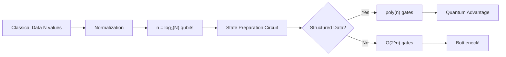
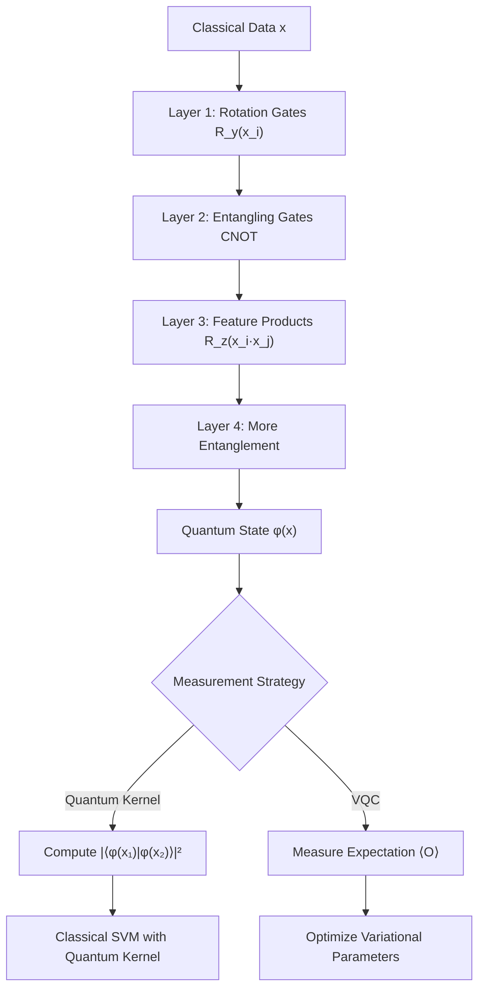

# **Chapter 9: Quantum Data Encoding Techniques**

---


## **Introduction**

The transformation of classical data into quantum states represents one of the most critical—and challenging—steps in the quantum machine learning pipeline. Unlike classical neural networks where data naturally exists as vectors of real numbers, quantum algorithms require classical information to be encoded into the complex probability amplitudes, phases, and correlations of quantum states residing in exponentially large Hilbert spaces. This encoding step fundamentally determines the efficiency, expressiveness, and practical feasibility of any quantum machine learning algorithm. The choice of encoding scheme creates an inherent tradeoff between data compression (how many classical values can be stored per qubit) and circuit complexity (how many quantum gates are required to prepare the encoded state). This chapter provides a comprehensive analysis of the principal quantum data encoding techniques—basis encoding, amplitude encoding, angle encoding, Hamiltonian encoding, and quantum feature maps—examining their mathematical formulations, implementation complexities, and suitability for different machine learning tasks. We explore how basis encoding offers simplicity at the cost of limited expressiveness, how amplitude encoding achieves exponential compression but encounters the notorious data loading bottleneck that can negate quantum speedups, and how angle encoding and quantum feature maps enable the shallow variational circuits essential for NISQ-era quantum machine learning. Through detailed comparison of these encoding paradigms, we reveal the fundamental constraints that govern the practical deployment of quantum learning algorithms and the strategic design choices that determine whether quantum advantage can be realized [1, 2].

---

## **Chapter Outline**

| Sec. | Title | Core Ideas & Examples |
|------|-------|----------------------|
| **9.1** | Basis Encoding | Direct bit-to-qubit mapping, computational basis states, categorical data encoding, minimal qubit count |
| **9.2** | Amplitude Encoding | Exponential compression $2^n$ values in $n$ qubits, normalization requirement, data loading bottleneck, state preparation complexity |
| **9.3** | Angle Encoding | Parametric rotation gates $R_y(x_i)$, one qubit per feature, shallow circuits, VQC compatibility |
| **9.4** | Hamiltonian Encoding | Time evolution operators $e^{-iH(x)t}$, Trotterization, structural data encoding, physics-inspired methods |
| **9.5** | Quantum Feature Maps | Entanglement-based encoding $U_\phi(x)\|0\rangle$, quantum kernels, non-linear feature separation, QSVM applications |

---

## **9.1 Basis Encoding**

---

**Basis encoding** is the most direct and simplest technique for mapping classical binary data onto a quantum state. It establishes a one-to-one correspondence between the classical bit string and the computational basis states of a quantum register.

!!! tip "Simplicity at a Cost"
    Basis encoding is the quantum equivalent of one-hot encoding—straightforward to implement but informationally sparse. It's ideal for representing discrete labels or indices, not continuous numerical features [3].

### **Mathematical Formulation and Mechanism**

-----

Basis encoding represents a classical binary vector by directly translating each bit into the corresponding state of a qubit.

**Input**

A classical binary string $\mathbf{b} = b_0b_1\ldots b_{n-1}$.

**Output**

The corresponding quantum basis state, an $n$-qubit register:

$$
\mathbf{b} = (b_0, b_1, \ldots, b_{n-1}) \Rightarrow |b_0\rangle \otimes |b_1\rangle \otimes \ldots \otimes |b_{n-1}\rangle = |b_0 b_1 \ldots b_{n-1}\rangle
$$

**Qubit Scaling**

To represent $N$ distinct classical values (e.g., indices or categorical labels), this method requires the minimum number of qubits, $n = \log_2(N)$.

!!! example "Basis Encoding in Action"
    Encoding the 3-bit string `101` requires three qubits, resulting in the state $|101\rangle$. This state has an amplitude of 1 for the index $5$ ($|101\rangle$) and 0 for all other indices.
    
    Circuit implementation:
    ```
    |0⟩ ──X──  → |1⟩
    |0⟩ ─────  → |0⟩  
    |0⟩ ──X──  → |1⟩
    Result: |101⟩
    ```

```
Basis_Encoding(binary_string):
    # Initialize n-qubit register to |0⟩⊗ⁿ
    qubits = Initialize_Register(n)
    
    # Apply X gate where bit is 1
    for i in range(n):
        if binary_string[i] == '1':
            Apply_X(qubits[i])
    
    # Result: |b₀b₁...bₙ₋₁⟩
    return qubits
```

-----

### **Advantages and Suitability**

-----

**Simplicity and Implementation**

Basis encoding is **simple and intuitive** to implement, typically requiring only a sequence of Pauli $X$ gates to set the register to the desired state (e.g., $X|0\rangle = |1\rangle$). The circuits are shallow and easy to prepare.

**Data Type Suitability**

It is highly suitable for **categorical data** or **index labels** where the value represents a distinct category rather than a numerical magnitude.

-----

### **Limitations and Drawbacks**

-----

The simplicity of basis encoding comes at the cost of limited expressiveness, particularly for complex analysis:

**Limited Expressiveness**

It fails to encode numerical relationships or magnitude differences into the quantum state's probability **amplitudes** or **phases**. The state $|101\rangle$ (index 5) has the same amplitude (1) as the state $|001\rangle$ (index 1), giving no quantum mechanical information about the magnitude difference between 5 and 1.

**Inefficiency for Features**

When encoding the **features** of a dataset (rather than indices), basis encoding requires **one qubit per feature bit**. For high-dimensional datasets with many features, this linear scaling quickly exhausts the available qubits on current hardware.

??? question "When would you prefer basis encoding over amplitude encoding?"
    Use basis encoding when your data represents discrete categories or indices (e.g., classifying images into 10 categories requires only 4 qubits: $\log_2(10) \approx 4$), when you need extremely shallow circuits, or when the numerical magnitude relationships between values are irrelevant to your algorithm.

---

## **9.2 Amplitude Encoding**

---

**Amplitude encoding** is the most **compact** method for mapping classical data onto a quantum state. It achieves an exponential level of data compression by storing classical values in the **probability amplitudes** of the quantum state vector.

!!! tip "Exponential Compression"
    Amplitude encoding is the holy grail of quantum data compression: $n$ qubits can store $2^n$ classical values. But like all holy grails, it's incredibly difficult to obtain—the state preparation problem is the bottleneck [4].

-----

### **Mathematical Formulation and Mechanism**

-----

Basis encoding represents a classical binary vector by directly translating each bit into the corresponding state of a qubit.

**Input**

A classical binary string $\mathbf{b} = b_0b_1\ldots b_{n-1}$.

**Output**

The corresponding quantum basis state, an $n$-qubit register:

$$
\mathbf{b} = (b_0, b_1, \ldots, b_{n-1}) \Rightarrow |b_0\rangle \otimes |b_1\rangle \otimes \ldots \otimes |b_{n-1}\rangle = |b_0 b_1 \ldots b_{n-1}\rangle
$$

**Qubit Scaling**

To represent $N$ distinct classical values (e.g., indices or categorical labels), this method requires the minimum number of qubits, $n = \log_2(N)$.

-----

### **Advantages and Suitability**

-----

**Simplicity and Implementation**

Basis encoding is **simple and intuitive** to implement, typically requiring only a sequence of Pauli $X$ gates to set the register to the desired state (e.g., $X|0\rangle = |1\rangle$). The circuits are shallow and easy to prepare.

**Data Type Suitability**

It is highly suitable for **categorical data** or **index labels** where the value represents a distinct category rather than a numerical magnitude.

-----

### **Limitations and Drawbacks**

-----

The simplicity of basis encoding comes at the cost of limited expressiveness, particularly for complex analysis:

**Limited Expressiveness**

It fails to encode numerical relationships or magnitude differences into the quantum state's probability **amplitudes** or **phases**. The state $|101\rangle$ (index 5) has the same amplitude (1) as the state $|001\rangle$ (index 1), giving no quantum mechanical information about the magnitude difference between 5 and 1.

**Inefficiency for Features**

When encoding the **features** of a dataset (rather than indices), basis encoding requires **one qubit per feature bit**. For high-dimensional datasets with many features, this linear scaling quickly exhausts the available qubits on current hardware.

---

## **9.2 Amplitude Encoding**

---

**Amplitude encoding** is the most **compact** method for mapping classical data onto a quantum state. It achieves an exponential level of data compression by storing classical values in the **probability amplitudes** of the quantum state vector.

!!! tip "Exponential Compression"
    Amplitude encoding is the holy grail of data compression—store $2^{10} = 1024$ values in just 10 qubits! But preparing this exponentially compressed state is the bottleneck that makes or breaks quantum advantage [3].

### **Mathematical Formulation and Compression**

-----

Amplitude encoding stores a classical data vector $\mathbf{x}$ of dimension $N$ in a quantum state $|\psi\rangle$ using only $n = \log_2(N)$ qubits.

**High Compression**

This method allows storing $2^n$ values using only $n$ qubits. For example, 10 qubits can store $2^{10} = 1024$ values.

**The State Vector**

Given a normalized classical vector $\vec{x} = (x_0, x_1, \ldots, x_{N-1})$, the corresponding quantum state $|\psi\rangle$ is formed by setting the coefficient of each basis state $|i\rangle$ to the corresponding data value $x_i$:

$$
|\psi\rangle = \frac{1}{\|\mathbf{x}\|} \sum_{i=0}^{N-1} x_i |i\rangle
$$

The factor $1/\|\mathbf{x}\|$ (where $\|\mathbf{x}\|$ is the $L_2$ norm) is required to ensure the state vector is **normalized** ($\langle\psi|\psi\rangle = 1$), which is a fundamental requirement of quantum mechanics.



-----

### **The Data Loading Bottleneck**

-----

Despite its immense compression power, amplitude encoding introduces the significant **data loading bottleneck**.

**Complexity of State Preparation**

Preparing an **arbitrary** quantum state $|\psi\rangle = \sum x_i |i\rangle$ with high fidelity requires a complex, deep circuit. The number of quantum gates required to synthesize a general state is typically $O(N)$ or $O(2^n)$ (exponential in the number of qubits $n$).

**Negating Speedup**

If a classical algorithm can process the $N$ data points in $O(N)$ time, the quantum advantage gained from processing the data using subsequent $\text{poly}(n)$ quantum steps is negated entirely by the $O(N)$ time consumed in the initial preparation step.

**Trade-off**

Amplitude encoding is most effective when the data has a specific, simple **structure** that allows the state to be prepared in polynomial ($O(\text{poly}(n))$) time, or when the cost of subsequent quantum processing is so high that it justifies the exponential setup cost.

!!! example "The Bottleneck in Practice"
    Consider encoding a 1024-dimensional vector (10 qubits):
    - **Compression:** 1024 classical values → 10 qubits (exponential compression!)
    - **Preparation cost:** $O(2^{10}) = 1024$ quantum gates for arbitrary data
    - **Subsequent algorithm:** HHL solves linear system in $O(100)$ gates
    - **Net result:** Total cost dominated by 1024-gate preparation, not 100-gate algorithm
    
    The quantum speedup is negated unless data has structure enabling $O(\text{poly}(10))$ preparation.

-----

### **Challenges**

-----

**Noise Sensitivity**

Amplitude-encoded states are highly sensitive to noise, as small errors in the complex amplitudes can significantly impact the encoded data and final results.

**Readout Problem**

Retrieving all $N$ data points $(x_0, \ldots, x_{N-1})$ from the quantum state $|\psi\rangle$ requires quantum tomography, which scales exponentially and negates the speedup. QML algorithms must be designed to extract only the final, required **result** (e.g., a classification label or an expectation value), not the raw data itself.

```
Amplitude_Encoding_Structured(x, structure_type):
    # For structured data that enables efficient preparation
    n = log₂(len(x))
    qubits = Initialize_Register(n)
    
    if structure_type == "uniform":
        # Uniform superposition: O(n) Hadamard gates
        for i in range(n):
            Apply_H(qubits[i])
    
    elif structure_type == "sparse":
        # Sparse data: only encode non-zero entries
        for i, value in enumerate(x):
            if value != 0:
                Prepare_Basis_State(qubits, i)
                Apply_Amplitude_Rotation(qubits, value)
    
    else:  # Arbitrary data - expensive!
        # Requires O(2^n) complexity
        Apply_Arbitrary_State_Preparation(qubits, x)
    
    return qubits
```

Amplitude encoding remains crucial because it underpins the potential for exponential speedups in algorithms like HHL (Harrow-Hassidim-Lloyd) and qPCA (Quantum Principal Component Analysis), but its use is constrained by the difficulty of state preparation on current NISQ hardware.

---

## **9.3 Angle Encoding**

---

**Angle encoding**, also known as **parametric rotation encoding**, is the simplest and most common method used in current **Variational Quantum Circuits (VQCs)**. It maps classical numerical features directly onto the **rotation angle** of a single-qubit gate.

!!! tip "NISQ-Era Workhorse"
    Angle encoding sacrifices the exponential compression of amplitude encoding for shallow circuits that actually work on noisy quantum hardware. It's the pragmatic choice for variational quantum algorithms [5].

### **Mathematical Formulation and Mechanism**

-----

Angle encoding represents a scalar feature $x_i$ by setting it proportional to the angle of a rotation gate, typically $R_x(x_i)$, $R_y(x_i)$, or $R_z(x_i)$.

**The State Vector**

When applied to the initial $|0\rangle$ state, the $R_y$ rotation (the most common choice) produces a state whose amplitudes are functions of the feature $x_i$:

$$
|x_i\rangle = R_y(x_i) |0\rangle = \cos\left(\frac{x_i}{2}\right)|0\rangle + \sin\left(\frac{x_i}{2}\right)|1\rangle
$$

**Measurement Probability**

The resulting probability amplitudes for measuring $|0\rangle$ and $|1\rangle$ are $P(0) = \cos^2(x_i/2)$ and $P(1) = \sin^2(x_i/2)$, respectively.

**Multiple Features**

To encode a vector with $D$ features $(x_0, x_1, \ldots, x_{D-1})$, the simple angle encoding requires **$D$ qubits**, with one rotation applied per feature, resulting in a product state:

$$
|\psi\rangle = R_y(x_0) |0\rangle \otimes R_y(x_1) |0\rangle \otimes \cdots \otimes R_y(x_{D-1}) |0\rangle
$$

!!! example "Angle Encoding a 3D Feature Vector"
    For the feature vector $\vec{x} = (0.5, 1.2, 2.0)$:
    
    ```
    Qubit 0: |0⟩ ─ R_y(0.5) ─ → cos(0.25)|0⟩ + sin(0.25)|1⟩
    Qubit 1: |0⟩ ─ R_y(1.2) ─ → cos(0.6)|0⟩ + sin(0.6)|1⟩
    Qubit 2: |0⟩ ─ R_y(2.0) ─ → cos(1.0)|0⟩ + sin(1.0)|1⟩
    ```
    
    Circuit depth: 1 (just rotation layer)
    Qubits required: 3 (one per feature)

-----

### **Advantages and Trade-offs**

-----

**Ease of Implementation**

Angle encoding is **easy to implement** because it uses shallow circuits (often just one layer of rotation gates). This makes it highly compatible with current NISQ devices, which are severely limited by circuit depth.

**Direct Expressiveness**

It directly encodes the **numerical magnitude** of the data into the state's **probability amplitudes**, allowing the feature value to influence the subsequent computation.

**Qubit Usage Trade-off**

While requiring $\log_2(N)$ qubits for Amplitude Encoding is exponentially compact, Angle Encoding trades this compression for a **larger qubit count (one qubit per feature)** but a much **shallower circuit depth**.

-----

### **Precision and Limitations**

-----

**Gate Fidelity**

The precision with which the feature $x_i$ is encoded is limited by the physical **fidelity** of the quantum gates on the hardware. High noise or gate infidelity can lead to errors in the encoded angle.

**Feature Scaling**

Classical data must be carefully **normalized** and scaled before being used as an angle to avoid exceeding the $2\pi$ range of the rotation, which would result in information loss.

```
Angle_Encoding_VQC(x, num_layers):
    # x is D-dimensional feature vector
    D = len(x)
    qubits = Initialize_Register(D)
    
    # Layer 1: Initial angle encoding
    for i in range(D):
        # Normalize feature to [0, 2π] range
        normalized_x = Normalize(x[i])
        Apply_R_y(qubits[i], normalized_x)
    
    # Additional variational layers with entanglement
    for layer in range(num_layers):
        # Entangling layer
        for i in range(D-1):
            Apply_CNOT(qubits[i], qubits[i+1])
        
        # Parametric rotation layer
        for i in range(D):
            Apply_R_y(qubits[i], x[i] * (layer + 1))
    
    return qubits
```

??? question "Why use $R_y$ instead of $R_x$ or $R_z$ for angle encoding?"
    $R_y$ rotations are preferred because they create superpositions of $|0\rangle$ and $|1\rangle$ with real-valued amplitudes, avoiding the phase complexities of $R_z$ and providing more direct geometric interpretability than $R_x$. Additionally, $R_y$ naturally produces probability distributions that are smooth functions of the input angle.

Angle encoding is often combined with two-qubit entangling gates (like CNOT) to form the basic layers of a parameterized VQC, enabling the subsequent creation of expressive **Quantum Feature Maps** (Section 9.5).

---

## **9.4 Hamiltonian Encoding**

---

**Hamiltonian encoding** (or dynamics encoding) embeds classical data not as an instantaneous state, but as a parameter within the system's **evolution operator**.

!!! tip "Physics-Inspired Encoding"
    Hamiltonian encoding is the natural choice when your data describes a physical system or when you want to exploit the rich structure of quantum dynamics. It's quantum simulation meeting machine learning [6].

### **Mechanism and Structural Encoding**

-----

In Hamiltonian encoding, the classical data $\vec{x} = (x_0, x_1, \ldots, x_{D-1})$ is encoded into the parameters of a Hamiltonian $H(\vec{x})$. The quantum state is then evolved under this Hamiltonian for a time $t$, resulting in the unitary transformation:

$$
U(\vec{x}) = e^{-iH(\vec{x})t}
$$

This unitary $U(\vec{x})$ is then applied to an initial state $|\psi_0\rangle$ (typically $|0\rangle^{\otimes n}$), producing the encoded state:

$$
|\psi(\vec{x})\rangle = e^{-iH(\vec{x})t} |\psi_0\rangle
$$

**Building the Data Hamiltonian**

The data-dependent Hamiltonian $H(\vec{x})$ is typically constructed as a linear combination of Pauli operators, weighted by the classical features:

$$
H(\vec{x}) = \sum_{i=0}^{D-1} x_i \sigma_i
$$

where $\sigma_i$ are Pauli matrices acting on different qubits.

**Example**: For a 3-feature vector $\vec{x} = (x_0, x_1, x_2)$, the Hamiltonian could be:

$$
H(\vec{x}) = x_0 Z_0 + x_1 Z_1 + x_2 Z_2
$$

The resulting unitary is then implemented via **Trotterization** or **time-evolution circuits**.

-----

### **Trade-offs and Expressiveness**

-----

**High Expressiveness**

Hamiltonian encoding leverages the full structure of quantum evolution, allowing the data to be embedded in a highly **expressive** way that naturally generates entanglement and complex quantum correlations [7].

**Circuit Complexity**

The main drawback is the **circuit depth** required to accurately implement the time-evolution operator $e^{-iHt}$. Even for simple Hamiltonians, Trotterization can require deep circuits, limiting its applicability on current NISQ devices.

**Natural for Physical Data**

This encoding method is ideal when the classical data describes a physical system (e.g., molecular structures, material properties) because the Hamiltonian $H(\vec{x})$ can directly represent the system's energy operator.

```
Hamiltonian_Encoding(x, time_steps, evolution_time):
    # x is D-dimensional feature vector
    D = len(x)
    qubits = Initialize_Register(D)
    
    # Construct data-dependent Hamiltonian H(x)
    H = 0
    for i in range(D):
        # Pauli-Z weighted by feature x[i]
        H += x[i] * Pauli_Z(qubit=i)
    
    # Time evolution via Trotterization
    dt = evolution_time / time_steps
    
    for step in range(time_steps):
        # Apply exp(-i H dt) via Trotter decomposition
        for i in range(D):
            angle = -x[i] * dt  # Z rotation angle
            Apply_R_z(qubits[i], angle)
        
        # Optional: add entangling terms
        for i in range(D-1):
            # Two-qubit interaction: X_i X_{i+1}
            Apply_XX_Rotation(qubits[i], qubits[i+1], dt)
    
    return qubits
```

Hamiltonian encoding is the foundation for many **quantum simulation algorithms** and **quantum kernel methods** used in QML.

---

## **9.5 Quantum Feature Maps**

---

**Quantum Feature Maps** are the most general and powerful encoding method. They map classical data $\vec{x}$ to a high-dimensional quantum state $|\phi(\vec{x})\rangle$ in a Hilbert space, explicitly designed to enable **quantum kernels** for classification and regression tasks.

!!! tip "The Power of Kernels"
    Quantum feature maps are quantum computing's answer to the kernel trick in classical machine learning. By mapping data to an exponentially large Hilbert space, they can discover patterns invisible to classical polynomial kernels [8].

### **Mechanism and Mathematical Formalism**

-----

A quantum feature map $\phi$ is defined as a unitary operation $U_{\phi}(\vec{x})$ parameterized by the classical data $\vec{x}$:

$$
|\phi(\vec{x})\rangle = U_{\phi}(\vec{x}) |0\rangle^{\otimes n}
$$

The feature map circuit $U_{\phi}$ is typically constructed using multiple layers of:
1. **Angle encoding** gates (rotation gates $R_y(x_i)$, $R_z(x_i)$)
2. **Entangling gates** (CNOT, CZ) to create correlations between features
3. **Higher-order feature interactions** using gates like $e^{i(x_i x_j) Z_i Z_j}$

**Common Feature Map Example**

One widely used feature map (introduced by Havlíček et al., 2019) is defined as:

$$
U_{\phi}(\vec{x}) = U_{\text{ent}} U_{\text{data}}(\vec{x}) U_{\text{ent}} U_{\text{data}}(\vec{x})
$$

where:
- $U_{\text{data}}(\vec{x})$ applies rotation gates: $R_z(x_i)$ to each qubit $i$
- $U_{\text{ent}}$ applies entangling gates (e.g., CNOT) between qubits



-----

### **Quantum Kernel Calculation**

-----

The **quantum kernel** between two data points $\vec{x}_1$ and $\vec{x}_2$ is computed by measuring the **overlap** (inner product) between their encoded quantum states:

$$
K(\vec{x}_1, \vec{x}_2) = |\langle \phi(\vec{x}_1) | \phi(\vec{x}_2) \rangle|^2
$$

This kernel can be calculated on a quantum computer by preparing the states $|\phi(\vec{x}_1)\rangle$ and $|\phi(\vec{x}_2)\rangle$, computing the overlap using the **SWAP test** or by direct measurement, and then using the kernel matrix in a classical machine learning algorithm (such as SVM).

**Quantum Advantage**

The quantum kernel $K(\vec{x}_1, \vec{x}_2)$ corresponds to a feature map in an exponentially large Hilbert space (dimension $2^n$ for $n$ qubits). This allows quantum feature maps to implicitly compute kernel functions that are intractable for classical computers [9].

!!! example "Quantum Kernel SVM Workflow"
    Given dataset $\{(\vec{x}_1, y_1), \ldots, (\vec{x}_M, y_M)\}$ where $y_i \in \{-1, +1\}$:
    
    1. **Encode each data point** on quantum computer: $|\phi(\vec{x}_i)\rangle = U_{\phi}(\vec{x}_i)|0\rangle^{\otimes n}$
    2. **Compute kernel matrix** $K_{ij} = |\langle\phi(\vec{x}_i)|\phi(\vec{x}_j)\rangle|^2$ for all pairs $(i,j)$
    3. **Train classical SVM** using kernel matrix $K$
    4. **Predict new point** $\vec{x}_{\text{new}}$:
        - Encode $|\phi(\vec{x}_{\text{new}})\rangle$ on quantum computer
        - Compute kernel $K(\vec{x}_{\text{new}}, \vec{x}_i)$ for all training points
        - Use SVM decision function: $f(\vec{x}_{\text{new}}) = \sum_i \alpha_i y_i K(\vec{x}_{\text{new}}, \vec{x}_i) + b$

-----

### **Advantages for Classification**

-----

**Exponential Feature Space**

Quantum feature maps enable classification in an exponentially large feature space without explicitly computing the feature vectors.

**Tailored Expressiveness**

The structure of $U_{\phi}$ can be **designed** or **optimized** (via variational methods) to match the specific geometry of the data, potentially providing advantages over fixed classical kernels.

**Integration with VQCs**

Feature maps serve as the encoding layer in **variational quantum classifiers (VQCs)**, which combine encoding with trainable parameterized gates to maximize classification accuracy.

```
Quantum_Feature_Map_ZZFeatureMap(x, num_layers):
    # x is D-dimensional feature vector
    D = len(x)
    qubits = Initialize_Register(D)
    
    for layer in range(num_layers):
        # Data encoding layer: single-qubit rotations
        for i in range(D):
            Apply_H(qubits[i])  # Hadamard for superposition
            Apply_R_z(qubits[i], 2 * x[i])
        
        # Entangling layer: ZZ interactions for feature products
        for i in range(D):
            for j in range(i+1, D):
                # Two-qubit ZZ rotation: encodes x[i]*x[j]
                angle = (π - x[i]) * (π - x[j])
                Apply_ZZ_Rotation(qubits[i], qubits[j], angle)
    
    return qubits

Compute_Quantum_Kernel(x1, x2, feature_map, num_qubits):
    # Prepare |φ(x1)⟩
    state1 = feature_map(x1)
    
    # Prepare |φ(x2)⟩
    state2 = feature_map(x2)
    
    # Compute overlap |⟨φ(x1)|φ(x2)⟩|² using SWAP test
    kernel_value = SWAP_Test(state1, state2)
    
    return kernel_value
```

??? question "How do quantum feature maps relate to the classical kernel trick?"
    Both quantum feature maps and the classical kernel trick compute inner products in high-dimensional spaces without explicitly constructing feature vectors. The quantum advantage comes from the exponential dimensionality ($2^n$) of the Hilbert space, which allows quantum kernels to potentially capture correlations that are computationally hard for classical polynomial kernels to represent.

Quantum feature maps are the cornerstone of **quantum kernel methods** and serve as the encoding foundation for **quantum neural networks (QNNs)** used in supervised and unsupervised learning tasks.

---

### **Summary: Comparison of Quantum Data Encoding Techniques**

-----

| **Encoding Technique** | **Description** | **Qubit Scaling** | **Circuit Depth / Complexity** | **Advantages** | **Disadvantages** |
|------------------------|-----------------|-------------------|-------------------------------|----------------|-------------------|
| **Basis Encoding** | Maps binary strings to computational basis states $\|i\rangle$ | Linear: $n$ qubits for $n$ bits | Very shallow: $O(n)$ | Simple, easy to implement | Exponential waste: $2^n$ basis states for $n$ qubits |
| **Amplitude Encoding** | Encodes $N$ classical values into amplitudes of $\log_2(N)$ qubits | Logarithmic: $\log_2(N)$ qubits for $N$ values | Deep: $O(N)$ or $O(2^n)$ for arbitrary data | Exponential compression | Data loading bottleneck, noise-sensitive, hard readout |
| **Angle Encoding** | Uses classical data as rotation angles $R_y(x_i)$ | Linear: $D$ qubits for $D$ features | Shallow: $O(D)$ | Easy to implement, NISQ-compatible | Linear qubit scaling, feature normalization required |
| **Hamiltonian Encoding** | Encodes data as parameters in Hamiltonian $H(\vec{x})$, applies time evolution $e^{-iH(\vec{x})t}$ | Depends on Hamiltonian structure | Deep: Depends on Trotterization steps | High expressiveness, natural for physical data | Circuit depth complexity, Trotter errors |
| **Quantum Feature Maps** | General unitary $U_{\phi}(\vec{x})$ creating high-dimensional encoding with entanglement | Depends on design: typically $O(D)$ to $O(\log D)$ | Moderate to deep: Depends on layers and entanglement | Exponential feature space, quantum kernel advantage | Design complexity, optimization required |

The choice of encoding depends on the specific QML algorithm, the structure of the data, the capabilities of the quantum hardware (especially qubit count and circuit depth limits), and whether the goal is to achieve exponential compression or simply to create a suitable representation for a variational quantum circuit.

---

## **References**

---

[1] Schuld, M., & Petruccione, F. (2018). *Supervised Learning with Quantum Computers*. Springer.

[2] Biamonte, J., Wittek, P., Pancotti, N., Rebentrost, P., Wiebe, N., & Lloyd, S. (2017). "Quantum machine learning." *Nature*, 549(7671), 195-202.

[3] Harrow, A. W., Hassidim, A., & Lloyd, S. (2009). "Quantum algorithm for linear systems of equations." *Physical Review Letters*, 103(15), 150502.

[4] LaRose, R., & Coyle, B. (2020). "Robust data encodings for quantum classifiers." *Physical Review A*, 102(3), 032420.

[5] Havlíček, V., Córcoles, A. D., Temme, K., Harrow, A. W., Kandala, A., Chow, J. M., & Gambetta, J. M. (2019). "Supervised learning with quantum-enhanced feature spaces." *Nature*, 567(7747), 209-212.

[6] Schuld, M., Sweke, R., & Meyer, J. J. (2021). "Effect of data encoding on the expressive power of variational quantum-machine-learning models." *Physical Review A*, 103(3), 032430.

[7] Lloyd, S., Mohseni, M., & Rebentrost, P. (2014). "Quantum principal component analysis." *Nature Physics*, 10(9), 631-633.

[8] Liu, Y., Arunachalam, S., & Temme, K. (2021). "A rigorous and robust quantum speed-up in supervised machine learning." *Nature Physics*, 17(9), 1013-1017.

[9] Huang, H. Y., Broughton, M., Mohseni, M., Babbush, R., Boixo, S., Neven, H., & McClean, J. R. (2021). "Power of data in quantum machine learning." *Nature Communications*, 12(1), 2631.

[10] Cerezo, M., Arrasmith, A., Babbush, R., Benjamin, S. C., Endo, S., Fujii, K., ... & Coles, P. J. (2021). "Variational quantum algorithms." *Nature Reviews Physics*, 3(9), 625-644.


